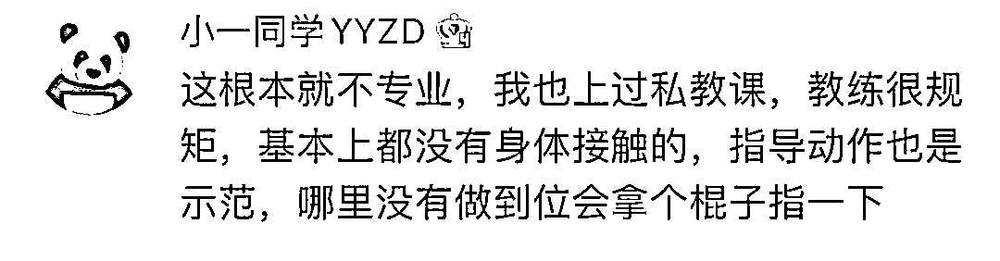

# 教练不顾劝阻将学员压骨折，网友骂上热搜：这什么动作？！

> 原文：[`mp.weixin.qq.com/s?__biz=MzIyMDYwMTk0Mw==&mid=2247530226&idx=3&sn=14dfdacc6223f227cf1d933535ce2c21&chksm=97cbbdcaa0bc34dc0b52305afe2c03e6dad848922c3286c420d31a230fec3d4813f00fe100bb&scene=27#wechat_redirect`](http://mp.weixin.qq.com/s?__biz=MzIyMDYwMTk0Mw==&mid=2247530226&idx=3&sn=14dfdacc6223f227cf1d933535ce2c21&chksm=97cbbdcaa0bc34dc0b52305afe2c03e6dad848922c3286c420d31a230fec3d4813f00fe100bb&scene=27#wechat_redirect)

花钱到健身房请私教指导 

没想到

可怕的事就这么发生了

[`mp.weixin.qq.com/mp/readtemplate?t=pages/video_player_tmpl&action=mpvideo&auto=0&vid=wxv_2280766325314715653`](https://mp.weixin.qq.com/mp/readtemplate?t=pages/video_player_tmpl&action=mpvideo&auto=0&vid=wxv_2280766325314715653)

据当事人杨女士此前接受媒体采访时表示，2021 年 8 月 29 日，她在健身房上私教课时，教练做拉伸运动时不顾自己多次提醒拍打劝阻，将其左股骨干压骨折，目前关于后续赔偿事宜未达成一致。

22 日下午，记者联系了涉事健身房。健身房负责人李女士回应记者称，涉事健身教练有相关教练资格证，当天是否因教练训练不规范而导致杨女士骨折她不清楚，这可能跟杨女士个人体质也有一定关系。前期他们已经支付了医药费等费用三万元，之后杨女士还有一个钢板摘除手术，但现在杨女士要求赔付后续康复及误工等费用 13 万元左右，双方没能谈妥，“此事已经进入司法程序，近期将开庭，一切有待法院的判决，法院说赔多少就是多少。”等法院判决之后，他们也将对涉事教练做出相应处分，其也需要承担相应责任。

协商不成

就听法院的吧

怎么判怎么赔

可网友在看到事发视频后 

炸锅了

**“这什么动作”**

**骂上热搜**

有过私教体检的网友 

纷纷提出质疑

这类请了私教却起到反效果的例子

并不鲜见 

《新华视点》曾对此做过专题调查

发现健身私教领域存在不少问题 

[`v.qq.com/iframe/preview.html?width=500&height=375&auto=0&vid=n0020upjyh8`](https://v.qq.com/iframe/preview.html?width=500&height=375&auto=0&vid=n0020upjyh8)

济南市民小姐

在请私教锻炼的过程中，

因私教指导不当导致运动拉伤，

而在李小姐想要维权退卡的时候却处处受阻

业内人士介绍，目前健身教练证书主要有三种，一种是健身教练国家职业资格认证，由国家体育总局职业技能鉴定中心综合管理；二是中国健美协会和健美操协会颁发的健身指导员证书；三是由国内外的各类培训机构组织培训并自行考核认证的证书，这类证书由于缺乏统一的培训机构规范，经过简单培训，考试的通过率相当高。

**大家在选择私教时**

**还是要擦亮眼睛**

**详细考察仔细询问** 

**花了钱却伤了身**

**不值得**

来源：极目新闻、新闻晨报、晨视频、潇湘晨报

← 向右滑动与灰产圈互动交流 →

