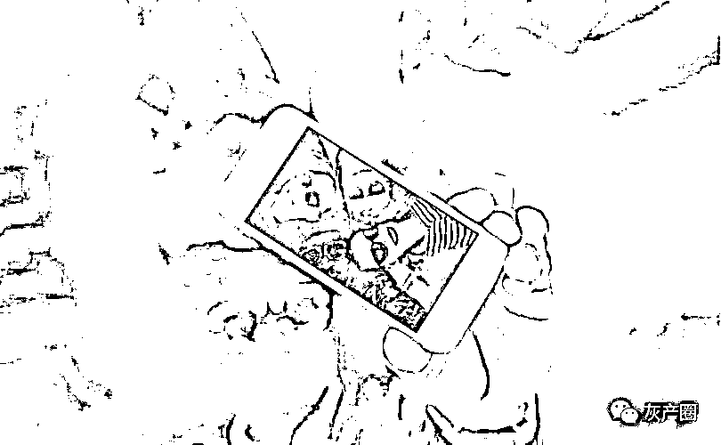

# “交友”变“交钱”，小心这些“脱单”App 暗藏陷阱！

> 原文：[`mp.weixin.qq.com/s?__biz=MzIyMDYwMTk0Mw==&mid=2247530226&idx=4&sn=78f9f92a1ef38acf318431886224c538&chksm=97cbbdcaa0bc34dc457858189f0e116df223bad6fd24405541c9792ee045dbbe8565624b9eb2&scene=27#wechat_redirect`](http://mp.weixin.qq.com/s?__biz=MzIyMDYwMTk0Mw==&mid=2247530226&idx=4&sn=78f9f92a1ef38acf318431886224c538&chksm=97cbbdcaa0bc34dc457858189f0e116df223bad6fd24405541c9792ee045dbbe8565624b9eb2&scene=27#wechat_redirect)

“发每条信息都要钱”“花了 10 多万元，还拿不到联系方式”“要线下见面，先得刷个价值 1 万元的‘一生一世’”……“新华视点”记者调查发现,部分自称“快速脱单”“互助脱单”App 通过平台规则“下套”，让交友过程异化为步步“交钱”，不少用户成为被“收割”对象，引发了大量涉嫌“诱导消费”“情感欺诈”的纠纷。

“花 10 多万元没脱单，
结果面都没见到”

记者发现，多个运营模式类似的“脱单”App 在应用商店上下载量巨大，有的下载量突破 1 亿次。然而，该类 App 在黑猫投诉等投诉平台上遭到大量网友投诉，有的多达 1600 多起，涉及“虚假宣传”“诱导大量充值”“情感欺诈”等。

——博眼球，恶俗广告横行。“就在软件上聊了几次，这个女的就非要跑来跟着我”“你都不知道上面的女的有多主动”……记者发现，该类 App 大肆在短视频平台上推广，演员扮作交友成功的用户“现身说法”，且语言恶俗、表演夸张。

一名来自新疆的女士告诉记者，自己被该类 App“强制交友”了一把。“偶然发现我在抖音上的个人视频成了‘爱聊’App 的宣传广告，广告里我照片上还有一行字‘30 岁、单身、喜欢旅游’，但此前平台并没联系我，也没有得到我的许可和授权。”

——想交友，步步要充值。“为了找对象，我在平台上花了 10 多万元，还网贷了 3 万多元，结果面都没见到。”来自江西农村 50 岁的刘先生因为丧偶，下载了名为“来遇”的 App，希望找个伴侣，结果人财两空。

“注册后就有不少女用户像机器人一样给我发照片、语音，但回复文字、语音、视频都要花钱。我给一个女用户送礼物就花了 6 万多元。”刘先生说。

记者在该类 App 中发现，男用户视频通话单方花费可高达每分钟数十元，语音通话花费可高达每分钟数元。男用户最高可一键发送价值数百万元的礼物给女用户。

——要“奔现”？屏蔽联系方式。来自浙江的蒋先生告诉记者，他在“他趣”“来遇”等 App 上，希望和女用户交换微信号、手机号，但无论输入字母还是数字，或通过语音告知，平台都会将相关内容屏蔽或中断通话。

“发送联系方式后，对方无法看到，平台还会提示‘禁止发送微信、手机和地址信息’，如果多次发送，可能会造成账号被封。”蒋先生说。

在投诉平台上，平台方给投诉者的回复为：“付费目的在于寻找和筛选真实的活跃玩家”“付费提高社交质量，增加与对方互动体验”“是否充值消费以用户个人意愿为前提，平台不强制也不干涉”……

“聊天就能赚钱”，
是交友还是陷阱?

该类平台一方面诱导男性用户步步充值，另一方面则通过“聊天就可以赚钱”的宣传吸引大量女性用户参与其中。

记者发现，不少平台通过宣传“高额返现”“月入过万”，吸引用户“拉人头”。根据相关 App 的奖励机制，若邀请的好友每次进行充值提现，便可获得其充值提现额度的 8%到 12%作为奖励，并表示“上不封顶”。

记者在他人帮助下在“爱聊”App 注册一个女性账号，系统立马发来“回复即能获得现金”的相关提示。在与多名男性用户交流 10 分钟后，账号获得 10 元左右的积分收益。

但不少女性用户反映，这类 App 存在“男方打赏无法提现”“提现申请提交后未到账”“账号未违规却被封禁”等“提现难”问题。

“以前在‘爱聊’提现几十元很快到账，可最近平台莫名把我的账号封了，理由是向第三方软件引流，账号里还有 1600 多元的积分，多次和平台沟通也没有结果。”在广州工作的刘小姐希望平台能够解封账号，继续在平台上赚钱。

记者询问了多个该类 App，人工客服均未向记者提供细化的封禁标准和封禁时长，给记者的回复仅为“涉及平台内部规则，无法告知”“封禁以审核部门审核为准，没有具体标准”等。

记者注册了“来遇”App 男性用户账号，未与任何人聊天和充值便向客服询问：“聊天的异性对象账号被封，是否能退还刷礼物用的积分？”该 App“人工客服”“秒回”表示：积分无法退回，“经相关部门核实，对方账号存在违规行为，故对其进行封号”。

北京格丰律师事务所合伙人郭玉涛认为，该类平台一方面鼓励男性用户充值、刷礼物；另一方面利用平台优势，对女性用户采取收益提现抽成、任意封禁账号清零收益等方式让资金沉淀在平台，实现“两头吃”。

扫清交友平台上的“荷尔蒙陷阱”

专家表示，当前大量打着“交友”旗号的平台注册主体都是科技信息公司，经营范围绝大部分没有“婚姻介绍服务”项目。有的平台以此逃避民政部门监管，存在一定的监管盲区。

郭玉涛认为，若该类平台发布虚假信息，引诱他人进行注册、充值、消费的行为，并将用户资金非法占有，则涉嫌诈骗罪等。

在北京理工大学计算机学院副教授闫怀志看来，由于应用商店已经成为用户获取 App 的重要入口，应用商店运营方应当进一步承担起 App 应用上架审核和运营监管责任。

“App 上架前，应用商店应要求 App 运营方提供各项用户协议，并进行运营模式评估，做到合规上架；App 上架后，应便捷受理和处置用户投诉，并向 App 运营方反馈，督促其整改，必要时下架 App 甚至列入黑名单。如 App 运营涉嫌违法犯罪，应用商店等应积极配合国家网信、公安、工信等部门对相关违法犯罪行为依法处置和坚决打击。”闫怀志说。

东部某婚介机构管理协会相关负责人表示，当前，网络日渐成为婚恋交友的主要渠道，建议民政部门进一步完善婚介行业标准和监管法规，进一步规范网络婚介管理。“行业组织可充分运用平台‘红黑榜’公示制度，引导网络婚介平台合规运营。对打着陌生人交友旗号‘打擦边球’侵害用户权益的平台，有关部门要加强监管和惩治。”

中国人民大学商法研究所所长刘俊海表示，用户在交友平台遭受财产或人身损害时，应积极主动保全相关证据，要求侵权人承担赔偿责任。若交友平台利用平台优势，恶意侵害用户合法权益，拒绝赔偿和退还，用户决不能忍气吞声，应通过行政或司法途径捍卫自己的合法权益。

来源：新华社，红网

← 向右滑动与灰产圈互动交流 →

