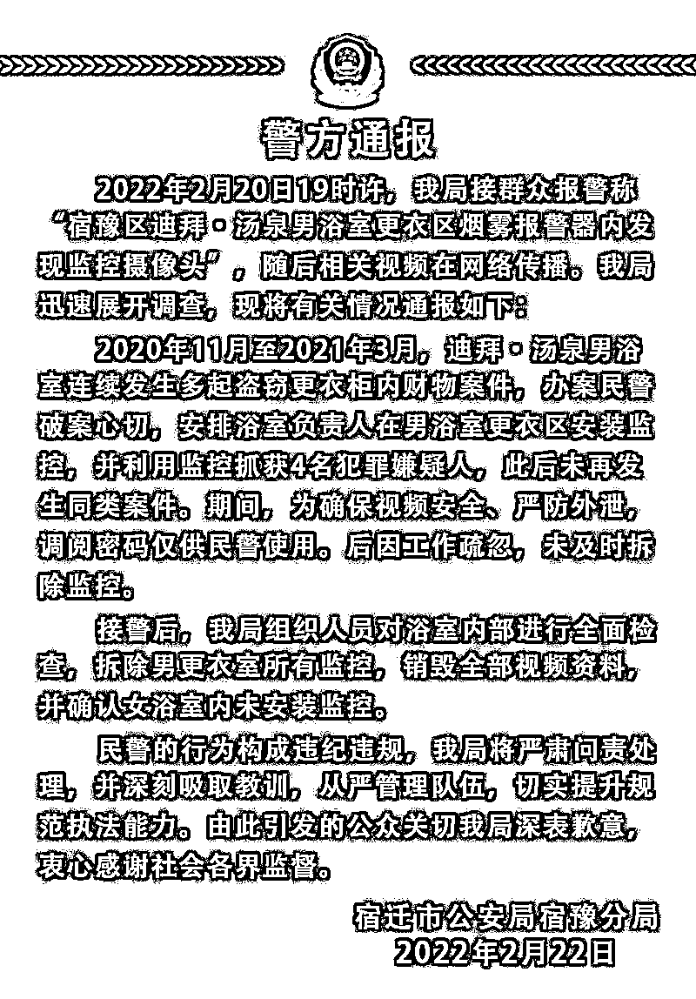
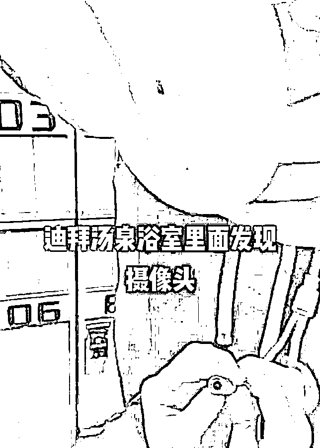

# 男浴室藏摄像头？

> 原文：[`mp.weixin.qq.com/s?__biz=MzIyMDYwMTk0Mw==&mid=2247530226&idx=5&sn=2c11c4b92ce036d9e29b4a8c2272f05d&chksm=97cbbdcaa0bc34dc7baae128a0ffd7eaae51ddccf6055c3dcf11f74aff8d05f036c30755c899&scene=27#wechat_redirect`](http://mp.weixin.qq.com/s?__biz=MzIyMDYwMTk0Mw==&mid=2247530226&idx=5&sn=2c11c4b92ce036d9e29b4a8c2272f05d&chksm=97cbbdcaa0bc34dc7baae128a0ffd7eaae51ddccf6055c3dcf11f74aff8d05f036c30755c899&scene=27#wechat_redirect)

2 月 21 日，网曝江苏宿迁**某浴池男更衣室暗藏摄像头**。 

22 日警方通报称，2020 年 11 月至 2021 年 3 月，该浴室男更衣室发生多起盗窃事件，**办案民警破案心切，安排浴室负责人在更衣室安装监控**，并成功抓获 4 名犯罪嫌疑人。

后因工作疏忽，未及时拆除。接警后，已全面检查并拆除监控，销毁全部视频资料。

**民警的行为构成违纪，将严肃问责处理。**

来源：宿豫公安微信

2 月 21 日，江苏宿迁市民李先生（化姓）向记者反映，在宿迁一浴池更衣室发现摄像头。

李先生说，2 月 20 日晚 8 时许，他在宿迁市宿豫区的某浴池泡完澡，去二楼休息室休息了一会儿，到一楼更衣室发现有很多人围在一起，据说有顾客发现了监控摄像头，摄像头隐藏在烟雾报警器内，摄像头后还发现三根线，两根电线和一根网线。

[`mp.weixin.qq.com/mp/readtemplate?t=pages/video_player_tmpl&action=mpvideo&auto=0&vid=wxv_2280414329290227714`](https://mp.weixin.qq.com/mp/readtemplate?t=pages/video_player_tmpl&action=mpvideo&auto=0&vid=wxv_2280414329290227714)

据网传视频显示，一男子正将一烟雾报警器扯下，报警器后还连着多条线路。视频中有人称该烟雾报警器是假的，摄像头是真的。

李先生回忆，事发后服务员到现场，起初该服务员称该摄像头安装已在警方备案。

后来有顾客报警，民警到现场后，顾客向民警询问该摄像头是否向警方备案，但民警否认了此前服务员的说法。

李先生还介绍，冬季他经常带家人到这家浴室泡澡。后来在民警拆除摄像头时，他就和家人离开现场了，但他在现场时一共拆除三个摄像头，都在更衣室。

来源：央视网综合极目新闻、宿豫公安微信、时间视频

← 向右滑动与灰产圈互动交流 →

