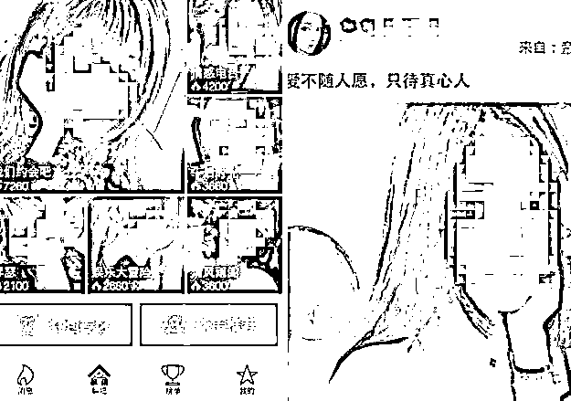
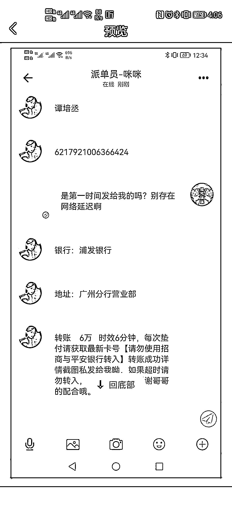
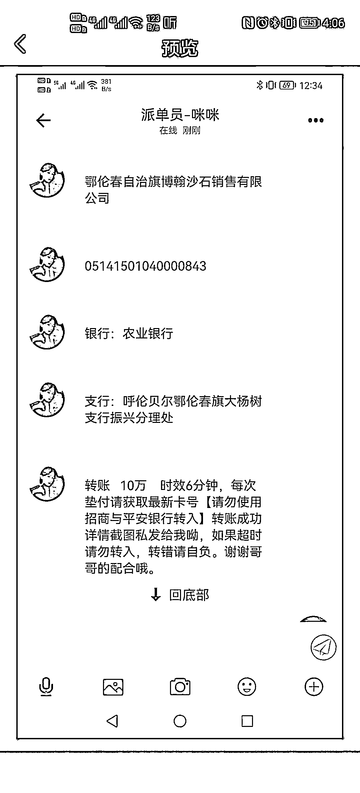
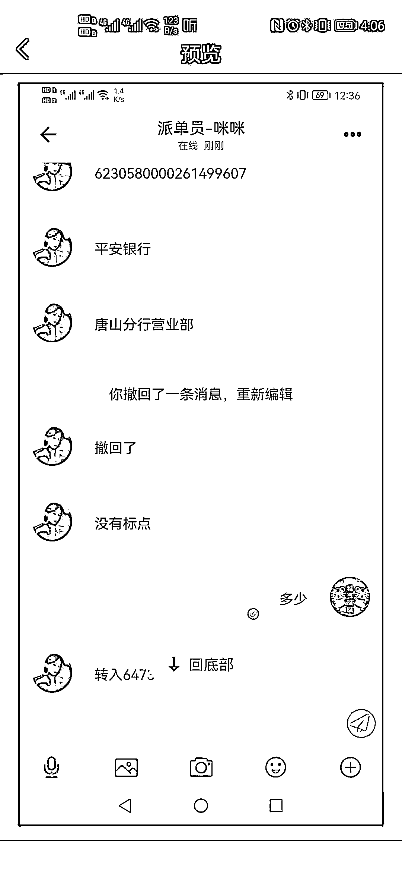
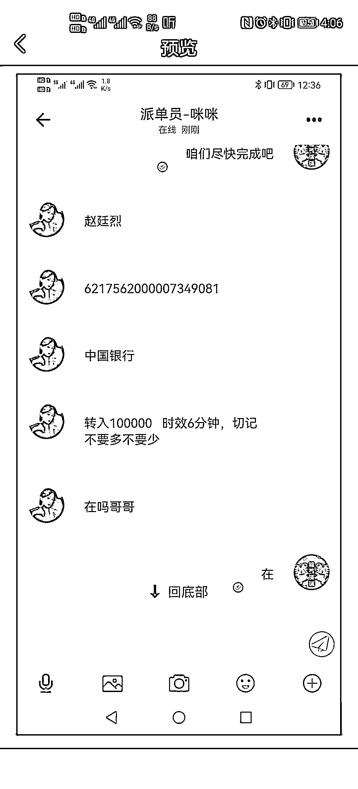
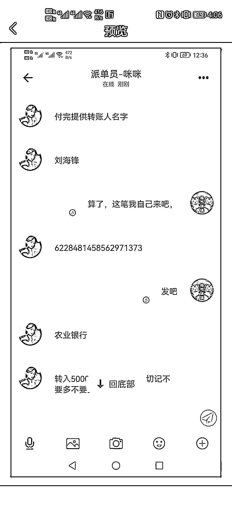
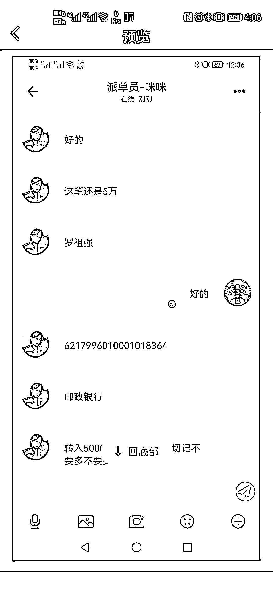

# 紧急预警：约炮+刷单，新型复合式诈骗来袭，你能把持住吗？

> 原文：[`mp.weixin.qq.com/s?__biz=MzIyMDYwMTk0Mw==&mid=2247530226&idx=7&sn=04011fc3ca9196275b952795f0252d2a&chksm=97cbbdcaa0bc34dccfbda695d2bc75c520069ec9a2420560ae90bff1e28be904d965bb3813eb&scene=27#wechat_redirect`](http://mp.weixin.qq.com/s?__biz=MzIyMDYwMTk0Mw==&mid=2247530226&idx=7&sn=04011fc3ca9196275b952795f0252d2a&chksm=97cbbdcaa0bc34dccfbda695d2bc75c520069ec9a2420560ae90bff1e28be904d965bb3813eb&scene=27#wechat_redirect)

****漫漫长夜寂寞孤单**** 

******夜深人静 当你掏出手机时******

********突然收到一条信息：******** 

**********“有精彩小视频放送 **********

**********可以同她同城私密约会 **********

**********让你不再夜夜孤单”**********

**********面对这些挑逗的文字和美女图片**********

**********想马上见到真人美女？**********

****************

******别急！******

******做完任务才能获得约炮机会！******

******前有美女激情聊天******

******后有“导师”带你做任务返利******

******还有这种好事？******

************

******近期，桃色陷阱迭代升级。洛阳发生多起受害人在浏览黄色网站后被诈骗份子获取身份信息后被诈骗份子引导下载“约炮”APP，称要在 APP 上完成刷单任务以换取招嫖的机会，在色诱和利诱的双重驱使下，受害人极易上当受骗。****** 

******案例回顾****** 

********昨日，我市西工区居民李某，夜晚在家收到一条短信，对方号码是 12 位“152027888888”.发送内容是“附近少妇，学生，白领，随叫随到，一夜炮友 ixxxx.cc”，点开链接后让下载个“万丽会”的 APP。********

****************

********该 APP 一进页面就有多个“美女”向其打招呼，并且发了数个美女图片并附带价格让李某挑选。李某挑选了一个美女，又选了一个 98 元的套餐后，向对方提供的银行账户转账 98 元。********

************

**********随后又有一个客服加其好友称如果想联系该美女必须先刷四单任务并告诉李某怎么做单，说白了就是利用所谓的漏洞操作提升分数然后提现，这四单每做一单就要按照要求充钱，做完四单才能提现。**********

************

**********李某就按照客服发的任务价目表上选了一个 83 元的单子并向对方转账 83 元。****登录 APP 后发现分值果真提升。**********

************

**********之后对方又用这种方式骗李某先后充值 198 元、512 元、3888 元。任务完结后发现提不了现，对方告诉其经过核实发现李某之前操作有误，如果想提现 10888 元就得先补做三单，李某此时急于把钱提出，就按照对方要求想对方账户陆续转账 74 万余元后因没钱才发现自己被骗，遂报警。**********

************

************

************

****************

********诈骗分析********

********** **这个诈骗案件，融合了招嫖 APP、刷单 APP，而骗子的最终目的就是骗受害者往该平台充钱。好色、贪财、这些人性的弱点被骗子利用的淋漓尽致，有几个人能抵挡的了？************

**********网络时代，骗子一直在进步，一个诈骗案件会混合招嫖、刷单、赌博等多种诈骗手段，骗子们分工明确、手段成熟、深谙人性的弱点，广大市民放松心情的时候，也要注意洁身自好。色字头上一把刀，招嫖类的 APP 上不会有艳遇，骗子的温柔刀很有可能榨干你的钱包。**********

**********千万别相信“招嫖类 APP”“同城交友类 APP”，也千万不要在网上做任务、赌博；多看反诈文章，增强防范意识。**********

**********如若被骗请及时拨打 110 或者 96110 报警。**********

****************

********警方提醒********

**********招嫖和嫖娼都是违法行为，都要接受法律的制裁**。**网络招嫖完成了，涉嫌违法，会被治安拘留和罚款，没有嫖成，还会存在巨大被骗风险。**********

**********目前，网络上有许多虚假信息，不法分子利用互联网发布虚假的“招嫖”信息进行网络诈骗，借招嫖之名行诈骗之实，导致受害人财物损失。市民朋友们上网的时候发现此类信息不要理会，洁身自爱，一旦禁不住诱惑很容易就会掉进骗子的陷阱。**********

******来源：洛阳市反诈骗中心，阻击诈骗******

************

******← 向右滑动与灰产圈互动交流 →******

************