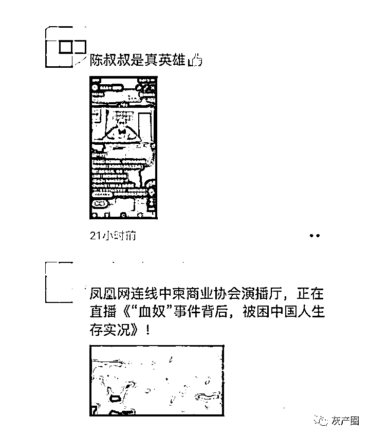
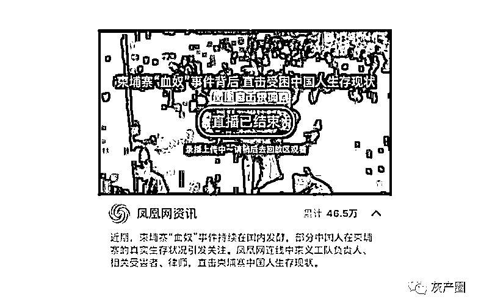
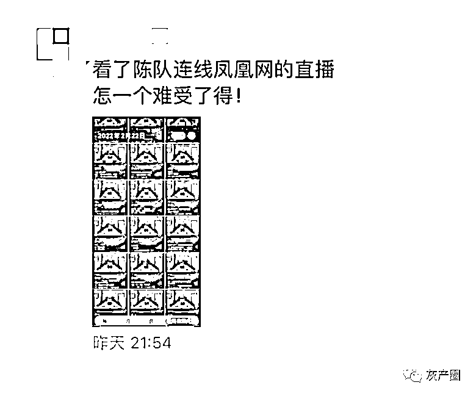

# 凤凰网连线义工陈队长 柬埔寨网投问题能引起重视吗？

> 原文：[`mp.weixin.qq.com/s?__biz=MzIyMDYwMTk0Mw==&mid=2247530305&idx=5&sn=dcb2ef9dbd88c724f5430051b7275a84&chksm=97cbbc79a0bc356f6799b40c8db33bd1d443e6316b94fb693f836d99763ab502099807a9293e&scene=27#wechat_redirect`](http://mp.weixin.qq.com/s?__biz=MzIyMDYwMTk0Mw==&mid=2247530305&idx=5&sn=dcb2ef9dbd88c724f5430051b7275a84&chksm=97cbbc79a0bc356f6799b40c8db33bd1d443e6316b94fb693f836d99763ab502099807a9293e&scene=27#wechat_redirect)

昨晚（2 月 22 日），凤凰网在视频号上直播连线中柬义工队陈宝荣队长，直击受困中国人生存现状，引发不少在柬国人共鸣。 

<mpvideosnap class="js_uneditable custom_select_card channels_iframe" data-pluginname="videosnap" data-id="export/UzFfAgtgekIEAQAAAAAAtXkoFOuLuwAAAAstQy6ubaLX4KHWvLEZgBPExYNUNAghQ638zNPgMIud-zrhDRxp5856HNUji7NP" data-url="https://findermp.video.qq.com/251/20304/stodownload?encfilekey=rjD5jyTuFrIpZ2ibE8T7YmwgiahniaXswqzBYsbDv7HicFCb1Slj8OHfoJMVVyWDWBpBULa1muzHOOSnwAibp2BrOnQNQzpkStVkewUibZIEwniar5k1GrPiafKDeQ&amp;adaptivelytrans=0&amp;bizid=1023&amp;dotrans=0&amp;hy=SH&amp;idx=1&amp;m=&amp;scene=0&amp;token=x5Y29zUxcibCHyuTL5bRN9lC6sCn1AXKwMLKHpLtCfkFJWNzP7AzicyFkhwl1Ted9kIb18armuHVo" data-headimgurl="http://wx.qlogo.cn/finderhead/PiajxSqBRaEKW36RiayPxG4EbaEocNMsibEWwbO2pwpVZJAKQfCwaFZ7Q/0" data-username="v2_060000231003b20faec8c4e48d1ac5d7cd06e935b077e446a613223d91bf7dd9d2bcd6c91a20@finder" data-nickname="凤凰网" data-desc="柬埔寨中国人逃生事件持续发酵，晚 8 点凤凰网直播连线，直击受困中国人生存现状。" data-nonceid="1692684537154915442" data-type="video"></mpvideosnap>

由于陈宝荣队长在柬埔寨华人中知名度较高，再加上相关问题正是目前大家关注的焦点。直播刚一开始，相关直播的消息就刷屏朋友圈，不少同胞还在各大微信群分享直播消息。 

不少在柬华人纷纷在直播间留言，就“血奴”、网赌、绑架、航班等问题发表自己的看法。 

据凤凰网公布的统计数据，截至直播结束，累计有 46.5 万人观看该次直播。 

有许多同胞在直播结束后意犹未尽，“看了陈队连线凤凰网的直播，怎一个难受了得。”

还有的同胞在微信群中表示，“血奴”事件都可以拍成电影了。另有消息称，相关剧本“已经出来了”。

陈宝荣透露，在这一年的时间内他共解救 170 多名被绑架的国人、被迫从事网络诈骗违法犯罪的年轻人、流落街头精神病患和生命垂危的国人。值得注意的是，其中还有数十名未成年人，年龄最小的才 14 岁。其中有 6 名未成年女孩被救出时怀有身孕，最终不得不去堕胎，令人叹息。

连线被解救当事人 

陈宝荣在直播中讲述了自己解救陷入网投的小孩的经历。陈宝荣称，在解救的小孩里，有一个是被自己的表弟骗过去的。他的表弟当时也是在网投的淫威之下被控制，最后无奈让自己的表哥也陷入到网投之中。 

陈宝荣表示，希望国内的年轻人不要轻易相信国外的高薪工作，即使是自己的亲人在国外给你介绍工作也应加强防范，不要轻易相信。

负责此次直播连线任务的中柬义工队梁肥军对《今日柬闻》记者表示，此次连线也是为了让国内能更加深入了解柬埔寨的状况，“血奴”事件引发了国内舆论的关注，同时也发生了一些网络暴力事件，有些国内同胞对在柬华人有些偏见，也希望通过这次连线让大家了解到，在柬埔寨还是有很多像中柬义工队、陈宝荣这样的带来光明的组织、人物和义举。 

昨天连线的演播室 梁肥军供图 

有网友表示，“此次事件的爆发，引起了广大媒体的关注，但是对于网投现状有否起到作用，相信也是大家最为关注的点。能否切实改变柬埔寨网投的现状，后续如何，这个是值得大家期待的。”

来源：今日柬闻，凤凰网

← 向右滑动与灰产圈互动交流 →

