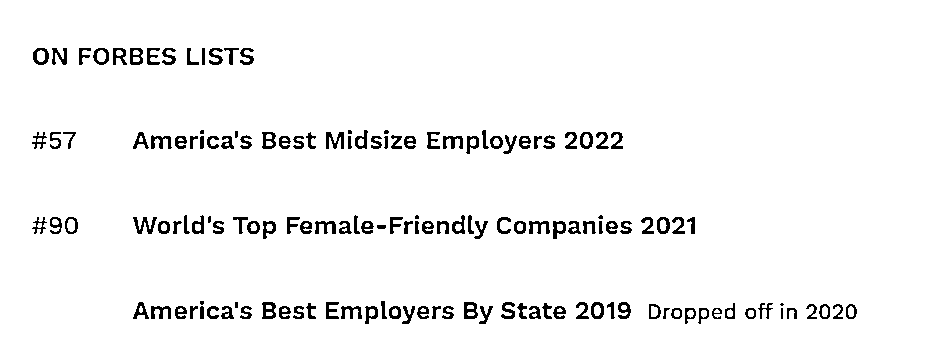

# 培训会致 19 例阳性！如新涉传销、组织“洗脑”，多年争议不断

> 原文：[`mp.weixin.qq.com/s?__biz=MzIyMDYwMTk0Mw==&mid=2247530305&idx=6&sn=b2b48ecad4ff3408c6e18f615c68f530&chksm=97cbbc79a0bc356f3115884338fee6f035ec2946aad410bbc9e8f0e08b21dd083f39976360b6&scene=27#wechat_redirect`](http://mp.weixin.qq.com/s?__biz=MzIyMDYwMTk0Mw==&mid=2247530305&idx=6&sn=b2b48ecad4ff3408c6e18f615c68f530&chksm=97cbbc79a0bc356f3115884338fee6f035ec2946aad410bbc9e8f0e08b21dd083f39976360b6&scene=27#wechat_redirect)

2 月 21-22 日，武汉、北京、青岛各新增新冠阳性病例 14 例、4 例、1 例，而这 19 例阳性均指向同一家公司——如新集团（NUS.US）旗下如新（中国）日用保健品有限公司（以下简称“如新中国”）举办的培训会。

针对此事，如新方面回应媒体称，是上海经销商违规私自举行的年会，并未上报总部获批。

上一次如新集团引发如此广泛的关注，是在 2019 年，一名女子因坚信如新果汁散热排毒的说法，生病不肯吃药，只喝如新果汁，最终因肺部感染死亡。

红星资本局通过采访及梳理，发现如新集团自 2003 年正式进入中国后，涉嫌传销、组织聚会“洗脑”……争议声始终未停。

**如新培训会致多人感染**

**实地探访：北京门店拉起警戒线**

2 月 21-22 日，武汉、北京、青岛三地各新增新冠阳性 14 例、4 例、1 例，而这 19 例阳性都指向了如新在武汉举办的一场线下培训会。

2 月 22 日下午，武汉召开新冠肺炎疫情防控新闻发布会，通报了 14 例新增确诊病例和感染者有关情况及活动场所。

根据通报，13 例为某公司培训班学员，1 例为某学员的家人。培训期间为 2 月 18 日至 20 日，在武昌区凯莱熙酒店和江岸区华清园小区内举行，共有 66 名学员。据封面新闻报道，该酒店介绍称，整个会议期间大概先后累计有 180 名住客，多是外地游客，另外还有数十名各地艺考生。

此次出现疫情的培训会组织者，是如新中国的上海经销商——上海舍耀市场营销服务中心。**如新方面对媒体回应称，该培训是上海经销商违规私自举行的年会，并未上报总部获批。**

据上游新闻报道，舍耀公司法定代表人顾某表示，自己确实是这次培训班的牵头人，来参加培训班的人员有下面的经销商，业务合作伙伴，还有他们带来的亲朋好友。

顾某称：“也不算是严格意义上的培训。就是想聚一聚，北京摘星了，我们商量着来武汉聚聚，来的人还带了亲朋好友。团队之间互相交流了一下心得、企业文化、销售思路。大家干劲都很足，就是想把产品卖好。”

**对于传销的质疑，顾某称：“我们是正规企业。”**

而在 2 月 22 日召开的北京疫情防控新闻发布会上，公布了海淀新增确诊病例的轨迹，涉及丰联广场一咖啡厅，以及如新专卖店。

2 月 22 日下午，**红星资本局记者前往如新北京门店的所在地——朝外大街丰联广场。**

记者在现场注意到，丰联广场门前已拉起警戒线，通往丰联广场的停车场也已关闭。二十多个穿有防护服的医护人员在门外露天处，安排大楼内的人员分批次做核酸检测。

丰联广场门前已拉起警戒线

丰联广场后侧的如新智能体验中心也已关闭，门前同样有“禁止入内”的警戒线。

有现场工作人员告诉红星资本局，**上午 11 时左右丰联广场就已关闭，分批进行核酸检测。有楼内人员表示，中午时接到物业通知，只是告诉有确诊病例来过大厦，让所有人员待在公司，减少外出，等通知统一做核酸，并告知所有人员大楼“只进不出”。**

如新智能体验中心已关闭

春节过后，多地出现新增新冠病例，很多公司都采取措施避免线下聚集，但如新中国的经销商仍然举办了线下培训会。通过采访和梳理，红星资本局发现，“集会”是如新重要的日常经营环节。与此同时，涉嫌传销、洗脑的争议一直围绕着这家公司。

**起底如新集团：**

**员工数达 2.6 万人，多次登上福布斯**

公开资料显示，如新集团是一家主营个人保养品和营养补充品的企业，由 Blake M.Roney，Sandra N.Tillotson 和 Steven J.Lund 创立于 1984 年，总部位于美国犹他州，1996 年在纽交所挂牌上市，2003 年进入中国市场。

天眼查显示，如新中国曾经名为上海如新日用保健品有限公司，成立于 1993 年，是一家外国法人独资的有限责任公司，注册地上海，注册资本 3007 万美元

红星资本局查询商务部网站得知，2006 年 7 月 22 日，如新中国正式获得了直销经营许可证，包含分支机构 25 个，服务网点 225 个，直销产品 121 种，直销培训员 190 人（在册 190 人，注销 365 人）。

2014 年，如新集团成立 30 周年时，在上海建成了其全球最大的工作园区——大中华创新总部园区。该创新园区位于上海工业综合开发区的最核心地带，投资近 5 亿元人民币。**当时，大中华区已成为如新集团全球 53 个市场增长最快的地区，并在 2013 年成为了集团全球第一个突破 10 亿美元的区域市场。**

福布斯官网显示，**如新集团曾先后登上《福布斯 2021 年度全球最佳女性友好企业榜单》《福布斯 2022 年全美最佳中型雇主榜单》，截至 2022 年 2 月 10 日，如新集团员工数达 2.6 万人。**

2 月 16 日，如新集团公布财报，数据显示，**公司截至 2021 年末总资产达 19.06 亿美元，全年营收 26.96 亿美元，同比上涨 4.41%；归母净利润为 1.47 亿美元，同比下降 23.04%；销售毛利率高达 74.95%，销售净利率为 5.46%。**

然而如新集团在直销的外衣下，对其经营涉嫌传销的质疑声始终未绝。

**专访涉案律师：**

**这是一家典型的传销公司**

如新中国上一次受到广泛关注，还是在 2019 年，年仅 34 岁的如新销售人员林某生病后，靠喝如新果汁“排毒”，拒绝就医治疗，最终不幸身亡。**如新发布声明回应此事称，经公司内部调查，****涉事经销商因违反公司相关规定，已对其解除合同，终止合作。**

据报道，林某的朋友曾表示，如新的培训就是让人敌视传统医疗。他们（如新）宣称 95%的药品都是无效的，要是你真爱你的家人，就让他们远离医疗。

北京市浩东律师事务所律师张晓玲，正是“喝如新果汁延误治疗”的林某的委托律师。

2 月 22 日，**张晓玲接受红星资本局采访时称：“这家公司就是一家典型的传销公司。”**

培训现场 图由受访者提供

张晓玲称，“我在 2019 年左右，共计接受了 4 名当事人的委托，分别起诉如新中国。” 在这 4 人中，除了林某，还有另一名当事人也深信如新公司老师的话——远离医疗，并最终错过了治疗时期不幸身亡，另外两人则造成重症。

“不过这 4 起案件均庭下和解了。”据张晓玲透露，由于 4 家人均得到了高额赔偿并签署了《保密协议》，“我记得当时处理这件事情的如新团队能力非常强，包括对家属的应对和处理，该事件很快就得到了解决。虽然他们最终达成了庭下和解，但该公司至今仍然在运营。”

在张晓玲看来，如新中国早就该查处了。**张晓玲掌握的资料显示，该公司搭建起了“金字塔式”的结构，发展的层级越多，获得的经济效益就越多。**

培训现场 图由受访者提供

张晓玲称：**“虽然该事件已经过去几年，但是毕竟该公司的经营模式已经发展了多年了，它不可能重新换一个发展模式。现在可能会重新换了一个名字，但换汤不换药。”**

张晓玲给红星资本局提供了一段如新内部课件，描述了公司层级。

图由受访者提供

根据如新老师的讲解，**如新第一级是星级顾客**——购物超过 500 元就有资格注册一张如新的 VIP 卡号，其拥有的权利：消费如新产品享 8 折优惠和推荐权。

**第二级是见习零售商**——“自用+分享”营业额超过 5000 元，有资格和如新签订见习零售商合同，有 10%的零售利润。

**第三级是正式零售****商**——4 个月之内“自用+分享”营业额超过 3 万元，就可改签为正式零售商。

正式零售商每月要完成 15000 元的营业额，这其中包括自己使用和向周边朋友们推荐使用的金额，其中分享 20 至 30 人，平均每人使用如新产品 800 元至 1000 多元，每月就会有稳定的 2 万至 3 万元的营业额，公司会给予 10%至 30%的零售利润。此外，每月 14 日之前完成 15000 元的，额外奖励 1000 元；21 日前完成 20000 元的，再额外奖励 1000 元；月底前完成 30000 元，再额外奖励 1000 元。

**第四级，如果在其推荐的人中，能够培养 4 个经销商，就会进入“业务经理”的评级。**一年内有任意 4 个月完成“培养 4 个经销商”的任务，该公司将奖励双人豪华海外游。同时，公司还会给予 5%的奖励。“4 个经销商，平均按照每个经销商 2 万元计算，4 个经销商的营业额是 8 万，按照 5%的奖励，再加上你的营业额和零售奖励，业务经理的月收入在 1 万至 2 万元之间。”

在该课件中，如新的老师说，“培养推荐的 4 个经销商相当于是 4 个加盟店。如果 4 个经销商继续发展，平均每人推荐 4 个经销商，就是 16 个经销商，相当于 16 个加盟店，16 个加盟店平均每个推荐 4 个，就是 64 个加盟店。”该老师介绍，“这些加盟店的发展发展均与你有关，公司会给予你 5%的利润。每家加盟店的利润额平均按照 2 万元来计算，每月你至少可得到 8 万元的奖励。在该老师看来，所有经销商的利润来自两个部分：第一、零售利润部分，属于劳动性收入。第二、建立的加盟网络的渠道领域，这是被动性收入，也就是资产型收入。

张晓玲告诉红星资本局，**就如新经营模式而言：一是形成了一定的上下层级架构并具有一定人数，二是参加者均有一定的经济支出以获得会员资格，三是发展人员数量是获利的依据，每一个会员再发展下线时也是有利益回报的，且发展的成员越多，其经济利益越大。“这就是典型的传销。” 张晓玲说。**

**人民日报曾“三揭如新骗局”**

事实上，早在 2014 年，人民日报就曾连发三篇文章，揭露“如新骗局”。

人民日报在报道中指出，如新捏造科研成果，宣传虚假信息，鼓动大家加入如新直销团队。成为如新直销需要先购买如新产品，**如新还根据产品销售数量和发展下线人数，将直销商分为 7 级，涉嫌传销**。此外，**如新还时常组织大型聚会对直销商进行“洗脑”，通过制造榜样，利用群体效应进行精神控制**。

人民日报记者参加了如新公司在北京市郊某酒店举办的“2014 NU SKIN 星峰大会”。

在现场，来自太原、石家庄、天津等地的近 2 万人齐聚，灯光闪烁，音响雷动。大会包含精英表彰、现场访谈等环节。被表彰的人依次走上讲台，并大声嘶吼带领全场齐喊口号。台下近 2 万人手持玩具手掌跟着鼓拍，气氛狂热。据知情人士介绍，公司几乎每天都有不同内容的聚会和培训课程。

西南政法大学法学院讲师胡江认为，这种行为涉嫌精神控制，俗称“洗脑”。

**不仅在中国，美国对如新集团经营模式的质疑和调查也没有间断过。**1991 年，美国有 6 个州的司法机关对如新展开调查。1997 年，宾夕法尼亚州总检察长指控如新通过一家名为 QIQ 的分支机构开展传销。1994 年，经美国联邦贸易委员会（FTC）调查，如新夸大产品功效和经销商利润。1997 年，FTC 指控如新对其减肥、促进肌肉生长等产品进行不实宣传，如新再次向美国联邦贸易委员会交付 150 万美元罚款。

而针对如新想把责任推给一线经销商的做法，人民日报采访了北京市岳成律师事务所主任岳运生。岳运生表示，对于一个公司来讲，可能存在多种经营模式，如设立分公司，甚至借助更低层次的经营团队等。但他表示，由于分公司不具有独立法人资格，因此分公司的所有经营后果和法律责任由总公司承担；而对于经营团队来说，只要其归属于总公司或总公司下属的分公司，且以总公司或者分公司的名义拓展业务，那么这个经营团队的经营后果和法律责任都应由总公司承担。

专家表示，只**要经营主体不具备独立法人资格，那么它的经营行为均属于职务行为，都该由总公司来承担责任。**

← 向右滑动与灰产圈互动交流 →

