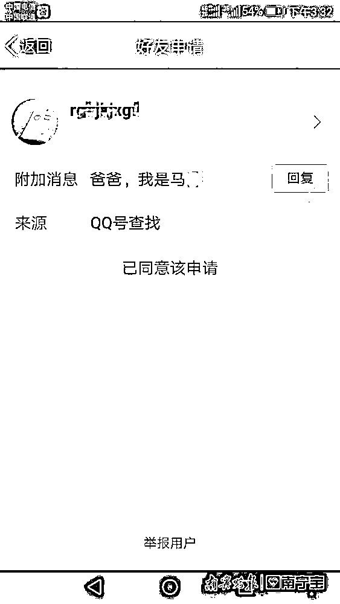
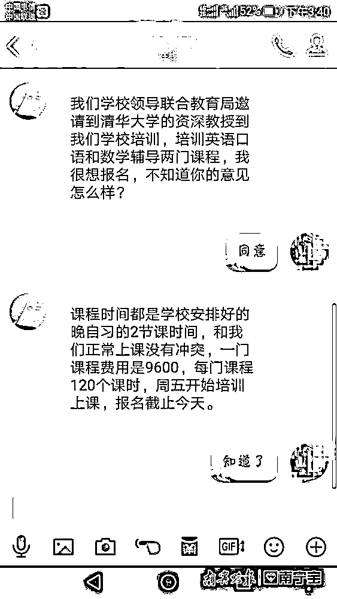
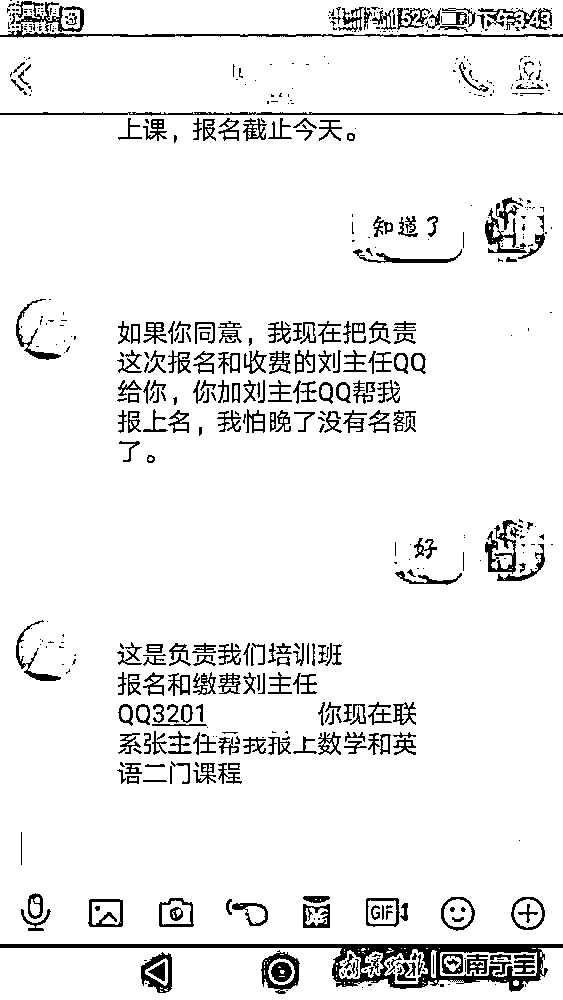
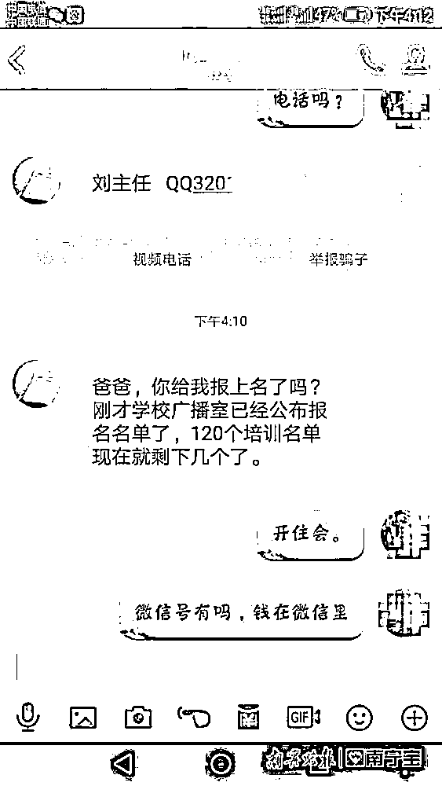
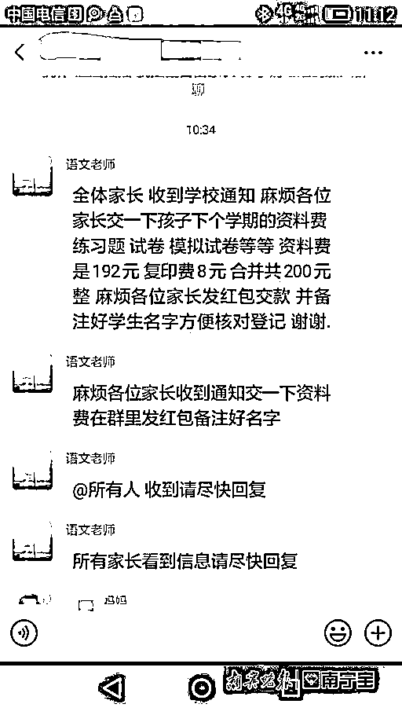
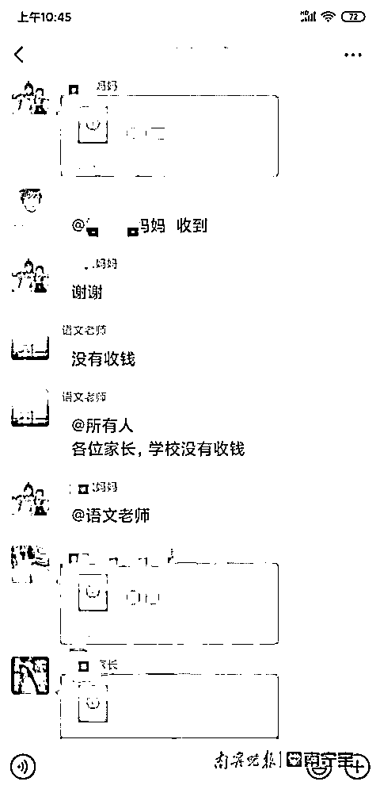

# “儿子”要报清华培训班，爸爸知道后果断报了警……这种骗局近期高发，千万当心！

> 原文：[`mp.weixin.qq.com/s?__biz=MzIyMDYwMTk0Mw==&mid=2247530305&idx=8&sn=0c05f2abcf02dfc8ad7fc41b1bae274a&chksm=97cbbc79a0bc356fa66e4cf6eccb60f76058f080480297a72fcf23f5c4eb9385806faf5094f6&scene=27#wechat_redirect`](http://mp.weixin.qq.com/s?__biz=MzIyMDYwMTk0Mw==&mid=2247530305&idx=8&sn=0c05f2abcf02dfc8ad7fc41b1bae274a&chksm=97cbbc79a0bc356fa66e4cf6eccb60f76058f080480297a72fcf23f5c4eb9385806faf5094f6&scene=27#wechat_redirect)

“爸爸，我们学校联合教育局邀请了清华大学资深教授到我们学校培训，培训英语和数学两门课程，我很想报名，不知道你的意见怎么样？”

“一门课程费用 9600，每门课程 120 个课时，周五开始培训上课，报名截止今天。”

“这是负责我们培训班报名和缴费的刘主任的 QQ……爸爸，你能快点给我报名吗，我怕晚了没有名额了。”

开学季是诈骗案件的高发期，家长朋友们务必要多留个心眼。近日，广西南宁的家长马先生便收到了“儿子”发来的信息，**“儿子”称要参加培训班，并不断催促他尽快转钱**，幸亏马先生及时与学校老师进行核实，才没有落入骗局。

骗子通过克隆头像的方式，冒充学生通过 QQ 添加家长。

在南宁市公安局巡警（反诈）支队，前来报案的马先生回忆说，**当时收到了儿子发来的 QQ 好友申请，**一开始并没有存疑，也很支持儿子报名参加培训班，直至对方不断催促交钱，马先生渐渐察觉事情并不简单。于是，马先生当即拨打了学校老师的电话，确认学校并没有推出培训课程，骗子的谎言不攻自破。 

骗子告诉家长有培训课需要费用，并不断催促家长转钱。

针对该起案件，民警分析说，**骗子通过克隆头像的方式，冒充学生通过 QQ 添加家长**，如果家长收到此类信息，一定要拨打电话给子女或者子女所在学校老师进行核实。此外，学校联合当地教育部门开办的培训班，一般都会有相关的正式文件下发到学生手里，且缴纳的相关费用一般都是转入对公账户，**如果对方要求转入私人账户，那就要提高警惕了**。 

民警表示，骗子的套路并不新奇，只要大家提高警惕，多问多想，谨慎处理，就能有效避免财产遭受损失。

开学季惯用诈骗套路

↓↓↓

**套路 1：搜索 QQ 群广泛撒网**

诈骗分子会直接在 QQ 内，搜索班级群的群聊关键字，即可出现大量公开的群聊信息。如果该群没有设置相应的验证机制，或者班主任验证不严格，骗子就有可能冒充学生家长申请后进入。

**套路 2：套近乎获取进群二维码**

有不法分子在校园门口逗留，与其他家长闲聊、套近乎，向家长索要班级群的二维码。由于很多群聊设置并未开启“群主确认”功能，不法分子可直接扫码进群。

**套路 3：更换头像伺机行动**

骗子入群后一般会伪装成学生家长，添加班主任 QQ 或微信，并修改备注为某某学生家长，而后“潜水”观察班主任的活动规律，并找机会将自己的头像和备注修改成班主任的模样，随后在群里发送相关通知，要求缴纳学费、培训费等各项费用。

骗子冒充老师催缴费用

**套路 4：利用时间差发布诈骗信息**

由于职业的特殊性，很多老师都开了消息免打扰功能，或者在上课期间关闭手机。不法分子借机下手，利用时间差，让“假老师”代替“真老师”。

真老师上线辟谣

**套路 5：利用私聊等进行针对性诈骗**

有的骗子会利用 QQ 群“不是好友的两人可发起临时会话”这一功能实施诈骗。骗子在家长同意后，就会发来收款二维码。有的家长顾虑到面子问题，也没有追根究底去打听收费详情，就草草付了钱，这样一来，就中了骗子的套路。

**套路 6：发布“有毒”链接**

录取通知书、课程表、学费减免政策、核对家庭资料、致家长们的一封信……诈骗分子利用家长或学生的信息，冒充学校老师或教育局工作人员发送含钓鱼链接的内容，帮助其窃取银行卡信息骗钱。

如何识破骗局？

注意以下几点   

1、备注好老师的微信、QQ、电话，避免骗子模仿老师账号，如收到电话自称老师更换电话号码的，要和其他的老师进行确认。

2、采用多渠道核实的方法辨别，例如微信收到缴费通知，可以拨打老师的手机、学校办公室座机进行核实。

3、看到来源不明的短信内容，应及时联系孩子班主任或学校负责人，确认信息的真实性，不要轻易点击不明链接。

来源：南宁晚报

← 向右滑动与灰产圈互动交流 →

