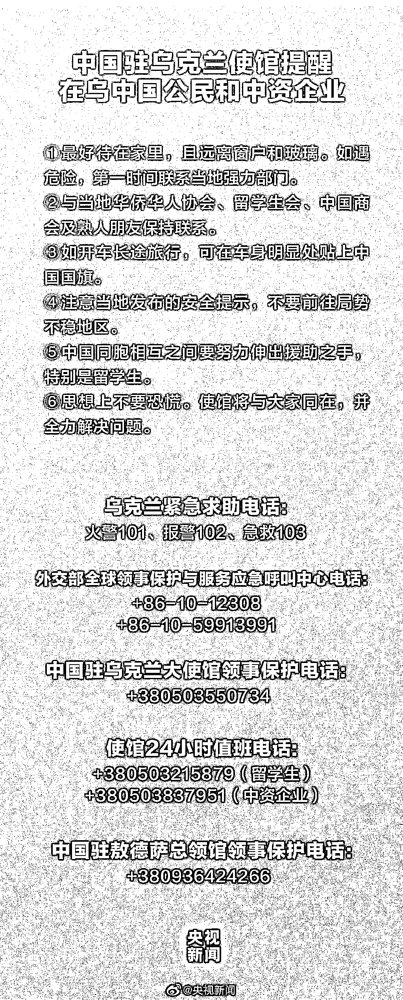

# 俄乌局势动荡，在乌华人拍下撤离现场｜视频

> 原文：[`mp.weixin.qq.com/s?__biz=MzIyMDYwMTk0Mw==&mid=2247530365&idx=2&sn=6a13f12d1a81c3d01621e9b2a58b9773&chksm=97cbbc45a0bc355317a05e5dcb30e68f8174307c3c8766c954ef46b85995f782e44379e81b6e&scene=27#wechat_redirect`](http://mp.weixin.qq.com/s?__biz=MzIyMDYwMTk0Mw==&mid=2247530365&idx=2&sn=6a13f12d1a81c3d01621e9b2a58b9773&chksm=97cbbc45a0bc355317a05e5dcb30e68f8174307c3c8766c954ef46b85995f782e44379e81b6e&scene=27#wechat_redirect)

北京时间 2 月 24 日

0 时 02 分

乌克兰银行和政府网站

因遭受大规模网络攻击而关闭 

1 时 19 分

乌克兰议会批准

在全国实施紧急状态 

10 时 57 分消息

俄罗斯总统普京已决定 

在顿巴斯地区进行特别军事行动

11 时 28 分 

乌克兰首都基辅

鲍里斯波尔机场区域传来爆炸声 

11 时 51 分

目击者称

乌克兰多个城市

发生一系列爆炸事件

时长 53 秒

▼

[`v.qq.com/iframe/preview.html?width=500&height=375&auto=0&vid=z3325diowe3`](https://v.qq.com/iframe/preview.html?width=500&height=375&auto=0&vid=z3325diowe3)

▲实拍乌克兰基辅现状：防空警报响彻城市，车辆排长队扎堆驶离。新京报我们视频出品（ID：wevideo）

北京时间 14 时 08 分

俄方称

乌克兰武装部队空军

军事基础设施已瘫痪 

14 时 17 分

乌克兰议会通过

乌全境进入战时状态的决定

16 时 30 分

乌克兰正进入全面防御状态

17 时 05 分

乌边防局和内务部称

俄军已越过国境线进入乌多州

17 时 37 分 

乌克兰总统宣布与俄罗斯断交

时长 39 秒

▼

[`v.qq.com/iframe/preview.html?width=500&height=375&auto=0&vid=b3325g98s0o`](https://v.qq.com/iframe/preview.html?width=500&height=375&auto=0&vid=b3325g98s0o)

▲乌克兰西部地区一机场遭导弹袭击：传出巨大爆炸声，火球瞬间升起。新京报我们视频出品（ID：wevideo）

一些在乌华人亲历爆炸现场 

并拍下居民撤离现场

时长 44 秒 

▼

[`v.qq.com/iframe/preview.html?width=500&height=375&auto=0&vid=w3325bg8ewh`](https://v.qq.com/iframe/preview.html?width=500&height=375&auto=0&vid=w3325bg8ewh)

▲乌克兰多地发生爆炸，亲历华人拍下居民撤离现场。新京报我们视频出品（ID：wevideo）

另有部分华人称准备撤离基辅 

前往乌克兰西部

亲戚一家已回乡下避难

时长 2 分 16 秒 

▼

[`v.qq.com/iframe/preview.html?width=500&height=375&auto=0&vid=d3325lcpyn5`](https://v.qq.com/iframe/preview.html?width=500&height=375&auto=0&vid=d3325lcpyn5)

▲乌克兰华人称准备撤离基辅：开车前往乌克兰西部，亲戚一家已回乡下避难。新京报我们视频出品（ID：wevideo）

有在乌中国留学生称凌晨 5 点听到爆炸声

空中火光特别大

爆炸声持续了一分多钟

地面也有轻微震动

时长 1 分 5 秒 

▼

[`v.qq.com/iframe/preview.html?width=500&height=375&auto=0&vid=n33256n4iqk`](https://v.qq.com/iframe/preview.html?width=500&height=375&auto=0&vid=n33256n4iqk)

▲在乌中国留学生亲历爆炸瞬间：凌晨 5 点听到爆炸声。新京报我们视频出品（ID：wevideo）

中国驻乌克兰大使馆发布提醒

请在乌中国公民高度注意安全

来源：新京报我们视频央视新闻

← 向右滑动与灰产圈互动交流 →

