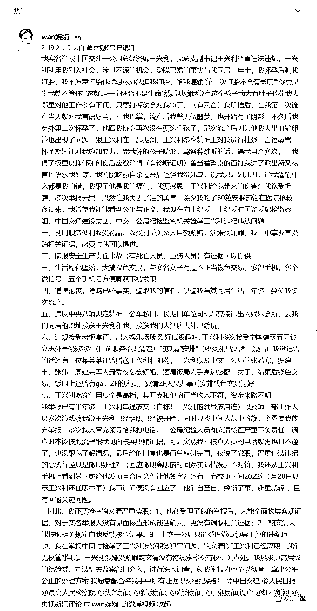
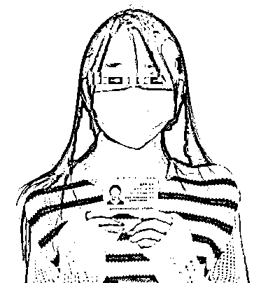
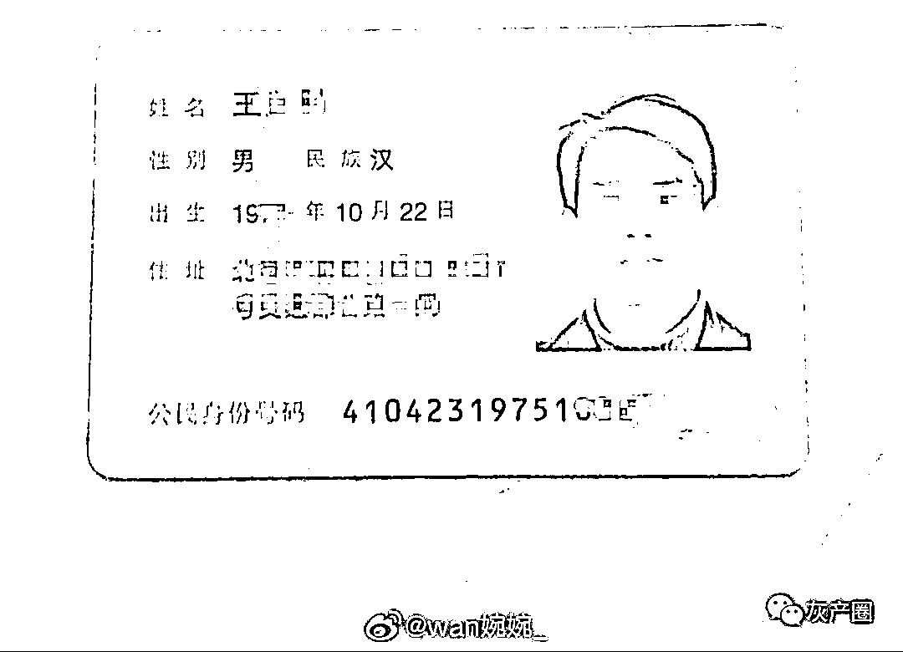
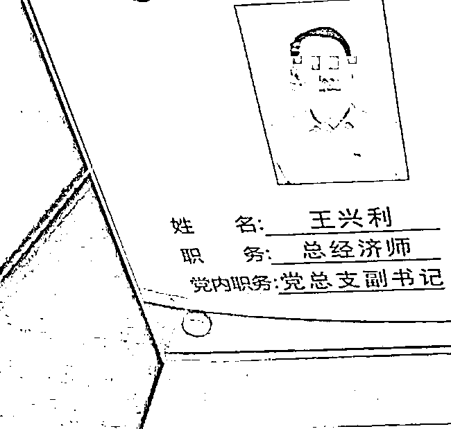
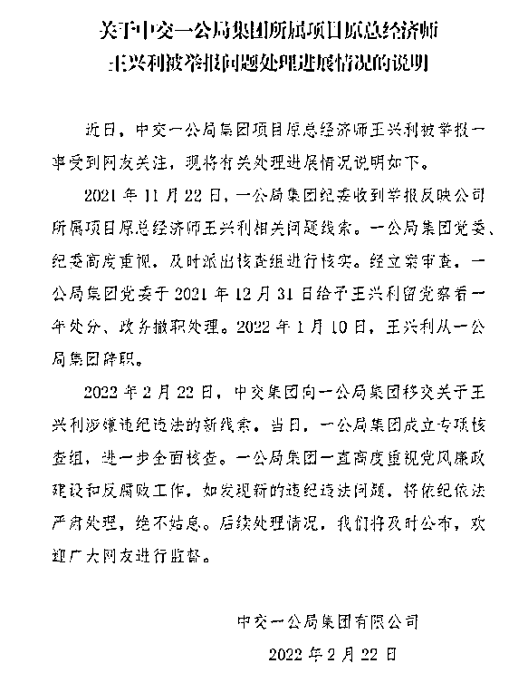
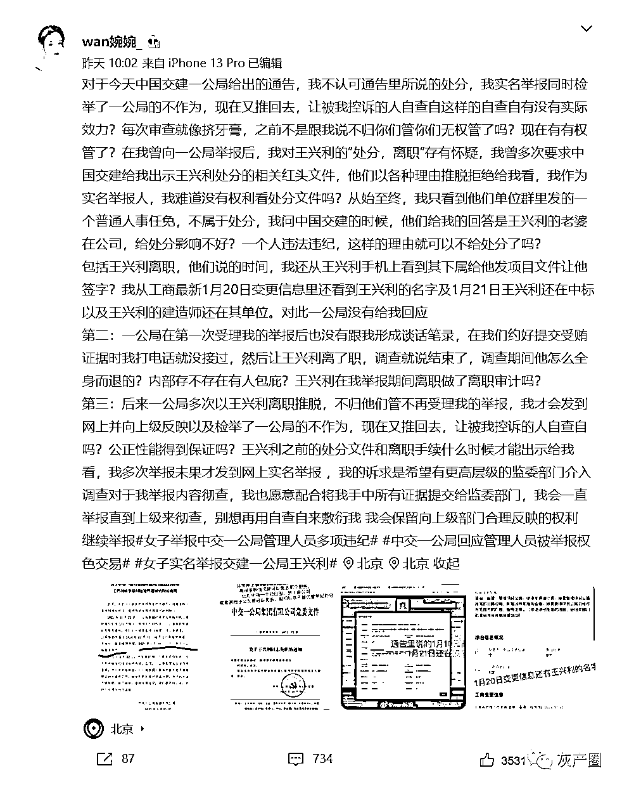
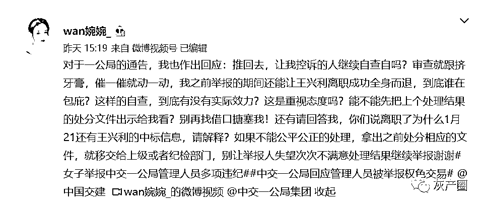

# 女子实名举报权色交易，中交一公局发布声明

> 原文：[`mp.weixin.qq.com/s?__biz=MzIyMDYwMTk0Mw==&mid=2247530365&idx=3&sn=7cb92121fec685d8b597c3e9d654a701&chksm=97cbbc45a0bc35534fe6cdc8d62f2b17d9e3564d7ca4a5138a1eac5bc6c69cdc2f225ee70adf&scene=27#wechat_redirect`](http://mp.weixin.qq.com/s?__biz=MzIyMDYwMTk0Mw==&mid=2247530365&idx=3&sn=7cb92121fec685d8b597c3e9d654a701&chksm=97cbbc45a0bc35534fe6cdc8d62f2b17d9e3564d7ca4a5138a1eac5bc6c69cdc2f225ee70adf&scene=27#wechat_redirect)

近日，有女子实名举报中国交建一公局合枞高速公路总经济师、党总支副书记王兴利严重违法违纪。

2 月 19 日，微博用户“wan 婉婉 _”发布视频，视频中，一名女子手持身份证，声称要举报中交一公局集团有限公司总经济师王兴利，隐瞒已婚事实，与自己同居一年多，并致其流产并患上抑郁症。

此外，其还举报王兴利收受利益关系人巨额贿赂，瞒报安全生产责任事故，以及与多名女子有过不正当钱色交易，生活腐化堕落等等。

据她称，她已举报半年，但相关部门并未作出相应的调查处理。对公司声称的 1 月 10 日王兴利已辞职的处理决定，她表示怀疑，“我恳求更高层级的纪检委、司法机关监察部门介入，进行深入调查。”

<mpvideosnap class="js_uneditable custom_select_card channels_iframe" data-pluginname="videosnap" data-id="export/UzFfAgtgekIEAQAAAAAAhE0YXzHQegAAAAstQy6ubaLX4KHWvLEZgBPE7oJkTWEdJ6_8zNPgMIvrdkCXu8AuynFfDi_QiPBj" data-url="https://findermp.video.qq.com/251/20350/stodownload?encfilekey=Cvvj5Ix3eexKX1zo1IZZBrQomawdVfSQH1uu2U31EqHbFia00vSYLwxObibGibNx6HkKRaa9zz9pZvFibfd6GnSjYLx3icar5KbuQHzN1UUBWkAQLY3943AJDjYydffCGVDjDLOTbE4TYgJXqia74OibUFGnB4FicoLCBTTGArs3QY3vsGk&amp;adaptivelytrans=0&amp;bizid=1023&amp;dotrans=0&amp;hy=SH&amp;idx=1&amp;m=9550a099dcd58bf3e31f44a2b638ff1d&amp;token=x5Y29zUxcibDDeU8dTDOicIdmAJshn6OSbz7ZfA5bvbOoqrOVaTVSbmyPZnicsqjRqnCgmgpQjha0g" data-headimgurl="http://wx.qlogo.cn/finderhead/PiajxSqBRaEISAKibugHhUQs74zK9sdqn9QvawbxCzU7AuxCgU4kpS0A/0" data-username="v2_060000231003b20faec8cae18b1bcad5cb00e937b0779ef044c516b0481d185bbca60dd9c21f@finder" data-nickname="灰产圈" data-desc="微博用户实名举报中国建交一公局总经理师王兴利。" data-nonceid="14494372328652849717" data-type="video"></mpvideosnap>

为了佐证自己的说法，她还晒出了王兴利的身份证以及工作牌。

2 月 22 日晚 10 时许，中交一公局集团有限公司官方微博发布声明称，近日，中交一公局集团项目原总经济师王兴利被举报一事受到网友关注，现将有关处理进展情况说明如下。

2021 年 11 月 22 日，集团纪委收到举报反映公司所属项目原总经济师王兴利相关问题线索。一公局集团党委、纪委高度重视，及时派出核查组进行核实。经立案审查，一公局集团党委于 2021 年 12 月 31 日给予王兴利留党察看一年处分、政务撤职处理。2022 年 1 月 10 日，王兴利从一公局集团辞职。

2022 年 2 月 22 日，中交集团向一公局集团移交关于王兴利涉嫌违纪违法的新线索。当日，一公局集团成立专项核查组，进一步全面核查。

随后微博用户“wan 婉婉 _”针对中交集团向一公局集团给出的通告做出回应：

这件事还未完结，我们等待后续处理结果，

你对这件事有什么看法？请在留言区发给我们！

来源：澎湃新闻 ，极目新闻，长沙晚报

← 向右滑动与灰产圈互动交流 →

