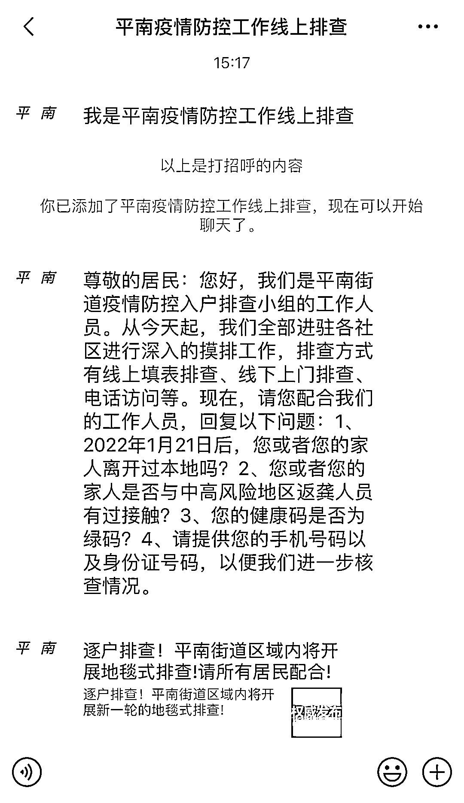
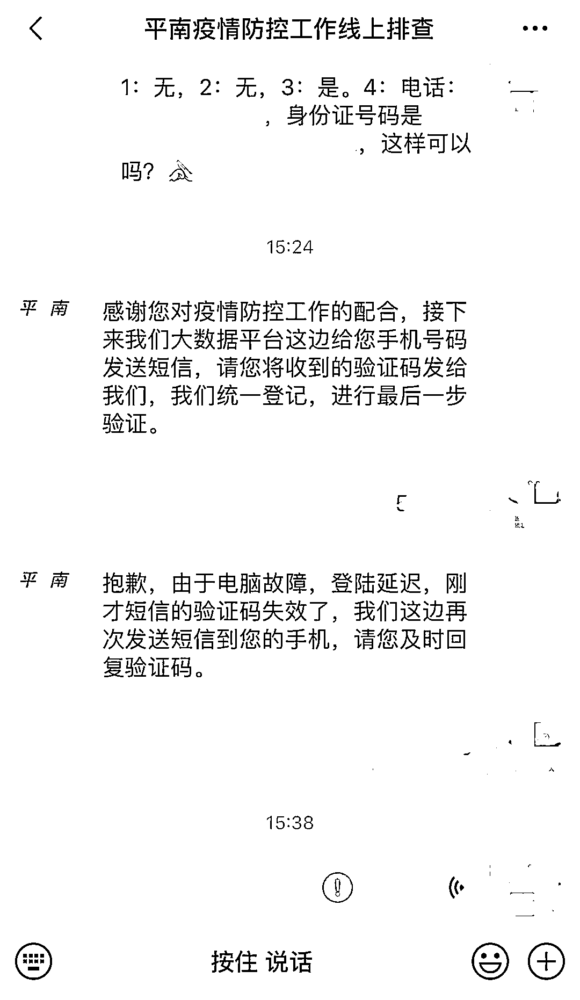
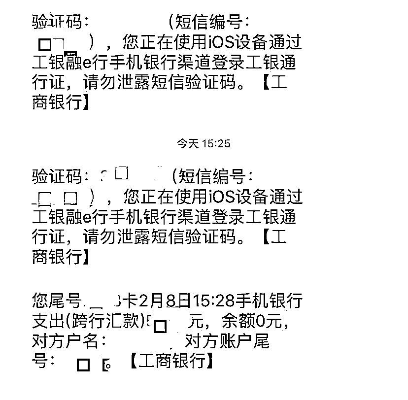

# 警惕新套路！一女子配合"疫情排查"，结果银行卡被掏空

> 原文：[`mp.weixin.qq.com/s?__biz=MzIyMDYwMTk0Mw==&mid=2247530365&idx=7&sn=07b656f05e4e06eb3992802fd4e087fd&chksm=97cbbc45a0bc3553f7e25fc51dce271748765829917af8636c17482401fc6426e1c0a20494f9&scene=27#wechat_redirect`](http://mp.weixin.qq.com/s?__biz=MzIyMDYwMTk0Mw==&mid=2247530365&idx=7&sn=07b656f05e4e06eb3992802fd4e087fd&chksm=97cbbc45a0bc3553f7e25fc51dce271748765829917af8636c17482401fc6426e1c0a20494f9&scene=27#wechat_redirect)

当前疫情防控形势严峻

在大家积极配合政府

疫情防控工作时

一些不法分子也趁机

**套用一些所谓的“官方消息”**

**实施各种套路的诈骗**

让人防不胜防

近日，广西贵港平南县的杨女士

在微信上收到一则

**“疫情防控工作线上**

** 排查工作人员”的通知**

她以为是疫情防控的核查

立刻按对方要求的步骤进行操作

**几分钟后，她银行卡里**

**的余额全都被转出去了**

杨女士直到看到

手机转账的短信才反应过来

原来自己掉入了骗子的圈套

立即报警向公安机关求助

所幸，这笔钱款被警方成功追回

虽然最后杨女士并没有损失钱财

但是这样的诈骗套路

值得每一位市民注意、警惕

小编提醒：

诈骗分子会利用防疫的要求措施

让群众一下子很难反应

到底是不是真的排查工作

遇到核查的时候

要沉着冷静，不要慌乱，理性应对

**排查工作组不会收集您的**

**银行卡号、密码等敏感信息**

**请注意甄别，谨防诈骗！**

来源：光明网、新闻坊、贵港网警巡查执法、中国青年网微信

← 向右滑动与灰产圈互动交流 →

