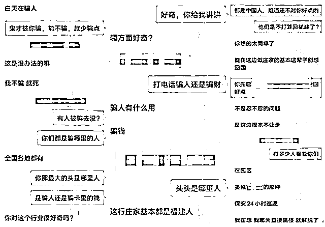
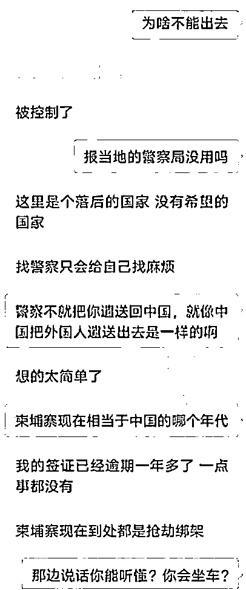
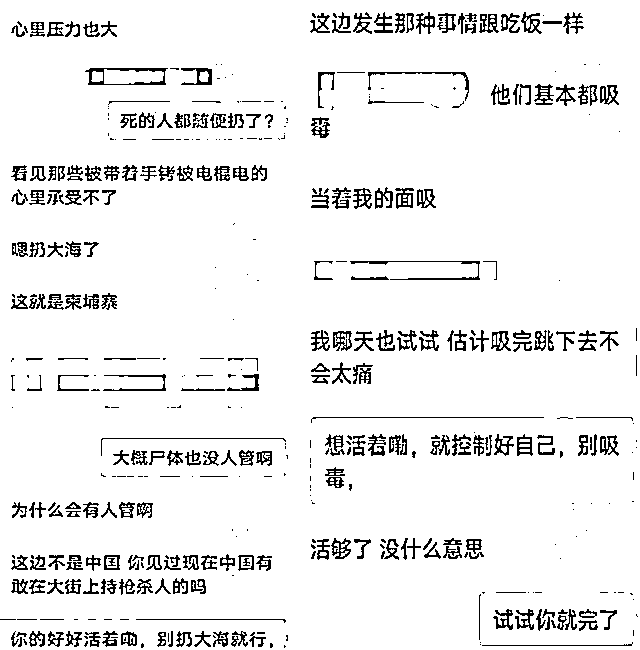
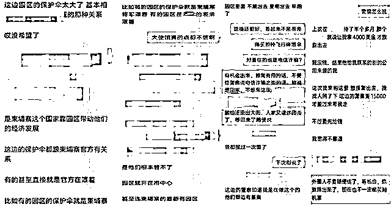
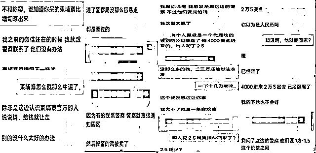
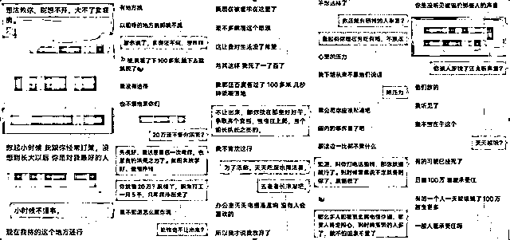
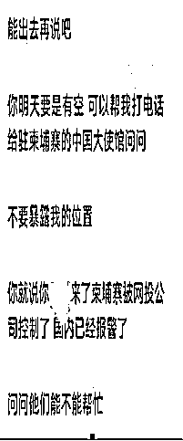
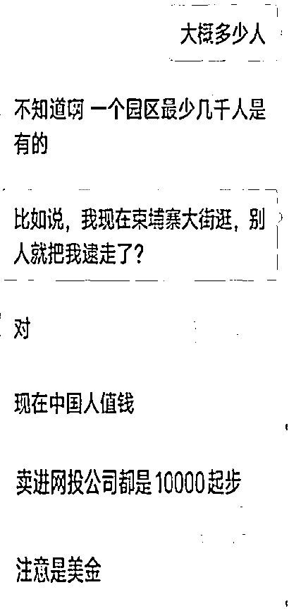
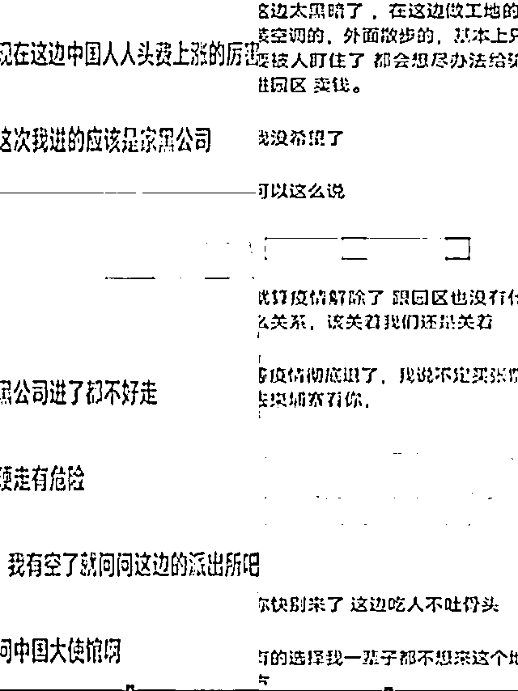
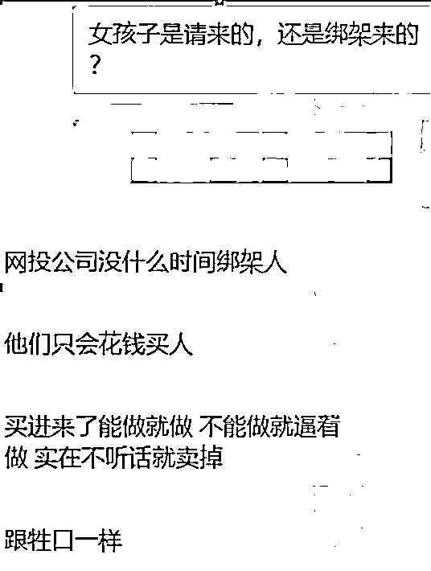

# 1400 余条聊天记录，还原一位“身陷柬埔寨诈骗园区”受害者的心路历程

> 原文：[`mp.weixin.qq.com/s?__biz=MzIyMDYwMTk0Mw==&mid=2247530450&idx=1&sn=3a1813fdd573aaec6ec11eb7dd5ba8c1&chksm=97cbbceaa0bc35fc0aa2e5353b1e914ba103927689b86fd8cb2ae1c474e285c481b3e6b312ea&scene=27#wechat_redirect`](http://mp.weixin.qq.com/s?__biz=MzIyMDYwMTk0Mw==&mid=2247530450&idx=1&sn=3a1813fdd573aaec6ec11eb7dd5ba8c1&chksm=97cbbceaa0bc35fc0aa2e5353b1e914ba103927689b86fd8cb2ae1c474e285c481b3e6b312ea&scene=27#wechat_redirect)

在柬埔寨的“血奴”事件发生后，不少在柬埔寨受害者的亲历见被全国媒体报道。

近日，**上游新闻**又报道了一位在柬埔寨身陷绝境的重庆人，渴望被解救的心理历程。

**上游新闻**记者收到一份重庆人晓欣（化名）发来的材料，与发件人联系确认后，看到，这是身陷柬埔寨某园区网诈窝点的重庆人晓渝（化名）与家人晓欣的 1400 余条聊天记录。

其中，晓渝讲述了自己从被骗进某园区窝点搞网诈、亲历网诈窝点“圈养”、向柬方报警求助后被带出、又被当地腐败官员转卖其他园区公司、继续受虐待被逼从事网诈、家属向老家警方报警求救的全过程。

上游新闻报料邮箱收到的约 1400 条聊天记录信息（因隐私和保护当事人需要进行了技术处理）

**“我不骗，就死”**

晓欣告诉记者，能再联系上晓渝完全是运气。

“联系上以后发了定位，我一看在柬埔寨。”晓欣对晓渝现在的工作和处境完全不知道，只是因为出去时间有点长了，家里人都很生气。

晓欣告诉记者：“我鼓动晓渝向警察报警求助，然后遣返回来。但晓渝说我想的太简单了。”

晓渝坦白了在柬埔寨的工作性质，“我不骗，就死。”

晓欣说：“这是晓渝在交谈中第一次说到‘死’字。当时我还不以为然，以为是开玩笑。”

聊天记录截屏

在后面的聊天对话中，晓渝也说出了园区里诈骗窝点的生存法则：“不听话，该死的都死了。”

聊天记录截屏

对于网诈窝点虐待受害人的各种手段，上游新闻此前有过多次报道。

被柬埔寨爱心人士解救出来的受害者贾小天（化名）告诉记者：“我被他们双手拷在上下铺的下铺，成大字型躺着，不吃不喝三天三夜，为了活命，我只有答应给他们坑蒙拐骗的事。”

17 岁获救男孩袁小虎（化名）则通过视频向记者展示了左小腿被电棍电击，皮肤被灼烧的痕迹。

此外，吸毒也是网诈公司的控制手段。获救的受害者墨洋（化名）告诉上游新闻记者：“公司会逼迫吸毒，吸了就逼迫其问家里要钱。男的不吸就强奸他女朋友，两个都得吸（毒）。”

对此，在晓渝与晓欣的对话中也再次得到印证。

晓渝对晓欣说：“他们基本都吸毒，当着我的面吸。”“我哪天也试试，估计吸完跳下去不会太痛。”

聊天记录截屏

**报警拿钱赎人都不行，“死了一了百了”** 

在交谈中，晓欣最初按照普通人的思维，让晓渝报警求助，然而晓渝讲述的遭遇，让晓欣彻底改变了走正规途径报警的想法。

在两人对话的早期，上游新闻记者看到，晓欣不断给晓渝支招逃出来，包括报警、电话联系中国驻柬埔寨大使馆等方式。

但晓渝说：“柬埔寨靠园区带动经济发展，这边的保护伞都跟柬埔寨官方有关系，有的园区保护伞就是柬埔寨将军。“

聊天记录截屏

晓渝还说，就算进了警察局，也没那么容易走，“都是要钱的，有的人报警，警察直接就联系园区，报警的人就被卖了。”

聊天记录截屏

晓欣告诉记者：“他们的手机都是公司发的，白天工作不准使用手机，只有晚上 11 点多下班回宿舍才能用，住在一起的人相互之间都不说话，稍有不慎就被告密，被毒打、电击或者被转卖给其他网诈公司。”

不得已，晓欣只能想出拿钱赎人这一招，但也被晓渝拒绝了。“没用”，晓渝绝望的说：“现在被套牢在这里了，我对生活没了希望。”

晓渝告诉晓欣，与其这样（卖房子拿钱赎人），“我死了一了百了，百度说，100 多米，几秒钟就能落地。”

聊天记录截屏

最近，由于国内对于柬埔寨网诈事件的连续报道，网诈人员也面临压力。在聊天记录里，上游新闻记者看到，晓渝说：“最近压力很大，办公室里随时电棍都在滋滋响。”

晓欣的鼓励，是晓渝现在活下去的动力。但晓欣也告诉记者，看到晓渝说起公司里每天虐待员工场面，担心晓渝“难免会有精神崩溃，做出傻事的时候，真的希望能挺过去。”

聊天记录截屏

**一条血淋漓的黑色产业链**

上游新闻记者注意到，随着时间推移，晓渝与晓欣的聊天内容逐渐深入，一条 “黑色产业链”及其背后血淋淋的利益输送，呈现在记者面前。

晓渝说，一个园区最少几千人。另外一名受害者王云（化名）告诉记者：“在园区里，我待的这个公司小，只有四五十人，转卖我的上一家公司有两三百人。”

**这些人从哪里来？**

上游新闻记者看到，晓欣问：“比如我现在柬埔寨大街上逛，别人就把我逮走了？”

晓渝说：“对，现在中国人值钱。卖进网投公司都是 10000 美金起步。”

聊天记录截屏

随着聊天时间推移，上游新闻记者发现，在柬埔寨的中国人被绑架、拐骗卖进园区的人头费不断上涨。单价从 1 万美金/人，涨到了 1.5 万美金/人。用晓渝的话说“现在这边中国人人头费上涨的厉害。”

在柬埔寨，**“中国人是‘行走的黄金’，在华人圈里家喻户晓。”**

**中柬义工队队长陈宝荣告诉上游新闻记者：“由于网诈窝点收中国人的价格越来越高，不少通过正规渠道来柬埔寨工作的中国人，也被绑架、拐骗进了‘园区’。只要进了网诈窝点，就很难逃出来，在里面被他们圈养、教唆、虐待从事网络诈骗，骗更多中国人的钱。”** 

**晓渝在接受上游新闻记者采访时也承认：“我进了‘园区’出去就难了，现在市面行情价，只要是个中国人就 2 万美金起步，有的人都卖到 3 万 5（美金）了，所以这种情况下，进了‘园区’基本走不掉。”**

****

**聊天记录截屏**

****是怎么被骗去柬埔寨的？****

**晓渝是被一个人骗，从上海持护照出境飞东南亚某国，进公司才知道是搞网络电信诈骗，三个月后公司将其带到了柬埔寨。**

**在国内的反诈压力下，反诈集团是否会有所收敛？**

**晓渝告诉上游新闻记者：“这行会永远（存在）下去，总有傻子。前几天，有人拿上百万人民币奖励，这样的人，更不会放走了。”**

****网诈团伙有哪些新目标？****

**晓渝说：“现在这行不局限于中国大陆、中国台湾，日本、欧美、韩国、越南，那里的华人或当地人都是目标。”**

**从事网络诈骗的人怎么说外语沟通？晓渝告诉上游新闻记者：“请几个会（外国）语言的女孩子就可以了，打字使用翻译软件，语音让女孩子说。”**

**女孩子是请来的，还是绑架来的？晓渝说：“网投公司没时间绑架人，他们只会花钱买人，买进来了能做就做，不能做就逼着做，实在不听话就卖掉。”**

**“（这里的人）跟牲口一样。”**

**** 

**聊天记录截屏**

**来源：上游新闻**

****此前报道：********[挑人脚筋、残杀中国粉丝？!百万粉丝网红李赛高真实身份曝光，竟是诈骗团伙头目！](http://mp.weixin.qq.com/s?__biz=MzIyMDYwMTk0Mw==&mid=2247530365&idx=1&sn=add7c9350783812751cd89a32db62a0e&chksm=97cbbc45a0bc3553631936cbcabdae7e5f0cd05bfa66e66050dbc2be1fc38b2c52b2b4c5cee0&scene=21#wechat_redirect)**** ****[“血奴”背后的柬埔寨网赌江湖](http://mp.weixin.qq.com/s?__biz=MzIyMDYwMTk0Mw==&mid=2247530165&idx=1&sn=8ab8ddbcdd672c570b9d6f3883309e53&chksm=97cbbd8da0bc349bc8e1f5293170263ad0da2c9706e07fc6d650a5bef920c53a215976b857c0&scene=21#wechat_redirect)**** **[**“血奴”事件热度节节攀升，柬埔寨的抖音网红们被“网暴”了……**](http://mp.weixin.qq.com/s?__biz=MzIyMDYwMTk0Mw==&mid=2247530112&idx=1&sn=bdd83fe1ea019385a9513bf10cd756f4&chksm=97cbbdb8a0bc34aebeb39612baf2bafd7b06ccd01ae06ebee20433a841d9143cc8fe77ddf2fe&scene=21#wechat_redirect)** **[**柬埔寨“血奴”事件牵出 58 同城：大量网友被骗，有人招聘马仔贩毒**](http://mp.weixin.qq.com/s?__biz=MzIyMDYwMTk0Mw==&mid=2247530022&idx=3&sn=2b937b715241a4ada98132f4d1598e9f&chksm=97cbbd1ea0bc3408e7013dc16c0db012048a5e10c572e58411c00ed8cc14019d63f78ea87f26&scene=21#wechat_redirect)** **[**“血奴”之后，他们从柬埔寨获救，最小 14 岁**](http://mp.weixin.qq.com/s?__biz=MzIyMDYwMTk0Mw==&mid=2247530022&idx=4&sn=99ec46895d346e5acdbd03f935bc1996&chksm=97cbbd1ea0bc34086813e0f47a6b2e55fc8a001ba9e8fc42a18a63742b59e74ab017ddb41d9d&scene=21#wechat_redirect)** **[**困在柬埔寨诈骗公司的中国人：交了 30 万赎金却被转卖，完不成业绩被电击！**](http://mp.weixin.qq.com/s?__biz=MzIyMDYwMTk0Mw==&mid=2247529713&idx=4&sn=ddfec568dcd5aa13f7e3517b77d18d35&chksm=97cbbfc9a0bc36df0870d52c009d4efdb99ea2d0e7a8c548e0b58cb9b00818166e90b5c1a71a&scene=21#wechat_redirect)** ****[紧急发布：赴缅甸、柬埔寨等国家“高薪务工”陷阱提醒！](http://mp.weixin.qq.com/s?__biz=MzIyMDYwMTk0Mw==&mid=2247529393&idx=4&sn=b0afe005862fbd0593adea54d72f954d&chksm=97cbb889a0bc319f4589c8c9ce7a1b45f6368c046fd1f0dc9547fe3a60f9b499998817c42ea5&scene=21#wechat_redirect)********

**← 向右滑动与灰产圈互动交流 →**

****