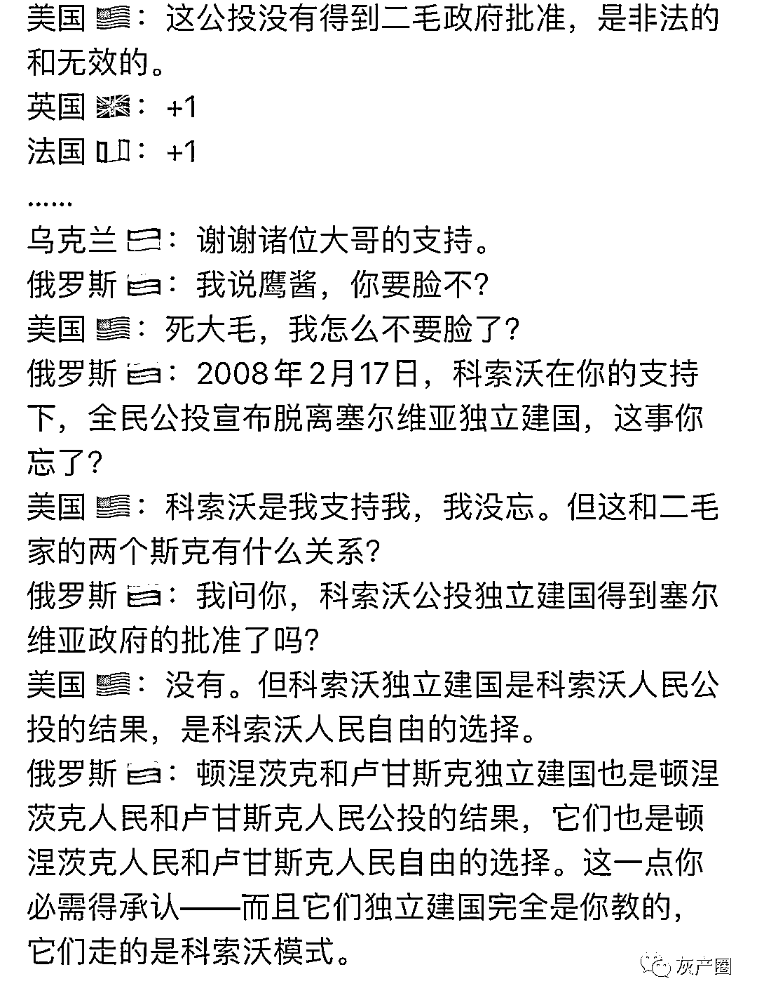
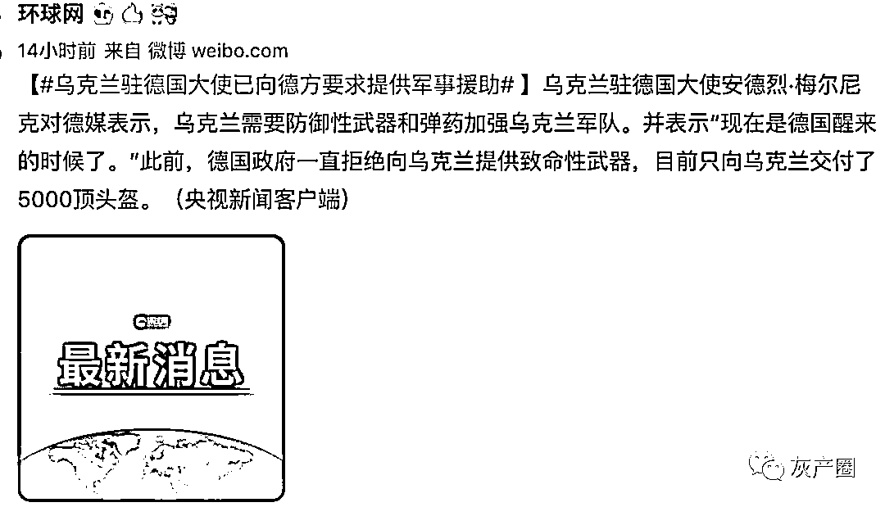

# 乌克兰被美国坑惨了，俄军都打到家门口了，美军表示：没空，在打索马里！

> 原文：[`mp.weixin.qq.com/s?__biz=MzIyMDYwMTk0Mw==&mid=2247530450&idx=2&sn=9f4a9125b9d9c099e5c8744b79a4c3c9&chksm=97cbbceaa0bc35fc872e92af5580ac50a88e89785d9c368472f67c9755b6a13b0e5d47275899&scene=27#wechat_redirect`](http://mp.weixin.qq.com/s?__biz=MzIyMDYwMTk0Mw==&mid=2247530450&idx=2&sn=9f4a9125b9d9c099e5c8744b79a4c3c9&chksm=97cbbceaa0bc35fc872e92af5580ac50a88e89785d9c368472f67c9755b6a13b0e5d47275899&scene=27#wechat_redirect)

俄罗斯为什么和乌克兰打仗，俄罗斯说为了不让乌克兰加入北约。 

各个国家之间的关系，网友用对话生动形象地表达了出来 

当俄罗斯全面进攻乌克兰后，乌克兰九傻眼了 

本以为美国领导的北约会出兵帮自己：

“泽连斯基总统，好消息！美国军队出动了！”
“太好了！他们到哪儿了？”
“索马里。”

而北约国家能做的，除了在旁边嗑瓜子，发个谴责声明，剩下的就只有祈祷了 

美国，英国，法国，德国纷纷亮灯作秀，支持乌克兰！ 

网友引经据典

乌克兰让德国人醒醒，德国人表示：不是给你头盔了嘛！

美国的小弟昨天也没闲着 

急得乌克兰总统泽连斯基在推特上一会 at 这个领导人一会 at 那个领导人，甚至不停重复 at 

乌克兰总统泽连斯基称：俄罗斯的进攻已造成乌克兰 137 名士兵死亡，316 名士兵受伤。他询问北约 27 个成员国是否可加入北约，得到的答案是否定的。美国和北约拿虚假的北约成员国身份欺骗乌克兰，乌克兰政府相信了，现在它为此付出了代价。泽连斯基正为自己的演技接受惨重教训。

来源：微博那些事儿

← 向右滑动与灰产圈互动交流 →

