# "为啥俄乌开打，台湾上了热搜？"

> 原文：[`mp.weixin.qq.com/s?__biz=MzIyMDYwMTk0Mw==&mid=2247530450&idx=4&sn=075a7b464312f0b393fc726a3fec1bb4&chksm=97cbbceaa0bc35fc3f75dfc953d13511777f78d14249c96345a2ccc56144bad7a96a1b1a23df&scene=27#wechat_redirect`](http://mp.weixin.qq.com/s?__biz=MzIyMDYwMTk0Mw==&mid=2247530450&idx=4&sn=075a7b464312f0b393fc726a3fec1bb4&chksm=97cbbceaa0bc35fc3f75dfc953d13511777f78d14249c96345a2ccc56144bad7a96a1b1a23df&scene=27#wechat_redirect)

“台湾与乌克兰没有可比性，这种关联极其错误。台湾问题纯属中国内政，在主权上台湾始终是中国的一部分。”

正当世界目光都聚焦在俄乌之际，**“台湾地区”**却上了推特的美国热搜榜第二名，话题热议度仅次于“乌克兰”，有热门帖文写道**“你们猜现在谁吓得不行了？台湾！”**

据台媒“中时新闻网”25 日报道，从俄方宣布行动开始后的 4 小时内，“台湾地区”的热搜话题讨论度超过了 10 万。不少网友对热门推文表示认同，就台当局频频在两岸关系上刻意制造事端可能招致的后果忧心忡忡。尤其是在美国等西方国家对乌克兰空口支援但坚决不出兵后，他们认为由此可见蔡英文当局对美国出兵援台是“白日做梦”，还有人贴出表情包来讽刺“倚美谋独”的台当局此刻忐忑的心情。

俄乌爆发冲突以来，民进党当局配合美西方舆论，一直在炒作所谓的“今日乌克兰，明日台湾”，并不断强调所谓“美国会出兵帮台湾”的论调，企图借乌克兰问题渲染大陆“军事威胁”。对此，台湾时事评论员赖岳谦表示，乌克兰是主权独立国家，但台湾跟大陆属于一个中国，而美国只承认中华人民共和国，“民进党当局现在就是慌了，认为美国一定会为你怎样，其实都是空话，放弃幻想吧。”

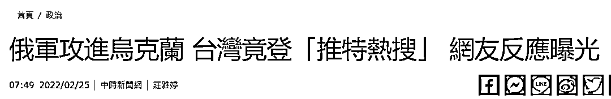

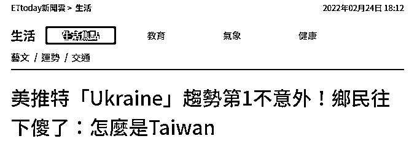

俄罗斯总统普京 24 日凌晨宣布在乌克兰顿巴斯地区展开“特别军事行动”后，乌东局势急转直下。

与此同时，一些台湾网民则在疑惑一件事：**为什么俄乌开打，上热搜的却是台湾？**

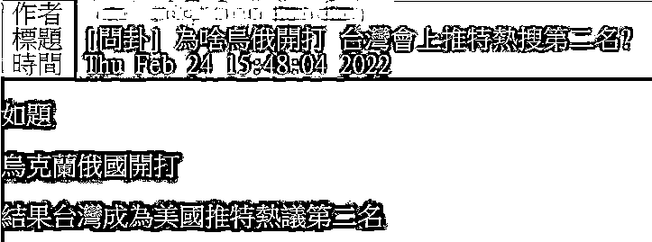

据台媒报道，俄乌冲突升级后，“台湾地区”却随之冲上了推特的美国流行趋势话题第二名，话题热议度仅次于“乌克兰”。

就在全球流行趋势话题排名中，“台湾”也排到了第五位，仅次于“乌克兰”、“普京”、“北约”等词条。

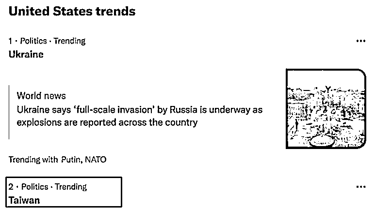

美国流行趋势话题

一名外国网友就俄乌危机发推称“你们猜现在谁吓得不行了？台湾！”，随即跃升为热门。

报道称，从俄方宣布行动开始后的 4 小时内，“台湾地区”的推特热搜话题讨论度超过了 10 万。

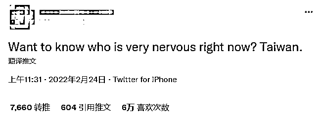

不少岛内网民对这则热门推文表示认同，就台当局频频在两岸关系上刻意制造事端可能招致的后果忧心忡忡，也对台当局所谓“美国会出兵帮台湾”的谎言越来越不相信。

尤其是在美军撤离阿富汗后，再次亲眼见到美国等西方国家对乌克兰空口支援但坚决不出兵后，他们认为由此可见蔡英文当局对美国出兵援台是“自欺欺人”“白日做梦”，“美、英等哪个派兵去援助乌克兰了。蔡英文却对美国出兵援台白日做梦！”

昨晚（24 日），“美国在台协会（AIT）”在脸书引述美国总统拜登对俄乌局势的最新声明，称“全世界的人民今晚与乌克兰人民一起祈祷”。结果众多台湾网民跑到文章评论区表示不满，有人直言“对台湾人来说，接连看到贵国在阿富汗跟乌克兰的事件反应，不会再存有幻想”。

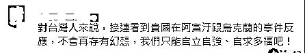

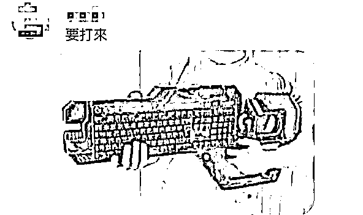

还有一些网民则贴出各种恶搞表情包，来讽刺“倚美谋独”的台当局此刻忐忑的心情。

“台湾看着乌克兰。”

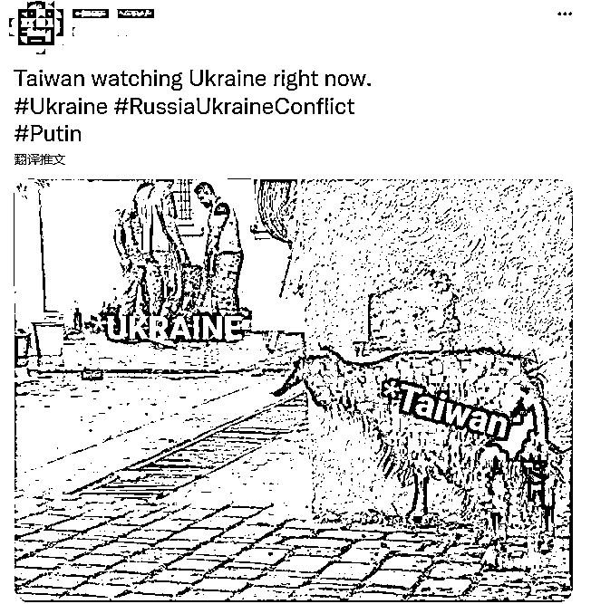

“看着新闻的台湾现在正瑟瑟发抖、目瞪狗呆、一头冷汗……”

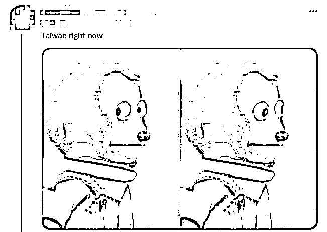

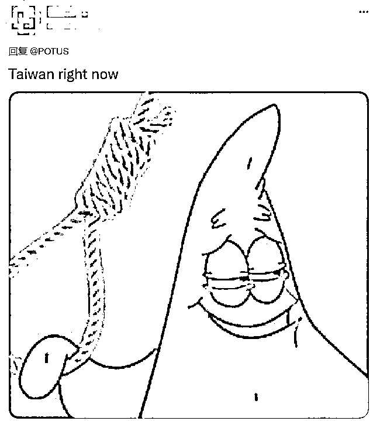

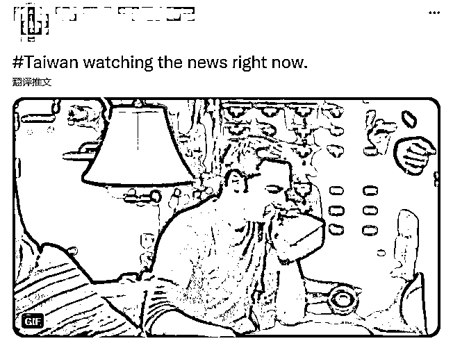

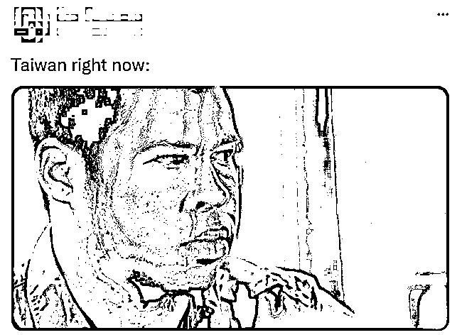

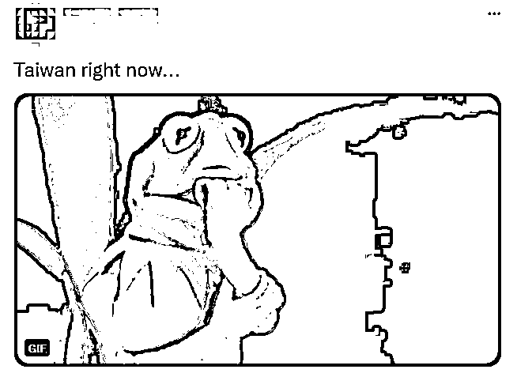

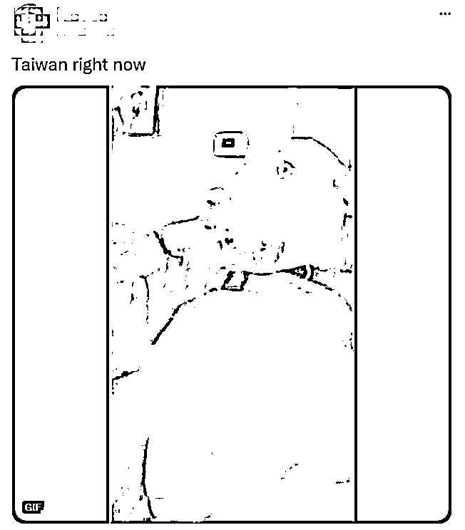

俄乌爆发冲突以来，民进党当局配合美西方舆论，一边暗示将配合美国对俄罗斯采取制裁措施，一边借乌克兰问题蹭热点，声称“台湾比乌克兰更重要”，以此希望美西方支持台湾，迫使大陆不敢“武力侵犯”。

对此，岛内舆论则是警告声不断。台湾资深媒体人赵少康 23 日发文喊话“蔡英文该醒醒了”，称民进党不断麻痹台湾人“大陆不会打台湾，就算打了美军也会来”，但乌克兰对台湾的启示很明确，就是“小地方不要刺激实力强的一方”，并强调两岸和平相处最重要，“如果没事捅大陆一下，捅久了总有出事的一天，受伤最大的还是台湾。”

同一天，台北市议员王鸿薇也质问，美国对建交的乌克兰尚且如此对待，台湾却把美国当成唯一救命稻草，“台湾的国际政治局势，比乌克兰还要差，还能自以为美国会为台湾打仗吗？”

台湾时事评论员赖岳谦的评价则直接点出了问题核心，他直斥民进党吹嘘的“台湾在美国心中比乌克兰更重要”的论调是胡说八道、自我安慰，强调乌克兰是主权独立国家，但台湾跟大陆同属于一个中国，而美国只承认中华人民共和国，“乌克兰和俄罗斯还是两个国家，两个主权国家美国都不敢派兵，（大陆和台湾是）同一个国家他怎么敢介入？”

赖岳谦哭笑不得，“现在民进党当局就是焦虑、恐惧、恐慌，然后不安，一定要找人来跟他说‘你很棒棒、你最重要，美国一定会为你怎么样’，其实都是空话，不要睁眼说瞎话，**有一点军事常识，放弃幻想吧。**”

[`mp.weixin.qq.com/mp/readtemplate?t=pages/video_player_tmpl&action=mpvideo&auto=0&vid=wxv_2284628487732985858`](https://mp.weixin.qq.com/mp/readtemplate?t=pages/video_player_tmpl&action=mpvideo&auto=0&vid=wxv_2284628487732985858)

视频来自国防时报 

据环球时报报道，中国国际问题研究院欧洲所所长崔洪建近日受访时也表示，必须严正说明的是，**台湾与乌克兰没有可比性，这种关联极其错误。****台湾问题纯属中国内政，在主权上台湾始终是中国的一部分。**

他说，西方和台湾一些人将乌克兰问题与台湾问题相关联，试图用所谓中国大陆与台湾的“分治”状态来论证“主权分离”，给中国扣上“改变现状”的帽子。也有人将俄罗斯对待乌克兰问题的策略看作未来解决台湾问题的某种“榜样”。这两个方向产生的负面影响是一致的，即模糊了这两个问题的本质不同。说到底，**乌克兰问题，是大国博弈中的地缘政治问题，与作为中国内政的台湾问题存在本质区别。**

对于台当局屡次借乌克兰问题炒作，我方也曾做出多次回应。

23 日，国台办发言人马晓光在记者发布会上评价民进党当局声称“对乌克兰情况感同身受”的炒作完全是**自作多情。**

马晓光表示，台湾是中国领土不可分割的一部分，台湾问题纯属中国内政。近期民进党当局配合美西方舆论，借乌克兰问题恶意炒作所谓大陆“军事威胁”，包藏着他们图谋把台湾问题“国际化”和在岛内煽动“反中抗中”民粹的祸心，完全是为了一党私利的政治操弄。需要指出的是，当前台海形势紧张的根源，是民进党当局和“台独”势力勾连外部势力不断进行谋“独”挑衅。我们为捍卫国家主权和领土完整所采取的一切必要行动，针对的是“台独”分裂活动和外部势力干涉，目的是从根本上维护两岸同胞切身利益和中华民族整体利益。

同一天，外交部发言人华春莹也在例行记者会上表示，**台湾当局有些人借乌克兰问题蹭热点和碰瓷，是不明智的行为。**

她说，台湾的确不是乌克兰。**台湾从来都是中国领土不可分割的一部分**，这是无可辩驳的历史和法理事实。一个中国原则是公认的国际关系准则。台湾地区的和平取决于海峡两岸关系的和平发展，而不是揺尾乞怜，指望外部势力售卖武器或提供军事支持。“台独”只能是死路一条。对此，任何人都不应有任何误解误判。

24 日，国防部新闻发言人谭克非大校也就相关问题回应表示，民进党当局挟洋自重、以各种形式进行谋“独”挑衅，不断升高两岸对立对抗，这是威胁台海和平稳定的根源，也是严重危及台湾同胞福祉的祸害。解放军在台岛周边海空域组织多军兵种力量、多批次舰机开展常态化巡航、警巡等行动，就是要坚决打击“台独”分裂势力的嚣张气焰和谋“独”行径。[**“台独”挑衅**](http://mp.weixin.qq.com/s?__biz=MzIyMDYwMTk0Mw==&mid=2247493302&idx=2&sn=30b0477162d806a501e981abc7dcab0f&chksm=97cb2d8ea0bca49883c565a99b5d0154010fe309d0fda016abb7da1ce247cccd2681b041dc2b&scene=21#wechat_redirect)**一日不止，中国人民解放军捍卫国家主权和领土完整的行动就一刻不能停、也不会停。**

来源：观察者网 文/阮佳琪

← 向右滑动与灰产圈互动交流 →

