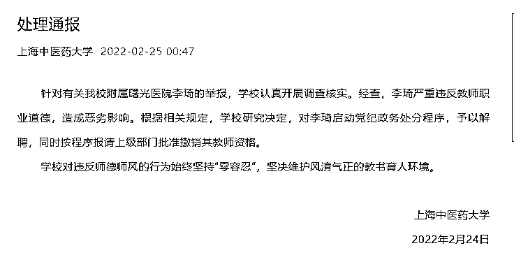
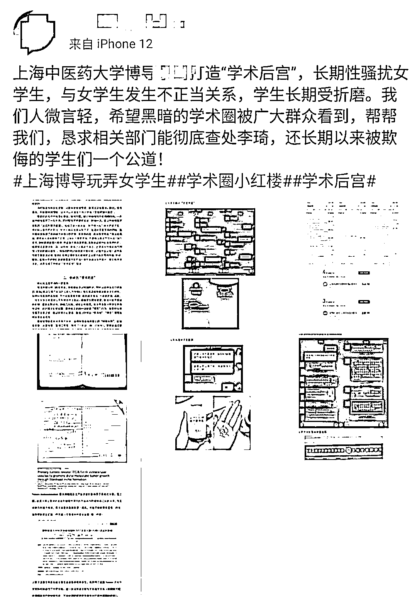
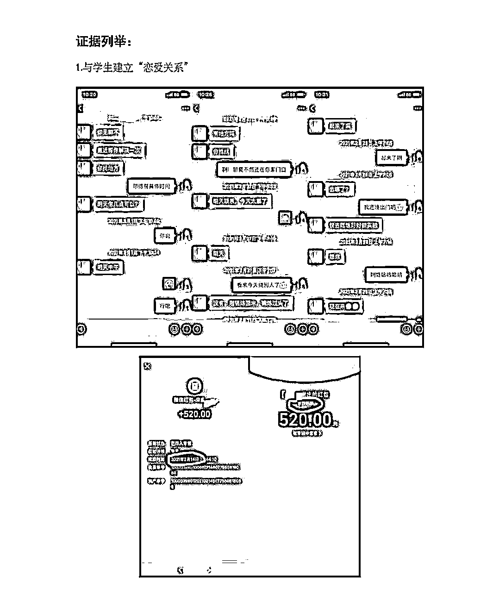
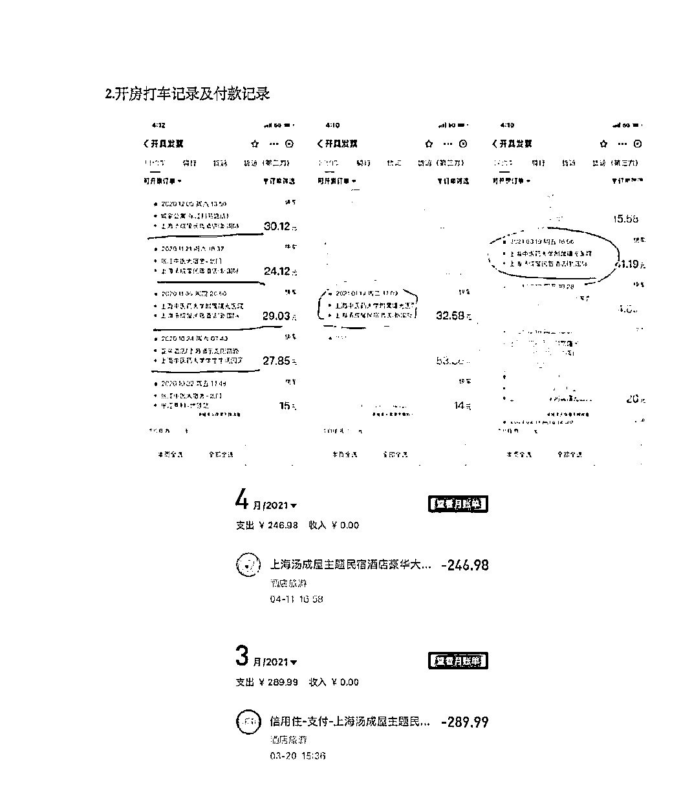
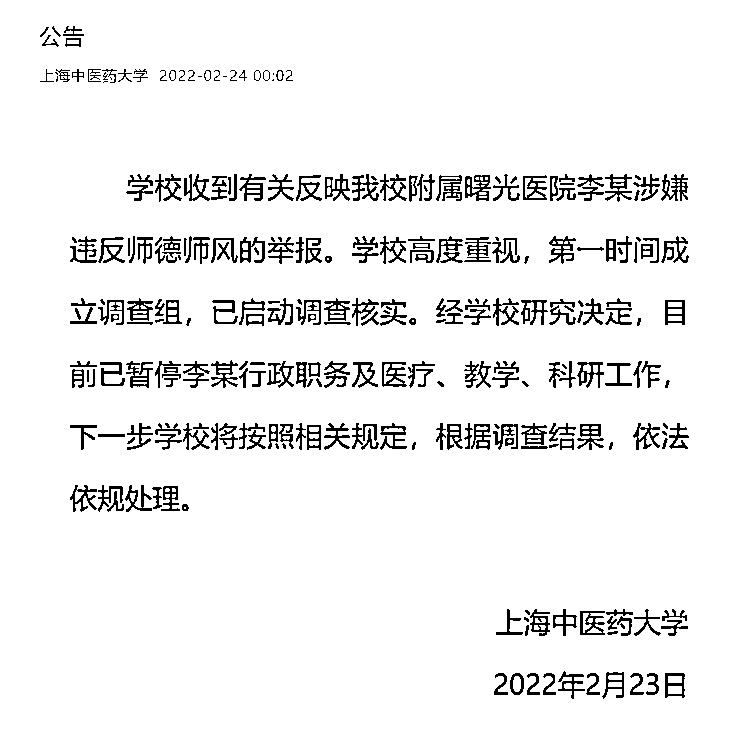
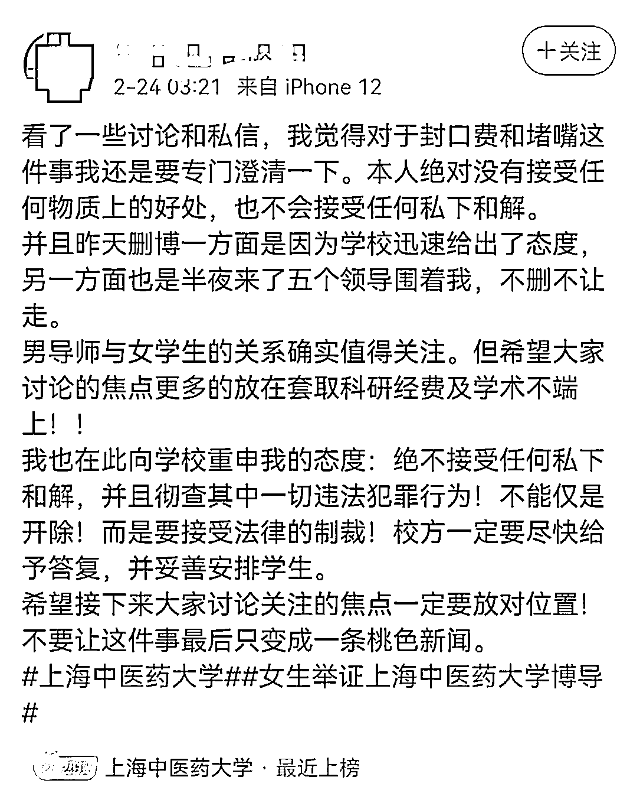

# 网传导师致女学生怀孕堕胎，校方通告

> 原文：[`mp.weixin.qq.com/s?__biz=MzIyMDYwMTk0Mw==&mid=2247530450&idx=5&sn=e55076e00bffb04627195974e3f8db0a&chksm=97cbbceaa0bc35fcaae584faa79662e828cdcc31ab850c0beea6fda661b8e0e0ae1ea6be885c&scene=27#wechat_redirect`](http://mp.weixin.qq.com/s?__biz=MzIyMDYwMTk0Mw==&mid=2247530450&idx=5&sn=e55076e00bffb04627195974e3f8db0a&chksm=97cbbceaa0bc35fcaae584faa79662e828cdcc31ab850c0beea6fda661b8e0e0ae1ea6be885c&scene=27#wechat_redirect)

继 2 月 24 日，上海中医药大学发布对涉事教师做暂停行政职务及医疗、教学、科研工作，并启动调查后，上海中医药大学 2 月 25 日凌晨再次发布“处理通报”称：经查，李琦严重违反教师职业道德，造成恶劣影响，予以解聘。

通报称：针对有关我校附属曙光医院李琦的举报，学校认真开展调查核实。经查，李琦严重违反教师职业道德，造成恶劣影响。根据相关规定，学校研究决定，对李琦启动党纪政务处分程序，予以解聘，同时按程序报请上级部门批准撤销其教师资格。学校对违反师德师风的行为始终坚持“零容忍”，坚决维护风清气正的教书育人环境。

**事件回顾**

此前本报报道，2 月 23 日，网友在微博发文称，“上海中医药大学博导李某打造‘学术后宫’，长期性骚扰女学生，与女学生发生不正当关系，学生长期受折磨。我们人微言轻，希望黑暗的学术圈被广大群众看到，帮帮我们，恳求相关部门彻底查处李某，换长期以来被欺负的学生们一个公道！”

该网友还晒出与李某的聊天记录、打车开房付款记录、怀孕打胎记录等。记者注意到，李某还曾在 2021 年 2 月 14 日情人节给当事女生转 520 红包表示节日快乐。

当事女生表示，其于 2020 年入学，由于是外地学生到学校后不太熟悉，女生生病后李某会给其开药，经常对其关心照顾。李某先从礼节性拥抱女生，逐渐变为“背后环抱”“亲吻”，并提出和女生发生性关系，最终两人“交往”确认男女关系，后多次到酒店开房。2021 年 4 月，女生查出怀孕，随后女生一人到医院打胎。

李某在接受媒体采访时说道，“我不知道这个事，现在学生这么复杂，她有啥依据，有啥证据，她这样平白无故的就这样说我。没有这个情况，不知道是谁，她有名字吗，有落款吗？为什么要这样搞呢？”

李某

据上海中医药大学官网显示，李某在上海中医药大学及所属医院和研究机构担任多个重要职务。

2 月 24 日零时，上海中医药大学官方微信发布公告称：学校收到有关反映我校附属曙光医院李某涉嫌违反师德师风的举报。学校高度重视，第一时间成立调查组，已启动调查核实。经学校研究决定，目前已暂停李某行政职务及医疗、教学、科研工作，下一步学校将按照相关规定，根据调查结果，依法依规处理。

上海医药大学发布公告后当事女生删除了此前相关的微博发帖，并再次发文回应称，本人绝对没有接受任何物质上的好处，也不会接受任何私下和解。希望学校彻查该教授相关不当行为。

来源：潇湘晨报综合报道

← 向右滑动与灰产圈互动交流 →

