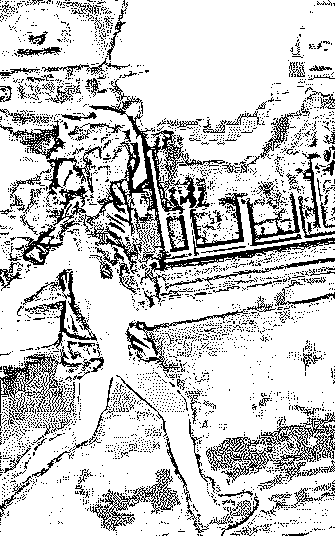
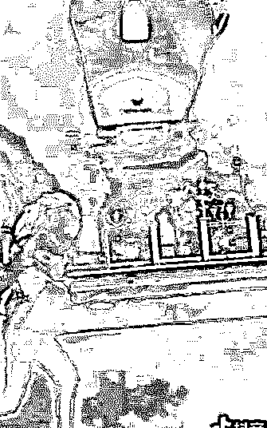
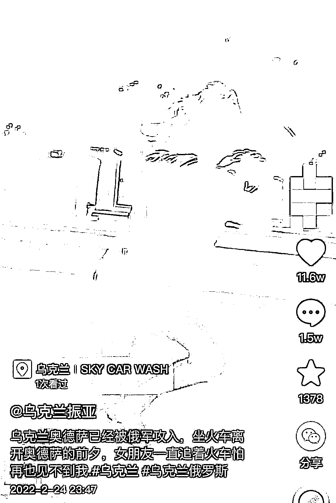
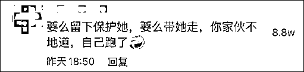
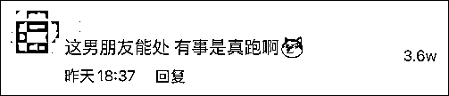
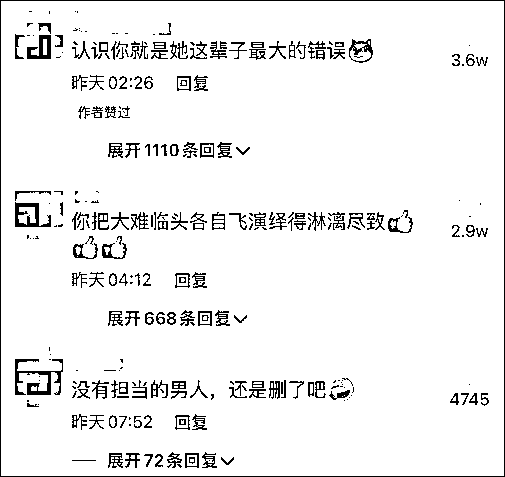
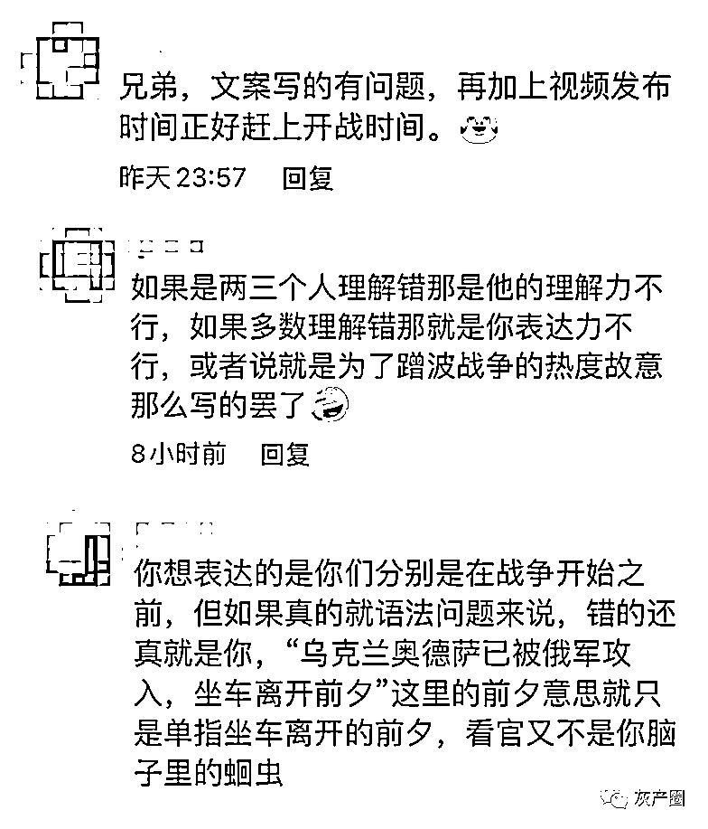
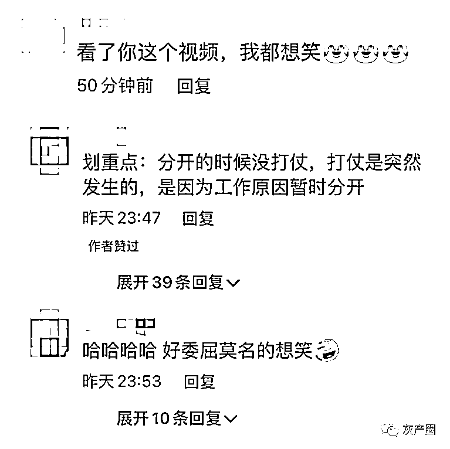

# 丢下乌克兰女友跑了？中国小伙回应被骂"渣男"

> 原文：[`mp.weixin.qq.com/s?__biz=MzIyMDYwMTk0Mw==&mid=2247530572&idx=3&sn=4b5148bf6ad5b1497f7065b2c7adfa60&chksm=97cbb374a0bc3a62f0836844605db18afc302ca4b49c66ebe1976b3396d9465b523ceda9e1ea&scene=27#wechat_redirect`](http://mp.weixin.qq.com/s?__biz=MzIyMDYwMTk0Mw==&mid=2247530572&idx=3&sn=4b5148bf6ad5b1497f7065b2c7adfa60&chksm=97cbb374a0bc3a62f0836844605db18afc302ca4b49c66ebe1976b3396d9465b523ceda9e1ea&scene=27#wechat_redirect)

俄乌冲突升级后，中国在乌民众的安全引发关注。近日，一段乌克兰女友追着火车跑告别中国籍男友的视频引发关注，一些网友直言这样的分别画面太过心酸，还有网友怒斥男子不地道，战争来临自己跑了，类似的评论均获得了上万点赞。 

25 日，男子发布澄清视频，声称视频是战争前夕拍摄的，当时，他因为工作原因离开女友，发布视频只是为了表达对女友的思念。

24 日，该男子发布了一段他自己拍摄的女朋友的视频，其中，她的女友追着火车跑，一边跑一边给该男子比心；

视频最后，能明显看出来，女生追不上了，从男子的视频画面里消失，夜幕之下，火车继续前进……

在帖子正文，男子称，敖德萨被俄军攻入，坐火车离开敖德萨的前夕，女朋友追着火车跑怕见不到他。

25 日，这段男子被乌克兰女朋友追着跑的视频在社交媒体上引发关注，热评清一色在指责该男子“有事真跑”，还有网友表示，“认识你就是她这辈子最大的错误”；

25 日晚，男子发布澄清视频，其愤怒表示，自己明明说了视频是战争之前拍的，谁也不知道会有战争这种事儿，他指责一些人故意盗用他的视频，歪曲原意并进行添油加醋，将他说成了“中国第一大渣男”。

他介绍称，当时只是因为工作原因必须要离开，女友舍不得他所以拍下了这段视频，如今，他正在朋友乡下的房子里，一切安全，可女朋友在战区，“我们俩都在逃难，发布视频只是想表达我想我女朋友了。”

对于该解释，有网友表示，该男子在原帖中的表述很有问题，自己先说俄军攻入敖德萨，接着称离开敖德萨前夕，女朋友追着火车跑，一般人都很容易理解成离开是因为战争。

值得一提的是，敖德萨位于乌克兰南部，此前，乌克兰武装部队总参谋部发布声明称，俄罗斯军队在敖德萨登陆的信息不属实。因此，有网友认为，该男子根本就是在蹭热度。

还有网友对男子表示同情，认为他无故遭受了很多质疑，有点委屈。

来源：观察者网

← 向右滑动与灰产圈互动交流 →

