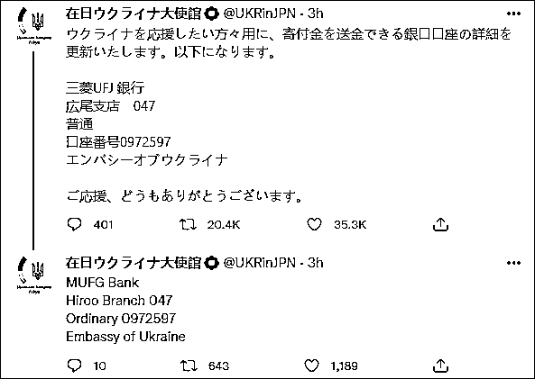

# "我，乌克兰，打钱"

> 原文：[`mp.weixin.qq.com/s?__biz=MzIyMDYwMTk0Mw==&mid=2247530572&idx=4&sn=9a75dd9d9cfa89221ac712d8aab35918&chksm=97cbb374a0bc3a62e8e97b55cb55e9211c086779acf7099acf33f7f7d18165f9dba039147a68&scene=27#wechat_redirect`](http://mp.weixin.qq.com/s?__biz=MzIyMDYwMTk0Mw==&mid=2247530572&idx=4&sn=9a75dd9d9cfa89221ac712d8aab35918&chksm=97cbb374a0bc3a62e8e97b55cb55e9211c086779acf7099acf33f7f7d18165f9dba039147a68&scene=27#wechat_redirect)

24 日，俄罗斯总统普京宣布对乌东地区展开军事行动，乌克兰局势风云突变。 

自此，乌克兰驻日本大使馆开始连发推特，恳请网民众筹支援乌克兰，并公布了多个筹款银行账户。结果确实有不少日本网民纷纷表示会捐款，许多人还上传了汇款截图与照片。

而除了在日本，乌克兰驻华大使馆 25 日也在微博发文，公开众筹信息......

25 日，乌克兰驻日本大使馆在推特上汇总捐款银行账户

随着俄乌局势不断升级，25 日上午，乌克兰总统泽连斯基发表讲话，抱怨没有任何国家向乌克兰作出派兵保证，乌克兰只能独自战斗。值此之际，乌克兰驻日本大使馆的推特账号开始在 24、25 日连发多条推文，“求支援”。

梳理其 24 日的推文，乌克兰驻日本大使馆先是称俄罗斯对乌“战争开始了”，然后笼统地请求国际社会给予乌克兰支援，并表示当晚会在日本东京都组织“阻止普京（Stop Putin）”的游行活动。

之后，在持续通报乌克兰国内战况之中，乌克兰驻日本大使馆请求支援的措辞变得稍显急切：

“乌克兰期待国际社会迅速采取果断行动。”

“乌克兰呼吁国际社会迅速采取行动。”

“乌克兰的伙伴必须立采取新的一揽子制裁措施。我们还呼吁盟友提供武器和军事装备，以继续提高乌克兰军队的防御能力。”

值得注意的是，在此期间，乌克兰外交部发布了一条呼吁人们“帮助乌克兰对抗俄罗斯侵略”的推文，并在推文内给出链接罗列帮助方式。其中一条提到，“你可以向乌克兰军队和志愿者提供财政支持”。乌克兰驻日本大使馆随即转发了这一推文。

随后，乌克兰驻日本大使馆开始直接发布捐款链接，希望网民为乌克兰武装部队后勤和医疗提供捐款，并给出乌克兰国防部的银行账户。

“请将乌克兰武装部队后勤和医疗支持资金捐赠给乌克兰国防部的银行账户”

接着，乌克兰驻日本大使馆又推了乌克兰国家银行的账户，称“俄罗斯‘入侵’后，乌克兰国家银行开设了一个特别账户来帮助乌克兰。可以以美元/欧元/英镑，从世界各地汇款。”

自此，乌克兰驻日本大使馆陆续发布直白呼吁捐款的推文。其间还闹过一次乌龙，有捐款人指出一个捐款账户可能出现错误，乌克兰驻日本大使馆赶忙去核查。

在 25 日，乌克兰驻日本大使馆还特别汇总了目前可以汇款的银行账户，并表示“非常感谢人们的援助”。需要注意的是，确实有不少日本网民在该推文下表示会捐款，许多人还上传了汇款截图与照片。

“金额不多，但希望能帮上忙。”

“虽然非常少，但我还是汇了钱。希望乌克兰人民早日恢复平静的日常生活。不要再让更多的‘侵略’行为发生。”

“虽然金额不多但还是要汇款，我支持乌克兰。”

此外，日本政府紧跟美国宣布制裁措施。25 日早些时候，日本首相岸田文雄宣布，日本政府因乌克兰局势，发动冻结俄金融机构资产等 3 项新的经济制裁措施。此前，鉴于俄罗斯承认“顿涅茨克人民共和国”和“卢甘斯克人民共和国”，岸田文雄 23 日曾宣布禁止向两地代表发放签证，禁止与之开展进出口交易，禁止在日本发行和交易新的主权债券。而对于日本宣布制裁俄罗斯一事，俄罗斯驻日本大使米哈伊尔·加卢津 25 日在新闻发布会上称，日本对俄追加制裁等行为无助于两国关系发展，且不会没有回应。

另外，值得一提的是，除了在日本，乌克兰的驻华大使馆 25 日也发微博，公开了众筹消息。

25 日下午 16 时许，乌克兰驻华大使馆信息中心官方微博@乌克兰信使 在微博发文称，24 日，乌克兰国家银行宣布开设特别筹款账户，以支持乌克兰武装部队。

@乌克兰信使 一并公布了几个银行账户，并表示“该账户接收来自国际合作伙伴和捐助者的捐款（美元、欧元、英镑）”，呼吁人们以此方式“支持乌克兰”。

截至 25 日晚 21:00，这条微博的评论数超 5700 条，不过@乌克兰信使 已开启评论精选，目前没有网友留言露出。

<mpvideosnap class="js_uneditable custom_select_card channels_iframe" data-pluginname="videosnap" data-id="export/UzFfAgtgekIEAQAAAAAAXVIVYUbtEwAAAAstQy6ubaLX4KHWvLEZgBPExqMAGRUdc6j8zNPgMIv_2dbfF-uNR4lQL8fgQvH_" data-url="https://findermp.video.qq.com/251/20304/stodownload?encfilekey=rjD5jyTuFrIpZ2ibE8T7YmwgiahniaXswqzibVxKyPCCTCwmm2syRYQ1MUibtjMtlW8TDPdpyf44Lp13MwMuK5320qJdkTPEBlxic5ibAeus9I5GgxDcibYKp8d5mQ&amp;adaptivelytrans=0&amp;bizid=1023&amp;dotrans=0&amp;hy=SH&amp;idx=1&amp;m=&amp;scene=0&amp;token=x5Y29zUxcibDlXcPibDfLCfV4HoX9cZf5HZcrR7n2mfpMhTPCdpu2GQic1RCp6H9XVQhFqjiaYIBiaUs" data-headimgurl="http://wx.qlogo.cn/finderhead/ibq4aVwOt6HNqrr8OD3sCviaytF3B8TqCwHicxsuIanAJo/0" data-username="v2_060000231003b20faec8c6e48a1acbd3ce04ef33b077a1e41d0d3794ed88ea537878dbe65910@finder" data-nickname="灰产圈+" data-desc="乌克兰小姐姐阐述心里话：“战争不是可以拿出来开玩笑的！中国是世界上最安全的国家没有之一！”#乌克兰@灰产圈+ " data-nonceid="14520394774147831829" data-type="video"></mpvideosnap>

来源：观察者网

← 向右滑动与灰产圈互动交流 →

