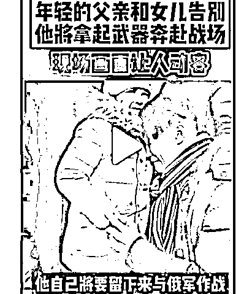
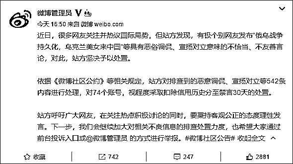
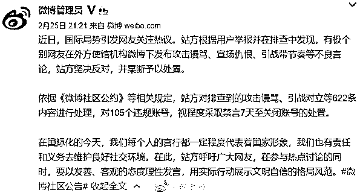
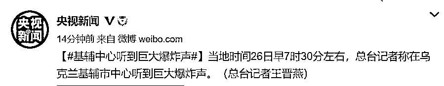

# 视频疯传！乌克兰父亲流泪送别女儿？真相反转！

> 原文：[`mp.weixin.qq.com/s?__biz=MzIyMDYwMTk0Mw==&mid=2247530572&idx=5&sn=b7d5669c3fb2127ab01bdf18002ef80b&chksm=97cbb374a0bc3a6212949df9b8c8d9c7dcd814858b93d42fb1b66509bb9ac8cd5fc193a6f559&scene=27#wechat_redirect`](http://mp.weixin.qq.com/s?__biz=MzIyMDYwMTk0Mw==&mid=2247530572&idx=5&sn=b7d5669c3fb2127ab01bdf18002ef80b&chksm=97cbb374a0bc3a6212949df9b8c8d9c7dcd814858b93d42fb1b66509bb9ac8cd5fc193a6f559&scene=27#wechat_redirect)

**乌克兰局势正持续引发关注**

**可一些信息却鱼龙混杂**

**↓↓**

这两天，一则标题为

**“一名乌克兰父亲在上战场与俄军作战前**

**与女儿挥泪诀别”**的视频

在社交网络上疯传

**然而，这个视频的真相**

**却与报道的内容截然相反**

据环球时报求证，**视频中的那位父亲根本不是要去与俄罗斯军队作战。他其实是来自乌克兰东部地区的亲俄人士，准备将女儿送往俄罗斯，然后与“入侵”他家园的乌克兰军队拼命。**

这个视频最早于 2 月 21 日出现在俄罗斯的社交网站 VK 上，而且当时俄罗斯还尚未对乌克兰动武。

[`v.qq.com/iframe/preview.html?width=500&height=375&auto=0&vid=h33253brg8v`](https://v.qq.com/iframe/preview.html?width=500&height=375&auto=0&vid=h33253brg8v)

**除了这则假消息外**

**恶俗调侃“乌克兰美女来中国”**

**74 个微博账号被处理**

@微博管理员 25 日发布消息称，有极个别网友发布**“俄乌战争持久化，乌克兰美女来中国”**等具有恶俗调侃、宣扬对立意味的不恰当、不友善言论，对此，站方坚决予以处置。

依据《微博社区公约》等相关规定，站方对排查到的恶意调侃、宣扬对立等 542 条内容进行处理，对 74 个账号，视程度采取扣除信用历史分至禁言 30 天的处置。

**在外方使馆微博下发布引战对立等言论**

**105 个微博账号被处置**

@微博管理员 此后继续发布消息，有极个别网友**在外方使馆机构微博下发布攻击谩骂、宣扬仇恨、引战带节奏等不良言论**，站方坚决反对，并果断予以处置。

依据《微博社区公约》等相关规定，站方对排查到的攻击谩骂、引战对立等 622 条内容进行处理，对 105 个违规账号，视程度采取禁言 7 天至关闭账号的处置。

**半天过去**

**来看最新战况**

**↓↓**

**刚刚，传来巨大爆炸声**

**基辅及周边地区发生交战**

据央视新闻最新消息，当地时间 26 日早 7 时 30 分左右，总台记者称在乌克兰基辅市中心听到巨大爆炸声。乌克兰总参谋部称，**俄军从黑海向乌克兰发射“克拉布”导弹。**

美国有线电视新闻网（CNN）26 日报道称，**“在基辅的战斗已经开始”**。从当地时间 25 日晚至 26 日凌晨，基辅多个地区响起密集的爆炸声，包括第聂伯英雄站和舒良夫卡站两个地铁站。

<mpvideosnap class="js_uneditable custom_select_card channels_iframe" data-pluginname="videosnap" data-id="export/UzFfAgtgekIEAQAAAAAASsEEi98wSQAAAAstQy6ubaLX4KHWvLEZgBPE2qM8FU4Ocaj8zNPgMIsE2wH3lIadIJc4goZ3-ffI" data-url="https://findermp.video.qq.com/251/20304/stodownload?encfilekey=rjD5jyTuFrIpZ2ibE8T7YmwgiahniaXswqzXYX6JiaPtBeCicxrOlIN6JcIMn5bnj5TxpH0LcFUnQiaAgQQkqOl4tc8J6xjQQU0YwGnUAFicYBwrUskez4KENDTAA&amp;adaptivelytrans=0&amp;bizid=1023&amp;dotrans=0&amp;hy=SH&amp;idx=1&amp;m=&amp;scene=0&amp;token=x5Y29zUxcibDlXcPibDfLCfVAdz8YVpjWWUdYCslkvPYIrHCzoaz4SFCh4lrbVETIyyBF7LISBeoQ" data-headimgurl="http://wx.qlogo.cn/finderhead/ibq4aVwOt6HNqrr8OD3sCviaytF3B8TqCwHicxsuIanAJo/0" data-username="v2_060000231003b20faec8c6e48a1acbd3ce04ef33b077a1e41d0d3794ed88ea537878dbe65910@finder" data-nickname="灰产圈+" data-desc="乌克兰首都基辅，这里已经成为名副其实的战区 #乌克兰@灰产圈+ " data-nonceid="4723433955299295399" data-type="video"></mpvideosnap>

基辅市政府 26 日**向市民发布紧急避难提示，称目前基辅市内街道上正在发生战斗，呼吁市民前往就近避难所**，或在家中远离窗户和阳台，尽量待在封闭空间内,并利用可防子弹和弹片的物体保护自己。

美联社 26 日称，局势升级下，大批乌克兰民众撤离至周边国家。波兰安全部门发言人 25 日表示，过去 24 小时内，约有 2.9 万人从乌克兰进入波兰境内。此外，匈牙利、罗马尼亚、摩尔多瓦等国也陆续有乌克兰民众入境。

**俄罗斯多个网站访问困难**

当地时间 26 日早上，包括克里姆林宫官网、俄罗斯外交部、红星电视台在内的多家俄罗斯网站处于不稳定状态，部分用户无法正常打开页面。

此前，有消息人士表示，**美国情报机构建议拜登对俄罗斯发动“大规模网络攻击”**，包括切断俄罗斯全境的互联网连接、停电和干扰铁路道岔的运行。

当地时间 2 月 26 日，俄罗斯媒体播放了俄军进入乌克兰东南部城市梅利托波尔的视频。报道称，俄军并未遭遇抵抗，同时缴获了一批西方国家向乌克兰提供的武器。

**乌总统拒绝离开基辅**

**“这可能是最后一次看到我活着！”**

《华盛顿邮报》26 日援引美乌官员的话称，美国当局准备帮助泽连斯基离开基辅，但遭到泽连斯基拒绝。他表示，“战斗就在这里，**我需要的是弹药，而不是搭车。**”

泽连斯基 25 日通过社交媒体表示，他已与美国总统拜登进行了通话，双方讨论了乌克兰局势以及双方在国防等领域的合作。有报道称，**泽连斯基在与欧盟领导人的视频通话中表示，这“可能是他最后一次被人看到还活着”。此外，泽连斯基称欧洲对乌的援助极慢。**

[`mp.weixin.qq.com/mp/readtemplate?t=pages/video_player_tmpl&action=mpvideo&auto=0&vid=wxv_2285983396923441157`](https://mp.weixin.qq.com/mp/readtemplate?t=pages/video_player_tmpl&action=mpvideo&auto=0&vid=wxv_2285983396923441157)

乌克兰总统泽连斯基当地时间 2 月 26 日录制一段视频，在视频中他敦促乌克兰人民不要相信假消息。他说，**没有人会放下武器！**

## 

**普京：呼吁乌克兰军人**

**把权力掌握在自己手中**

## 

俄罗斯总统普京 25 日在电视讲话中呼吁乌克兰军队撤换基辅领导层。他称基辅领导层是“恐怖分子”“一群瘾君子和新纳粹分子”，同时呼吁乌克兰军方“把权力掌握在自己手中”。

<mpvideosnap class="js_uneditable custom_select_card channels_iframe" data-pluginname="videosnap" data-id="export/UzFfAgtgekIEAQAAAAAALOQs0akorAAAAAstQy6ubaLX4KHWvLEZgBPEkqNYQ0lBSKj8zNPgMItk9D-h67p5Lsfl5MC0DsiV" data-url="https://findermp.video.qq.com/251/20304/stodownload?encfilekey=rjD5jyTuFrIpZ2ibE8T7YmwgiahniaXswqzoVRvTgTaQScIbiaia4iaHHOO2iaD5ZotTiaWIUDzS7hl1XVV6JVrrvPWPXHaicSOuREssI9hWrIfUJrV7So48KnnoXvQ&amp;adaptivelytrans=0&amp;bizid=1023&amp;dotrans=0&amp;hy=SH&amp;idx=1&amp;m=&amp;scene=0&amp;token=x5Y29zUxcibDlXcPibDfLCffcHEcWrL1C9HFInyZ4rh1KQqTDicF63jT51cYuuX0HyK2rTGgXe8bicw" data-headimgurl="http://wx.qlogo.cn/finderhead/ibq4aVwOt6HNqrr8OD3sCviaytF3B8TqCwHicxsuIanAJo/0" data-username="v2_060000231003b20faec8c6e48a1acbd3ce04ef33b077a1e41d0d3794ed88ea537878dbe65910@finder" data-nickname="灰产圈+" data-desc="乌克兰民众街头痛哭：我该去哪儿……#乌克兰@灰产圈

" data-nonceid="2824266789556043088" data-type="video"></mpvideosnap>

# **乌克兰总统办公室：**

# **今晚将决定乌俄谈判进程**

据央视新闻最新报道，当地时间 2 月 26 日，乌克兰总统办公室主任顾问米哈伊洛·波多利亚克在记者发布会上表示，今晚（26 日）将决定谈判进程，在这个过程中，立场将由乌克兰决定。

来源：长沙晚报、上观新闻、央视新闻、环球时报、环球网、人民日报、中国新闻网、@微博管理员 

← 向右滑动与灰产圈互动交流 →

