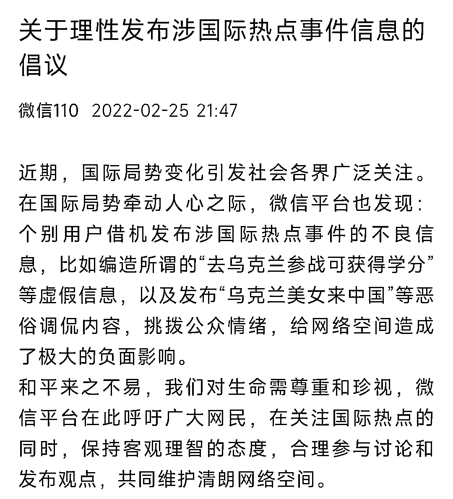
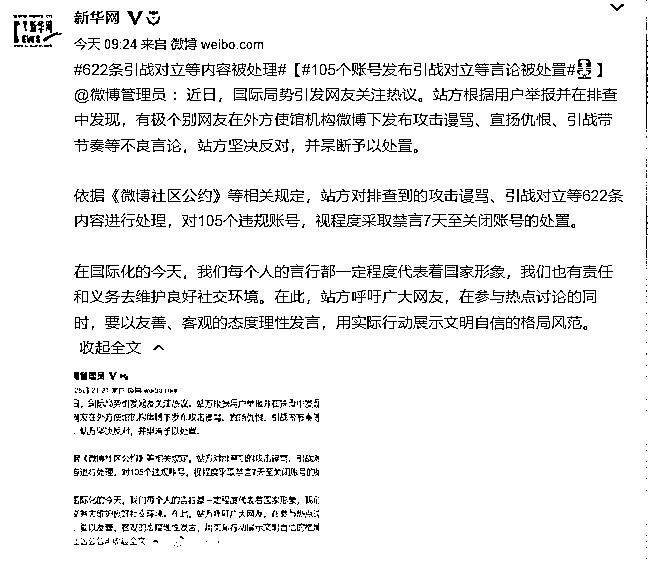

# 多个账号被处置！请理性发言！

> 原文：[`mp.weixin.qq.com/s?__biz=MzIyMDYwMTk0Mw==&mid=2247530572&idx=7&sn=3e2b8ded6acead94a5162d98552c9faf&chksm=97cbb374a0bc3a62dcaaec6b6e09aab80cc122f7e85a0f67100eafa8c0c3f6be44e7afeb8db1&scene=27#wechat_redirect`](http://mp.weixin.qq.com/s?__biz=MzIyMDYwMTk0Mw==&mid=2247530572&idx=7&sn=3e2b8ded6acead94a5162d98552c9faf&chksm=97cbb374a0bc3a62dcaaec6b6e09aab80cc122f7e85a0f67100eafa8c0c3f6be44e7afeb8db1&scene=27#wechat_redirect)

近日

国际局势引发网友关注热议

但个别网民却以调侃语调 

发布不恰当言论

目前

多个社交平台处置了相关账号 

并发出理性讨论的倡议

**1**

* * *

**微信发布关于理性讨论** 

**涉国际热点事件信息的倡议**

2 月 25 日，“微信 110”公众号发布《关于理性发布涉国际热点事件信息的倡议》。全文如下：

近期，国际局势变化引发社会各界广泛关注。在国际局势牵动人心之际，微信平台也发现：个别用户借机发布涉国际热点事件的不良信息，比如编造所谓的“去乌克兰参战可获得学分”等虚假信息，以及发布“乌克兰美女来中国”等恶俗调侃内容，挑拨公众情绪，给网络空间造成了极大的负面影响。

和平来之不易，我们对生命需尊重和珍视，微信平台在此呼吁广大网民，在关注国际热点的同时，保持客观理智的态度，合理参与讨论和发布观点，共同维护清朗网络空间。

**2**

* * *

**发布引战言论** 

**多个账号被处置**

@微博管理员 2 月 25 日发布消息称，站方对排查到的恶意调侃、宣扬对立等 542 条内容进行处理，**对 74 个账号，视程度采取扣除信用历史分至禁言 30 天的处置。**

**站方呼吁广大网友，在关注热点积极讨论的同时，要秉持客观公正的态度理性发言。下一步，会继续加大对相关不良信息的排查处置力度，也希望大家通过前台投诉入口或@微博管理员 的方式进行举报。**

****

**@微博管理员 25 日 21 时发布消息称，站方对排查到的攻击谩骂、引战对立等 622 条内容进行处理，**对 105 个违规账号，视程度采取禁言 7 天至关闭账号的处置。****

****在国际化的今天，我们每个人的言行都一定程度代表着国家形象，我们也有责任和义务去维护良好社交环境。在此，站方呼吁广大网友，在参与热点讨论的同时，要以友善、客观的态度理性发言，用实际行动展示文明自信的格局风范。****

********

****据@微博管理员 26 日消息，近日，国际局势引发网友关注热议。站方根据用户举报并在排查中发现，有极个别网友在外方使馆机构微博下发布攻击谩骂、宣扬仇恨、引战带节奏等不良言论，站方坚决反对，并果断予以处置。**** 

****依据《微博社区公约》等相关规定，站方对排查到的攻击谩骂、引战对立等 622 条内容进行处理，对 105 个违规账号，视程度采取禁言 7 天至关闭账号的处置。****

****在国际化的今天，我们每个人的言行都一定程度代表着国家形象，我们也有责任和义务去维护良好社交环境。在此，站方呼吁广大网友，在参与热点讨论的同时，要以友善、客观的态度理性发言，用实际行动展示文明自信的格局风范。****

******3******

* * *

******抖音安全中心关于****** 

******理性发布涉国际热点事件信息******

******拒绝不当蹭热玩梗的公告******

****2 月 26 日，“抖音安全中心”公众号发布《关于理性发布涉国际热点信息，拒绝不当蹭热玩梗的公告》。全文如下：****

****近日，国际热点地区的冲突引发各方关注。包括很多媒体在内的众多创作者在平台发布内容，真实、客观、及时的报道与分析当地情况。同时，平台在日常巡检中发现，极个别用户借助热点事件，不当蹭热、玩梗。特别是以痛点为笑点，发布诸如“俘虏乌克兰美女”等视频，传播不当价值观，破坏平台氛围。****

****对此现象，平台进行了集中打击，**共处理违规视频 6400 条，中断违规直播 1620 次，并对相关账号进行了处置。******

****抖音呼吁广大用户，共同维护风清气正的社区氛围。如发现平台上存在类似违规行为，用户可以在站内举报或发送详情至举报邮箱：feedback@douyin.com。对于涉嫌违法犯罪的行为，平台也将积极配合有关部门进行打击。****

********

******希望广大网友******

******合理参与讨论和发布观点******

******共同维护清朗网络空间******

****<mpvideosnap class="js_uneditable custom_select_card channels_iframe" data-pluginname="videosnap" data-id="export/UzFfAgtgekIEAQAAAAAA_5cL0LdHSQAAAAstQy6ubaLX4KHWvLEZgBPEkKNsHRkrcaj8zNPgMIsLPjq_AddlNNruBsssfh-q" data-url="https://findermp.video.qq.com/251/20304/stodownload?encfilekey=S7s6ianIic0ia4PicKJSfB8EjyjpQibPUAXolOoU0JjiafHQWjTa1AGE7z7rIWcW8bRvj6tE5muWCAro4EKMRibEmsTF6R5xwh02sPZf2xvniapVqlj0ojkSu8sRjA&amp;adaptivelytrans=0&amp;bizid=1023&amp;dotrans=0&amp;hy=SH&amp;idx=1&amp;m=&amp;scene=0&amp;token=AxricY7RBHdVJXpIGxBxiad8WhQqtpZ7Oo3XtYibGAvmMiaiaLuOSK0GQfg5k19kkCPibMx3FtvWUsP5k" data-headimgurl="http://wx.qlogo.cn/finderhead/ibq4aVwOt6HNqrr8OD3sCviaytF3B8TqCwHicxsuIanAJo/0" data-username="v2_060000231003b20faec8c6e48a1acbd3ce04ef33b077a1e41d0d3794ed88ea537878dbe65910@finder" data-nickname="灰产圈+" data-desc="【中国驻乌克兰大使馆发布紧急提醒】由于目前俄乌战争爆发引发的社会极端行为在不断上升，使馆提醒在乌的中国公民要高度重视与当地民众的友好相处的关系，同时尽量呆在家中，远离军事设施、军人和持枪者！减少安全风险！根据乌国家警察局发布的通告，警方要求当地市民举报街头可疑人员（包括身上有红色元素的标记），并要求所有平民不要穿着制服或战术服装（比如迷彩服）外出。因此，使馆也提醒华人不要随意亮明身份和展示具有识别性标志的标识！
        我觉得国旗先不要展示了，因为俄罗斯军人在这次战斗中都是携带有红色标识作为识别队友的印记！而乌克兰军人出于同样原因，会携带有黄色的标识，例如在胳膊上或者头盔上绑有或贴有相关颜色的标识！#乌克兰@灰产圈+ " data-nonceid="17491553204297969477" data-type="video"></mpvideosnap>****

****来源：综合新华网、微信 110、@新华网、@微博管理员、抖音安全中心、北京日报、红网****

********

****← 向右滑动与灰产圈互动交流 →****

********