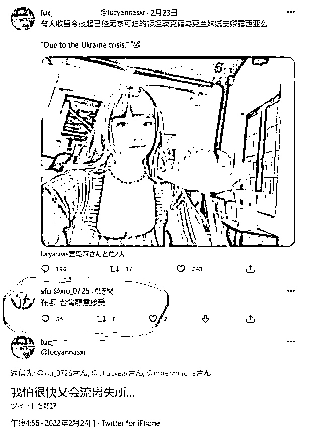

# 涉乌克兰恶俗言论，为何矛头全部指向"中国"？

> 原文：[`mp.weixin.qq.com/s?__biz=MzIyMDYwMTk0Mw==&mid=2247530630&idx=1&sn=7b17a70e17ec1f9a9cd7308aca31a151&chksm=97cbb3bea0bc3aa8b07f0c3349ce9bac6c82db92f02eb70acc5f8372fa8435e73b7fb91d6d2e&scene=27#wechat_redirect`](http://mp.weixin.qq.com/s?__biz=MzIyMDYwMTk0Mw==&mid=2247530630&idx=1&sn=7b17a70e17ec1f9a9cd7308aca31a151&chksm=97cbb3bea0bc3aa8b07f0c3349ce9bac6c82db92f02eb70acc5f8372fa8435e73b7fb91d6d2e&scene=27#wechat_redirect)

近日，俄乌战争引发全球关注，硝烟下的乌克兰民众牵动着全球舆论关切，包括中国民众在内的绝大部分网民对于战火中无辜平民的悲情遭遇都深表同情，但“林子大了什么鸟都有”的现实决定了，总有个别网民会在这种时候“抖机灵”、“图嘴快”，以调侃戏虐的语调发布“欢迎乌克兰美女来中国”、“欢迎乌克兰小哥哥来中国”等恶俗言论。

这类言论虽比不上西方舆论嘲讽乌克兰为“欧洲子宫”般恶毒，但在乌克兰危难时刻，如果被乌克兰人民看到，带给他们的负面观感是不言而喻的。因而，对于此类言论不论有没有在乌克兰舆论场得到传播，都是应该坚决反对的。

不过我们也应该注意到另外一个现实，中文世界的个别极端信息是如何被炒作进乌克兰舆论场的？事实上，这类言论并非只是中国大陆的个别网民在发布，如下列截图，一批包括台湾账号在内的境外账号都发布了类似信息：

由此可见，此类信息并非中国大陆舆论场独有，可为何矛头最终全部指向了“中国”呢？经过中国海峡研究院（香港）溯源，该信息是经由境外推特平台 ID 为@MeMeTaiWan 的账号发布。

再由 ID 为@Karwan70446933 的账号进行英文转译，从而引发第一波的关注。之后，一个域名为 supchina.com 的网站以此舆论为噱头，发布了题为《Some Chinese men express their horniness for potential Ukrainian refugees, to the disgust of netizens》的文章，将所有矛头导向中国网民。

这类信息随后被传入在乌克兰的华人圈，并引起了一部分华人的警惕，不少人将此信息发布在中国大陆的微博平台，其中微博 ID 为 I0nGnnn-账号（目前搜寻不到该账号）发布的信息点爆了舆论场，获得了超 6 万转发，近 50 万点赞，千万级阅读量的传播。同时，QQ 空间 ID 为@牛岛若利 的账号发布的相关信息，也在特定青少年群体中获得了 1500 多万的转发。

由此引爆舆论。随后，微博平台很快对发布恶俗言论的 74 个账号进行了处置，彰显了中国大陆积极维护健康清朗的网络空间的态度。

观察数据不难发现，@MeMeTaiWan 和@Karwan70446933 在境外推特平台上发布信息后，仅获得了 200 多转，400 多赞，并不属于“热帖”，在万众关注战争的背景下，并不具备在乌克兰境内引发群体性情绪的可能。

恰恰是在中国大陆引爆后，才进入到了全球舆论的视野。回溯整个舆论发酵的过程，MeMeTaiWan 和 Karwan70446933，以及 supchina.com 是该信息传播的始作俑者。

经过公开信息搜索发现，MeMeTaiWan 是涉台账号，其对话内容中除了有不少与台湾账号的互动外，甚至还包含了与疑似 1450 账号的互动。

Karwan70446933 则是疆独账号：

supchina.com 网站创立于 2015 年，总部位于纽约布鲁克林，其核心口号是“无所畏惧地报道中国”。在对外展示的自我介绍内容中，该网站宣传“我们不亲中也不反华，不亲美也不反美”，但稍微翻阅其网站文章内容不难发现，基本都带有技巧性的反华倾向，常规模式为前半段报道中国的一些基础事实，后半段进入呼应西方媒体观点的“臆想式批判”。

例如最近的一篇标题为《北京 2022 年奥运会结束了，他们将如何被记住？》的文章，前半段肯定中国取得了有史以来最好的冬奥成绩，后半段就开始进入到了“政治问题”的批判，对子虚乌有的新疆人权问题展开控诉。再比如《赞美北京 2022 最酷的场地，大航空首钢》的文章中，又阴阳怪气地引入中国冬奥阳性药检、所谓“外交抵制”等问题。诸如此类“挂羊头卖狗肉“的内容还有很多。

之所以会出现这套操作，与它的创始人郑安澜（Anla Cheng）恐怕有着莫大的关系。郑女士是蒋介石政府时期台湾外交官的女儿，先后经营 CenteniumCapital 亚洲对冲基金的家族办公室和一家中国私募公司 Sino-Century，曾任职 RobertFleming（被摩根大通收购）高级副总裁和花旗银行的投资经理，是美国自然保护协会中美副主席、华美协进社副主席。

目前，具有鲜明台湾特征的账号还在持续煽动该舆论。

正是在台湾相关及疆独势力的联手推动下，在大陆舆论场的“配合”下，“涉乌克兰恶俗言论”成为了俄乌冲突中，异军突起的“重大负面舆论”。该舆论追溯，只是帮助大家了解该舆论事件的发酵过程，同时也希望借此呼吁广大网民理性发言，一方面，展现新时代中国民众的素养，因为越来越国际化的今天，我们每个人的言行都在一定程度上代表着中国的形象；另一方面，避免给境外别有用心的力量以可乘之机，毕竟靠着绞尽脑汁地挖中国大陆的负面消息，靠着嚼人血馒头而活着的人，他们一直都在。 

<mpvideosnap class="js_uneditable custom_select_card channels_iframe" data-pluginname="videosnap" data-id="export/UzFfAgtgekIEAQAAAAAAXVIVYUbtEwAAAAstQy6ubaLX4KHWvLEZgBPExqMAGRUdc6j8zNPgMIv_2dbfF-uNR4lQL8fgQvH_" data-url="https://findermp.video.qq.com/251/20304/stodownload?encfilekey=rjD5jyTuFrIpZ2ibE8T7YmwgiahniaXswqzibVxKyPCCTCwmm2syRYQ1MUibtjMtlW8TDPdpyf44Lp13MwMuK5320qJdkTPEBlxic5ibAeus9I5GgxDcibYKp8d5mQ&amp;adaptivelytrans=0&amp;bizid=1023&amp;dotrans=0&amp;hy=SH&amp;idx=1&amp;m=&amp;scene=0&amp;token=AxricY7RBHdWkz79abBGFTcVUjUHeuwaGpCTenHibt1qmibu33aXAxq9j3uoldgs4OiafHOh9Iwiafog" data-headimgurl="http://wx.qlogo.cn/finderhead/ibq4aVwOt6HNqrr8OD3sCviaytF3B8TqCwHicxsuIanAJo/0" data-username="v2_060000231003b20faec8c6e48a1acbd3ce04ef33b077a1e41d0d3794ed88ea537878dbe65910@finder" data-nickname="灰产圈+" data-desc="乌克兰小姐姐阐述心里话：“战争不是可以拿出来开玩笑的！中国是世界上最安全的国家没有之一！”#乌克兰@灰产圈+ " data-nonceid="14520394774147831829" data-type="video"></mpvideosnap>

来源：海峡研究，观察者网

← 向右滑动与灰产圈互动交流 →

