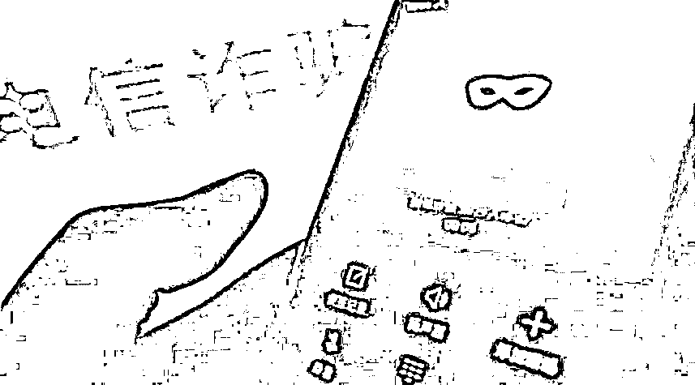

# 被骗缅北小伙自述：被关在又脏又臭的水牢，守卫还往里丢毒蛇……

> 原文：[`mp.weixin.qq.com/s?__biz=MzIyMDYwMTk0Mw==&mid=2247530630&idx=2&sn=ee034b2a09947afac4e26533f615473b&chksm=97cbb3bea0bc3aa823f0c7c452441e98201b404425ad902e9f5444129ff4f865f01201162301&scene=27#wechat_redirect`](http://mp.weixin.qq.com/s?__biz=MzIyMDYwMTk0Mw==&mid=2247530630&idx=2&sn=ee034b2a09947afac4e26533f615473b&chksm=97cbb3bea0bc3aa823f0c7c452441e98201b404425ad902e9f5444129ff4f865f01201162301&scene=27#wechat_redirect)

“站住，站住，再不站住就开枪了。”漆黑的夜晚，一条山路上，三个人在前面气喘吁吁地跑，后面七八个人手持冲锋枪，一边追赶一边喊。

这不是警匪片的画面，而是陆川籍小罗在缅北的亲身经历。2 月 22 日，小罗向记者讲述了他的“虎口”逃生之旅。

来源于网络

**天掉“馅饼”**

**16 岁的小罗在某技工学校读书，他总渴望着能早点出社会，早点挣钱。**

**2021 年 2 月，小罗刷抖音时看到“西双版纳高薪招聘”的启事，便抱着试试看的心态，与启事的联系人钱某互加微信。钱某很热情，给他描绘了工作轻松舒服又能拿高薪的前景。得知小罗还是未成年人后，钱某让小罗转担保费 5000 元，才能安排工作。**

**打工也要交那么多钱？小罗认为不值得，便取消了去西双版纳的念头。但两天后，钱某致电小罗，称玉林籍李某也想去西双版纳打工，让小罗和李某互加微信，一起结伴前往昆明，不需要交担保费了。因为有老乡作伴，小罗就打消了顾虑。2021 年 2 月底，两人坐上了开往昆明的动车。**

**两人到了昆明后，自称是招聘公司的人将他们安置在一家酒店，让他们先熟悉环境，然后再带他们去西双版纳。在此期间，小罗把自己到昆明的情况告诉了母亲。罗妈妈担心孩子没钱花，当天快递了一张银行卡给儿子。收到银行卡后，小罗到柜员机取出 100 元现金。但后来小罗需用钱时，已无法取出现金，他将此情况告知了母亲。也正因此，罗妈妈确认儿子已经被骗出境，当即报警。**

**2021 年 3 月 15 日下午，小罗、李某被告知坐顺风车去西双版纳。两人被送上一辆物流货车。此时，他们的身份证和手机已被招聘公司的人收走。两人迷迷糊糊地坐着货车经过一天一夜的奔波，来到一个山村。通过观察，他们发现自己已被送到地处中缅边境的云南省普洱市某县。**

****落入“虎口”****

****感到不妙的小罗此时无法淡定，他和带他们到边境的人说，自己不想去打工了。那几个人也答应送他们回家。****

****2021 年 3 月 17 日 21 时许，小罗、李某的手机又被收走了。他们和另外两人被 4 个摩托车手接走，连夜赶路。天色大亮时，他们被送到一条小河边。****

****小罗当时以为过了河就是西双版纳，但摩托车手的话却把他吓了一大跳。摩托车手告诉他们，已经到了缅甸某康。随后，他们被关进当地一酒店客房，手机被还了回来，但没有了手机卡。****

****“面对陌生的环境，很绝望。没有手机卡，无法打出电话，无法报警，只能听天由命。”小罗回想起当时的情景，后怕不已。****

****3 月 18 日上午，小罗、李某被人用枪押着去一个诈骗公司。****

****诈骗公司在一栋楼内，一楼大门有人持枪驻守，二楼以上分布着各类的诈骗公司，有些办公室里也有拿枪的人在监视。小罗所在的公司位于三楼，他分析这是一栋新建楼房，因为还没来得及安装防盗网。****

****所谓的“业务总监”给小罗丢来几本话术和电脑、工作手机等工具，让他学习怎么在网上聊天、怎么和“上钩”的人“谈恋爱”、怎么诱导受骗者“投资”等等。但是“入职”多天后，小罗还是只懂得问对方“吃饭了没有”等日常客套话。****

****十几天后，小罗无意中听到管理人员说因为他没有业绩要把他转卖。想到这非人的生活，他决定找机会逃跑。****

******“虎口”逃生******

******“我无时无刻不在想着怎么逃跑。”小罗说，落入诈骗窝点的 6 个多月里，他总共逃了 6 次，最终在 2021 年 8 月底那一次成功逃脱，其中印象最深的有 4 次。******

******2021 年 4 月初一个大雨滂沱的深夜，小罗瞅准楼下一处水坑，以雨声作为掩护，毅然从 10 多米高的三楼跳下去。他顾不得身上的痛，马上从水坑里爬起来，一瘸一拐地往外跑。他成功跑到几公里开外的地方，躲在路边桥洞底等待求助机会。在桥底忍饥挨饿躲了两天，眼看再得不到帮助就有可能饿死或病死，他只能冒险走到大路上寻求帮助。但让他绝望的是，他刚在马路上出现，就被抓了回去，关在小黑屋 4 个多小时，没有吃也没有喝。或许看到他年纪还小，或许是感觉他还有其他用处，负责管理他的人，发了善心，把他放了出来。******

******此后的几个月里，他又跑了几次。其中一次，他趁看守午休的时候，一口气跑了出去，用刚刚发的 1000 元钱在酒店躲了两个晚上，但钱用完后他不得不离开酒店，结果一出酒店又被抓了回去。还有一次，他收买了守关卡的人，那人让他到附近一酒店 KTV 做服务生，挣到路费后再回国。但他没想到那不过是个陷阱，酒店是诈骗团伙开的，他一踏进去就被抓了起来，并转卖给其他诈骗公司。******

******落入“虎口”的几个月里，他一躺下来就想到那个可怕的水牢。水牢是一个不到 1 平方米的水坑，却关进了两个人。水牢的盖子压得里面的人只能弓腰窝在又脏又臭的水里。更可恶的是，全副武装的守卫闲来无聊时还往水牢里丢毒蛇。******

******他想起那个可怜的 70 后大叔，因为年纪大，不会写字，不会用电脑，不会聊天，没有业绩而被关进水牢，一个星期后被放出来时，脚都烂了；想起旁边公司的“业务员”，因为想从窗户逃跑，刚跳出去，还没掉到地上，就被一枪击毙，埋在后山……******

******“必须活着逃出去，回家。”活着的欲望支撑着他。******

******至 2021 年 8 月，他和李某已经被转卖了两次。第三家公司在一栋大楼里，所有窗户都有防盗网，一层开设有赌场、各种食品和生活用品店及娱乐设施，并且通宵营业。小罗被卖到九楼的诈骗公司。在这个公司一个多月，小罗与李某发现：公司每天有一个放风的时间，放风时他们可以到一楼买东西或娱乐；一楼赌徒众多，人声鼎沸，具有较好的掩护作用；每天凌晨，这栋楼都会定时停电 1 分钟左右。但是，他们也发现，守楼的武装人员比较多，要想从门口出去难上加难。后来，他们经过观察发现，一楼的某个窗户螺丝可以扭松。于是，他们决定在窗户上作文章。其他省份的一名被害人也加入了他们的行列。******

******此后，他们轮流扭窗户螺丝。没有螺丝刀，他们就用指甲扭。每扭一个螺丝，需要六七分钟，为了不被发现，他们三人分工：一人负责与看守人员聊天，转移对方注意力；一人负责望风，不让来往的人看出端倪；一人负责扭螺丝，每扭出一颗螺丝，就往孔洞塞半截烟头遮挡。******

******经过努力，第五天时，那个窗户的 8 颗螺丝被他们扭下了 6 颗。当天夜里，他们不敢睡觉，一起等待逃跑时机。凌晨 2 时许，电终于停了，三人迅速跳出窗外。等灯再亮起时，他们已经跑出一公里。尽管身后传来追逐的声音，但是利用夜色掩护，他们跑了几公里远。路过一栋楼时，楼里出来一个人，招呼他们进去躲躲。眼看追兵越来越近，他们顾不上考虑太多，跟着那人躲进了楼。******

******在好心人的帮助下，他们躲过了风头，又在好心人的帮助下躲过两层关卡，到达中缅边境附近，一边打工筹集路费一边排队等候回国。******

******今年 1 月 5 日，小罗终于能够进入缅甸邦康隔离点隔离。隔离 16 天后，踏上了祖国的土地。******

********后记********

******“踏上中国领土的那一瞬间，真的特别感动。我从小就很叛逆，也没为什么事哭过，但那一刻我哭了。感谢我们的祖国，也感谢家乡的警察，没有他们的帮助，我现在还流落他乡受苦受难。”小罗说。******

******原来，得知小罗遭遇的罗妈妈，2021 年 6 月向陆川县公安局沙湖派出所报了警。派出所核实到小罗被骗到境外，在缅甸北部受到殴打和限制人身自由后，与上级相关部门及公安机关共同努力，于 2021 年 12 月 25 日成功联系到小罗，为他办理了相关回国手续。今年 2 月 14 日，小罗顺利回到祖国怀抱，并到指定地点进行隔离。******

******今年 1 月 16 日，为了表示感谢，远在上海的罗妈妈给陆川县公安局寄来一封感谢信、一面锦旗以及两幅手绘“雪容融”与“冰墩墩”图。小小的礼物，沁润了民警的心，温暖了整个冬天。******

******‍<mpvideosnap class="js_uneditable custom_select_card channels_iframe" data-pluginname="videosnap" data-id="export/UzFfAgtgekIEAQAAAAAAmxsx8eQJ5AAAAAstQy6ubaLX4KHWvLEZgBPE1qNYLCxuNK78zNPgMItGbrh91___ZHHj_VzqPNsm" data-url="https://findermp.video.qq.com/251/20350/stodownload?encfilekey=oibeqyX228riaCwo9STVsGLPj9UYCicgttvn7s1myVPv6ZIQfdmicywfc9kU8nGeyrF2BErUCeDoQZOtnd3cYPudia1tFxenlfyxvnYTa8O9FmGSODMM0cfnAAfXF5XC1TvyP2sFJ5l3ibJlA&amp;adaptivelytrans=0&amp;bizid=1023&amp;dotrans=0&amp;hy=SH&amp;idx=1&amp;m=9899b95cb9177841fcbf5dd5e7a67917&amp;token=x5Y29zUxcibCj5w1D74M9wD1xMjz6xp7ks7QtiaL6Q1iaEcPQTW1xHQdfHPoJSv2zrkiaM77dzt3GwQ" data-headimgurl="http://wx.qlogo.cn/finderhead/ibq4aVwOt6HNqrr8OD3sCviaytF3B8TqCwHicxsuIanAJo/0" data-username="v2_060000231003b20faec8c6e48a1acbd3ce04ef33b077a1e41d0d3794ed88ea537878dbe65910@finder" data-nickname="灰产圈+" data-desc="亨利集团诈骗团伙竟然是抖音网红美女。@灰产圈 " data-nonceid="14336873546757309102" data-type="video"></mpvideosnap>来源：广西法治日报，利箭在行动************‍

← 向右滑动与灰产圈互动交流 →

******