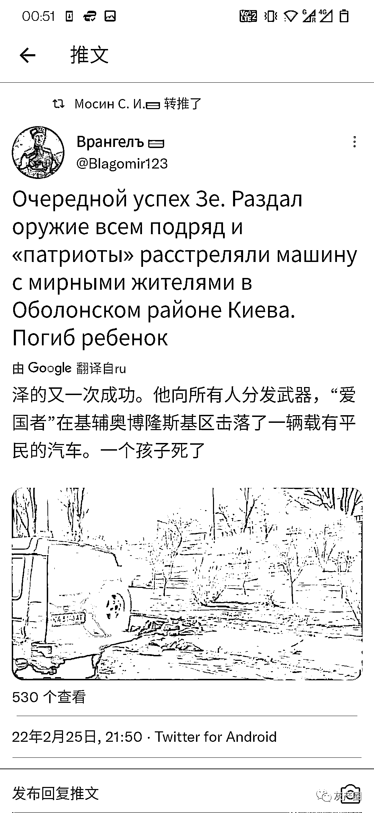
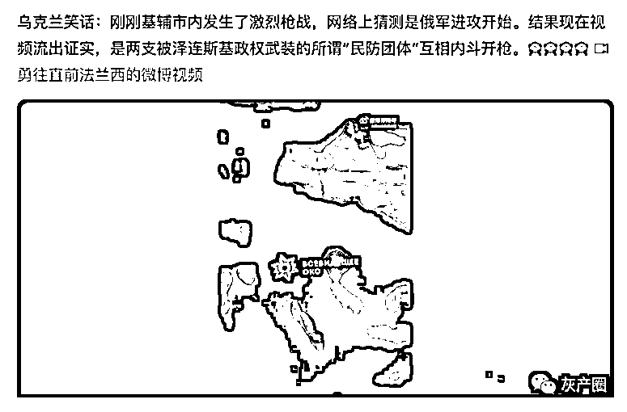
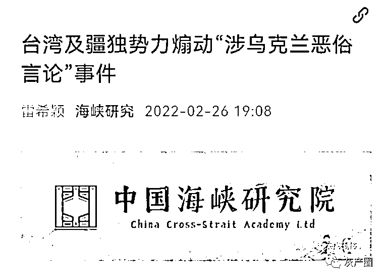
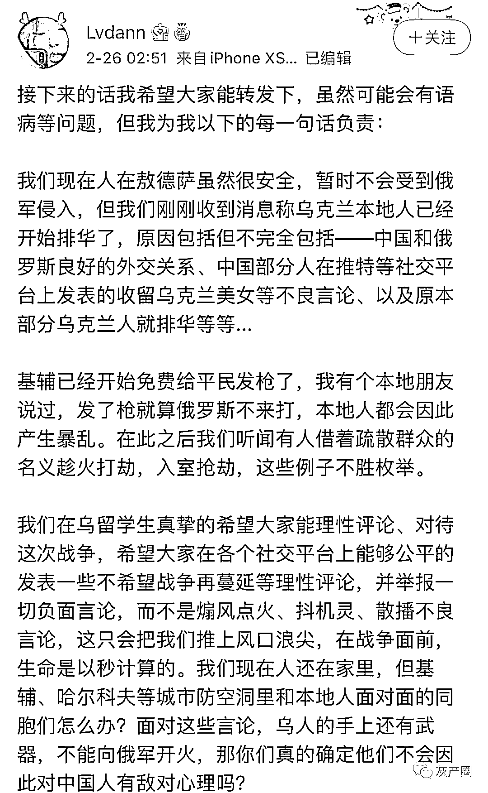
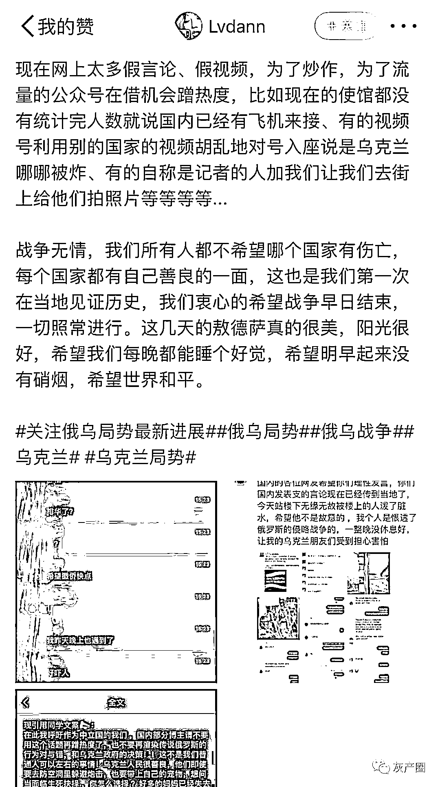
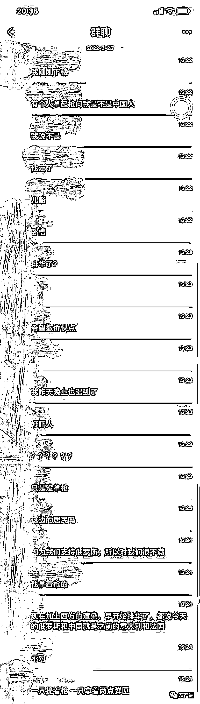
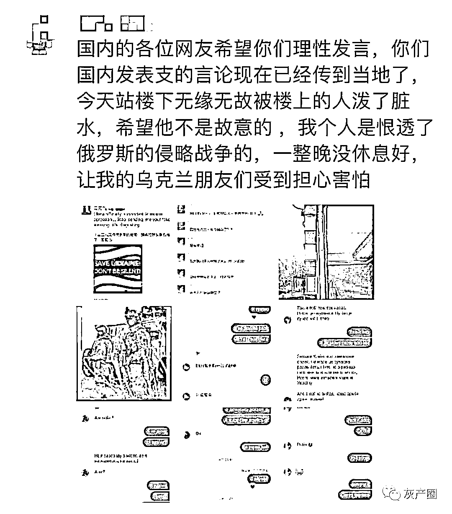
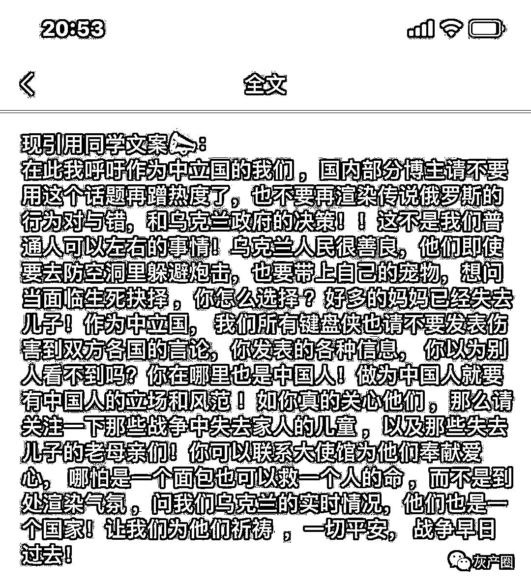
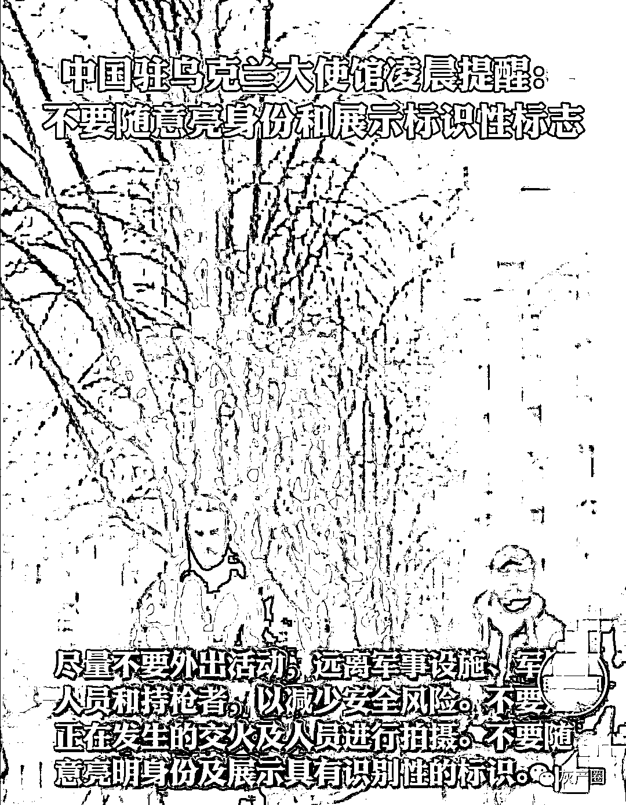

# 乌克兰“排华”情绪被激起，有在乌国人被拿枪顶着，还有人被楼上泼了脏水！

> 原文：[`mp.weixin.qq.com/s?__biz=MzIyMDYwMTk0Mw==&mid=2247530630&idx=4&sn=03457b0c6c44df644e7c5da9bcf9def5&chksm=97cbb3bea0bc3aa8c8c86c055ef6deb9451672d1a0dd4f6cc9d6126a749e223b520c08c1d7f0&scene=27#wechat_redirect`](http://mp.weixin.qq.com/s?__biz=MzIyMDYwMTk0Mw==&mid=2247530630&idx=4&sn=03457b0c6c44df644e7c5da9bcf9def5&chksm=97cbb3bea0bc3aa8c8c86c055ef6deb9451672d1a0dd4f6cc9d6126a749e223b520c08c1d7f0&scene=27#wechat_redirect)

最近一段时间，随着乌俄战事不断升级，乌社会上极端行为增加，出言不逊甚至持枪射击，给我在乌中国公民造成安全风险。 

目前仍滞留在乌克兰基辅的中国留学生表示，有基辅当地民众向中国留学生反映，乌克兰多家媒体在新闻报道中散布不实消息，称“中国支持俄罗斯入侵乌克兰”，目前已经出现乌克兰民众对当地华人不友好的声音和举动。 

一位自称身在乌克兰的博主就发出了自己的感受：

中国驻乌克兰大使馆 2 月 26 日发布《关于提醒中国公民注意社会治安风险的通知》，提醒：在乌中国公民不要随意亮明身份

* * *

阿六滴:就奇怪了，微博圣母的言论一个都没到乌克兰？

三册柏 SanCebai:网络评论能杀人，说了不止一次了。

徐佳杰 Pierre：原本这种挑动性别矛盾的帖子我是懒得看的。
但我无论如何也没想到，会有人把 Karwan 这个疆独的推转出来还给他捧臭脚，甚至有人到推上去给他道歉的。
每个国家的网上都有一些喜欢开低级玩笑的人，怎么非要针对全体中国人呢？？？？？

来源：微博那些事儿

<mpvideosnap class="js_uneditable custom_select_card channels_iframe" data-pluginname="videosnap" data-id="export/UzFfAgtgekIEAQAAAAAA1ikmWQBTgQAAAAstQy6ubaLX4KHWvLEZgBPEkqMQKGhydaj8zNPgMItft_45wEjeXySLOH8T8nM_" data-url="https://findermp.video.qq.com/251/20304/stodownload?encfilekey=S7s6ianIic0ia4PicKJSfB8EjyjpQibPUAXolLuOnjF6cQB8PaFWdShw0uXd3ydqeS6sQL9urMMJibkaNfJNZNWmiaib5RMdYpbeBhP0Wicfy0txUlwYYuMHMGCFFxQ&amp;adaptivelytrans=0&amp;bizid=1023&amp;dotrans=0&amp;hy=SH&amp;idx=1&amp;m=&amp;scene=0&amp;token=x5Y29zUxcibCj5w1D74M9wJgTR0KBXEdjwwqCaUklVucFef7VSB4lmKL0UicoFzdUkJNKicoN7yiaos" data-headimgurl="http://wx.qlogo.cn/finderhead/ibq4aVwOt6HNqrr8OD3sCviaytF3B8TqCwHicxsuIanAJo/0" data-username="v2_060000231003b20faec8c6e48a1acbd3ce04ef33b077a1e41d0d3794ed88ea537878dbe65910@finder" data-nickname="灰产圈+" data-desc="直击俄乌前线#乌克兰#俄罗斯@灰产圈+ " data-nonceid="11016026510999986741" data-type="video"></mpvideosnap>

← 向右滑动与灰产圈互动交流 →

