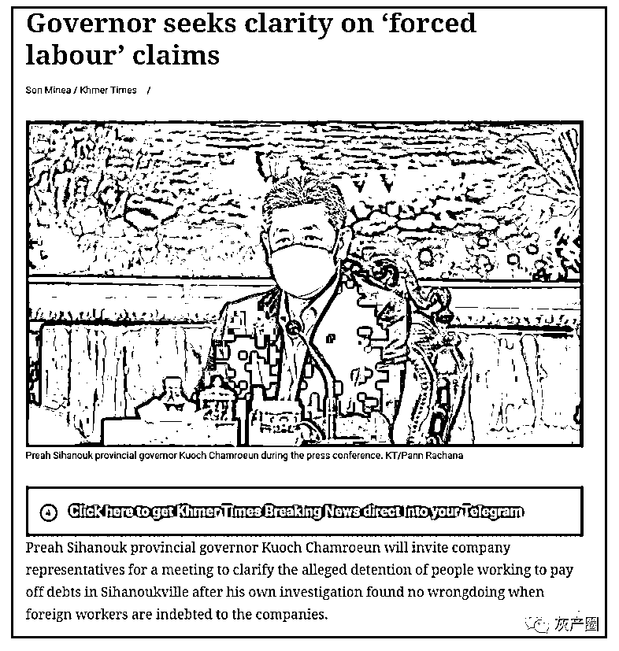
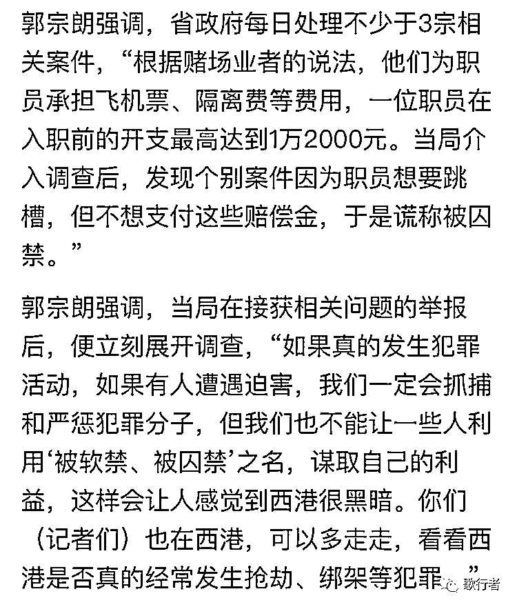
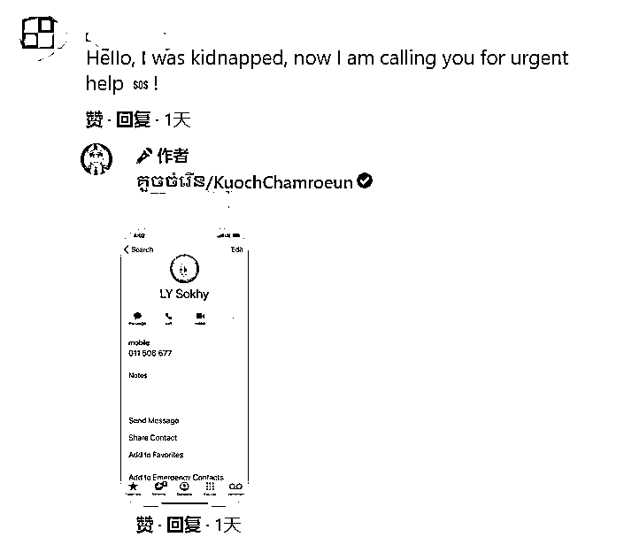
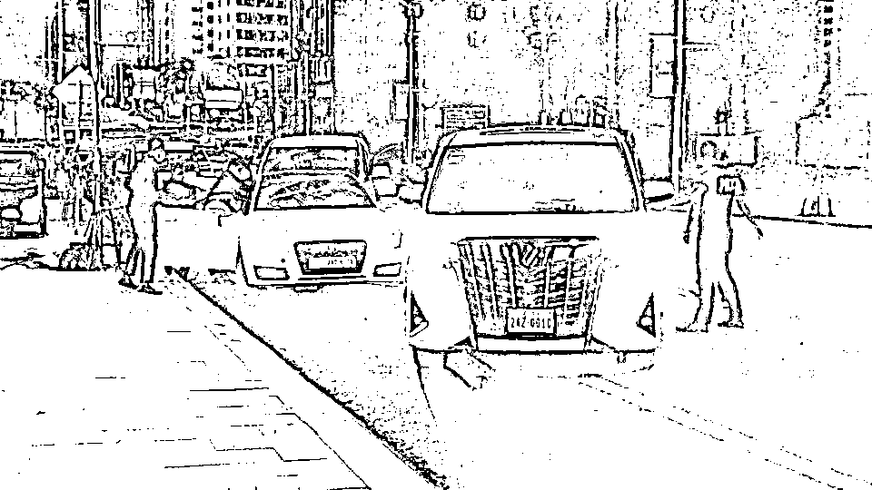
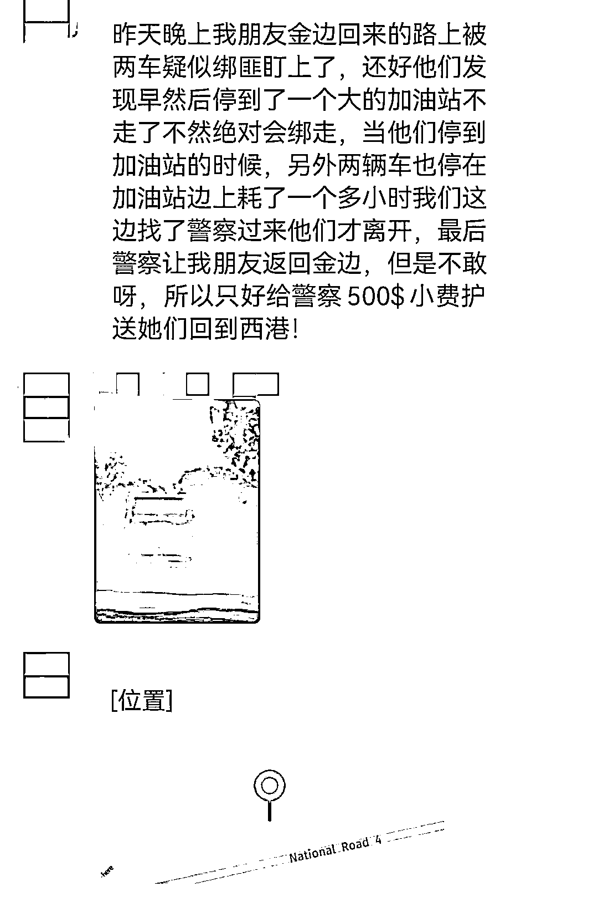
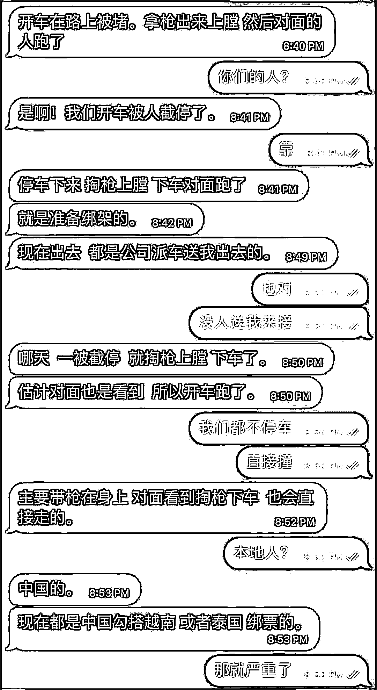

# 绑架和网赌 仍是西港中国人的噩梦

> 原文：[`mp.weixin.qq.com/s?__biz=MzIyMDYwMTk0Mw==&mid=2247530630&idx=5&sn=620249b3e66c50367a603c4d1b82c7df&chksm=97cbb3bea0bc3aa84c3bc44b7391882e6b4ee5f21479b6187af4817365dee631ffcd9663f237&scene=27#wechat_redirect`](http://mp.weixin.qq.com/s?__biz=MzIyMDYwMTk0Mw==&mid=2247530630&idx=5&sn=620249b3e66c50367a603c4d1b82c7df&chksm=97cbb3bea0bc3aa84c3bc44b7391882e6b4ee5f21479b6187af4817365dee631ffcd9663f237&scene=27#wechat_redirect)

中柬义工队志愿者陈某被某园区殴打逃脱后，被隔壁园区拘禁。中柬义工队对此发出措辞非常严厉的警告。

**严正警告**

日前，我中柬义工队志愿者、贵州籍爱心人士陈某被非法拘禁于甘拉省财通市某园区，遭到殴打勒索，今日凌晨从该园区脱逃，被隔壁园区扣留，至今未得释放。

我们已经向柬埔寨警察总署报案，向中国驻柬埔寨大使馆、中柬联合执法协调办公室报备相关情况，现公开声明，警告如下：

一、爱心人士陈某遭不法分子非法拘禁，我们对此恶毒行径予以强烈谴责！

      二、我们警告限制他人身自由的单位，必须立即放人，否则我们将组织队员配合警方包围该园区，阻断所有粮食供应，并通过动员无人机航拍、通过直播媒体向全球曝光你们园区的所有情况！

三、奉劝从事绑架勒索的犯罪分子悬崖勒马，柬埔寨不是法外之地！柬埔寨的华人华商不是好惹的！激起了民愤，你们将无处立足！

自古以来，邪不胜正；古语云：盗亦有道！你们罪恶的无耻行径已经引起全社会的厌恶，你们玷污了“中国人”这三个字！

立即放人！否则，与尔等终生为敌，誓不两立！

 中柬商业协会常务副主席、秘书长  陈岸

中柬义工队队长 陈宝荣

2021 年 12 月 9 日

目前，陈某已被干拉省警方与移民局解救，被带往警局做笔录，完善报案材料。 

西港省长最近发话了。

西港省长说，最近每天至少要处理 3 起公司非法拘禁员工的案件，经过调查发现，许多是因为赌场公司招聘员工时为员工支付机票、隔离费等，每个员工都欠公司几千美金，所以要工作还债。有的员工想跳槽，于是报警说被绑架了。

《高棉时报》英文报道截图

《柬中时报》中文报道截图

西港省长认为，这些赌场公司的做法没有问题。他计划召集所有公司的老板开会，讨论怎么解决这个问题，他不想再在社交媒体上看到绑架拘禁的帖子。

西港省长脸书上的求救信息 

近日来，不少身陷网赌的人员通过在脸书求助的方式获救。但以后这条路还能否走通？就不好说了。 

西港省长的这一表态让在柬的中国人感到震惊，许多人表示不能理解。

“这种掩耳盗铃的话也说得出口？出来工作的人反而欠公司一大笔钱，然后工作还债？”

正如许多同胞所言，西港省长所说的逻辑与真实情况相差甚远。 

一个员工刚到一个公司工作，就先欠了几千美金，这是不合常理的。相信如果真有这样的工作，也没人会愿意去做。

**现实中的逻辑** 

其实，涉及到相关事件的并不是什么赌场，也不是什么网络投资公司，而是网赌公司。

这样的事情在网赌行业也并不新鲜，有个专门的词——“赔付”，来之前网赌公司给你买机票办签证，来了之后你想走得先把“赔付”交完才行，但真正算“赔付”的时候，并不只是简单的机票和签证钱，许多无良网赌公司会计算高额的住宿费、餐费甚至“海景空气费”，最终成为“天价赔付”。

疫情后这一局面更加恶劣，一方面来柬隔离费用昂贵，网赌公司真实的招人成本增加，另一方面因为人员紧缺，一些网赌公司开始以“赔付”为由禁止员工离开，许多员工工作半年甚至一年后还不能离开。

更有甚者，因为人员紧缺“人头费”暴涨，一家网赌公司转卖一个员工到另一家公司，就能拿到至少 1 万美金的“人头费”。最终导致一些人专门以“招工”方式诱骗、绑架人，再卖到网赌公司。诱骗、绑架一个人，就能拿到至少 1 万美金的费用。

对于网赌公司来说，因为付给了绑架者 1 万美金，入职前就要被绑架者签署赔付协议，声明自己欠公司 1 万美金。 

而当被绑架者向警方求助时，警方联系网赌公司，网赌公司会出具被绑架者签署的赔付协议，表示是被绑架者欠公司钱。

一名从事救助被绑架到网赌园区人员的义工对此深感无奈：“他们自己说是被卖的，但是园区里面有证据，政府会相信谁？” 

但是，另一个问题西港省长也避重就轻，这些公司是什么公司？他们从事的是什么业务？ 

818 网赌禁令后，网赌在柬埔寨已是非法行业，为什么现在在西港还能大行其道？甚至省长还会认为，他们因为手握“赔付协议”，强迫、拘禁员工在园区也没问题？ 

即使欠债还钱，也该有人身自由。 

**独立大道上的绑架案**

12 月 2 日，西港独立大道上发生了一起当街绑架事件，两名中国人被殴打、砸车之后被绑架。 

当时，一辆白色阿尔法将两人乘坐的白色奥迪车截停，随后大概有十几名黑衣人从阿尔法车上下来，试图将车中两人控制。 

其中一人当场被控制在车内，另一人想反抗往人多的地方跑，结果被十几人追着打，最后被电棍电到脖子上电晕，被拖上了车。 

事发现场 图片/柬媒 

想要逃走的人，胳膊被打断，头上缝了几十针。随后两人被带到网赌公司，向其家人勒索 5 万美金。

由于该奥迪车系两人向车主租赁，车主看到自己的车被砸，但联系不到租车人，于是向警方报警。 

第二天，西港警方将两人救出，并将涉嫌绑架的十多人拘捕到警局。

该团伙中，带头的两人是中国人，其余十多人为本地人。 

据本地人向警方提供的口供，由于两人是从某网赌公司逃出的，所以当时当街绑架两人的时候是打算将两人打死，“打人给 1 万美金，打死给 5 万。”

这起绑架案是当街发生的，但属于网赌公司的绑架，并非随机绑架陌生人。 

**绑架案起**

近日对绑架事件的担忧，成了不少在柬华商的最担心的事情。今天又有两起未经证实的疑似绑架事件。

一起是有同胞在微信群发帖，称昨晚朋友从金边到西港路上被绑匪盯上，发现后朋友停到加油站，但绑匪两辆车也在边上耗了一个多小时，直到找了警察后才离开。

另一起是有网友称开车被截停，但自己掏枪上膛，下车后绑匪离开。 

上述两起均未证实，疑似都属于“绑架未遂”的事件。 

如果绑架成功，绑匪会怎么做？ 

一种可能是勒索受害者，向家里要钱；一种可能是卖到网赌园区，赚取“人头费”。

还有可能是先勒索，再卖到网赌园区。 

到了园区，签了“赔付协议”，再向警方求助，就成了西港省长所说的“欠公司钱想要跳槽”的人了。

<mpvideosnap class="js_uneditable custom_select_card channels_iframe" data-pluginname="videosnap" data-id="export/UzFfAgtgekIEAQAAAAAA1VU0iA8WDwAAAAstQy6ubaLX4KHWvLEZgBPE46MACmZwNK78zNPgMIvmAez4LD3N-KjalT8Twgis" data-url="https://findermp.video.qq.com/251/20350/stodownload?encfilekey=oibeqyX228riaCwo9STVsGLPj9UYCicgttvMuSKAicnSugOfIRQib1gwz7UvneBibCbNibvibmOyEeHHaTz7GianXNDRfAm9FaiaX4STyLwHcKFSUq1qmo7ItCYFnAKTq1Cm8dycmQap4t4ds13fk&amp;adaptivelytrans=0&amp;bizid=1023&amp;dotrans=0&amp;hy=SH&amp;idx=1&amp;m=cb19cfbaa27fb4a8097b89325841cbb6&amp;token=AxricY7RBHdWkz79abBGFTVabmE461dhqSUT1SsfD2StFGE31bZzRqtkBlyFpO2ag60oCy48JE7o" data-headimgurl="http://wx.qlogo.cn/finderhead/ibq4aVwOt6HNqrr8OD3sCviaytF3B8TqCwHicxsuIanAJo/0" data-username="v2_060000231003b20faec8c6e48a1acbd3ce04ef33b077a1e41d0d3794ed88ea537878dbe65910@finder" data-nickname="灰产圈+" data-desc="缅甸不止一个李赛高
#李赛高@灰产圈 " data-nonceid="17655745224306224897" data-type="video"></mpvideosnap>

← 向右滑动与灰产圈互动交流 →

