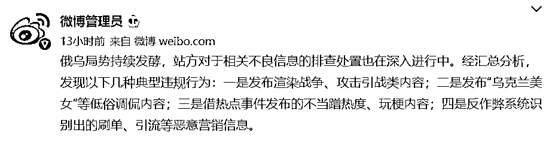
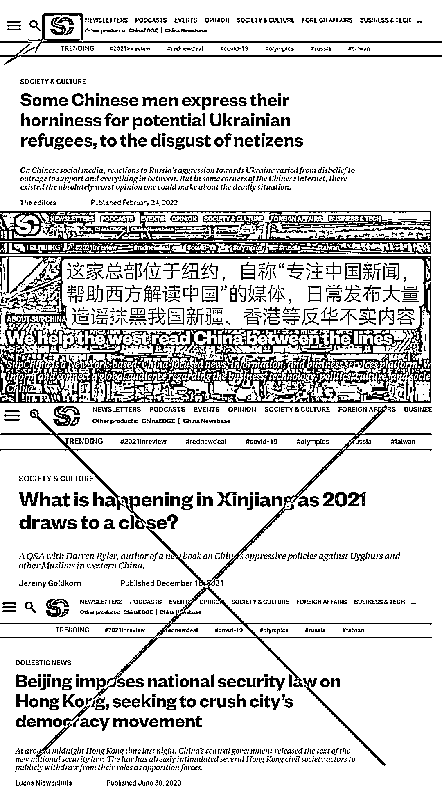
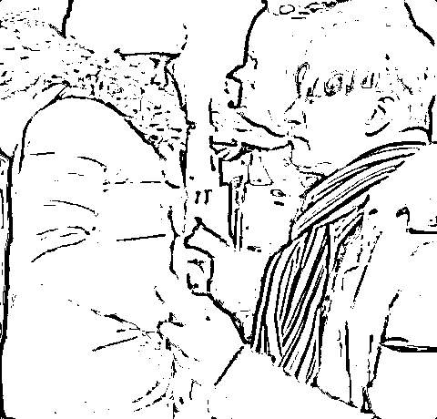

# 炮制乌克兰网络谣言的这些“键盘侠”，身份可疑！

> 原文：[`mp.weixin.qq.com/s?__biz=MzIyMDYwMTk0Mw==&mid=2247530684&idx=1&sn=01c2324931dd46ae6e6cca3fea7dc9d3&chksm=97cbb384a0bc3a92f2cf37ab28d6071d7ac788c0285c84834ea7978d37eaa8459ed866934114&scene=27#wechat_redirect`](http://mp.weixin.qq.com/s?__biz=MzIyMDYwMTk0Mw==&mid=2247530684&idx=1&sn=01c2324931dd46ae6e6cca3fea7dc9d3&chksm=97cbb384a0bc3a92f2cf37ab28d6071d7ac788c0285c84834ea7978d37eaa8459ed866934114&scene=27#wechat_redirect)

近日，

俄乌局势不断升级，

引起多方关注。

然而，

**部分外媒却恶意散播不实消息，**

**传播有关中国的不实言论。**

**部分境外反华媒体和账号**

**恶意炒作中国网友言论**

近日，个别网友以调侃戏谑的语调发布有关乌克兰女性的恶俗言论，造成不良影响，被多个社交平台清理、禁言。

**与此同时，一些境外账号也发布了类似信息，这类言论被别有用心的反华媒体和账号炒作并输入乌克兰的舆论场，将所有矛头导向中国网友。**其中，一家名为 SupChina 的境外媒体发布了“中国网民不当言论导致乌克兰产生排华浪潮”相关内容。

炒作上述说法的境外账号日常发布大量反华分裂内容

据了解，该媒体自称“帮助西方通过文字了解中国”，实际上却捏造中国人排外谣言，挑拨中外民众关系，此前还曾发布大量抹黑造谣中国新疆、香港等地的反华不实内容。

**中国驻乌克兰大使提前撤离？假！**

俄乌局势紧张的当下，各类未经证实的消息广泛传播，有部分外媒恶意散播有关中国不实言论。

目前仍滞留在乌克兰基辅的中国留学生表示，有基辅当地民众向中国留学生反映，乌克兰多家媒体在新闻报道中散布不实消息，称“中国支持俄罗斯入侵乌克兰”。此外，还有所谓“中国驻乌克兰大使馆提前撤离置同胞于不顾”的言论流传。

对此，中国驻乌克兰大使范先荣发布致全体在乌中国同胞的信，他在信中表示：**“我要明确地告诉大家，中国大使永远不可能抛下自己的同胞不管，先顾自己的安危。这不是中国大使的风格，不是中国共产党人的风格！”**

[`v.qq.com/iframe/preview.html?width=500&height=375&auto=0&vid=p3325pr9w9n`](https://v.qq.com/iframe/preview.html?width=500&height=375&auto=0&vid=p3325pr9w9n)

**乌克兰父亲泪别女儿与俄军作战？假！**

不久前，一则标题为“乌克兰父亲在与俄军作战前，与女儿挥泪诀别”的视频被外媒广泛传播，随后有一些国内自媒体直接“搬运”，在社交网络上刷屏。

[`mp.weixin.qq.com/mp/readtemplate?t=pages/video_player_tmpl&action=mpvideo&auto=0&vid=wxv_2288738747443707907`](https://mp.weixin.qq.com/mp/readtemplate?t=pages/video_player_tmpl&action=mpvideo&auto=0&vid=wxv_2288738747443707907)

然而，这个视频的真相却与外媒所报道的内容截然相反。

从该视频最初发布者的介绍来看，**视频中这位正在与女儿挥泪诀别的父亲，准备把女儿从顿巴斯撤离到俄罗斯的安全地区，自己则留下与“入侵”他家园的乌克兰军队战斗。**

乌克兰局势发生突变后，这段视频的内容遭到一账号恶意歪曲，将原本的内容完全颠倒，把准备抗击乌克兰军队的父亲，说成是准备抗击俄罗斯“入侵”乌克兰的士兵。

随后，这则颠倒事实的视频迅速被外媒发布在网站上“吸引眼球”，甚至一些不明真相的国内自媒体也直接“搬运”，导致不少国内网民也被误导。

**警惕谣言，理性发言！**

**针对近期网上出现的不恰当言论，微博、微信、抖音等网络社交平台接连发布公告，对不当言论坚决予以处置，清理、禁言多个违规内容和账号。**

**此外，各平台呼吁用户，在关注国际热点的同时，保持客观理智的态度，合理参与讨论和发布观点。**

来源：央视新闻

<mpvideosnap class="js_uneditable custom_select_card channels_iframe" data-pluginname="videosnap" data-id="export/UzFfAgtgekIEAQAAAAAAXVIVYUbtEwAAAAstQy6ubaLX4KHWvLEZgBPExqMAGRUdc6j8zNPgMIv_2dbfF-uNR4lQL8fgQvH_" data-url="https://findermp.video.qq.com/251/20304/stodownload?encfilekey=rjD5jyTuFrIpZ2ibE8T7YmwgiahniaXswqzibVxKyPCCTCwmm2syRYQ1MUibtjMtlW8TDPdpyf44Lp13MwMuK5320qJdkTPEBlxic5ibAeus9I5GgxDcibYKp8d5mQ&amp;adaptivelytrans=0&amp;bizid=1023&amp;dotrans=0&amp;hy=SH&amp;idx=1&amp;m=&amp;scene=0&amp;token=x5Y29zUxcibAAiaIdXxPrEqTfZibPgohNBMIibXjVvxTrzlwEUqh3YfHALe0l3STFEIjaFGfyML2f4U" data-headimgurl="http://wx.qlogo.cn/finderhead/ibq4aVwOt6HNqrr8OD3sCviaytF3B8TqCwHicxsuIanAJo/0" data-username="v2_060000231003b20faec8c6e48a1acbd3ce04ef33b077a1e41d0d3794ed88ea537878dbe65910@finder" data-nickname="灰产圈+" data-desc="乌克兰小姐姐阐述心里话：“战争不是可以拿出来开玩笑的！中国是世界上最安全的国家没有之一！”#乌克兰@灰产圈+ " data-nonceid="14520394774147831829" data-type="video"></mpvideosnap>

← 向右滑动与灰产圈互动交流 →

