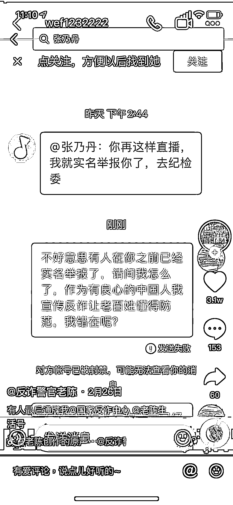

# @所有键盘侠，可闭嘴吧！

> 原文：[`mp.weixin.qq.com/s?__biz=MzIyMDYwMTk0Mw==&mid=2247530684&idx=4&sn=a18560e7edfbf1e39bd858201cfc6ac6&chksm=97cbb384a0bc3a92cb93f97fd8e2656d9c95af435a101688a4afd5919f2ca0cad2dc2daf6a16&scene=27#wechat_redirect`](http://mp.weixin.qq.com/s?__biz=MzIyMDYwMTk0Mw==&mid=2247530684&idx=4&sn=a18560e7edfbf1e39bd858201cfc6ac6&chksm=97cbb384a0bc3a92cb93f97fd8e2656d9c95af435a101688a4afd5919f2ca0cad2dc2daf6a16&scene=27#wechat_redirect)

今天想跟大家聊聊“**网络暴力**”这个话题。

网上冲浪，常常会见到一些奇人骇语。

他们的典型特征就是**以键盘为武器，以互联网为阵地，发动“语言暴力”**。

在刚刚过去的冬奥会，中国短道速滑接连夺金，韩国选手被判罚犯规，最终取消决赛资格。

比赛结束后，部分韩国网民却将矛头指向了曾经的韩国短道速滑传奇、现任中国队技术教练的安贤洙，**网暴****安贤洙及其家人。**

**有网民呼吁不让安贤洙回韩国。**

“有没有什么能让安贤洙、金善台（中国短道速滑队韩国籍主教练）不能回韩国的？太像 XXX”↓

“禁止安贤洙入国”↓

**有网民辱骂安贤洙是“卖国贼”↓**

某些网友甚至连他女儿都不放过，要求他“**公布女儿的长相**”，还要“展现韩国的力量”，让他尝尝厉害↓

2 月 8 日凌晨，安贤洙发长文回应，请求大家不要伤害他的家人。

但韩国网民仍然不依不饶，让本应是一片净土的奥运赛场，充斥着一些非常不好的声音。

将时间再往回溯一点，**15 岁的寻亲男孩刘学州海边自杀**，**成为 2022 年开年，公开死于网暴的第一人。**

刘学州在社交媒体发布的遗书中称，他寻亲成功后，因在网上公开自己被生母拉黑的截图、被“**一些颠倒黑白的人说要求买房子**”等经历，遭到网络暴力。

遗书最后，刘学州希望人贩子及“在网络上丧尽天良的人”得到“应有的惩罚”。

这个 15 岁少年的悲剧，让人唏嘘。

**而这样的网暴事件，在生活中数不胜数。** 

比如，**一线的医护人员发了条跳舞的短视频**，特意强调是刚忙完拍的。

结果评论区一片骂声。

“西安疫情有多少人沉浸在痛苦中，你觉得你这样合适吗？”↓

这位医护人员不得已，把视频删除。 

**某演员发视频庆祝圣诞节。**

结果被骂崇洋媚外： 

“咱不过这个节，只有老外过。”↓

电影《搜索》曾被网友称为**《一个由“不让座”引发的血案》**。

刚接到人生噩耗的女主叶蓝秋，因为没有在公交车上给老人让座，陷入舆论中心。

报社主编为了为了创造话题，提高收视，**把事件放大恶化**。↓

一番添油加醋的新闻，铺满全网。

一时间叶蓝秋被广大网友人肉，被调侃“墨镜姐”，被指责教育的缺失。

电影最后，叶蓝秋纵身一跳离开了这个世界。

这一跳有她对癌细胞扩散的恐惧，也有对网暴的不堪重负。

前段时间给大家安利“**下载国家反诈中心 APP**”的网络安全保卫大队民警老陈，也被网暴。

老陈在自己业余时间宣传反诈，本来是一件利国利民的好事。

根据央视数据，老陈以一己之力让各路神仙的直播间变成了反诈宣传据点，直播观看量上亿。

但是，老陈在火上热搜之后，也感受到了网络直播带来的压力 ——

有人跳出来质疑：**“警察不去破案，做这些合适吗？”**

在得知老陈是用业余时间直播后，又有一批人指责老陈**凭什么下班后还穿着警服直播：**

而和短视频上的各种“妖魔鬼怪”PK 连线，则被人挑刺：**“太影响人民警察的形象”**。

甚至于，尽管老陈从来没开过直播打赏、也从不接广告，还有人质疑老陈是不是和主播勾结，导流后带货一起分成，还**扬言要去纪委举报他。↓**

老陈感觉每句话都有可能被人断章取义，他已经驾驭不了直播这种形式，所以选择暂停一切直播。

但是，在老陈宣布退播的视频下面，很多网友表示，正是因为老陈的直播宣传，自己才知道并下载了国家反诈中心 APP。

之前一位基层反诈人员也感慨过：“全中国基层工作人员几个月的宣传，顶不过陈警官一晚上的直播......”

随手可触碰的键盘鼠标，网络的言论自由，让躲在屏幕背后的“键盘侠”输出观点的门槛很低。

## 

“他炫富。”

“她不爱国。”

“他只有一米四吧。”

......

在网络的掩护下，“键盘侠”打下那一串看似人畜无害的文字，却可以对他人造成不可描述的影响。

因此一些网友、学者都在**呼吁法律保护加大对网络暴力责任主体惩治力度，出台反网络暴力法提高社会法律意识**。

同时，治理网暴也**需要更高层次的行业自律，对网络服务提供者、网络媒体进行责任分工，加强监管和预防机制，及时筛选违法有害信息**。

**当然，**减少网络暴力的发生还需要每个网民做好自我约束**。**

**当热搜代替了媒体，当网络升堂成为日常，**我们与网暴的距离，仅仅只隔着一次轻率的点评或转发。****

**在不能明确判定事情的真相的时候，不轻易评论**，为自己的每一句言论负责**。**

**热播剧《开端》大结局的弹幕里，网友们都在刷：**

****“注意不要去网暴这个演员”****

****“请不要网暴这个色狼演员”****

****“请不要网暴所有饰演了反派角色的演员……”****

****

**虽然很多弹幕都把“网暴”写成了“网爆”，但这些友好的弹幕还是让小珊我感慨不已。**

**你看，**当越来越多人提升反网暴的意识，我们的网络空间就将越来越清曜和纯净**。**

**来源：微信珊瑚安全**

**<mpvideosnap class="js_uneditable custom_select_card channels_iframe" data-pluginname="videosnap" data-id="export/UzFfAgtgekIEAQAAAAAAfCYwm14V6AAAAAstQy6ubaLX4KHWvLEZgBPE2qMMIDJJYan8zNPgMIsPKRrR4s6irzhoxE1y0lYL" data-url="https://findermp.video.qq.com/251/20304/stodownload?encfilekey=rjD5jyTuFrIpZ2ibE8T7YmwgiahniaXswqzKAkWlibibPQu4xW5CPr19iaPh7ucOcjEmSw0hCWS4ib8dh3Fpotc1Qep0GQCzG3iaahmSt1Eu1ZgjcYuQvfBQ4eMPlQ&amp;adaptivelytrans=0&amp;bizid=1023&amp;dotrans=0&amp;hy=SH&amp;idx=1&amp;m=&amp;scene=0&amp;token=x5Y29zUxcibAAiaIdXxPrEqXcjqRPJokkBj2GvMFaibAAuzu5cq60ic5u24gS8UvVd0ZKnQiafPwc1o0" data-headimgurl="http://wx.qlogo.cn/finderhead/ibq4aVwOt6HNqrr8OD3sCviaytF3B8TqCwHicxsuIanAJo/0" data-username="v2_060000231003b20faec8c6e48a1acbd3ce04ef33b077a1e41d0d3794ed88ea537878dbe65910@finder" data-nickname="灰产圈+" data-desc="99%的人都会上当的骗局@灰产圈

" data-nonceid="15071173229047322054" data-type="video"></mpvideosnap>******

**← 向右滑动与灰产圈互动交流 →**

****