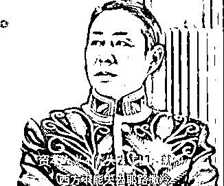
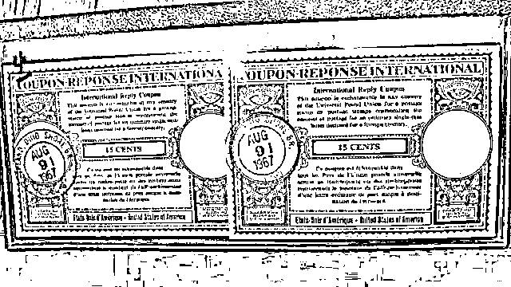
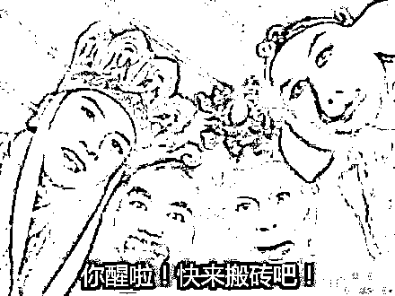

# 一百年前的骗术，今天依然有效——历久弥坚的「庞氏骗局」

> 原文：[`mp.weixin.qq.com/s?__biz=MzIyMDYwMTk0Mw==&mid=2247530684&idx=5&sn=b3d7be3890bf67523435f904b0696d00&chksm=97cbb384a0bc3a922699021a6f05076324bc34bd31ee59bd6a797fb53233dab1ad86695de534&scene=27#wechat_redirect`](http://mp.weixin.qq.com/s?__biz=MzIyMDYwMTk0Mw==&mid=2247530684&idx=5&sn=b3d7be3890bf67523435f904b0696d00&chksm=97cbb384a0bc3a922699021a6f05076324bc34bd31ee59bd6a797fb53233dab1ad86695de534&scene=27#wechat_redirect)

不管你信不信， 

有效的骗术就算经过 100 年的时间，

依然能够在诈骗届闪闪发光。

今天要向大家介绍的骗术，即使是放在浩如烟海的「金融诈骗届」

也称得上是一颗明珠，它就是——**庞氏骗****局。**

**01**

**骗局之王：查尔斯·庞兹**

先给不了解庞氏骗局的小伙伴们稍稍科普一下庞氏骗局和它的创造者的前世今生。

1919 年，美国波士顿的这个冬天不会太好过，

全世界刚刚饱经一战摧残，世界经济体系遭受了巨大的破坏，百废待兴， 

人民期待着一位英雄出来拯救他们的世界。

在这个人人望眼欲穿的时候，

**查尔斯·庞兹**（记住这个名字后面要考）， 

带着他的“金融工具”来拯 hui 救 mie 他们的世界了。 

就是我👆

所谓乱世出枭雄，金融出骗子（啊，不是

查尔斯·庞兹，严格来讲都不算是金融界的人，

1882 年他出生在意大利，学历顶多算个幼儿园肄业， 

大字都不识几个的他，在 1903 年移民到美国，全部身家只有 2.5 美分，就差在街头和狗抢食吃了。 

虽然出身贫苦，但是查尔斯心气很高，**他从来不因利小而不贪，也不因恶小而不为。**

即使是在餐厅当洗碗工和服务员，也坚持在顾客找零上缺斤短两和偷盗行为。

面容这么和蔼，一定不会骗人吧🙂

几次被餐厅开除之后，查尔斯一路坑蒙拐骗，溜到了加拿大的蒙特利尔和魁北克，

在这里，他成为了一家名为 Banco Zarossi 银行的柜员。

要说银行柜员这份工作，对于常年野外漂流的查尔斯来说也算体面，

如果他能痛改前非、好好做人，即使没法成为达官显贵，想要摆脱自己当前和野狗抢食的“街级”，也应该不难。

但要不说人家是诈骗大王呢？

即使身处命运的十字路口，一面是平稳，一面是幸福，

他依然能够坚定的选择弯道超车，

最终成功漂向警察局，完成对自己的救赎。

在 Zarossi 银行工作不到两年，**查尔斯就因票据造假而锒铛入狱 3 年。**

出狱之后，查尔斯发现加拿大并非他的福地，

1911 年，查尔斯重新回到美国，由于走私非法移民，又在亚特兰大的监狱中度过了两年。

**02**

**拆东墙补西墙的「庞氏骗局」**

多年的牢狱生活培养了查尔斯死猪不怕开水烫的性格，

也更加坚定了他，**要发财、快发财、发大财**的信念。

但是，要怎么才能发财呢？ 

别的地方不好讲，但这里可是资本主义的天堂：美利坚啊，

经过美国式发财梦十几年的熏陶，查尔斯发现最快速赚钱的方法还得是——金融，

从 1919 年起，查尔斯隐瞒了自己的历史来到了波士顿，设计了一个投资计划，向美国大众兜售。

这个投资计划说起来很简单，**就是投资一种东西，然后获得高额回报。** 

具体是投资什么东西呢？ 

根本不重要， 

可以是鸡蛋，可以是篮球，也可以是投资火箭，

总之，关键的是，这项投资会给你带来一个**十分高额的回报。** 

查尔斯·庞兹是这么操作的，通过收购其他国家贴现的邮政票据，然后在美国按面值赎回，作为套利的一种形式。 

这个过程其实非常简单，但是，查尔斯故意把这个计划弄得非常复杂，让普通人根本搞不清楚他们到底是怎么操作的。

接着，查尔斯开始在波士顿开设店铺，聘用代理，向广大波士顿人宣传自己的投资项目，

同时，他向客户承诺在 45 天之内就可以获得投资额 50%的利润回报，或在 90 天之内获得 100%的利润回报。 

最后，最关键的一步来了：

****

**他将后面投资人投资的金额，作为付给前面投资人的利润，**

就营造出一种前期投资人真的“赚”到钱了的错觉。 

就是所谓的拆东墙补西墙，用后来者的钱去补前期投资人的钱。 

后来的人看到前面的人赚到了钱，自然会前赴后继、迫不及待地跟进，

越多的人跟进，这个骗局就能持续得越久。 

当然，庄家也能获利更多。

**03**

**泡沫再大，总是会破的**

在短短一年的时间里，差不多有 4 万名波士顿市民，变成查尔斯赚钱计划的投资者，其中的大部分是怀抱发财梦想的穷人，

查尔斯共收到约 1500 万美元的小额投资，平均每人仅“投资”几百美元。

当时的查尔斯被一些愚昧的美国人称为与哥伦布、马可尼（无线电发明者之一）齐名的最伟大的三个意大利人之一，

**因为他像哥伦布发现新大陆一样“发现了钱”。**

查尔斯住上了有 20 个房间的别墅，买了 100 多套昂贵的西装，并配上专门的皮鞋，拥有数十根镶金的拐杖， 

还给他的妻子购买了无数昂贵的首饰，连他的烟斗都镶嵌着钻石。

当某个金融专家揭露查尔斯的投资骗术时，查尔斯还在报纸上发表文章反驳金融专家，说金融专家什么都不懂。

其实，都不需要是金融专家，任何一个思维正常、逻辑通畅的人， 

都应该能够想到： 

**没有门槛，没有风险，同时还有高额回报的投资活动，是不可能存在的。**

****

**如果真的有，那最有可能的情况是，你的本金，正在成为别人的利润。**

**这个时候就有人要开杠啦：**

**那最开始投的人不是赚到钱了吗？**

**那我建议你可以看看《华尔街之狼》里小李子和马修康纳之间的精彩对话，**

**<mp-miniprogram data-miniprogram-appid="wx7564fd5313d24844" data-miniprogram-path="pages/video/video?__preload_=16460375137691&amp;__key_=16460375137692&amp;avid=33559657" data-miniprogram-nickname="哔哩哔哩" data-miniprogram-avatar="http://mmbiz.qpic.cn/mmbiz_png/9gYq0FHZpd0YyuQ2ZWFlMiat21cmISmjSnWJiaz3xS5HzoeXRGQndzm1VgwmiaZHuE1ibaBTzUGMjiaYWpYWU3bBtRw/640?wx_fmt=png&amp;wxfrom=200" data-miniprogram-title="《华尔街之狼》" data-miniprogram-imageurl="http://mmbiz.qpic.cn/mmbiz_jpg/QiawPjYEkDxVGVEdcicicxHYxATbUibiawMgnV2iaZemicapcD5Yd521E3f3OZuyCib2oXU7CTB29xh2F2mSWc5VvFhsibQ/0?wx_fmt=jpeg" data-miniprogram-type="card" data-miniprogram-servicetype="0"></mp-miniprogram>**

**点击观看👆**

**你可能能够赚到一次钱、两次钱，但你不可能永远赚钱。**

********

****1919 年波士顿的冬天不太好过，就像 1920 年查尔斯·庞兹的夏天一样。**** 

****1920 年 8 月，查尔斯破产了，**** 

****他所收到的钱，按照他的许诺，可以购买几亿张欧洲邮政票据，**** 

******事实上，他只买过两张。******

********

****此后，“庞氏骗局”成为一个专门名词，**** 

****意思是指：**用后来的“投资者”的钱，给前面的“投资者”以回报。****** 

****查尔斯后来被判处 5 年刑期。**** 

****出狱后，他又干了几件类似的勾当，因而蹲了更长时间的监狱。**** 

****基本上符合了，愿你出走半生，归来仍是狱友的期待了。****

****1934 年他被遣送回意大利，他又想办法去骗贝尼托·墨索里尼，也没能得逞。****

****1949 年，查尔斯在巴西的一个慈善堂去世。****

****死去时，这个“庞氏骗局”的发明者身无分文。****

****不能说是罪有应得吧，也能算是报应不爽了。****

********04********

********骗术不必新，骗子个个精********

******庞氏骗局在所有骗术中成为一个典型，作为骗术而言这有点失败，******

************************

********但是尽管知道的人越来越多，也丝毫没有影响到这颗“明珠”继续发光发热。********

********在一百多年的时间里，这个诡异又可笑的骗术在全世界被异化成各种各样离奇的版本，********

********从欧洲到亚洲再到非洲，所有有经济的地方就有骗局，所有有骗局的地方，庞氏骗局都曾出了一把力。********

********可能你已经看过很多关于它的文章，可能很多短视频把它表现得好玩有趣，可能多年的教育让你觉得，这样简陋的骗术不可能有人再上当。********

********但是现实是，即使到了今天，相似的骗术仍然层出不穷，********

**********“2017 年 12 月 26 日，钱宝网老板张小雷投案自首，又一个超 500 亿的庞氏骗局崩盘，钱宝网官网数据显示注册用户超过 2 亿。”********** 

********************

**********“2019 年，光合华旅新能源投资骗局曝光！年化收益率 1500%？”**********

********************

**********上面的这两个案例，基本上照搬了一百年前的套路，依然能够骗到人，**********

**********更不用说那些精心设计和伪装的更加精密的骗局了。********** 

**********像是层出不穷的各种虚拟货币，**********

****************************

********明明是很简单的东西，经过一堆谁也听不懂的专业名词的包装，******** 

**********加个“区块链”，再加个“金融创新”，********** 

********就成了高科技产品，就成了未来科技，就成了聚宝盆。******** 

********就让许多人把全部家当“投资”进去，******** 

********结果呢？往往是创始人跑路，接盘侠暴雷，********

********************

**********留下一地鸡毛，伤害的只有老百姓的钱包。********** 

**********还有朋友圈数不清的化妆品微商，********** 

**********动不动创始人和哪位商业大佬合照，动不动就喜提玛莎拉蒂、宾利，**********

************************

********全球一年产的豪车还不够他们喜提的，******** 

********提完豪车该去提航空母舰了。******** 

********这样的话术，瞄准的就是人性的贪婪，******** 

********他就好像在告诉你，做得好的能吃上肉，哪怕做得不好，总能喝点汤吧。******** 

********然而现实是，没有肉，也没有汤，甚至连这顿晚餐也是假的，********

**********你不是去吃肉的，你是去被吃的。**********

********************

**********我相信，这些案例在被爆出来之前，它们的投资者，肯定也看过类似的书和短视频，********** 

**********说不定还有人已经看穿，但就是在等自己成为“天选之人”，成为前面的投资者，成为获益人。**********

**********但是结果呢？**********

************你不会成为天选之人，但你的钱肯定会被圈。************

********************

**********其实除了这些影响特别巨大的，最终被爆出来的大雷，**********

**********还有很多 P2P 的借贷平台，说也说不完，********** 

**********它们有些爆了，有些还在爆的路上，********** 

**********有的人赚得肠子都黑了，也有人将在牢狱里度过很长一段时间********** 

**********那真正承担这些后果的老百姓呢？********** 

**********那些**拿着几百美元也要“投资”期望暴富的穷人呢？************ 

**********我不敢去想。********** 

**********关于诈骗，说一千遍也不够，说一万遍也不够，********** 

**********哪怕天天趴在你的耳旁一直说，最终可能也是没用，********** 

**********但是，哪怕这一点小小的警告能在你的脑海存在五天，也能保护你起码在这五天里不上当，**********

**********假如，暴雷的 2 亿人里，能有一小部分，在“投资”之前的五天里，恰好看到了这篇文章，恰好保护了他们一次，**********

**********我们做这件事也就有意义了。**********

**********最后，**********

************骗术从来不怕简陋，因为人性永远会更简陋。************

**********来源：黑白呸******************************

**********← 向右滑动与灰产圈互动交流 →**********

********************