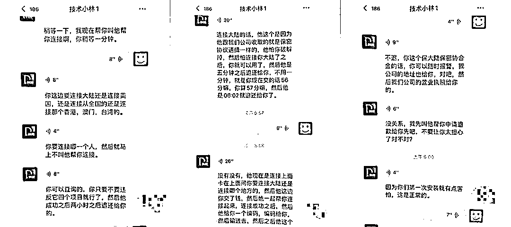

# 医学女博士网上找“黑客”查男友微信，结果被骗 8000 元

> 原文：[`mp.weixin.qq.com/s?__biz=MzIyMDYwMTk0Mw==&mid=2247530684&idx=6&sn=1c0b502a3d8dddb879e49ea84afa5c83&chksm=97cbb384a0bc3a92b92bbe3a72d8e98a3533aef56f2b1a086c261f5610c0d0a4729a8325eb2c&scene=27#wechat_redirect`](http://mp.weixin.qq.com/s?__biz=MzIyMDYwMTk0Mw==&mid=2247530684&idx=6&sn=1c0b502a3d8dddb879e49ea84afa5c83&chksm=97cbb384a0bc3a92b92bbe3a72d8e98a3533aef56f2b1a086c261f5610c0d0a4729a8325eb2c&scene=27#wechat_redirect)

“男朋友最近总是不说实话”，在沈阳某医科大学读博士小田躺在床上没有任何睡意，脑海里还回放着不久前跟男友吵架的画面。

“他是不是有什么隐情？”心里突然冒出这样的想法，让小田按捺不住打开网页进行搜索：**有没有可以查询好友聊天记录的黑客技术？**搜索结果马上跳出了具备此功能的 APP 界面，边上还附有客服的微信号，小田发送了好友申请。

很快这个名为“A 安全恢复”的客服就通过了小田的好友申请，在知晓小田的需求后，又向小田推了一个叫“技术小林”的好友，让小田具体询问他。

随后，“技术小林”告诉小田：“我们公司有这样的软件，只要安装到手机上面，输入对方手机号、微信号，就可以查看他的聊天记录。”同时发来的还有一段操作视频和营业执照的照片。

**“****普通版 480 元，加速版 880 元****，普通版只能看对方聊天记录的 70%-80%，加速版是可以查看全部的。**”小田思索后决定购买加速版。

**“公司规定安装前要先预付 180 元定金，下载后测试没问题了再支付尾款……中国人不骗中国人，姐。”**被对方看似诚恳的话语说动，小田马上转了钱。

之后，她下载名为“IPVPN”的 APP——注册账号，本该是水到渠成，界面却跳出了需要购买激活码，**对方告诉小田需要缴纳 300 元****。**

不疑有他，小田向其转账，输入激活码后界面又跳出需要购买套餐来激活设备进行授权，“这个钱都是会在五分钟后退还的。”再次相信了对方的话语，小田选择购买“1388 元”的套餐。

转账完成后对方又发来一份**“IPVPN 保密协议合同”**，**要求小田再交 5300 元的保证金**，对方信誓旦旦保证这个钱一定会返还，小田便还是转了账，结果却被告知选择开通中国地区服务器还需要转钱，这下小田不乐意了，钱是一笔又一笔转出去像个无底洞，要求对方给自己退款。

**“需要扣除 30%手续费，你先将 30%的费用转过来，我们会全额退款。”**看到这样的话语，小田心里彻底明白了——这是遇上骗子了！

见无法将钱要回，小田马上向派出所报了警。目前，案件正在侦办中。

** 警方提示 ** 

在各类诈骗里，骗子的身份可以是万能的，**切勿轻信陌生链接下载软件，不要轻信任何陌生人说的“能通过渠道获得他人隐私信息”等话语**。

**通过不正当手段获取他人隐私信息也属于非法行为，不要尝试此类调查服务**；不轻易相信陌生人所说的个人信息调查内容，发现类似钓鱼网站，要及时反馈给相关部门；一旦遇到此类诈骗，应立即报警。

**感情是建立在双方相互信任的基础上的，**《民法典》《个人信息保护法》都明确规定了公民个人信息受法律保护，《刑法》《治安管理处罚法》对侵犯公民个人信息应受的刑事、行政处罚作出明文规定，**切记不得逾越法律底线，否则同样会受到法律的制裁**。

来源：沈阳公安反电信网络犯罪查控中心

← 向右滑动与灰产圈互动交流 →

