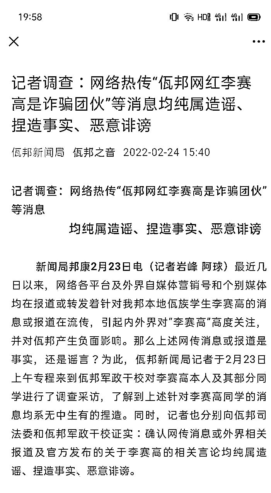
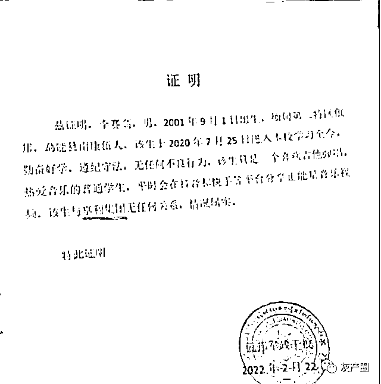
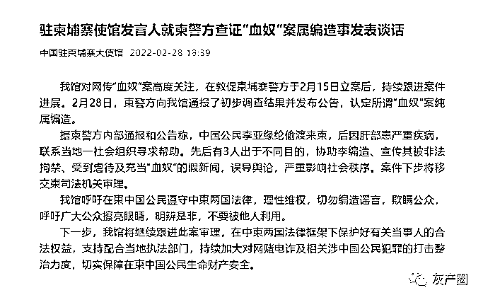
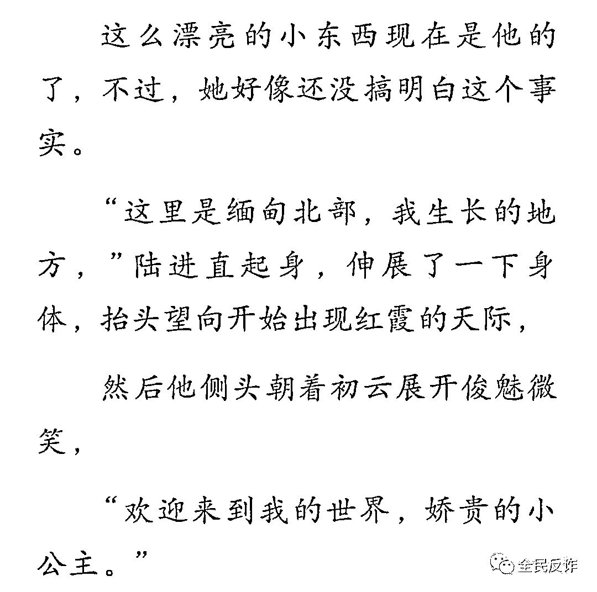
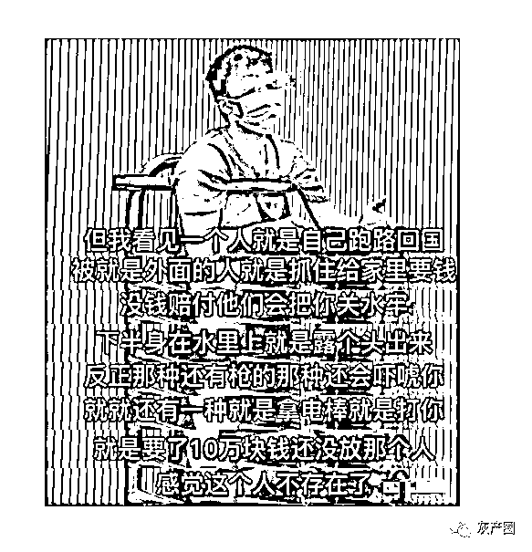
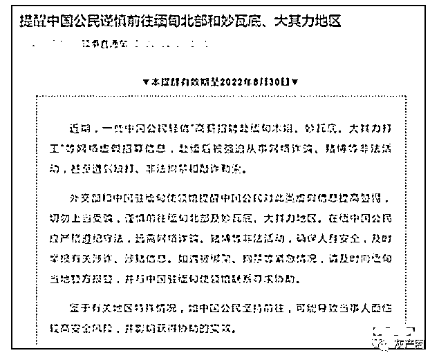
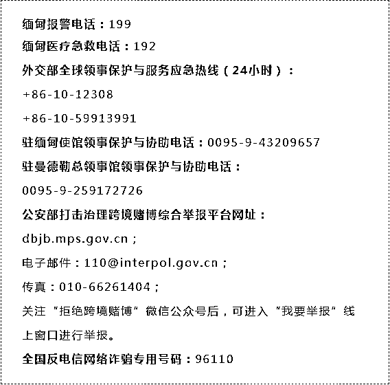

# “血奴”事件、百万粉丝的网红涉诈一一反转了？外交部和大使馆发出新提醒

> 原文：[`mp.weixin.qq.com/s?__biz=MzIyMDYwMTk0Mw==&mid=2247530747&idx=2&sn=0338254755f36988407e55138a123099&chksm=97cbb3c3a0bc3ad544dc3d5e1833967723a5fffdf73ca0f1c18f304a5948ab6b881709303f83&scene=27#wechat_redirect`](http://mp.weixin.qq.com/s?__biz=MzIyMDYwMTk0Mw==&mid=2247530747&idx=2&sn=0338254755f36988407e55138a123099&chksm=97cbb3c3a0bc3ad544dc3d5e1833967723a5fffdf73ca0f1c18f304a5948ab6b881709303f83&scene=27#wechat_redirect)

之前，缅甸网红李赛高真实身份疑为缅北诈骗团伙成员，被曝光。

反转来了！

事情出来后，李赛高本人发声，他说自己只是学生，跟亨利集团并没有任何关系，也没有做过非法之事。从未主动私聊网友，也未邀请网友非法入境，希望网友不传谣不信谣。

李赛高表示误会来源于某官方账号的一则评论，引起网友误解，还表示自己已经向云南警方报警接受调查。

2 月 24 日，佤邦新闻局官方公众号“佤邦之音”发布声明称，分别向佤邦司法委和佤邦军政干校证实：确认网传消息或外界相关报道及官方发布的关于李赛高的相关言论均纯属造谣、捏造事实、恶意诽谤。

佤邦新闻局称，2 月 23 日上午专程来到佤邦军政干校，对李赛高本人及其部分同学进行了调查采访，了解到李赛高作品内容均为李赛高本人和同学们的学习之余出于个人爱好，利用课余时间录制音乐视频与其粉丝们分享的内容。

此外，佤邦军政干校方面也出具了“李赛高事件”的证明。

证明称，李赛高于 2020 年 7 月 25 日进入该校学习至今，勤奋好学，遵纪守法，无任何不良行为。该生只是一个喜欢吉他弹唱，热爱音乐的普通学生，平时会在短视频平台分享正能量音乐视频。该生与亨利集团无任何关系。

目前，李赛高在抖音等的账号都已经恢复，可以看到视频。最早发抖音视频的贵定公安已经删除该视频信息。

尽管如此，网友还不买账，又在其视频下面评论留言。 

另一位缅甸佤邦网红佳润也被传与诈骗集团有关，她也为此做了澄清。

她表示自己真名叫余佳润，是中缅混血，现在在佤邦水利部进行入党入职工作，跟亨利与集团没有任何关系，和所传的中国岳阳楼李丹也没有任何关系，并且否认了和李赛高相识。

目前，对于网上这两位网红的情况，目前还没有最后中国官方信息通报。 

此外，针对江苏小伙被骗去柬埔寨沦为电信诈骗团伙的“血奴”，2 月 28 日，中国驻柬埔寨大使馆官微发文**《驻柬埔寨使馆发言人就柬警方查证“血奴”案属编造事发表谈话》。**

# **全文如下**

# 我馆对网传“血奴”案高度关注，在敦促柬埔寨警方于 2 月 15 日立案后，持续跟进案件进展。

# 2 月 28 日，柬警方向我馆通报了初步调查结果并发布公告，认定所谓“血奴”案纯属编造。

# 据柬警方内部通报和公告称，中国公民李亚缘纶偷渡来柬，后因肝部患严重疾病，联系当地一社会组织寻求帮助。先后有 3 人出于不同目的，协助李编造、宣传其被非法拘禁、受到虐待及充当“血奴”的假新闻，误导舆论，严重影响社会秩序。案件下步将移交柬司法机关审理。

# 我馆呼吁在柬中国公民遵守中柬两国法律，理性维权，切勿编造谣言，欺瞒公众，呼吁广大公众擦亮眼睛，明辨是非，不要被他人利用。

# 下一步，我馆将继续跟进此案审理，在中柬两国法律框架下保护好有关当事人的合法权益，支持配合当地执法部门，持续加大对网赌电诈及相关涉中国公民犯罪的打击整治力度，切实保障在柬中国公民生命财产安全。

**外交部、中国驻缅甸使领馆发出提醒**

从网友的评论看出网友对诈骗团伙也是恨之深。 

从去年 3 月，有个段子在网上流传。

**“这里是缅甸北部，我生长的地方。欢迎来到我的世界，娇贵的小公主。”**

这其实是来自网上一部小说

而随后很多人玩起了这个梗

但真实的缅北，真有那么好吗？

你以为去挣大钱从此人生走上巅峰，真是**t****oo young too simple.**

2 月 28 日，外交部、中国驻缅甸使领馆发出提醒。

**提醒中国国民谨慎前往缅甸北部和妙瓦底、大其力地区**

近期，一些中国公民轻信“高薪招聘赴缅甸木姐、妙瓦底、大其力打工”等网络虚假招募信息，赴缅后被强迫从事网络诈骗、赌博等非法活动，甚至遭到殴打、非法拘禁和敲诈勒索。

外交部和中国驻缅甸使领馆提醒中国公民对此类虚假信息提高警惕，切勿上当受骗，谨慎前往缅甸北部及妙瓦底、大其力地区。在缅中国公民应严格遵纪守法，远离网络诈骗、赌博等非法活动，确保人身安全，及时举报有关涉诈、涉赌信息。如遇被绑架、拘禁等紧急情况，请及时向缅甸当地警方报警，并与中国驻缅甸使领馆联系寻求协助。

鉴于有关地区特殊情况，如中国公民坚持前往，可能导致当事人面临较高安全风险，并影响获得协助的实效。

来源：全民反诈

← 向右滑动与灰产圈互动交流 →

