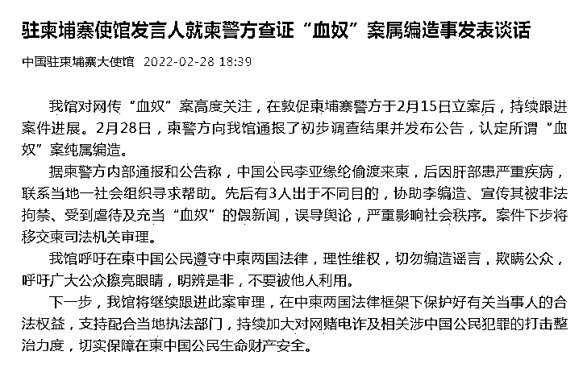
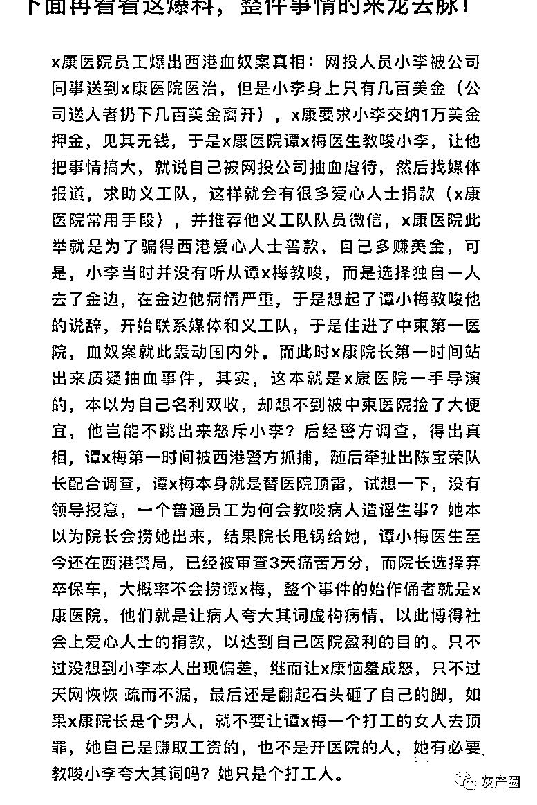
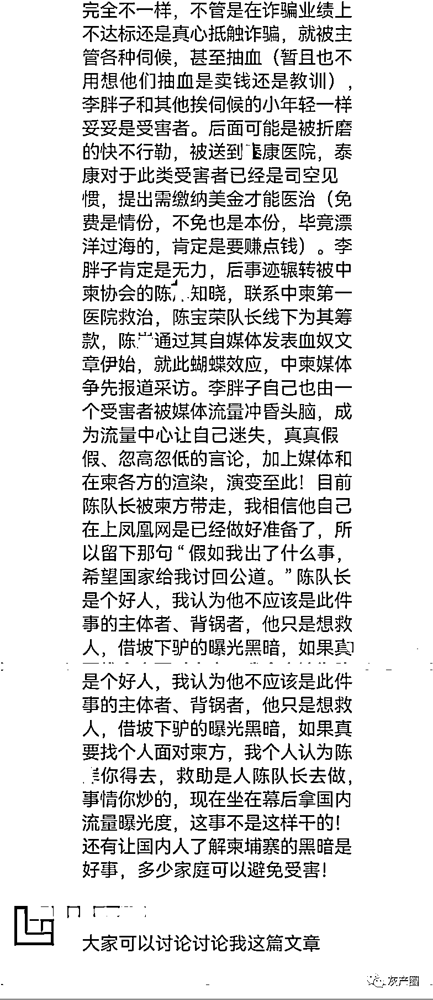
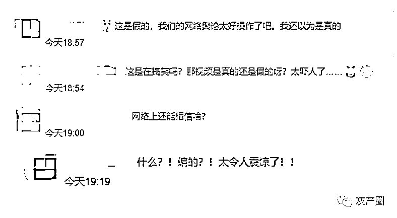

# 柬埔寨警方：“血奴案”纯属编造！网友炸锅了

> 原文：[`mp.weixin.qq.com/s?__biz=MzIyMDYwMTk0Mw==&mid=2247530747&idx=3&sn=15c11a32b96f74d12d9c5336958e6ac5&chksm=97cbb3c3a0bc3ad5e16b8c15a168071569c2c1e2e50f2c769abb13ff924e2d63cbad249c97d1&scene=27#wechat_redirect`](http://mp.weixin.qq.com/s?__biz=MzIyMDYwMTk0Mw==&mid=2247530747&idx=3&sn=15c11a32b96f74d12d9c5336958e6ac5&chksm=97cbb3c3a0bc3ad5e16b8c15a168071569c2c1e2e50f2c769abb13ff924e2d63cbad249c97d1&scene=27#wechat_redirect)

来源：中国驻柬埔寨大使馆公众号。

据“中国驻柬埔寨大使馆”微信公众号消息，驻柬埔寨大使馆对网传“血奴”案高度关注，在敦促柬埔寨警方于 2 月 15 日立案后，持续跟进案件进展。**2 月 28 日，柬警方向使馆通报了初步调查结果并发布公告，认定所谓“血奴”案纯属编造。**

据柬警方内部通报和公告称，中国公民李亚缘纶偷渡来柬，后因肝部患严重疾病，联系当地一社会组织寻求帮助。先后有 3 人出于不同目的，协助李编造、宣传其被非法拘禁、受到虐待及充当“血奴”的假新闻，误导舆论，严重影响社会秩序。案件下步将移交柬司法机关审理。

**中国驻柬埔寨使馆呼吁在柬中国公民遵守中柬两国法律，理性维权，切勿编造谣言，欺瞒公众，**呼吁广大公众擦亮眼睛，明辨是非，不要被他人利用。

使馆表示，下一步将继续跟进此案审理，在中柬两国法律框架下保护好有关当事人的合法权益，支持配合当地执法部门，持续加大对网赌电诈及相关涉中国公民犯罪的打击整治力度，切实保障在柬中国公民生命财产安全。

公告发出后 

话题#柬埔寨警方认定所谓血奴案系编造#

迅速登上热搜 

今天，在柬埔寨的各大微信群里出现了几张截图，内容都是讲述这起血奴事件的编造内幕，我自己也不知道截图中所说的是否正确，但是跟很多柬埔寨中文媒体的朋友们探讨了很久，觉得这几个截图里的内容也并非是空穴来风，下面就让我们一起来看看。

公众号：阿龙闯荡记 的爆料截图

无独有偶，随着揭开血奴造谣内幕截图的发出，另一个截图也出现在柬埔寨各大微信群里，下面我们就来看看这个爆料人他所报出的内幕里都说了什么？

爆料人发在各大微信群的爆料截图，来源：阿龙闯荡记

对此 

不少网友表达了自己的观点

**你怎么看？**

**欢迎在留言区讨论**

来源：中国驻柬埔寨大使馆，阿龙闯荡记

← 向右滑动与灰产圈互动交流 →

