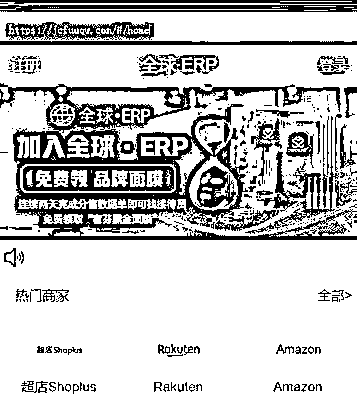
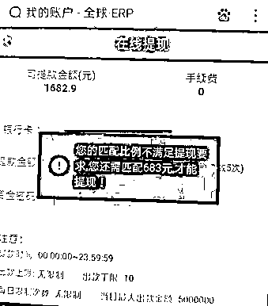
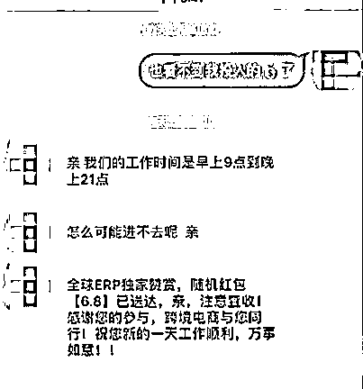
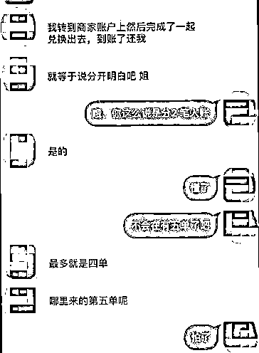
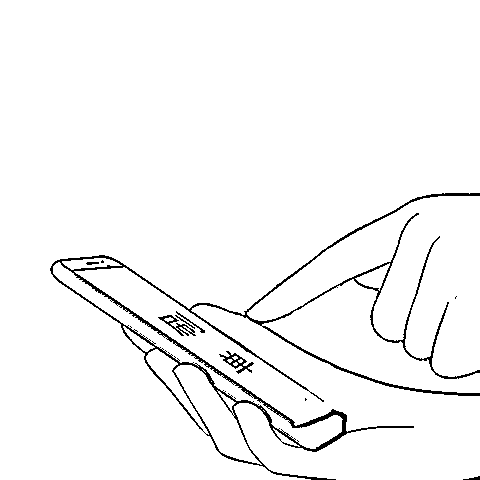

# 你手机里有吗？快！卸！载！

> 原文：[`mp.weixin.qq.com/s?__biz=MzIyMDYwMTk0Mw==&mid=2247530747&idx=7&sn=d688c04811797ad4e9fc54afaaac81cf&chksm=97cbb3c3a0bc3ad52529c7ae529ca414cb60831ac7e98ce0e2253a4e638ca145f9a44972345b&scene=27#wechat_redirect`](http://mp.weixin.qq.com/s?__biz=MzIyMDYwMTk0Mw==&mid=2247530747&idx=7&sn=d688c04811797ad4e9fc54afaaac81cf&chksm=97cbb3c3a0bc3ad52529c7ae529ca414cb60831ac7e98ce0e2253a4e638ca145f9a44972345b&scene=27#wechat_redirect)

最近一款叫**“全球 ERP”**的软件

在很多地方火了 

警方紧急提醒 

**这是诈骗软件**

**赶！紧！卸！载！**

**已有多人上当受骗！**

**市民下载“全球 ERP”****刷单不成反被骗**

2 月 13 日，市民郭先生向十堰市公安局东岳分局报警称，他在网上刷单被骗 17652 元。

经查：郭先生经营一家快递驿站，因为工作原因，微信上加了很多人。2 月 10 日，**一名陌生微信好友拉他进入一个微信群，群里有人发了“全球 ERP”的下载链接，称可以在这个 App 上刷单赚钱。**郭先生想着闲暇时间刚好可以利用起来，于是在接待员的指导下，注册、充值、接刷单任务。

郭先生第一次下单 120 元的商品，很快账户上就返还了 65 元佣金，他不放心所以特意点了提现。几个小时后，185 元到账，于是郭先生便放松了警惕，**第二单是一个 1588 元的任务，郭先生下单两次，客服都说他操作错误，直到第三次才成功下单。**

第二天，他发现佣金到账了，但是不能提现，客服称要完成第三单才能提现。**第三单是一个 12888 元的任务，下单后客服又说郭先生操作错误，要求再充值 16000 元的差价。**这时他才意识到遭遇诈骗，赶紧到东岳分局刑侦大队报案。

**并不只是郭先生一人被骗**

**“全球 ERP”近期已经骗了不少人！**

**0****1**

2 月 12 日，市民胡女士报警称，她在家中玩手机时，被他人推荐加入了一个微信群，并在群里下载了“全球 ERP”App，后来在此 App 上被以刷单为由诈骗**33956**元。

**0****2**

2 月 11 日，市民袁女士报警称，她在微信上认识了一网友，通过网友推荐扫二维码下载了“全球 ERP”App，后在此 App 上被以刷单为由诈骗**35310**元。

**0****3**

2 月 10 日，市民何女士报警称，一微信网友拉她进入了一个企业微信群并下载了“全球 ERP”App，后来在此 App 上被以刷单为由诈骗**36092**元。

**部分受害人手机截图** 

**套路解析**

**套路一**

**利用网络广告吸引目标群体**

不法分子通过 QQ、微信群、抖音等渠道发布广告。当你联系客服，对方会让你下载刷单平台，然后将商品添加至购物车，再截图提交审核等，总之一步步“指导”你，**最终把钱转到指定账户**。

从网络兼职的广告来看，日赚几百元很容易，可实际情况呢？起初完成一两笔小单获得数十元收益，之后就要你加大垫资的数目，完成一笔又一笔单，**想提现却根本不可能**！

**套路二**

**被拉进群，公司“三证齐全”**

进群后，骗子首先发一整套完备的公司资料给你看，**显得“非常正规”**。**声称要兼职刷单，先按流程填写资料，上传身份证，接着等审核，然后才发来刷单平台的链接。****后面的套路，基本和第一种套路相同。**

****你的个人资料被收集后会留下无穷后患**。你可能时刻被各种骗子骚扰。当你要拆穿他们骗局的时候，他们也会拿你的身份信息作为威胁。**

****套路三****

****初尝甜头深陷其中无法自拔****

**前面几单金额不大，佣金总能及时到账并提现。尝到甜头后，不法分子开始劝你刷大单赚更多钱。随着付出成本不断加大，你最终无路可退。**

****以“任务单未完成”为由拒退本金是刷单诈骗的通用手段。**随着投入的本金越来越多，**即使受害者已经怀疑自己受骗，但为了拿回成本，依然会选择再赌一把！**不法分子以任务未完成、二维码信誉已满无法支付等各种理由进行搪塞，直到你口袋空空。**

****防骗每日电讯提醒********

**1. “足不出户，月入过万” “一部手机轻松月赚 8000” “躺着就能赚钱”…**这些网络广告，全都是诈骗！请及时绕开！****

**2. “客服”发来的**不明网址链接一律不点击，推荐的手机 App 通通不下载。****

**3\. 网络刷单是违法行为，千万别被蝇头小利所迷惑。**刷单就是诈骗！****

****

**@全体人员**

****如果下载了“全球 ERP”****

****请立即卸载****

**如果发现被骗**

**请勿删除聊天记录**

**保存好相关证据**

**立即前往公安机关报案**

**来源：十堰人民路派出所**

****

**← 向右滑动与灰产圈互动交流 →**

****