# 乌克兰的网红梅爱偲夫妇，居然是个搞代孕的“皮条客”？

> 原文：[`mp.weixin.qq.com/s?__biz=MzIyMDYwMTk0Mw==&mid=2247530792&idx=1&sn=2f3e9eb17f0f660c5c9d50e7d75a6fb9&chksm=97cbb210a0bc3b060678d1232b67e9dec3675e5de24754443146c554663007243e190896a6d3&scene=27#wechat_redirect`](http://mp.weixin.qq.com/s?__biz=MzIyMDYwMTk0Mw==&mid=2247530792&idx=1&sn=2f3e9eb17f0f660c5c9d50e7d75a6fb9&chksm=97cbb210a0bc3b060678d1232b67e9dec3675e5de24754443146c554663007243e190896a6d3&scene=27#wechat_redirect)

**01**

**我，****梅爱偲**

**乌克兰的“明日之星****”**

就……很突然，打起仗来了。

俄乌局势瞬息万变，全球人民都跟着提心吊胆，

**乌克兰到底现状如何？百姓们生活状况又如何？**

幸而现在是一个网络发达的时代，

达莎梅爱偲夫妇一家被困在乌克兰。

他们从一个记录生活的博主，顺势成为了实打实的战地记者。

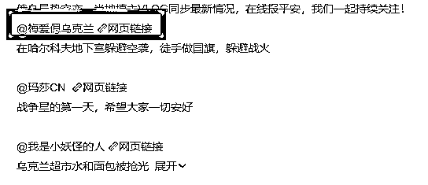

哪怕目前生活已经陷入困境，梅爱偲每天为网友介绍当地最新的情况。

一家三口躲在地下室打地铺，窘迫又心酸，但他们仍旧自制五星红旗。

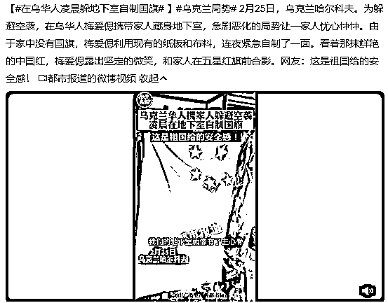

这个举动，让所有牵挂乌克兰华人的同胞们都沸腾了，

无情残酷的战争面前，这个男人沉着冷静应对当下的混乱；

而作为中国人本可以自己回国，但为了妻女留在了乌克兰！

一时间，**跨国婚姻、战火里的爱情、中国情怀**……种种标签为梅爱偲赢得了不少掌声。

夫妻二人一时风头无两，公众号、大 V 接连转发赞誉。

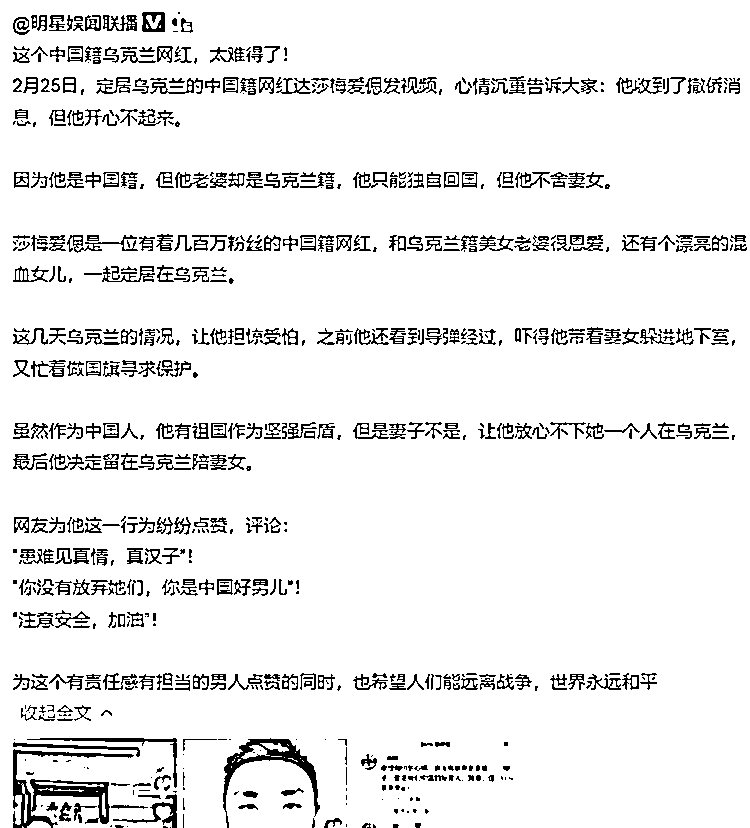

一一鉴赏了夸奖梅爱偲的文章，

越看越觉得这个梅爱偲，有点子东西的。

高考失利后去了乌克兰留学，毕业后就地发展，创办游戏公司、中餐厅、之后又进入互联网行业，混得风生水起。

梅爱偲成了在乌华人圈里有名的大富豪，

迎娶了小自己 12 岁的乌克兰美女达莎，

**爱情事业家庭名气他都有**，怎么看也是一副人生赢家的样子。

然后……

**然后他又火速地“垮”掉了。**

梅爱偲先是被扒出视频造假，凭借自己在乌克兰本地的“优势”，发布了不少“最新”战况视频……**大蹭战争热点，火速吸粉**。

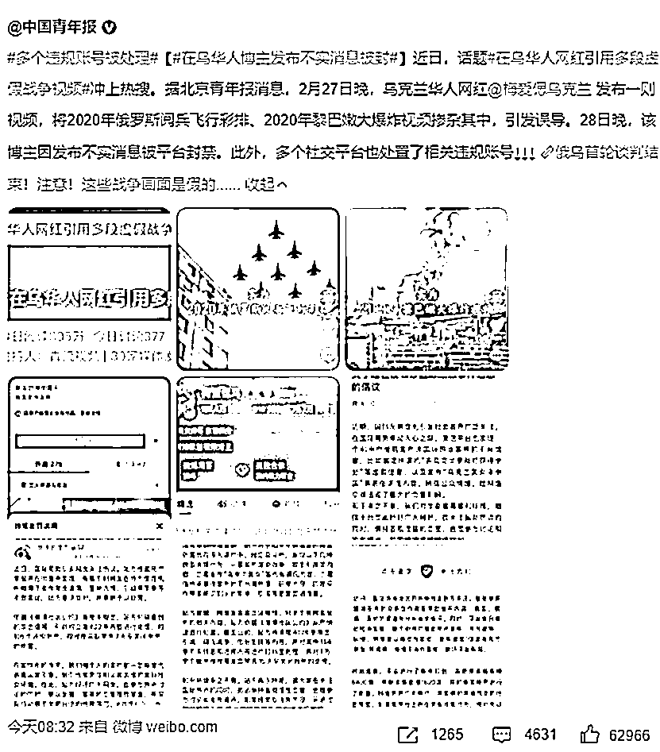

随后人设营销，为华争光好男儿、恩爱夫妻天天秀……

大家想看什么他就呈现什么，可算是把互联网给拿捏住了。

笑死，梅先生可真是营销界的鬼才！

不仅如此，视频造假被曝光后，暴涨的争议让网友孜孜不倦地开始扒他……

**“他是做中乌婚恋网站的，老皮条了！！”**

据网友透露，达莎梅爱偲所创办的“优爱乌克兰”，**专门介绍有钱人去乌克兰“相亲”**。

别人相亲加微信聊聊处感情，

梅爱偲的相亲会甭管成不成，

先交 6.9 万元入会，高级会员则要 9.6 万的会费……

而想要成为会员的乌克兰女性，则只需缴纳 100 元的会员费即可。

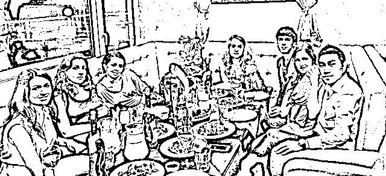

嗯嗯嗯对对对，梅先生您一定是在用金钱挑选“真心”吧！

绝对没有参杂什么利益熏心令人厌恶的低俗买卖是吧？

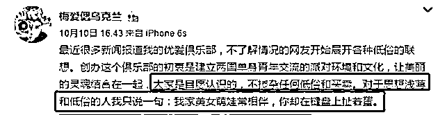

不管网上怎么批斗，总之梅爱偲在婚恋市场里越做越勇，

积攒了不少积蓄后梅爱偲又成立了代生孕公司，靠代孕暴富发家。

最初客户主要是欧美国家的有钱人，现在国内也有不少业务。

离谱的是，**为此他还拿到了乌克兰国家友谊贡献奖**。

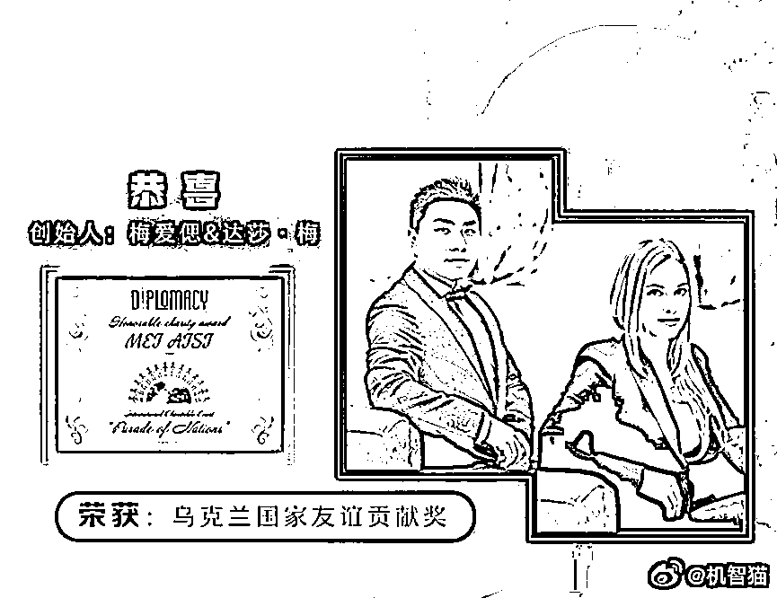

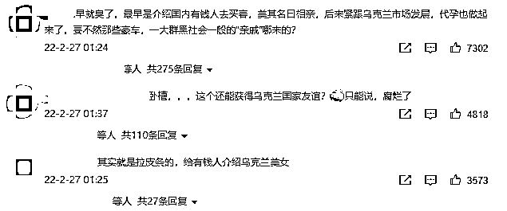

总结一下：

**全网夸赞小伙不仅视频造假、情怀碎了一地，**

**起底背后竟是拉皮条，攫取第一桶金后专职做代孕生意？！**

WHF？！

一时之间竟然不知道该从哪里开始吐槽，

而且代孕这档子事，不是违法的吗？

梅爱偲能这么光明正大搞这种事？我直接举报重拳出击！

emmmm，很遗憾地告诉兄弟们，代孕在乌克兰是合法的。

那么，一个中国人去代孕合法的地方搞代孕，

听起来似乎好像也没有什么不对，为什么网友们会如此生气？

**02**

****贫穷滋生罪恶****

****阴暗的欧洲子宫****

**代孕在乌克兰合法，但不代表乌克兰人支持代孕，**

****实际上代孕业务在乌克兰也是臭名昭著。****

****

**遥想当年乌克兰还是著名的欧洲粮仓，算得上是世界知名强国。**

**可惜种种原因，乌克兰经济迅速下滑，甚至面临全面崩溃，**

**为了挽救岌岌可危的 GDP，乌克兰做了很多“努力”，**

**比如修改法律，**把性交易行为定性为“不端行为”****。****

**即使被警察捉到，最多处罚 20 多欧元**，**跟交通违章差不多了。**

**而以前，性交易是典型的违法行为，处罚要重得多。**

****

**这种看似“禁止”实际“默许”的行为让乌克兰的色情业蓬勃发展，**

**2012 乌克兰举办欧洲杯，路透社发了个报告，**

**估计乌克兰的妓女数量最多可达 8.3 万，光首都基辅就有 1.1 万，**

****“乌克兰新娘”也成了欧洲人尽皆知的秘密代号**，并在这种“带动”下，非法人口贩卖更是应运而生。**

**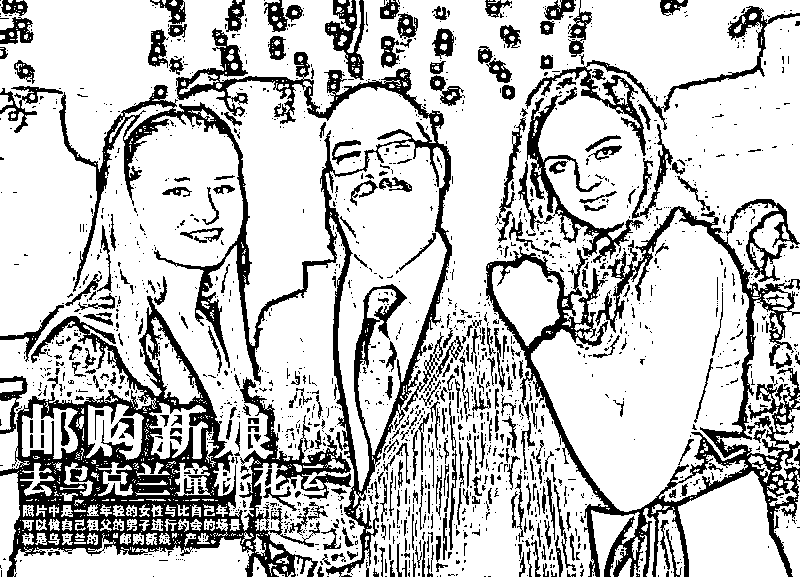**

**除了性交易，随着辅助生殖技术的蓬勃发展，**

**乌克兰人还逐渐掌握了全新的“财富密码”：开放代孕。**

**在政策和利益驱使下，欧美国家无数人飞往乌克兰寻找“孕母”。**

****现如今，性价比极高的乌克兰已经成了世界公认的“代孕之都”、“欧洲子宫”。****

**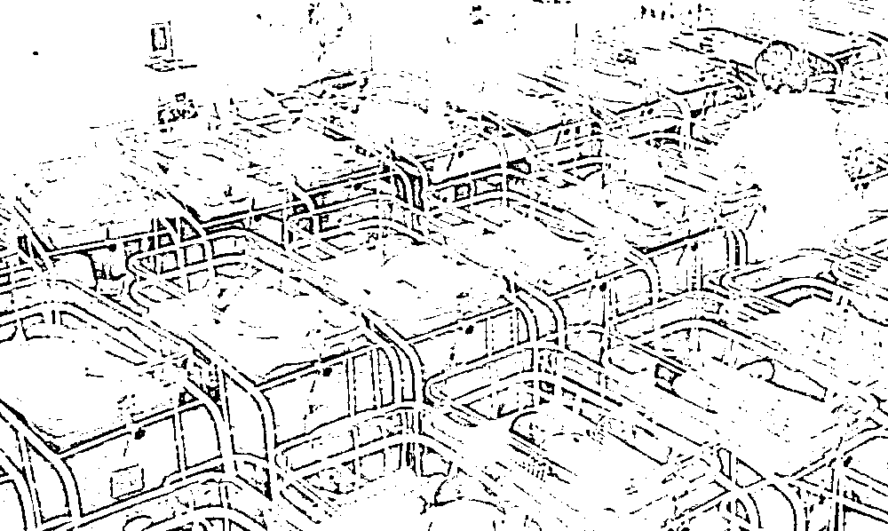**

**看到这肯定又有人要问了：**

**有手有脚为什么要去从事色情产业？为什么要选择做孕母？**

**干什么活不能养活自己是吗？**

**既然走上了这条路，什么后果都应该自己承担啊！**

**朋友，这话说得可能有点过于高高在上了。**

**乌克兰的经济每况愈下，贫穷更是随处可见。**

**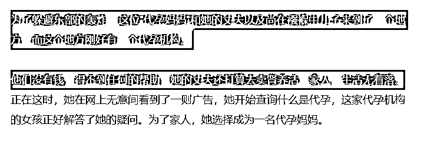**

**因为收入水平极低，很多乌克兰民众根本无法靠薪水养活自己。**

**当地女性迫于生计选择代孕赚钱，**

**但等待她们的，是一次次注射排卵药物后的身体排异，和意外流产、胎死腹中后的终身伤痛。**

**就像揭露乌克兰代孕产业的纪录片《motherland》中所说的：**

**孕母只是一群孵化器，他们不把你当人看，他们不会理解你。**

****在贫穷面前，与其说是她们“选择”成为孕母，倒不如说这是一种胁迫。****

****

**值得一提，就在这几天俄乌冲突爆发的第一时间，** 

**最关心乌克兰局势的人之一，**

**就有那些找了乌克兰孕母但还没能接到孩子的买家。**

**21 世纪的今天，我们竟在生活里、新闻里，**

**看到了真实存在的“去母留子”。**

**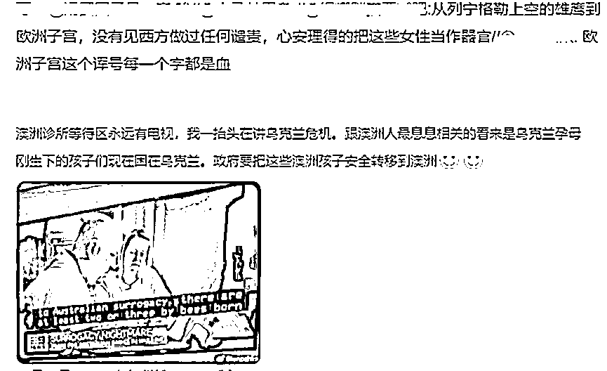**

**再退一万步讲，如果说代孕妈妈们尚且还有自己的意识，能反抗、能拒绝；**

**那么她们肚子里的孩子，就完全是被他人选择的。**

**如果孩子是健康的，她们的父母一般都会将孩子接回去，好好疼爱；**

****但如果孩子出现什么问题，第一个放弃孩子的人，就是他们的“父母”****。****

**在他们眼里，这些生命好像都不是生命，**

**她们只是一件“商品”，是有瑕疵可以退换的商品，**

**至于退换后她的命运如何，跟我一个“消费者”又有什么关系呢？**

**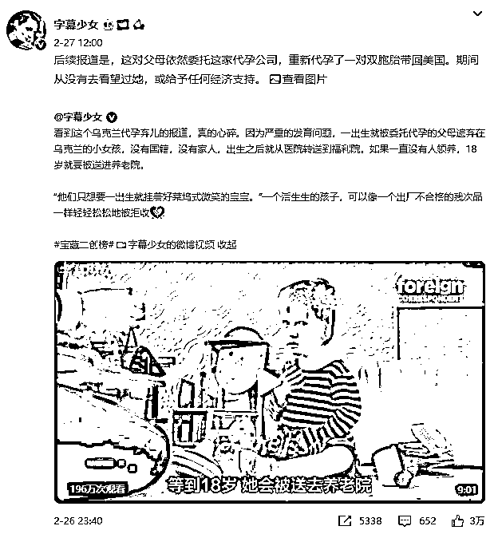**

**了解了这些内幕，我们再回到梅爱偲这件事上，**

**以生命做交易，这是一种耻辱。**

**踩着乌克兰女性的子宫跻身名流，却大肆营销自己的“幸福家庭”，**

**我真的很难共情梅先生的慈父“英雄主义”。**

****“本来你身处战火之中，作为同胞不想落井下石。****

****但作为代孕既得利益者能不能别在国内立慈父人设，在中国你的买卖不合法，就别想着名利双收了。****

****你的孩子是孩子，其他的孩子只是产品。”****

****

****03****

****绝对的自由意味着绝对的剥削****

**在我国，代孕是不合法的，但并不意味着相关的黑灰产业没有。**

**甚至今天我搜索微博想找相关的资料，**

**我没有看到大家如火如荼激烈探讨“人性”，**

**更多是这些莫名其妙的广告？**

**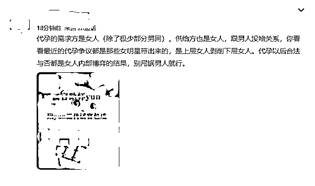**

**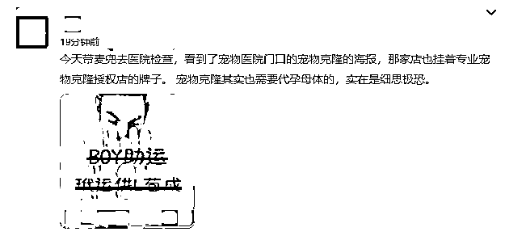**

**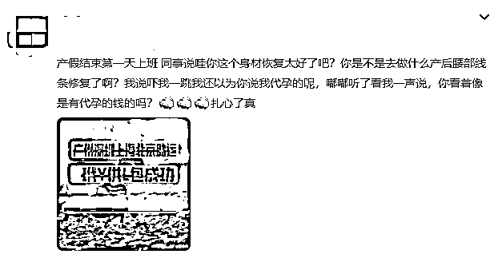**

**有人不能理解，为什么中国代孕不合法呢？**

**有钱但不愿意生的女性可以满足自己的愿望；**

**想生的自己生；**

**没钱的还可以因此赚点钱，这难道不好吗？**

****好——好你个鬼啊！！！****

**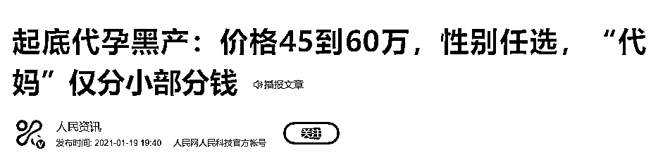**

**你看看“欧洲子宫”乌克兰，看看“亚洲子宫”印度，**

**只有那些积贫积弱的国家才会把代孕当成值得宣扬的事情。**

**法外狂徒张三老师有句名言：**绝对的自由意味着绝对的剥削。****

**在贫富差距巨大的当下，一旦代孕合法，更加拉大了富人与穷人的差距。**

****你以为代孕合法是给女性提供一个赚钱的途径，****

****不是，只是多给富人提供一个剥削的途径。****

**其次，即便是没有合法化的今天，把妙龄女性拐卖到山区沦为生育工具的惨案还少吗？**

**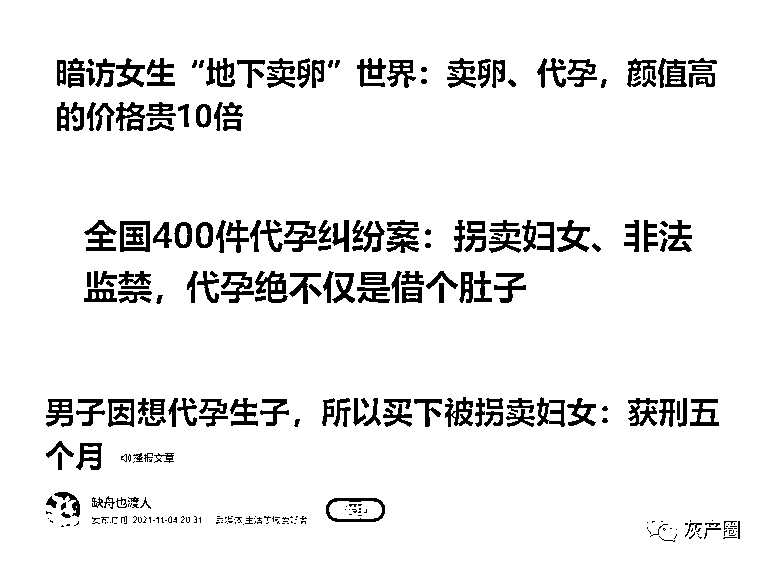**

**有人问：“你为什么反对代孕合法化？”**

**因为一旦合法，在比较偏僻的农村，他们就会给出生的女孩灌输这样的思想：**

**你是只能为哥哥弟弟赚钱的“子宫”。**

**而有女人会自愿成为别人的子宫吗？**

****但凡有选择，没有人会自愿。****

**来源：黑白呸**

****

**← 向右滑动与灰产圈互动交流 →**

****