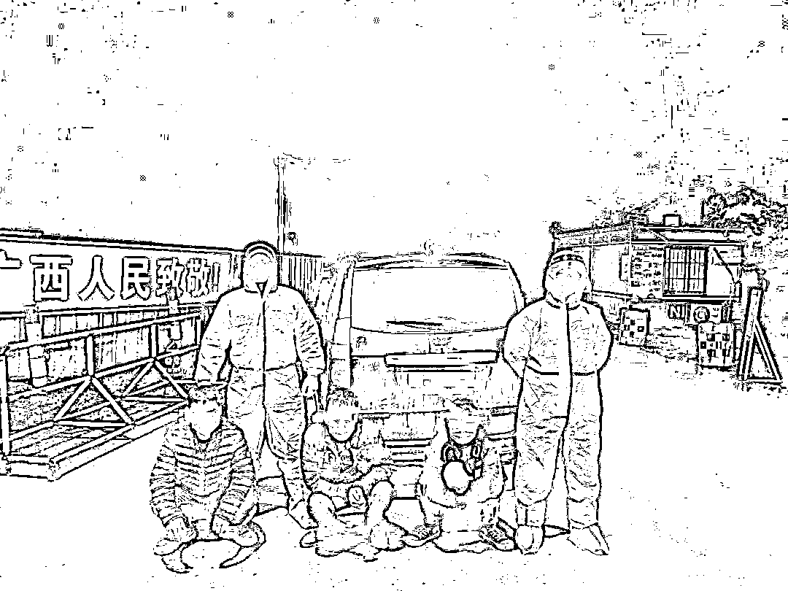
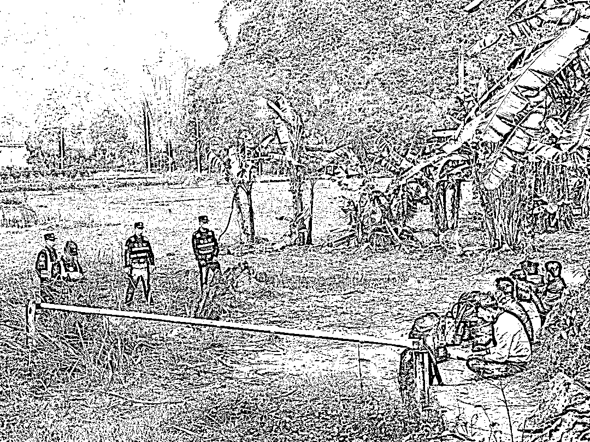

# 出国捞金是个“坑”！小心深陷电诈窝点

> 原文：[`mp.weixin.qq.com/s?__biz=MzIyMDYwMTk0Mw==&mid=2247530792&idx=3&sn=3832cf8d50aa2a4acddca01f1862bc40&chksm=97cbb210a0bc3b06b4c5cbe52249fe1c177c6d1451f6c219ea9740955fc1e17ee26a4b5aa6d2&scene=27#wechat_redirect`](http://mp.weixin.qq.com/s?__biz=MzIyMDYwMTk0Mw==&mid=2247530792&idx=3&sn=3832cf8d50aa2a4acddca01f1862bc40&chksm=97cbb210a0bc3b06b4c5cbe52249fe1c177c6d1451f6c219ea9740955fc1e17ee26a4b5aa6d2&scene=27#wechat_redirect)

**又到了这个时候！**

找工作的高峰期！

不管是在家待业的朋友

还是准备毕业的应届毕业生们

都忙着在网上寻找各种招聘信息

怀揣着这样的梦想

不少朋友看到所谓的

**“高薪”“月入过万”“工作轻松”**

全然不查这份工作合法与否

便抱着侥幸心理，铤而走险

**妄想偷渡出国**

近日，贺州市公安局援边工作队防城工作组在江口卡点执勤时，发现**2 名涉嫌偷渡出境参与电诈活动的男子及 1 名带路司机**，已移交防城港市边境管理支队板八边境派出所处理。

 /

同时，在另一边

贺州援边工作队再立新功！

抓获**7 名非法出入境外籍人员** 

2022 年 2 月 28 日，贺州市公安局靖边工作队应屯卡点站岗民警在巡逻盘查过程中，在边境一处芭蕉林附近，听到异响，发现可疑身影，民警立即提高警惕，慢慢靠近，**发现 7 名非法出入境外籍人员。**民警第一时间控制住现场，拉起警戒线，保持安全距离，立即联系当地边防派出所。

待到边防派出所民警和防疫医护人员赶到，民警便将现场移交给他们，继续执行边境线巡逻任务。

国外的人想偷渡进来

国内的人还想偷渡出去

**所谓的高薪招聘、境外捞金**

**多半就是要你参与违法犯罪活动**

**去诈骗别人！**

**大家一定要特别警惕！**

**也要****提醒身边的亲戚朋友**

**千万不要抱着侥幸心理**

**往对方设计好的“火坑”里跳！**

来源：贺州警方、八桂警事，利箭在行动

← 向右滑动与灰产圈互动交流 →

