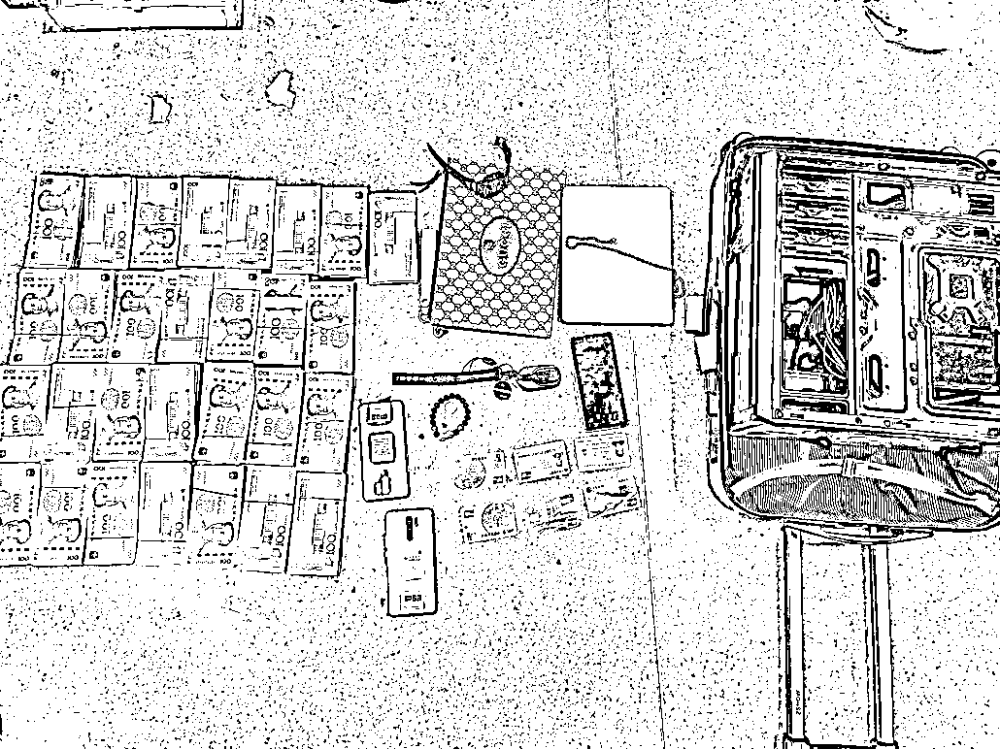
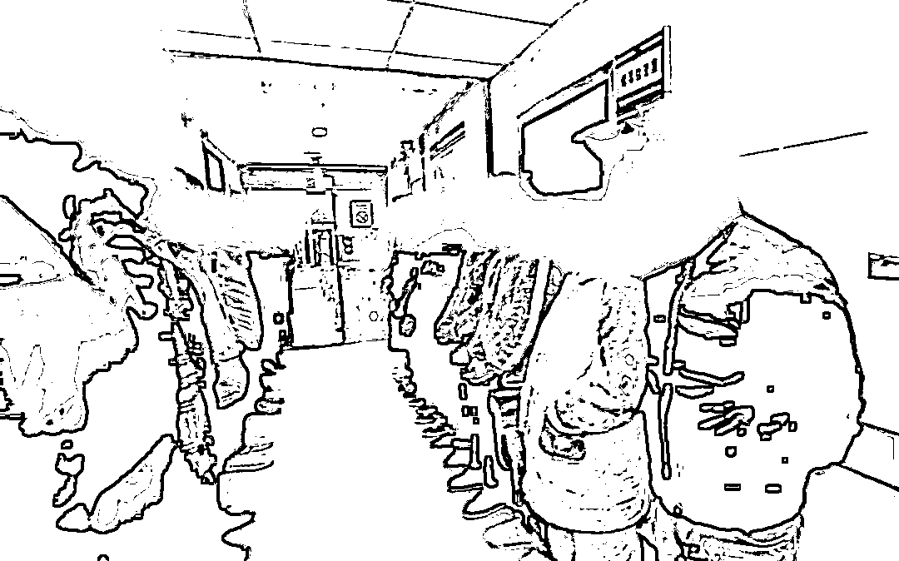

# 13 人落网！武汉警方打掉一缅北“回流”诈骗团伙

> 原文：[`mp.weixin.qq.com/s?__biz=MzIyMDYwMTk0Mw==&mid=2247530792&idx=4&sn=1d60d303733e5dbff4a3e0e744fa2300&chksm=97cbb210a0bc3b06257cddf76055757d24f69dde191c06a2d6c46946aead5daf7e5463417d08&scene=27#wechat_redirect`](http://mp.weixin.qq.com/s?__biz=MzIyMDYwMTk0Mw==&mid=2247530792&idx=4&sn=1d60d303733e5dbff4a3e0e744fa2300&chksm=97cbb210a0bc3b06257cddf76055757d24f69dde191c06a2d6c46946aead5daf7e5463417d08&scene=27#wechat_redirect)

**偷渡去缅北参与电信网络诈骗**

**本想赚大钱后荣归故里**

**怎料一回国就被抓获**

**↓↓↓**

 **[`mp.weixin.qq.com/mp/readtemplate?t=pages/video_player_tmpl&action=mpvideo&auto=0&vid=wxv_2290239452688105475`](https://mp.weixin.qq.com/mp/readtemplate?t=pages/video_player_tmpl&action=mpvideo&auto=0&vid=wxv_2290239452688105475)** 

****近 日****

**武汉警方经过缜密侦查，集中收网，成功打掉了一个从缅北回流的诈骗团伙，抓获作案嫌疑人 13 名。**据初步调查，该诈骗团伙涉案金额达 3000 余万元。****

**据悉，武汉警方按照公安部、湖北省公安厅部署，深入开展“雷火”专项行动，将打击从境外“回流”回国的电诈团伙，作为打防治理电诈犯罪的关键环节，深入研判、分类侦查、专班推进、合成作战。自去年 5 月以来，共打掉境外“回流”电诈团伙 33 个，抓获犯罪嫌疑人 186 名，其中，协助组织他人偷渡边境的嫌疑人 17 人。**

****

****

*****摸黑翻山偷渡去缅北*****

*****当地保安背着枪*****

*****↘*****

**“最令我震惊的是那里的保安都背着 AK47,每天都在害怕和业绩压力中度日如年。”缅北电诈“回流”人员梅某某(化名)向办案民警讲述在缅北的所谓“淘金史”。**

**今年 29 岁的梅某某是赤壁人，之前一直没有找到理想的工作。在一次和同学的交流中，听说去缅北搞诈骗很挣钱，于是 2020 年 9 月的一天，他踏上了去缅北的“淘金”路。当晚，他在蛇头的带领下，从边境翻过一座山，徒步 4 个多小时到达了缅甸，便开始了他的电诈作案“工作”。**

****

****

**▲涉案人员在接受警方讯问**

**秦先生是被梅某某实施诈骗的受害人之一。2020 年 12 月 5 日，受害人秦先生向武汉市公安局武汉东湖新技术开发区分局报案，称其接到一个放贷电话，可以为他低息快速放款。急需用钱的秦先生便添加了“业务员”微信，随后被以注册会员、银行卡卡号错误、流水不足等理由骗走了 2 万元。**

**东新分局民警接报警后便根据秦先生提供的线索开始了调查，最终将“业务员”锁定在了梅某某身上。2021 年 12 月，警方接到线报，梅某某已经回国，并在武汉找了份销售工作，民警立即实施抓捕，在武昌某写字楼内将其抓获。**

**梅某某到案后，并不承认自己去缅北从事电诈的违法行为，坚称自己只是在当地从事外卖、木工等工作，但对其收入来源，始终无法自圆其说。办案民警坚定信心，攻心斗智，终于迫使梅某某承认了实施电信网络诈骗的作案事实。**

**据梅某某交代，他们是一个团伙，有信息数据、业务员、业务经理、涉诈 APP 后台管理员、财务等五条主线，分别负责收集被害人信息、对受害人实施初步诈骗、对受害人进一步实施诈骗、修改涉诈 APP 后台数据和洗钱工作。团伙成员会收集那些急于获得小额贷款人群的个人信息，并以无息贷款为诱饵，向他们推荐“信贷宝 APP”“人人贷 APP”等贷款软件，当受害人缴纳 888 元成为会员后，便表明他们“上钩”了。**

**梅某某还交代，他们还有几名团伙成员也已回国。**

**乘胜追击！东湖新技术开发区公安分局在市公安局的统一指挥下，张网布控，对这个“回流”诈骗团伙成员展开了全面追抓。**

****

*****集中收网再抓获 12 人 *****

*****↘*****

**在接下来的调查中，警方发现这个团伙主要是通过亲戚、朋友邀约，前往缅北从事非法活动。成员主要来自省内天门、保康、大悟等地。**

****

****

**▲现场扣押涉案资金、物品**

**2022 年 2 月 16 日至 17 日，武汉警方组织警力 60 人，在武汉、天门、保康、大悟四地同时收网，共抓获 12 名涉嫌电信网络诈骗嫌疑人，现场扣押汽车三辆，查获现金 30 余万元。**

**2 月 17 日当晚，团伙主犯叶某（化名）驾驶自己的保时捷，从天门赶往武汉聚餐，在江汉路某烧烤店内被公安民警一举抓获。**

**据叶某交代，自己曾在广州做电商生意，2020 年 5 月前往缅北。开始是从事二手手机批发，但为了赚大钱，便和三名朋友共同组织“公司”，以小额贷款为诱饵，专门实施网络诈骗。**

**叶某的“公司”组织人员开发出不同的贷款 APP，通过精准推送受害人后，便会以银行卡流水不足为由，要求缴纳“流水包装费”；或以卡号输入错误为由，缴纳“信息更改费”；还以无息放贷可能存在无法偿还风险为由，要求缴纳“贷款保险费”。每次诈骗都是环环相套，等受害人醒悟过来，为时已晚。**

**“我们只干了一年，本想见好就收，没想到还是逃不过法律的制裁。”面对公安民警讯问，叶某怂着脑袋闷闷地说道。**

**“这些 APP 后台都掌握在诈骗分子手里，他们动动手指就能轻易操控程序，随便编个理便可实施诈骗。”东新分局反诈中心民警鲁健解释道。**

****

*****斩断作案链条*****

*****正告滞留缅北人员尽快回国投案*****

*****↘*****

**近年来，武汉警方通过斩链条、断通道，运用市、区反电诈中心和派出所分工协作的“三级侦查破案”机制，充分整合资源、融合数据、联合警种，发起对缅北回流人员的凌厉攻势，实现全链条打击，最大限度挤压电信网络诈骗犯罪的生存空间。**

****

****

**▲抓获缅北回流从事电诈犯罪嫌疑人**

**据了解，在打击电诈网络诈骗“断流”专项行动中，全市刑侦部门聚焦偷渡犯罪，深挖组织偷渡团伙背后的“金主”、“蛇头”，追查运送者和提供接应、住宿、办证、带路、洗钱等帮助的“黑灰产”人员，严查组织招募人员赴缅北实施电信网络诈骗的犯罪网络和团伙，坚决从源头上斩断本地输出人员的链条。**

**武汉警方刑侦部门负责人也正告仍然滞留在缅北地区从事电信诈骗、网络赌博等违法犯罪的武汉籍人员，请立即归国投案自首，公安机关将会视情依法从轻或减轻处罚；情节较轻的，依法免除处罚。非法滞留缅北地区人员要认清形势，珍惜机会，尽快回国投案自首，争取宽大处理。**

**在此，警方也呼吁广大群众不要轻信“赴境外高薪务工、高薪聘请”等诱惑招聘信息，此类信息可能是在诱导你前往缅甸北部等地区，一旦前往，他们会强迫你从事电信诈骗、网络赌博和卖淫等违法犯罪活动，如你拒绝或不能完成“业绩”，会受到暴力侵害、限制自由。**

**来源：武汉市反电信网络诈骗中心通讯员 徐飞 张敏 袁野，巴蜀反诈**

****

**← 向右滑动与灰产圈互动交流 →**

****