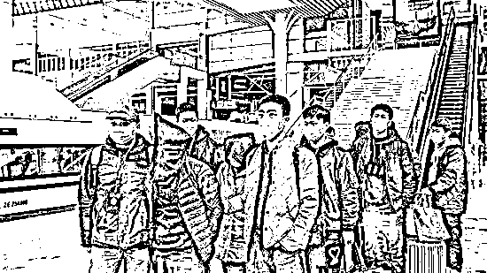
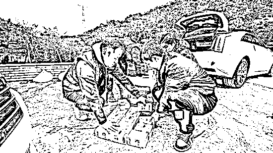

# 野地挖出巨额现金！背后涉及亿元大案

> 原文：[`mp.weixin.qq.com/s?__biz=MzIyMDYwMTk0Mw==&mid=2247530792&idx=5&sn=8d302488dbe061374c4d3bab2f513f89&chksm=97cbb210a0bc3b065ec6d9121d8673a0eacc8fcddf83bea0af6e9bac0bbae5e591bbaefa5101&scene=27#wechat_redirect`](http://mp.weixin.qq.com/s?__biz=MzIyMDYwMTk0Mw==&mid=2247530792&idx=5&sn=8d302488dbe061374c4d3bab2f513f89&chksm=97cbb210a0bc3b065ec6d9121d8673a0eacc8fcddf83bea0af6e9bac0bbae5e591bbaefa5101&scene=27#wechat_redirect)

精心设计“剧本”

团伙演戏诈骗 1 个亿

警方深土中挖出巨额现金

……

日前

上海警方成功侦破一起

案值高达 1 亿元的特大诈骗案

在上海、福建两地全链条摧毁

以犯罪嫌疑人陈某福为首的诈骗团伙

抓获犯罪嫌疑人 20 余名

目前已挽回被骗方经济损失

人民币 8100 余万元

其余钱款

正在全力追缴中

**“亮资”骗局转走 1 亿**

1 月 21 日，上海某贸易有限公司员工何先生经人介绍，结识了自称是一家贸易公司法人代表的蓝某凤及其朋友陈某英。在交谈过程中，蓝、陈二人表示近期要与福建一家公司做石材生意，**需要向****对方“亮资”以展示公司经营状况和资金实力，希望能从何先生所在的公司借款人民币 1 亿元作为“过桥资金”，**并保证仅需持有 3 小时即可。

在征得自己公司法人代表同意后，何先生收取了“好处费”20 万元，并口头约定于 1 月 24 日，在位于北京东路的蓝某凤公司内进行转账操作。

1 月 24 日下午，何先生如约而至，现场除了蓝、陈二人外，还有自称是蓝某凤生意伙伴的某石材公司业务人员黄某等人。眼见“做生意的双方”都在，何先生不疑有他，即按照约定向蓝某凤提供的银行对公账户转账 1 亿元人民币。

之后，陈某英借口安排当晚答谢宴席先行离开，何先生则与蓝某凤等人在现场闲聊，等候 3 小时后重新将钱款转回。然而，仅仅过去半小时，何先生就突然发现该笔资金已被分成几次从该账户上转走，察觉被骗的何先生即报警。

接报警后，上海市公安局黄浦分局民警立即赶赴现场将犯罪嫌疑人蓝某凤、黄某等 4 人当场抓获，并立即成立专案组，仅用 9 小时即将事先借故逃离现场的另一名犯罪嫌疑人陈某英抓捕归案。

1 月 25 日，专案组又在虹口区某商务楼内将骗局幕后主要犯罪嫌疑人陈某福抓获，**其随身携带的一张分工表中，详细标注了骗局中各人的扮演角色和任务分工，**很快将该诈骗团伙其余犯罪嫌疑人逐一抓捕归案。

在 5 天时间内，专案组先后前往江苏、江西等 5 省 7 地，成功止付冻结涉案资金 5400 余万人民币。

**1 米深土中挖出巨额现金**

**余下的几千万资金去哪儿了？**

**1 月 29 日，警方在福州将负责取款的犯罪嫌疑人抓获，发现其已将取现钱款分散隐匿在亲友处，掩埋在野地中。**

**在陈某福家后的野地里，警方使用挖掘机、铁锹等工具，挖地一米深后找到了两只包裹严实的塑料桶。打开塑料桶盖，一捆捆被塑料袋密封的现金重见天日。**

****

**据此，警方先后从二人的亲戚处收缴涉案现金人民币 2490 万元，从陈某福家后山脚野地深达 1 米多的土坑中挖出两桶现金人民币 160 万元，从取款组犯罪嫌疑人林某斌等人处缴获涉案佣金人民币 33 万元。**

**目前，已成功追回涉案资金人民币 8100 余万元，陈某福、陈某英等 21 名犯罪嫌疑人已被黄浦警方依法采取刑事强制措施，其余涉案资金及犯罪嫌疑人仍在全力追查中。**

****一场精心策划的骗局****

**犯罪嫌疑人到案后，如实供述了作案过程，一场精心设计的骗局浮出水面。**

**原来，陈某福作为该案主要犯罪嫌疑人，精心预谋了这起骗局，事先制定了严密计划，一方面指使陈某英招募人员策划实施对何先生的骗局，另一方面，安排在福建的亲戚林某福想方设法打通各个取款环节，为诈骗得手后钱款转移做好准备。**

**面对金钱利益的诱惑，陈某英按照陈某福的谋划，牵头招募了多名社会人员实施骗局。**她以承诺给予数十万不等的好处费为诱饵，物色了黄某等人扮演福建某石材公司工作人员。****

**就这样，陈某英唆使上述人员对何先生共同实施了所谓借用“过桥资金”用于“亮资”的骗局。在钱款到账之后，陈某英借机逃匿，而藏身幕后的陈某福则按照既定计划立即转账取款，并幻想借着牺牲蓝、黄等人隐藏自己。然而，天网恢恢，陈某福、陈某英最终还是没有逃过警方的追捕。**

**来源：上海政法综治网，人民网客户端，长安剑**

****

**← 向右滑动与灰产圈互动交流 →**

****