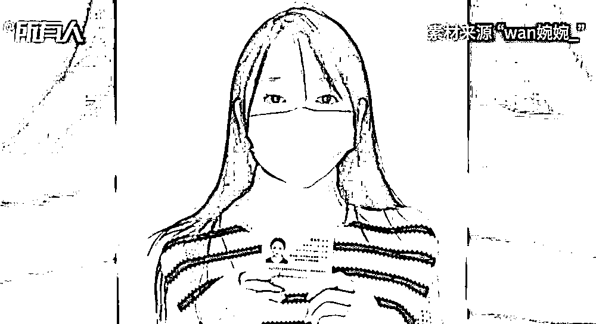
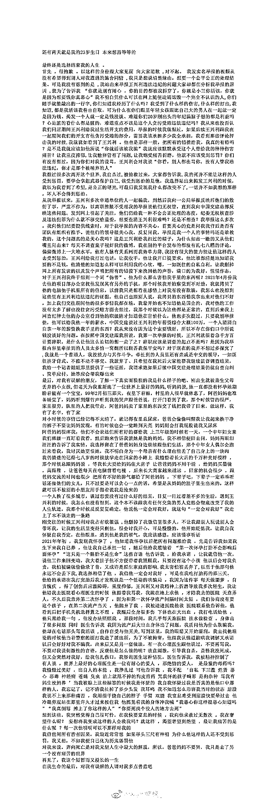
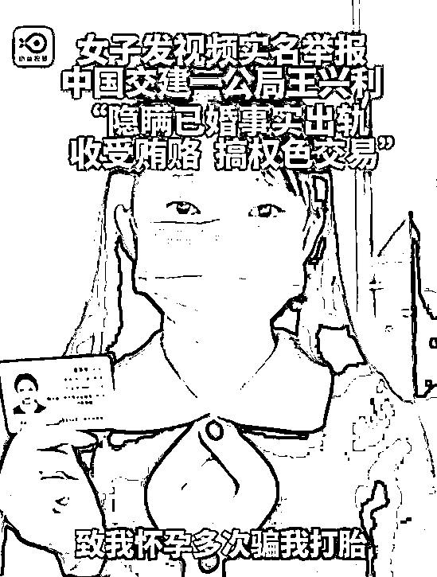
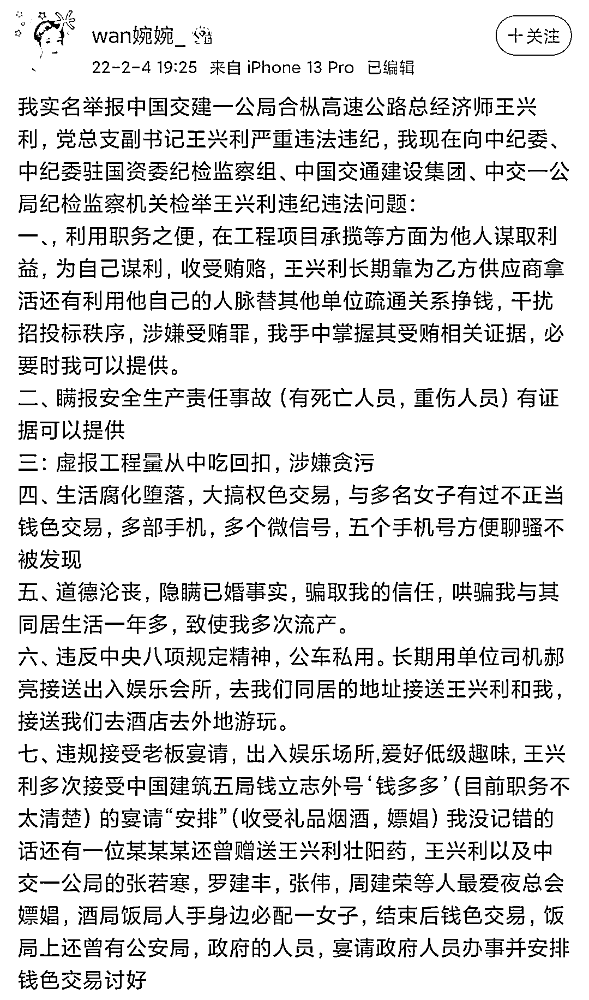
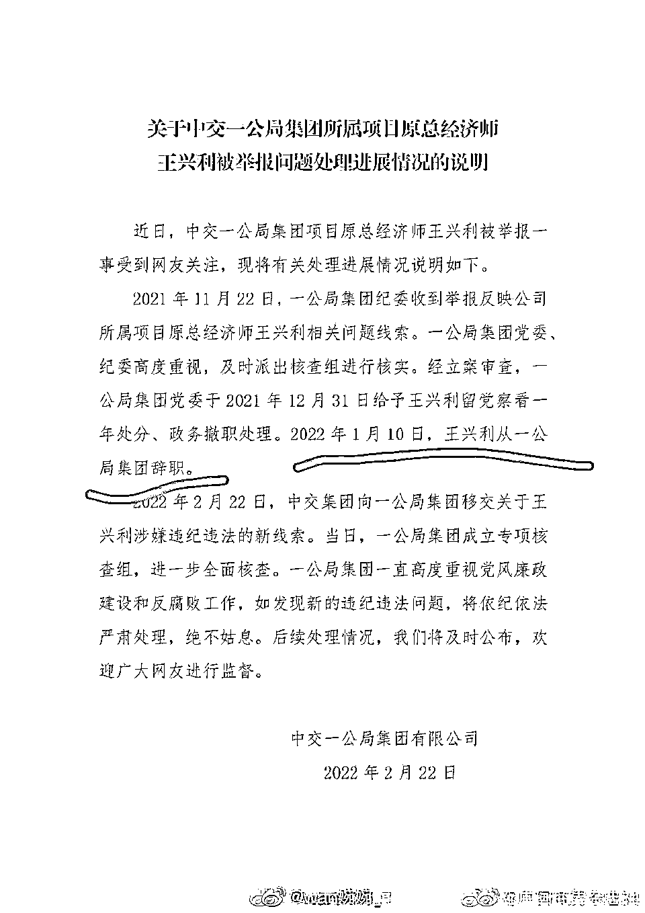
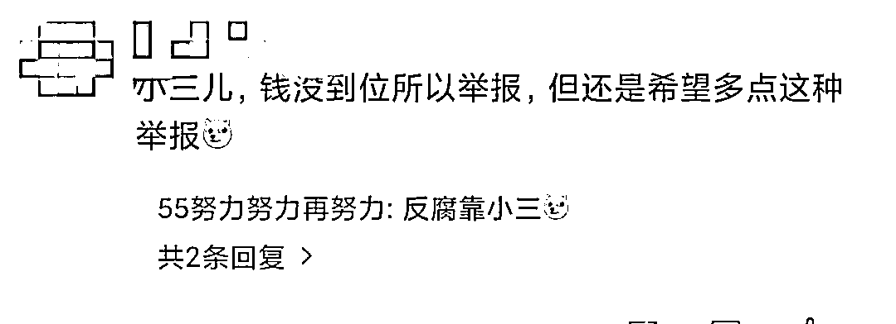
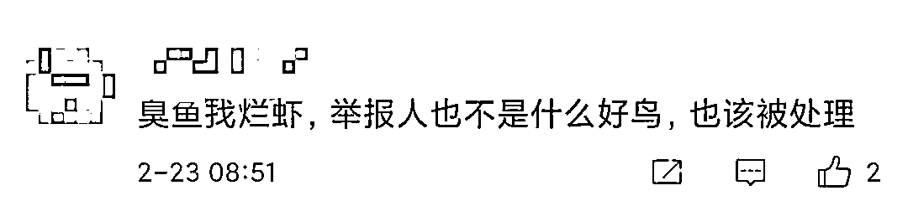
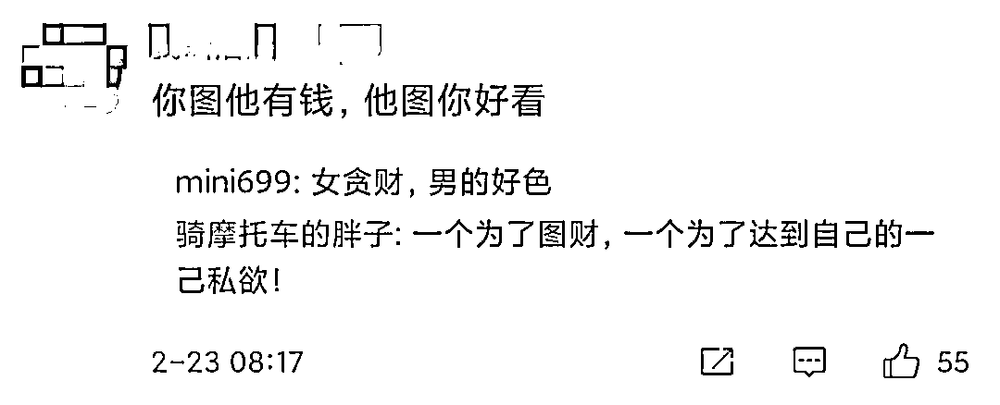
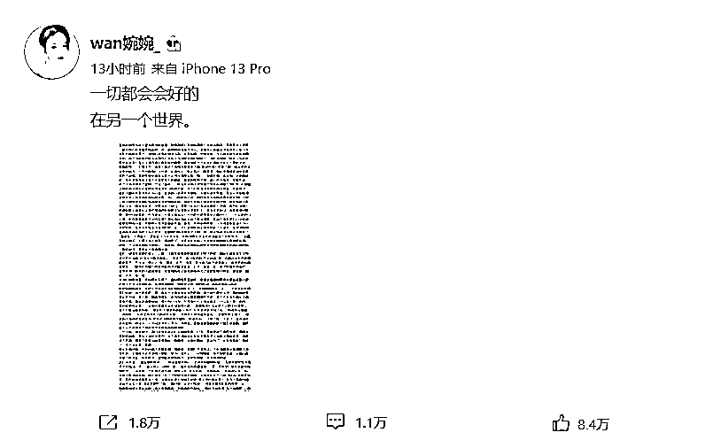

# 实名举报央企高管的女子不堪网暴轻生：举报成功，我就死！

> 原文：[`mp.weixin.qq.com/s?__biz=MzIyMDYwMTk0Mw==&mid=2247530847&idx=1&sn=af9f83f2b3c637fc7adeed9bba3fc591&chksm=97cbb267a0bc3b71888047e31b757ebae11c0c169469cb58a45ffa4bda5813c82ed3b379e24a&scene=27#wechat_redirect`](http://mp.weixin.qq.com/s?__biz=MzIyMDYwMTk0Mw==&mid=2247530847&idx=1&sn=af9f83f2b3c637fc7adeed9bba3fc591&chksm=97cbb267a0bc3b71888047e31b757ebae11c0c169469cb58a45ffa4bda5813c82ed3b379e24a&scene=27#wechat_redirect)

“wan 婉婉 _”

继“寻亲男孩”刘学州离世后，网暴再次引发悲剧。

3 月 2 日深夜，曾实名举报中交一公局项目总经济师王兴利的微博用户“wan 婉婉 _”在网上留下长文遗书轻生。

她只留下一句，**一切都会好起来的，在另一个世界。**

**就跟刘学州一样，她选择了轻生。**

万幸的是，北京东城区警方已经救下了该女子，并正在抢救中，目前处于等待苏醒的状态。

年前，一女子发视频实名举报中国交建一公局王兴利，隐婚同居，权色交易！

在该举报视频中，该女子称，中国交建一公局项目总经理王兴利**“你这个渣男！我实名举报国企经理玩弄感情！”**

新浪微博博主@wan 婉婉 _（举报当事人）披露，王兴利的违纪违法问题有： 

利用职务便利收受礼品、收受利益关系人巨额贿赂，涉嫌受贿罪；

瞒报安全生产责任事故；

**生活腐化堕落，大搞权色交易，与多名女子有过不正当钱色交易；**

道德沦丧，隐瞒已婚事实，骗取其信任，与其同居生活一年多，致使该女子多次流产；

违反中央八项规定精神，公车私用；

违规接受老板宴请，出入娱乐场所,爱好低级趣味, 王兴利多次接受中国建筑五局钱立志外号‘钱多多’（目前职务不太清楚）的宴请“安排”（收受礼品烟酒，嫖娼），还有一位某某某还曾赠送王兴利壮阳药，王兴利以及中交一公局的张若寒，罗建丰，张伟，周建荣等人最爱夜总会嫖娼，酒局饭局人手身边必配一女子，结束后钱色交易；

王兴利吃穿住用度全是高档，其开支和他的正当收入不符，资金来路不明。

举报材料在网上曝光后，中交一公局 1 月 24 日有一个回应：

> 公司纪委接到举报后，马上进行了核实调查，**已对王兴利进行了党纪和撤职处分。**
> 
> 该公司称，**被举报的王某某也于 2022 年 1 月 10 日从公司离职**，此外该公司还表示，对违反廉政问题坚持零容忍的态度。

那个情况说明，不难看出，事情最终还是自己查自己。

按理说，中交一公局已经对王兴利进行了党纪和撤职处分，舆情应该告一段落了。

该女子对于这样的处理并不满意，希望有上级部门深入调查。

然而，就没有下文了。 

**一个女性，连自己的脸面都不要了，果断举报王兴利，我想必有原因。**

这个原因就是，王兴利太渣了，女孩被伤得太深。

可她后面遇到的，却是网友无尽的网暴......

有水军疯狂攻击博主，试图制造更多的精神压力，逼迫她自杀。

**这不又是受害者有罪论？**

我们回头看那份遗书，第一句就让人泪崩：**还有两天就是我的 23 岁生日，本来想再等等的，最终还是选择结束我的人生。**

通读全文，让女孩最终选择自杀的原因归纳起来有三点：

**一是不堪网暴**。女子称，她站出来是为了举报王兴利的违法违纪问题，王兴利曾劝自己不要将事闹大，对方愿意付一年的薪水当“封口费”（约 100 万），但被自己拒绝了。可网上对她的评论却是一片骂声，**“你就是别有用心，你的目的都被拆穿了”“你就是小三你活该，你就是因为想要钱，你真恶心”。**

**二是有关方面的不作为**。女子称，举报事件发生后**，王兴利串通单位一起骗她，已离职推脱不受理**。即便她将问题反映到中国交建总部，仍让她觉得得到的是不公正的处理态度。

三是王兴利的辱骂和自身身体的现状。女孩称，**自己为了王兴利已多次流产，**身体状况极差，尽管如此，**王兴利殴打她，骂他“自私”、“下三滥”、“烂货”等一系列侮辱人格的话语。**导致女孩产生了严重的心理问题。

文中，女孩还讲述了自己的出身，自己刚出生时就被亲生父母抛弃，自己是被养父母带大的。本想着长大后好好孝敬养父母的，**不曾想却遭遇到这样的人生境遇。**

她这样形容自己的感受：我不明白凭什么可以在网上随便造谣诋毁一个完全不认识的人，你们随手就能敲出的一行字，你们知道我经历了什么吗？我受到了什么样的伤害，什么样的打击，**我知道，都是我活该我咎由自取，可为什么在你们眼里年轻女孩跟比自己大的男人在一起就一定是因为钱，揭发一个人就一定是钱没谈，难道你们 20 岁刚出头的年纪满脑子想的都是利益吗？心是脏的看什么都是脏的，难道重点不该是这个人贪污受贿违法违纪吗？**

女孩在文章的结尾部分写到“再见了，我这个短暂而又漫长的一生”。

**“在我生命的最后，对我有误解的人请对我多点善意吧。”**遗书末尾“wan 婉婉 _”这样写道。

何其的悲凉，她站出来是为了举报王兴利的违法违纪问题，可网上对她的评论却是一片骂声，称她是别有用心、小三活该…… 

对待事件的真实性，我们是存有质疑的，但关键是要推动调查取证。

**有问题依法处置，没问题还以清白，后续结果重要，受理态度更加重要。**

**网暴不可取，生命诚可贵，不要用别人的错误来惩罚自己。**

**就算受害者有悖道德，也要和加害者分开而言。**

对于婉婉，网友们还是让世界多一点爱，多一份宽容和理解，毕竟她还 23 岁还年轻，错了还来得及改。

来源：昌南大队长，图源网络，如有侵权请联系删除。

<mpvideosnap class="js_uneditable custom_select_card channels_iframe" data-pluginname="videosnap" data-id="export/UzFfAgtgekIEAQAAAAAAhE0YXzHQegAAAAstQy6ubaLX4KHWvLEZgBPE7oJkTWEdJ6_8zNPgMIvrdkCXu8AuynFfDi_QiPBj" data-url="https://findermp.video.qq.com/251/20350/stodownload?encfilekey=Cvvj5Ix3eexKX1zo1IZZBrQomawdVfSQH1uu2U31EqHbFia00vSYLwxObibGibNx6HkKRaa9zz9pZvFibfd6GnSjYLx3icar5KbuQHzN1UUBWkAQLY3943AJDjYydffCGVDjDLOTbE4TYgJXqia74OibUFGnB4FicoLCBTTGArs3QY3vsGk&amp;adaptivelytrans=0&amp;bizid=1023&amp;dotrans=0&amp;hy=SH&amp;idx=1&amp;m=9550a099dcd58bf3e31f44a2b638ff1d&amp;token=AxricY7RBHdWCQXUMfEico1yFuMJvMRqVtC4LbMtswoEsq1vlhRCdmdNxq4BqfeMQ3T6Y5lqBUMuw" data-headimgurl="http://wx.qlogo.cn/finderhead/PiajxSqBRaEISAKibugHhUQs74zK9sdqn9QvawbxCzU7AuxCgU4kpS0A/0" data-username="v2_060000231003b20faec8cae18b1bcad5cb00e937b0779ef044c516b0481d185bbca60dd9c21f@finder" data-nickname="灰产圈" data-desc="微博用户实名举报中国建交一公局总经理师王兴利。" data-nonceid="14494372328652849717" data-type="video"></mpvideosnap><mpvideosnap class="js_uneditable custom_select_card channels_iframe" data-pluginname="videosnap" data-id="export/UzFfAgtgekIEAQAAAAAAx380Pi34PgAAAAstQy6ubaLX4KHWvLEZgBPEyYI8FwpoJK_8zNPgMIukasYnRXFtAXPDKRIrmW2M" data-url="https://findermp.video.qq.com/251/20350/stodownload?encfilekey=Cvvj5Ix3eexKX1zo1IZZBrQomawdVfSQH1uu2U31EqFAPUiaeuYSHyD4I25N4my9m4L5ggB5dNcq428ibzia43hC2GGTRCoW5G9yr0wSANk54XyQkgGUQfe093E1AzwUSXvfyUA6g4j66wEp8icnOsyY1FVsD5gWjg7eqAxW1zmwne4&amp;adaptivelytrans=0&amp;bizid=1023&amp;dotrans=0&amp;hy=SH&amp;idx=1&amp;m=4ebafe19b54bd171b32d95817dd56395&amp;token=AxricY7RBHdWCQXUMfEico144zZuSia1DwA4mc3M7t1SmtgRXPQwBJwwrp6Q2PcpY6j0iccicyvCG74A" data-headimgurl="http://wx.qlogo.cn/finderhead/PiajxSqBRaEISAKibugHhUQs74zK9sdqn9QvawbxCzU7AuxCgU4kpS0A/0" data-username="v2_060000231003b20faec8cae18b1bcad5cb00e937b0779ef044c516b0481d185bbca60dd9c21f@finder" data-nickname="灰产圈" data-desc="对于一公局的通告，微博网友做出回应:" data-nonceid="3801037415921797078" data-type="video"></mpvideosnap>

← 向右滑动与灰产圈互动交流 →

