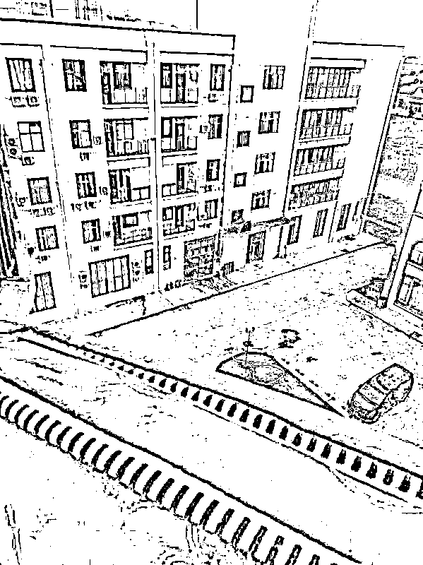
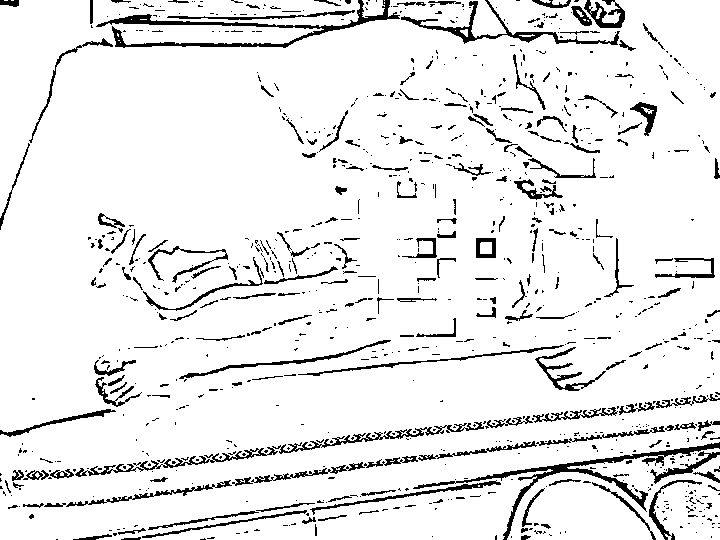
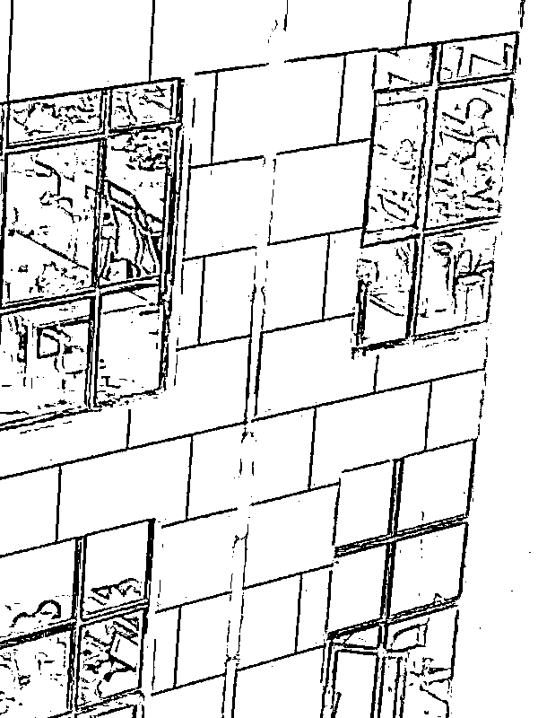
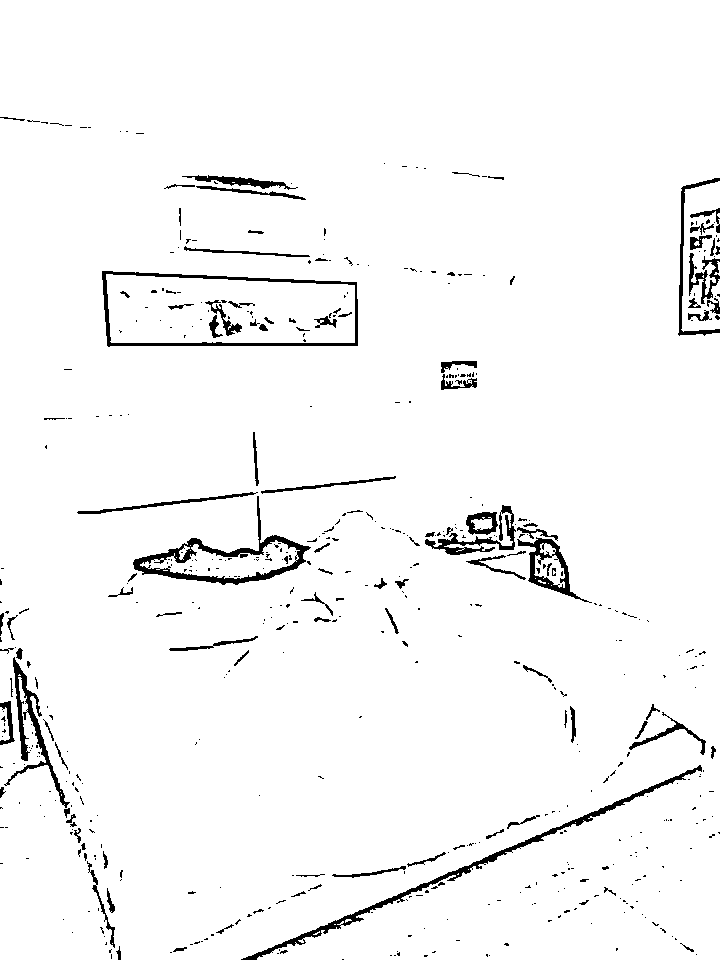

# 网络诈骗扎堆的“网投园区”：一座由围墙、电网、摄像头和持枪看守组成的“集中营”

> 原文：[`mp.weixin.qq.com/s?__biz=MzIyMDYwMTk0Mw==&mid=2247530847&idx=2&sn=b1d7168564ca4267c05e92d79d3f1cab&chksm=97cbb267a0bc3b71dbc6ed0033e51624ba4531568cffef7b92dbe8dd29870e605316c1cfcc2e&scene=27#wechat_redirect`](http://mp.weixin.qq.com/s?__biz=MzIyMDYwMTk0Mw==&mid=2247530847&idx=2&sn=b1d7168564ca4267c05e92d79d3f1cab&chksm=97cbb267a0bc3b71dbc6ed0033e51624ba4531568cffef7b92dbe8dd29870e605316c1cfcc2e&scene=27#wechat_redirect)

****

**高墙内的“网投园区”。**

**困守了 20 多天，25 岁的张祥终于走出了那栋封闭的 9 层大楼。**

**中午 12 点多，许久未见的阳光照得张祥有点眩晕，他趔趄地向前。一位打手和一位保镖将张祥架上车，车行不到 5 分钟，就开到了园区大门外。短短几公里，恐惧、紧张、无助等各种情绪将张祥包围，他一度以为，自己又要被贩卖转移。**

**自从遭遇网投公司劫持后，张祥已被贩卖过两次，价格从 1.28 万美金上涨到 2.1 万美金。在柬埔寨西哈努克港，张祥早已沦为“行走的美金”中的一员。**

**直到在大门外等待张祥的两个人，将他送往医院，又派车将他送往金边的救助站。这时，张祥才松了一口气，确定自己从西港最黑暗的一家“网投园区”逃离。**

**“我得救了，但只要没回国，就很不安全。”离开“网投园区”的那一天是 2021 年 12 月 3 日，可直到今天，张祥仍在救助站等待。**

**相对于更多受害者，全身而退的张祥已属幸运。“救助站还有四五十位受害者，有十多个致残或精神失常的，还有一些未成年。”张祥说。**

**在那些遍布柬埔寨西港、金边等多地的“网投园区”内，还有大量尚未得救、甚至有去无回的受害者。**

**三天之内被两次贩卖**

**张祥曾是江西一家快递网点的货车司机，工作虽辛苦，但七八千的月薪在当地已算高了。张祥说，自己到柬埔寨的动机很纯粹，只是想“见见世面”。**

**在柬埔寨经营 KTV 的朋友总是将异国他乡描述得天花乱坠，怂恿张祥一起加入。去年 3 月，张祥心动了。**

**自高中毕业后，张祥就留在家乡工作，“对外面的世界有点好奇。”最终，在朋友的介绍下，张祥来到柬埔寨西港一家餐厅做帮工，“底薪加上小费，每月也就七千元。”**

**直到上了几天班，张祥才得知自己所在的餐厅地处“网投园区”，也就是网络诈骗公司的聚集地。同时，张祥逐渐发现西港是一个安全难以保障的地方。**

**八个月后，餐厅的合同期满，张祥焦急地连夜从“网投园区”餐厅搬出，准备第二天就前往金边买机票回国。**

**深夜，张祥拖着行李箱走出了“网投园区”大门，在通向酒店的西港 4 号公路上，一辆黑色面包车却突然挡在他面前，两个身高约一米七的年轻男子持刀抵在他的腰边，威胁他上车。**

**自 2021 年 11 月的那一晚起，张祥彻底失去了人身自由，在“网投园区”间被贩卖。**

****

**黑暗的“网投园区”。**

**手机和护照被没收，双手被戴上手铐，张祥被锁在一张铁床上，无法动弹。第二天，劫持张祥的团伙以 1.28 万美金将他卖到白沙二期园区。**

**“想通了吗？你只有三条路：一跟我们做诈骗；二让家人打钱来赎身；三把你卖了。”在“网投园区”，张祥被关进一间小黑屋，连续三天，没饭吃，没水喝，遭受轮番洗脑和打骂。**

**三天后，不服从的张祥又被标价 2.1 万美金，转卖到凯博中国城。**

**“那是西港最黑暗的园区，精神异常的、残疾的、不从的人，最终都会被卖到这里。”张祥顿了顿说，“经常出人命。”**

****

**持枪看守下的“集中营”**

**“知道集中营吗？‘网投园区’就和集中营一样。”在柬埔寨生活了 5 年，并参与营救过不少受害者的华人阿龙这样描述。**

**“园区很大，进出都需要凭通行证。大门口和园区内有持枪保安 24 小时巡逻。在园区外围，每隔十米，也有一位拿着冲锋枪的保安，全天候轮流值班。一旦发现有人逃跑，他们可能直接开枪。”张祥身陷的凯博中国城建有几十栋办公楼，“每一栋楼，可能都是一家‘网投公司’，做的就是网络诈骗。”**

**张祥连办公楼也出不去，“一楼有两名保安，配枪且手持电棍，大门必须刷卡进出。”九层高的大楼，G 楼有小超市、餐厅和食堂，一楼是一间大办公室，坐了上百人，二楼是新人培训室，三四楼是诈骗专用房间，五楼及以上则都是宿舍。**

**“无论白天还是黑夜，这里都一片漆黑，要开灯。”张祥说，大楼一到三层的窗户外都被焊上了钢筋，其余房间也始终被黑色窗帘遮挡，不允许拉开，“在外面，根本看不出里面住了人。”**

**而窗帘内，一间房，四张上下铺的床，住满了八个分属不同层级的人。张祥的宿舍里就住着一位主管、一位组长和两位业绩骨干，“他们随时看押着新人。逃跑基本没有希望。”**

**每天被迫到楼下工作时，张祥总能听到办公室里传来“滋啦滋啦”的声音，“那就是打手在电（击）人。”**

****

**“网投园区”内的场景。**

**在精神和身体的双重威吓下，这一次，张祥屈从了。张祥开始听话地“好好上班”，每天中午 12 点半，准时到二楼参加新人培训，“培训为期一个月，考核成功后，才能正式上岗。”**

**网络诈骗的目标“客户”正从中国国内延伸到海外华人。张祥被划分为“国际盘”，要学习面向新加坡、马来西亚和美国等国的华人的诈骗话术。**

**在新人培训室，一位不到 30 岁的中国女性，面向包括张祥在内的十多人集体授课，“培训的大多是年轻人，从 16 岁到 40 岁不等，男女都有。”**

**结合投影屏上的 PPT，培训师讲授着实施“杀猪盘”的一步步套路——第一步，建立联系；第二步，获取信任；第三步，从朋友变成男女朋友；第四步，引诱充值，并及时退回给予好处；最后，获取更高金额的投资。**

**而针对这过程中的每一步，培训师都传授着各种技巧，比如，如何在国外 APP 给客户打招呼？怎么判断对方喜欢聊的话题？如何从文字交流过渡到语音交流？……**

**一节课时长四小时，张祥每天要上两节课，直到晚上 8 点多，才能回到宿舍房间休息。到了第二天，培训师还要再向大家提问，回顾前一天的课程内容。张祥说，由于自己表现不错，五六天后，他成功要回了自己的手机。**

**表彰狂欢之后的小黑屋**

**25 岁的王明却在得救后才夺回自己的手机。**

**王明在柬埔寨和泰国交界处的“网投园区”待了近八个月，这里离柬埔寨首都金边有七八个小时的车程。直到被救出的那天，他才知道自己被困在山里，附近就是雷区。**

**这是一栋由围墙、电网和摄像头组成的“监狱”，也有超市、餐厅、KTV 等休闲娱乐设施，当然后者只对“网投园区”里的管理层开放。**

**“网投园区”里的制度严苛到近乎变态。上班时间是早上七点到半夜十二点，没有休息时间；进出办公室需要打卡；上厕所需要报备；每天需要在社交软件上添加至少五个女性；每月最低要完成 15 万元的诈骗金额。**

**一旦不够听话，和制度产生一丁点背离，等待着王明们的将是一顿拳打脚踢、电棍殴打，“连萝卜白菜的盒饭都不给吃，不让睡觉”。在这里，他们是沉默的机器。**

**办公室里的人被严格地划分为三六九等。两位大小主管掌握绝对的话语权，下面是两个大组长，末端是分别管理四到五个劳工的小组长。他们和摄像头以及内部网络，形成了密不透风的监视系统。**

**管理层之间层层施压，王明们成了被压榨的终点，小组长日复一日地警告他们，“不好好做业绩，就把你弄死”。**

****

**又一幢拔地而起的“网投园区”。**

**王明最害怕的是每个月业绩结算的日子。办公室会进行隆重的庆祝大会，诈骗金额达到 50 万元，就敲一下锣，达到 70 万元，就敲两下锣，达到 100 万元，就敲三下锣。这些“优秀员工”拿着印有诈骗数额的奖状，笑着向大家展示自己和受骗女性的聊天记录，讲述对方是如何被骗得倾家荡产，甚至跳楼自杀的，仿佛炫耀自己的战利品。作为员工的榜样，他们会拥有丰盛的晚餐，以及向小组长晋升的途径。**

**在清脆喜庆的敲锣声、管理层的欢声笑语和榜样们的经验传授里，没有业绩的王明们成了麻木拍手的背景板。等待着他们的，是在小黑屋里连续几天的殴打、辱骂和虐待。“他们会给我们看视频，长期没有业绩、不听话的，就用老虎钳拔掉指甲。我们不去骗人，也会和他们一样。”**

**因为没有业绩，王明经常被当做仆人呼来喝去，搞卫生，给管理层洗衣服、洗鞋子。“我现在还记得他们经常说的那句话，有业绩的就是老大，没有业绩的就是废物。”王明回忆。**

**白天卖乖后的深夜呼救**

****

**黑暗笼罩下的“网投园区”。**

**在“网投园区”不到一个月，张祥几乎每天只睡两三小时，瘦了十余斤。“睡不着，吃不下，头昏脑涨，每天都在想着怎么出去。”表面上，张祥努力和网投公司人员打成一团，维持和管理层的关系，但拿到手机后的每一天，他都在四处求助。**

**回到宿舍后，上厕所时，或者在夜深人静、室友都睡着的时候，张祥会用被子裹住整个人，尽量不透出一点手机的光，悄悄在网上发出求救信号。然后，在黎明到来前，立即清除敏感的搜索记录，因为“一到培训室，手机就要被没收、查看。”**

**张祥还尝试给家人和朋友打了两三次电话，用室友听不懂的家乡方言，让家人帮忙报警，并故作轻松，佯装若无其事聊天的样子。尽管电话另一端，父母已泣不成声。**

**“其实心脏已经跳到嗓子眼了，生怕被他们看出破绽。”张祥说，打电话的时候正是自己最害怕的时刻，“他们对打电话的次数有限制。用手机的频率如果太高，也会引起警觉。”**

**直到辗转联系上中柬义工队队长陈宝荣，张祥终于看到一丝逃离的希望。“他让我继续维持好和网投公司的关系，他会想办法救我出去。”张祥等了两三天，果真等来了营救。**

****

**陈宝荣。**

**2021 年 12 月 3 日，张祥被护送进西港警察局录口供。不大的房间里，草席贴在冰凉的瓷砖地上，挤满了 20 多个形形色色的罪犯，有飞车党、绑匪，还有小偷……张祥提心吊胆地蹲了一整晚。**

**关押一晚后，张祥在热心华人的担保下释放，并被送进医院，“我没有外伤，都是内伤，拳打脚踢、电棍造成的淤青。”**

**第三天下午，一辆轿车载着张祥在西港四号公路上奔驰了五小时，最终在晚上 7 点多将他送达金边的一家华人救助站。一路上，担忧仍未停歇片刻，这条开启张祥厄运的公路，在当地也被称作“死亡公路”,“经常有人在这条路上被绑架、勒索。”**

**在救助站，张祥才第一次看见那个将自己从深渊拉回的人。“宝荣叔只有一米六几，看起来很瘦小。”张祥用力抱住了那个瘦小的身板，不禁泪流满面，在柬埔寨第一次畅快地哭了起来。**

**同样在被陈宝荣解救出来后没忍住眼泪的，还有一直“听话”的王明。在遭受非法拘禁期间，王明偷偷地用工作手机在网上搜索救助渠道，最终联系上陈宝荣。由于“网投园区”被深山环绕，陈宝荣让他下载谷歌地图来发送定位。**

**王明焦灼地等了二十多天。在陈宝荣和警察赶来的当天，由于“网投园区”得知王明报警的消息，他还遭受了七八个保安的殴打。**

**王明用手臂护住自己的头部，鼓起勇气从二楼的窗户跳了下去，“我的腰扭伤了，很疼，但我终于自由了”。**

**自发搭建的华人救助线**

**年近 50 岁的陈宝荣并非孤身作战，他带领的中柬义工队已有三百多位成员。**

**在柬埔寨，参与营救受害者的热心华人还有不少。从发布求助信息到协调各部门营救，再到免费提供抱团互助的救助酒店，华人已自发搭建起一条救助线。**

**在柬埔寨金边运营自媒体的阿龙就身处这条救助线的一端，主动成为了救助信息集散中心。**

**“之前有一天，我没在公众号推更，华人圈都在传，‘阿龙是不是被杀了’。”阿龙说，自己已经收到过不少死亡威胁，在柬埔寨，关注自己的不只是求助的华人，还有网投公司老板，“他们都在找我。”**

**新冠疫情后，阿龙原本做的生意停滞，却变得越来越忙。每天，在微信公众号“阿龙闯荡记”的后台，阿龙都能收到几十条求助信息，“有的是被困园区的受骗者，有的是在国内的家人想要寻人，还有的是想了解柬埔寨的真实情况。”阿龙忙于应对，联系求助者，发布消息，发动关系去救人，情况危急时也直接联系陈宝荣。**

**几乎每天有超过 16 小时，阿龙都守在电脑前，一边关注着后台动态，一边编发两到三篇求助信息。阿龙作息不定，求救信号往往在凌晨传来——只有夜深人静时，受困者才敢对外联系。“有时，一晚上我都在等对方回应，不敢睡，一条消息背后可就是一条命。”阿龙感叹。**

**即便能幸运地获得解救，身处柬埔寨的很多受害者也暂时找不到回家的路。由于疫情等种种原因，从柬埔寨回国的机票已涨成“天价”，“以前，几百元一张票，现在要七八万。”阿龙说。**

**如今，张祥、王明和四五十位获救受害者仍一同在救助站等待，即便三四个人共处一间，房间也早已住满。他们几乎不出门，每天，大家轮流帮忙打扫卫生，洗菜、做饭，照顾需要照顾的同胞，时不时迎接新的获救者到来。**

****

**张祥住在一家救助酒店。**

**（为保护受访者隐私，文中张祥、王明均为化名）**

**新闻+**

**中柬直飞航班有望增加**

**从“网投园区”里被解救出来，目前仍滞留在柬埔寨的受害者们，所担心的回国问题也将在近期得到解决。**

**2 月 24 日，中国驻柬埔寨大使馆表示，中柬两国往返直飞航班近期有望由每周一班调增为两班，新增航班将由中国航司轮流执飞。**

**在机票的价格上，使馆也将指导相关航司进行合理定价。同时中国驻柬埔寨大使馆也提醒在柬中国公民在疫情期间注意防护，通过官方渠道预订、购票。**

**<mpvideosnap class="js_uneditable custom_select_card channels_iframe" data-pluginname="videosnap" data-id="export/UzFfAgtgekIEAQAAAAAApoAK4vrEzAAAAAstQy6ubaLX4KHWvLEZgBPE4KMcZBZTT678zNPgMIv9_26CKenBH0vhYtSxsaqT" data-url="https://findermp.video.qq.com/251/20350/stodownload?encfilekey=oibeqyX228riaCwo9STVsGLPj9UYCicgttv52m0yExiaIb2JL8TdozCH3GXMicU3jhox8Aia5xDiaqmDwFujs4roia06yGx9eFFnEDnyAgfcibIGBK4s9I8zpQWT4XnvrJzaxWt6lENRDz4qQI5M&amp;adaptivelytrans=0&amp;bizid=1023&amp;dotrans=0&amp;hy=SH&amp;idx=1&amp;m=bd1f6b694637d4ce7c11c72e2cdaf8e5&amp;token=AxricY7RBHdUor7DVlnm60IeYjcq694YXJ4ibAJiaBp3TQOwGWBCyibPKvwz2eEs3aB7Rty92p8oxlY" data-headimgurl="http://wx.qlogo.cn/finderhead/ibq4aVwOt6HNqrr8OD3sCviaytF3B8TqCwHicxsuIanAJo/0" data-username="v2_060000231003b20faec8c6e48a1acbd3ce04ef33b077a1e41d0d3794ed88ea537878dbe65910@finder" data-nickname="灰产圈+" data-desc="江西男子深陷缅甸北部@灰产圈 " data-nonceid="207403218908731978" data-type="video"></mpvideosnap>**

**来源：钱江晚报，阻击诈骗**

****

**← 向右滑动与灰产圈互动交流 →**

****