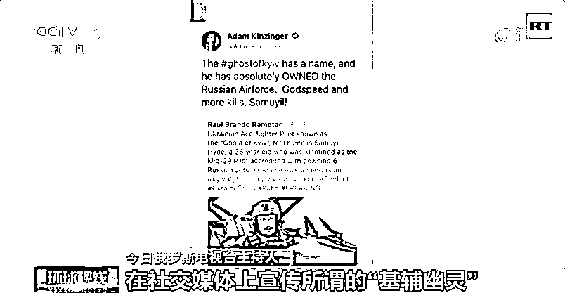
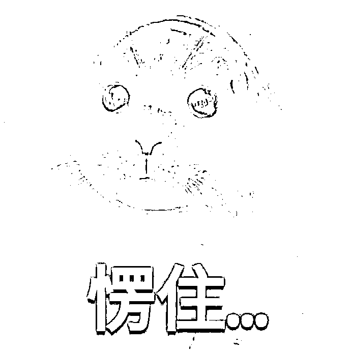
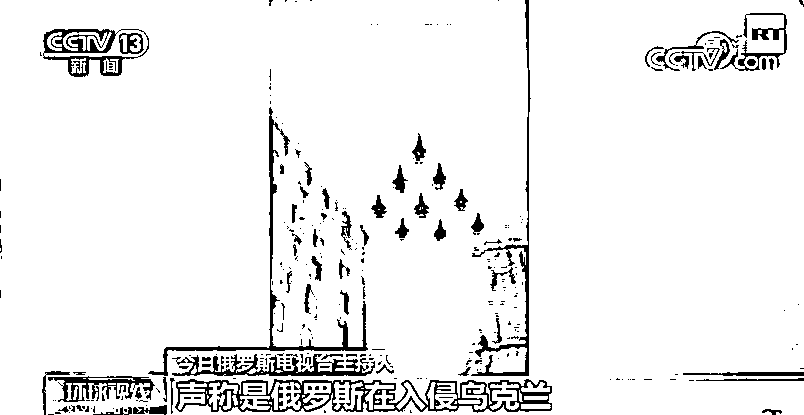
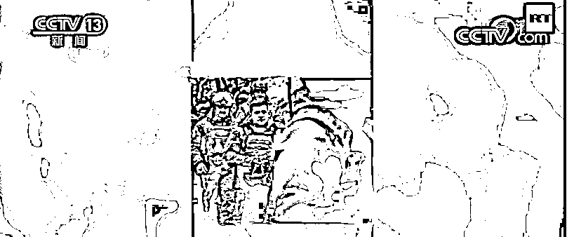
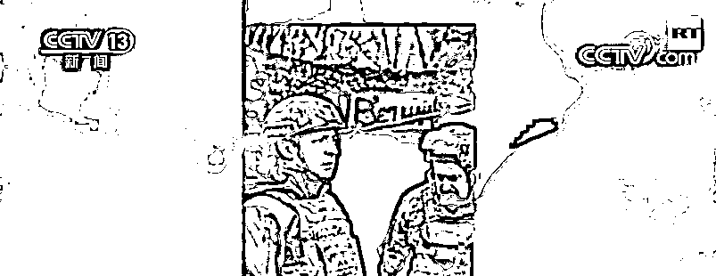
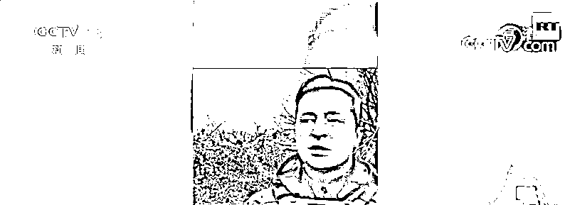
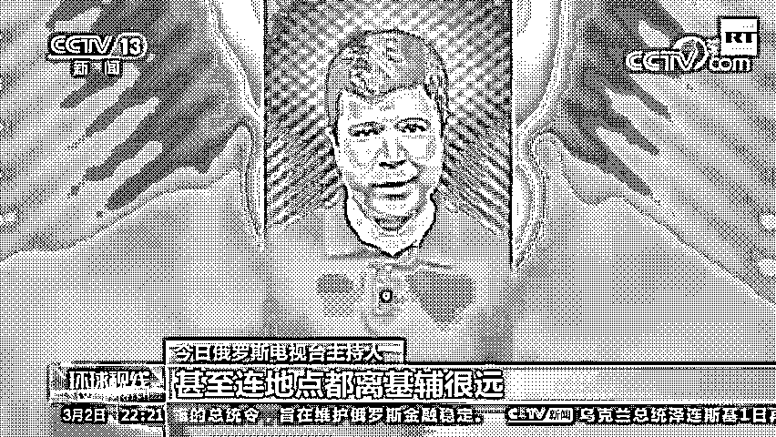

# 泽连斯基上前线？俄媒：假的！

> 原文：[`mp.weixin.qq.com/s?__biz=MzIyMDYwMTk0Mw==&mid=2247530847&idx=4&sn=5001401c63612f2f71be0cc8df26fa76&chksm=97cbb267a0bc3b7198dd65189c8b384a4940ad2d67f74970d24f62a233ddb0994651371e2cd1&scene=27#wechat_redirect`](http://mp.weixin.qq.com/s?__biz=MzIyMDYwMTk0Mw==&mid=2247530847&idx=4&sn=5001401c63612f2f71be0cc8df26fa76&chksm=97cbb267a0bc3b7198dd65189c8b384a4940ad2d67f74970d24f62a233ddb0994651371e2cd1&scene=27#wechat_redirect)

最近

俄方多次指责部分西方媒体和政客

**自从俄乌冲突以来**

**大打舆论战**

**释放假消息**

对此

今日俄罗斯电视台

3 月 2 日制作专题报道

对几个典型案例进行辟谣

**“基辅幽灵”？**

**美国国会议员亚当·金辛格
在社交媒体上宣传所谓的“基辅幽灵”——**
一名击落了 6 架俄战机的乌克兰王牌飞行员
金辛格说这位名叫萨穆伊尔·海德的飞行员
行动神速而且杀伤力超强

但不知道金辛格是真无知

还是“揣着明白装糊涂”

**图片上的人叫山姆·海德**

**是个美国喜剧演员**

当时在扮演一名飞行员

**俄战机在乌克兰上空？**

BBC“早餐”节目又用了这样一段画面
声称是“俄罗斯在入侵乌克兰”

但其实这是一段很久之前

俄军军演的彩排画面
地点在莫斯科附近

时间是 2020 年 5 月

**泽连斯基上前线？**

你应该还看过

几张乌克兰总统泽连斯基的图片

画面显示

他全副武装在阵地上和士兵交谈

**西方媒体声称**

**“这是泽连斯基在同俄军作战”**

但事实上这些图片是 2021 年 4 月 

**泽连斯基在乌克兰东部边境视察军队
甚至连地点都离基辅很远**

**俄装甲车撞平民汽车？**

下面这段恐怖的视频

居然被很多（西方）媒体形容为

“俄军的坦克在基辅故意撞对面的车辆”

但很多社交媒体上的网民发现
这并不是一辆俄罗斯坦克
而是一辆乌克兰装甲车
大家认为这大概率是一起意外事故 

还有网络上大量传播的

有关“俄罗斯轰炸乌克兰”的假画面

**实际上那些都是**

**北约轰炸南联盟、伊拉克等地的画面**

面对铺天盖地的消息

请大家冷静思考、理性分辨

警惕谣言，更要理性发言！

<mpvideosnap class="js_uneditable custom_select_card channels_iframe" data-pluginname="videosnap" data-id="export/UzFfAgtgekIEAQAAAAAAClEMwBwUnAAAAAstQy6ubaLX4KHWvLEZgBPE3aMIK1QHAqv8zNPgMItLZ-1kmsYTBA82JgJWH7JU" data-url="https://findermp.video.qq.com/251/20304/stodownload?encfilekey=rjD5jyTuFrIpZ2ibE8T7YmwgiahniaXswqzDP8gGoHfoSRX3LbNruLZRgnHkLLJjGOjtoUd1O0aCgQxRy0UnhkT47Ij9wrf52fY4R1mgVZbt71M0OBB2W7wrw&amp;adaptivelytrans=0&amp;bizid=1023&amp;dotrans=0&amp;hy=SH&amp;idx=1&amp;m=&amp;scene=0&amp;token=AxricY7RBHdUor7DVlnm60MxC0vQ7ib2QXxJibfMzvK5UQyIkeNN9FFQFGY1uYs6BIFwzjObSRRLkY" data-headimgurl="http://wx.qlogo.cn/finderhead/ibq4aVwOt6HNqrr8OD3sCviaytF3B8TqCwHicxsuIanAJo/0" data-username="v2_060000231003b20faec8c6e48a1acbd3ce04ef33b077a1e41d0d3794ed88ea537878dbe65910@finder" data-nickname="灰产圈+" data-desc="【#泽连斯基宣布成立由外籍人士组成的部队#】据央视新闻客户端 27 日报道，乌克兰总统泽连斯基 2 月 27 日宣布成立一支新的部队“乌克兰领土防卫国际战队”，由希望参与击退俄罗斯军队的外籍人士组成。#乌克兰@灰产圈+ " data-nonceid="3138322362752055221" data-type="video"></mpvideosnap>

来源：央视网（ID：cctvcomweixin），长安剑

← 向右滑动与灰产圈互动交流 →

