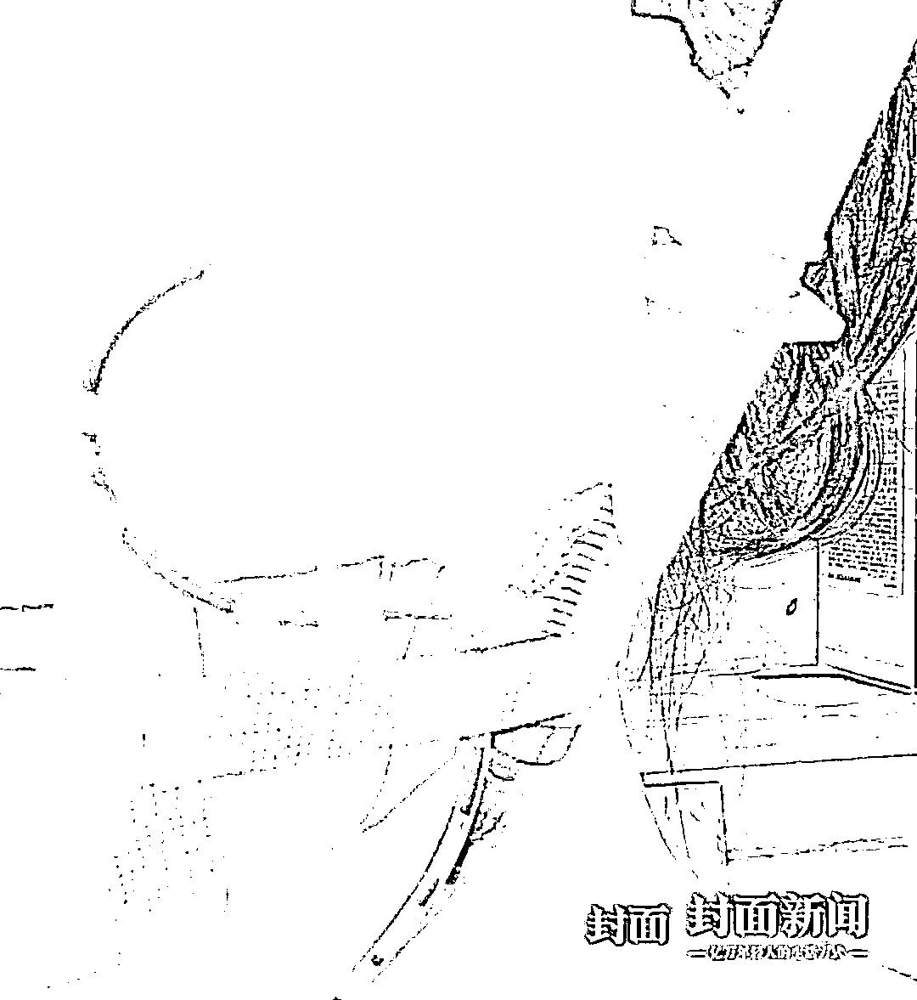

# 酒店开房当手术室！女生打瘦脸针后毁容：美容师已失联，警方介入调查

> 原文：[`mp.weixin.qq.com/s?__biz=MzIyMDYwMTk0Mw==&mid=2247530847&idx=6&sn=41220f0b137f9b2e549ab0e672965016&chksm=97cbb267a0bc3b7140fd7f46e5ab4adff2f0fa876c1ae4c358fe113db4f1993fbaad64f2af70&scene=27#wechat_redirect`](http://mp.weixin.qq.com/s?__biz=MzIyMDYwMTk0Mw==&mid=2247530847&idx=6&sn=41220f0b137f9b2e549ab0e672965016&chksm=97cbb267a0bc3b7140fd7f46e5ab4adff2f0fa876c1ae4c358fe113db4f1993fbaad64f2af70&scene=27#wechat_redirect)

小雯接受漫长而痛苦的治疗（受访者供图）

3 月 1 日，女生小雯再次联系大连市金州区卫生局和金州区公安局食药侦大队，询问失联美容师郭某的踪迹。

去年 5 月，小雯经朋友推荐微信认识了郭某，郭某自称是沈阳整形美容机构美容师。在郭某建议下，小雯和另外两名女生在大连某酒店开房作为整形手术室，郭某乘火车前来为她们注射了玻尿酸、溶骨针。

一个月后，小雯脸部肿胀不消并出现溃烂化脓。半年来辗转多家医院治疗，花费了 10 多万元仍未痊愈。治疗期间小雯陆续遇到 60 多名类似遭遇的女生，她们怀疑注射的针剂存在问题。

此时，小雯才发现自己对郭某几乎一无所知，不知道她是否有相关资质，不知道她所在的机构叫什么，在哪里营业，甚至不知道自己被注册的针剂是什么，来源是哪里。

**24 岁女生酒店开房当手术室**

**被网友注射瘦脸针后脸部溃烂出大洞**

“现在后悔死了，觉得自己太蠢了。”小雯已经半年多没敢自拍了，她的脸曾经化脓溃烂出大洞，治疗了几个月还是留下了伤疤和变形，这让爱美的她难以接受。

2021 年 5 月底，前同事小丽跟她聊天时说起一位美容师，声称多次在这位美容师手里做过微整形手术，“她说这个美容师在沈阳，外地顾客数量多的话也可以到外地上门服务。我和小丽以及小丽的姐姐，三个人拼单一起做，美容师愿意到大连来。”

在美容师郭某建议下，小雯在大连金州区一处公寓酒店开了一间房作为手术室。“她那天下午坐火车来的，3 点左右到酒店。在床上铺了一个布单子，从行李箱里拿出一些药剂、针管、手术钳，我们轮流躺上去让她给我们打针。还给一个人做了鼻子部位的线雕塑形，总共两个多小时就做完了。”

小雯说她以前没做过微整形，不知道做这些操作时要在无菌环境下进行，也不知道操作者需要提供什么资质。“郭某也没给我们看工作证，针剂的包装是外国文字，不知道叫什么，她只是说从西班牙进口的。现场做完，我们各自用支付宝转账给她，她就离开了。”

转账记录显示，小雯一共支付了 8900 元。“打了玻尿酸、溶骨针，我主要是想瘦脸。打完之后脸有点肿，她说是正常反应。过了一个月，已经开始化脓了，脸肿得很大。郭某在微信上说询问了厂家，可能是吸收不好，让我自己按摩揉开，还提供了一个中药方子，用玉米须泡茶喝。喝了一段时间还是不行，脸上已经溃烂出大洞了。”

小雯开始到医院就诊，被诊断为“非结核分支杆菌感染”，接受了清创手术。“医生用勺子一样的东西插到皮肤里，把烂肉刮出来。每次去换药，都是把纱布拆开，用棉签插到溃烂处清理，疼得人哭都哭不出来了。”

小雯说因为无法说明白当时注射的是什么药品，医生也无法判断具体病因，只是怀疑药品可能有问题。在多家医院辗转治疗期间，小雯又遇到了多个类似遭遇的病友。交流得知，她们都注射了同一种溶骨针。

**同款针剂已致 60 多人受害**

**受害人至今查不到针剂来源**

小雯注射的针剂外包装（受访者供图）

小雯所在的一个维权群里，有 60 多个群成员。她们说不清这款美容针剂的具体名称，只是口头以“溶骨针”“小红盒”“小蓝盒”称呼。她们在各地的整形机构注射了同款针剂，都出现不同程度的后遗症。

其中一些成员自称是整形从业者，在给顾客注射的同时自己也注射这种针剂，同样出现脸部结节或者溃烂。

一名整形从业者称，供货商发现出事已经跑路了，跑路前却又卖给她一批货，她也不知道这些针剂到底从哪来的。另一名受害者称，主治医生告诉她发生了病变，可能要终身服药。

封面新闻记者在多个社交平台搜索，有不少美容账号在推荐这款针剂，声称该针剂瘦脸效果好，安全无副作用。也有人发帖投诉称注射这款针剂后脸没有瘦下来，反而出现肿胀结节。

一位南京的受害者告诉封面新闻记者，她在一家整形机构注射这款溶骨针之后出现结节，目前还在协商解决，初步达成退费并赔偿 2 万元的协议。记者试图联系维权群其他成员了解情况，女生们则担心媒体介入被家人朋友知道，也担心惊动“厂商”，不利于索赔。

郭某自称受害者，让小雯走法律途径追责药商（受访者供图）

小雯介绍，她目前治疗费用已经花费 10 万余元，郭某通过支付宝陆续赔偿了她 4 万元后，表示自己也是受害者，是被推销针剂的人欺骗了，小雯如果维权的话要通过法律途径去追责药商，随后停用了微信。“我向大连市金州区卫生局和大连市公安局金州区分局食药侦大队投诉报案，才发现我只知道她的名字和身份证号，知道她是辽宁抚顺人。她所在的机构叫什么，药商是谁，我都不知道。”

当初的介绍人小丽表示，三年前郭某做微商卖衣服时自己添加了对方好友，之后看到她转行做整形，联系做过两次微整形，对郭某的情况并不熟悉。“我去沈阳打针，也是被她带到外边做的，或者是她来大连给我做。从来没去过她工作的地方，也不知道她工作的地方叫什么。”

**美容师失联 涉事机构无注册信息**

**警方已经介入调查**

郭某朋友圈截图（受访者供图）

封面新闻记者通过小雯、小丽提供的有限线索，搜索郭某朋友圈中“精訫微美”的机构名，并未搜到相关注册信息。多次拨打郭某的两个辽宁抚顺归属地的号码，一个显示为空号，另一个被设置成拒接陌生来电。

记者向这两个号码发送短信无人回复，在微信搜索两个号码都显示账号为空。之后，记者接到一个辽宁抚顺的陌生来电，一名女子声称看到有未接来电，回拨过来询问情况。记者询问她是否是郭某，该女子没承认也没否认，只是追问有什么事。听完记者介绍情况后，这名女子称自己不认识郭某，可能是回拨电话拨错了号码，随后挂断电话不再接听。

小雯的病友向她提供了一盒未注射完的针剂，通过翻译软件翻译药盒包装的文字，上边只有“骨溶剂液体”“5 毫升”以及生产日期、保质期等信息，没有生产单位、进出口信息。

3 月 2 日，金州公安分局食药侦大队杨警官告诉封面新闻记者，已接到小雯的报案，目前在外地出差，“这个事最好先通过卫生局追查解决。当然，我们也会积极跟进。”

金州区卫生局工作人员告诉封面新闻记者，小雯确实向他们投诉过这件事，但不方便向当事人之外的人介绍详细情况。

“工作人员告诉我，检测这个药剂需要我掏钱，要 8 万块钱。我对这方面也不懂，已经聘请了律师帮忙。”小雯说，这次事故已经对她的脸造成了不可逆的伤害，即便能追责，她的容貌也恢复不到以前的样子了。

来源：潇湘晨报，封面新闻

← 向右滑动与灰产圈互动交流 →

