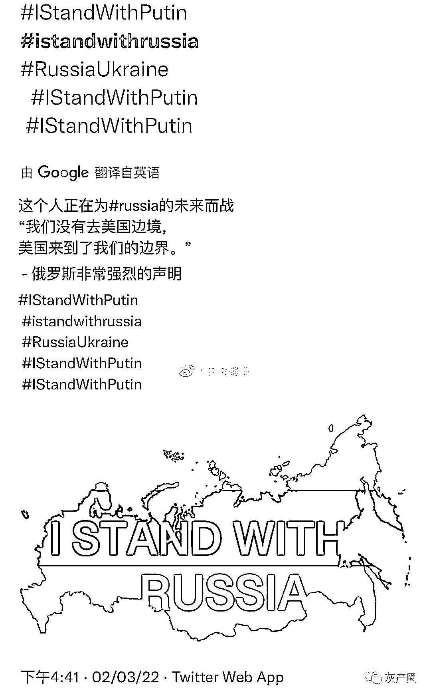
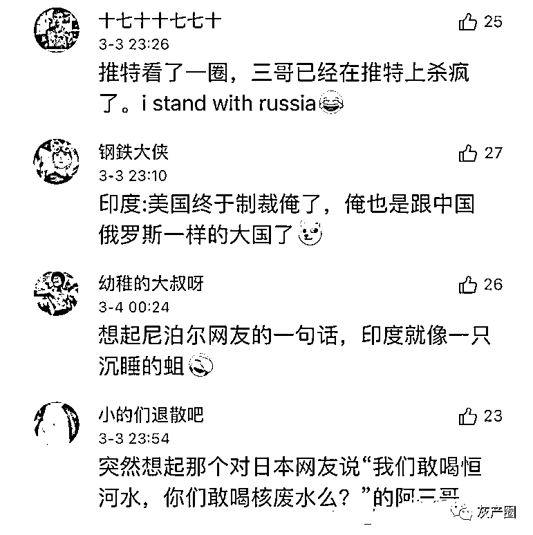

# 印度网友半路杀出力挺俄罗斯，骂得美国北约没脾气！稳坐“互联网五常”！

> 原文：[`mp.weixin.qq.com/s?__biz=MzIyMDYwMTk0Mw==&mid=2247530930&idx=1&sn=5903c084085e3df869e61aeb784235fa&chksm=97cbb28aa0bc3b9c3c51faf444b5f6b2e2b90cb239b2335a27b2413ff3d1d658ad895a9f8bf8&scene=27#wechat_redirect`](http://mp.weixin.qq.com/s?__biz=MzIyMDYwMTk0Mw==&mid=2247530930&idx=1&sn=5903c084085e3df869e61aeb784235fa&chksm=97cbb28aa0bc3b9c3c51faf444b5f6b2e2b90cb239b2335a27b2413ff3d1d658ad895a9f8bf8&scene=27#wechat_redirect)

前几天，泽连斯基说乌克兰发生战争，世界上最强大力量却在远处观望，乌克兰需要大国来主持公道！ 

印度表示，没错，世界上最强大的力量就是在下，我们不再沉默，不再观望，为世界主持公道来了！！！  

由于庞大的用户群，以及在各大互联网担任高管的印度人，印度在国际互联网的战斗力十分彪悍！

素有互联网五常上三常之称（油管五常：印度、韩国、土耳其、波兰、越南）

这几天印度网民在外网杀疯了！
在中国 14 亿网民没有参与，西方舆论机器全面开动，俄罗斯舆论全部掐灭的重重不利局面下，硬是让国际社交网络上支持普京和俄罗斯的声量超过了支持乌克兰。

印媒称很多推特用户打出了“我支持俄罗斯”（I stand with Russia）、“我支持普京”（I stand with Putin）的的 tag（热搜标签），其中绝大部分人都来自印度。 “我支持普京”等 tag 已经登上了 12 个国家及地区的推特热门趋势，其中全球榜为第 25 名，印度榜第 1 名。今天（3 日），这一 tag 还“杀”进了西方国家的推特趋势，高居美国榜第 2 名，澳大利亚榜第 3 名，英国榜第 8 名，加拿大第 9 名。

  在国际社交网站上，印度网民常常被戏称为网络世界五常之首，由于人口数量优势，又会英语，印度网民往往口吐芬芳，东征西讨，以洪水般的铺天盖地席卷之势吊打各种网络舆论。

亚洲之耻---日本犹如跳梁小丑，结果被印度网友一剑封喉，让日本这个黄种人中的垃圾彻底闭嘴！

俄罗斯也补了日本一刀 

俄罗斯驻日使馆毫不客气地指出：日本在不到 100 年的时间里两次支持纳粹政权。

印度网友主要替毛子解决有气不能撒的问题，中国网友主要替毛子解决有货不能卖的问题。

在毛子不能倒这个大问题上，无论出于什么，两国网友都达成了初步但空前的共识。

中印网友第一次这么和谐，都挂着五星红旗

美国也不是大度的人，在印度在联合国关于俄罗斯问题的两次投票中连续投下弃权票后，美国考虑对印度实施制裁 

印度网友表示很兴奋 

尽管美国宣称考虑是否制裁印度更多的是谈判筹码，但有印度网友希望美国真正实施制裁，这样就能和俄罗斯更紧密合作，还能迫使印度修补和中国的关系

* * *

暗夜沉浮易水纵横：真厉害，印度绝了哈哈哈，如果中国没有墙，不会被封号，这场战斗绝对是碾压性存在的，中国和印度和巴基斯坦联合起来直接占世界人口一半了，像中国网友这么强悍的战斗力，哪轮得到霉国和🐶发表意见。

乖乖风儿:互联网五常，不会被封号随便浪只要不出声，阿三的英文就是无比顺畅

阿士匹灵-7:因为阿三民族自信心爆表，一直觉得印度是宇宙第一，不接受反驳的那种，不像我国那么多软骨病天天中国吃早药丸

LR-局外人:印度在外网骂战的战斗力，哪管三七二十一，有问题必是你的问题，有错误必非我的错误，哪像我们，话还没说两句就有一堆二鬼子跪下反思

来源：微博那些事儿

← 向右滑动与灰产圈互动交流 →

