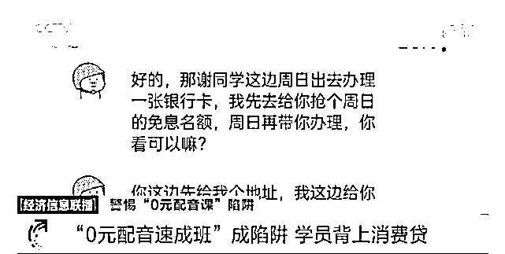
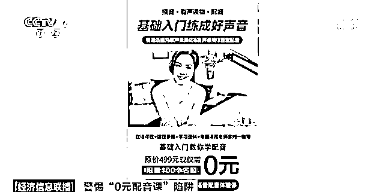
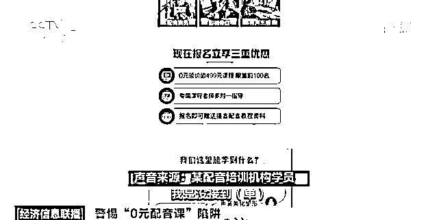
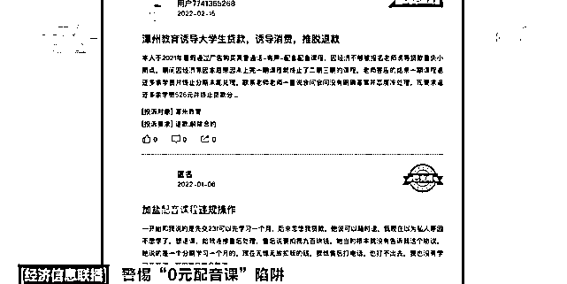
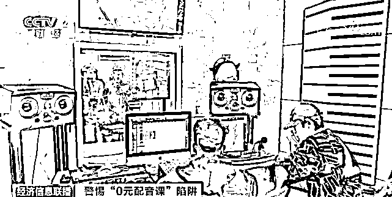

# "0 元配音速成班"?

> 原文：[`mp.weixin.qq.com/s?__biz=MzIyMDYwMTk0Mw==&mid=2247530930&idx=5&sn=720b807568977807fe00ecf6049d03cf&chksm=97cbb28aa0bc3b9c0c3296e82e618fbc710014cf8f112f13815d1c18f5e7f10b6d9496c12123&scene=27#wechat_redirect`](http://mp.weixin.qq.com/s?__biz=MzIyMDYwMTk0Mw==&mid=2247530930&idx=5&sn=720b807568977807fe00ecf6049d03cf&chksm=97cbb28aa0bc3b9c0c3296e82e618fbc710014cf8f112f13815d1c18f5e7f10b6d9496c12123&scene=27#wechat_redirect)

[`v.qq.com/iframe/preview.html?width=500&height=375&auto=0&vid=z3326fb4nt9`](https://v.qq.com/iframe/preview.html?width=500&height=375&auto=0&vid=z3326fb4nt9)

近年来，随着影视，动漫，游戏产业的快速发展，一些社交平台出现了大量的关于配音兼职的广告，这些广告宣称：“普通人经过学习就可以靠一部手机来配音赚钱，低门槛，高收入...”，但是呢，在这个诱人的广告背后，却存在着诱导贷款退费难等等问题。

刚满 18 岁的小谢是一位大学生，原本想在空闲时间做一些兼职来勤工俭学，看到网络上招配音兼职，觉得很合适自己，与该机构联系后得知，如果做配音兼职，每月会有 5000 元左右的收入，还承诺 0 元就可以上公开课学习配音。

受骗人小谢说：“听完（配音公开课）之后他就给我发微信说还有一个课程，就是 5000（元）的，兼职的话要先上他们那个课程，然后才能接单，他当时弄了教育分期免息，但是我不知道那个是一个贷款，他给我弄了一个假身份。”

小谢在没有上课的情况下就被扣了第一笔贷款，她告诉记者，自己上当后非常担心，多次联系培训机构的老师无果，也不敢告诉家里人，记者在调查中发现，像小谢一样有着同样遭遇的都是一些想要兼职，又觉得配音门槛不高，可以轻松赚钱的年轻人。

受骗人汪女士说：“给我报那个配音班说的要交那个 5880（元）就相当于分期交，就要弄贷款类的东西，中间有好几次我说我不要弄（贷款）了，他后来和我说你必须先弄了，我才能给你退款，然后我就按照他所有的要求，把所有的东西都填了之后，第二天（培训机构）就说你要是这边违约的话就要付违约金。”

记者打开网页和一些 App 搜索关键字配音培训发现，很多广告都写有 0 元学习或者结束课程后能配音兼职赚钱的标语。

某配音培训机构学员称：“我是没接到（单），（后来）把群退了！”

近期，在黑猫投诉平台上，关于配音培训的投诉有 749 条，主要都是关于诱导贷款，收款后不上课，退款难等问题。

那么，兼职配音员真的可以速成吗？如果遇到了 0 元配音等消费陷阱，消费者又应该如何来维权呢？继续来看！

业内人士告诉记者，如果说在短时间之内成为一名职业的，可以接单的配音员的话，几乎是不可能的，从事配音工作需要专业学习使用专业设备，并非毫无门槛，非科班出身的新人接到兼职的工作也并不容易。

中影人教育播音主持艺术专业教师李宝对此表示：“因为现在配音圈现在还没有形成一个常规的一种教育体系，语言的修炼是一个比较长期的过程，（0 元配音培训）让人产生一种短时间之内掌握配音的，这样的一个能力的冲动消费的状态，然后就落入了虚假宣传的圈套。”

针对一些培训机构广告中存在的 0 元学包接单和学习期间贷款服务等承诺，记者也咨询了相关律师。

北京市律师协会消费者权益法律专业委员会主任芦云对此称：“由于是以低价作为诱导，甚至说是 0 元作为诱导。那么对于这种虚假宣传行为，广告法是有明确的罚则的，除了需要承担这个相应的行政责任之外，还有可能去对这个消费者去承担一个民事的欺诈的责任，那么按照消法的五十五条的规定，要承担一个退一赔三，这是由于他的虚假宣传的行为。”

针对于培训机构提供的消费贷，芦律师表示，消费者要警惕可能产生的征信问题和还款压力。

芦律师说：“它对个人的征信会产生一个长远的影响，以及还不了款之后，又会产生类似于这种服务费，推荐费等问题。” 

来源：央视财经

← 向右滑动与灰产圈互动交流 →

