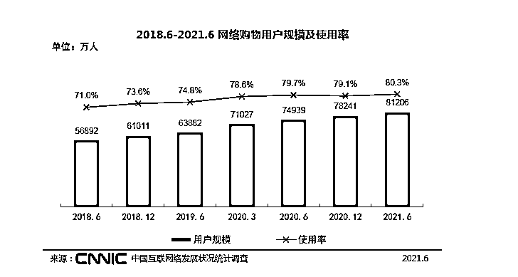
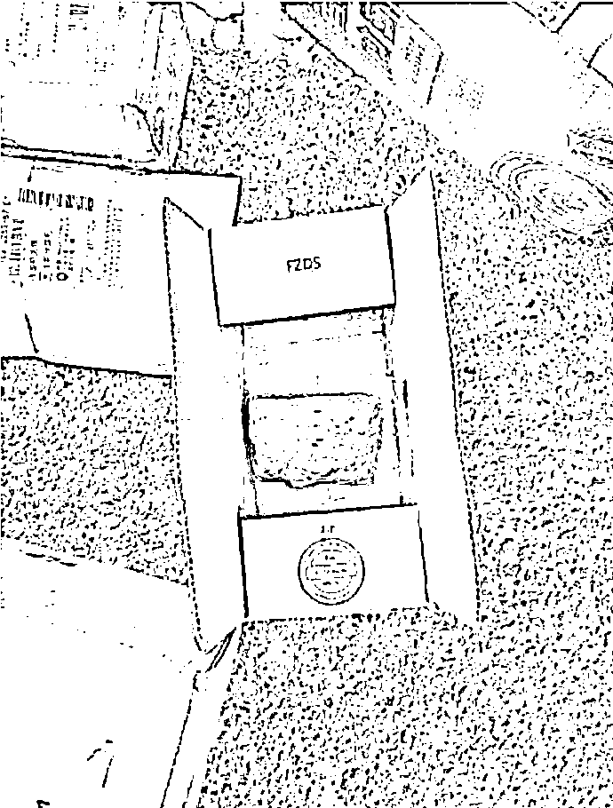
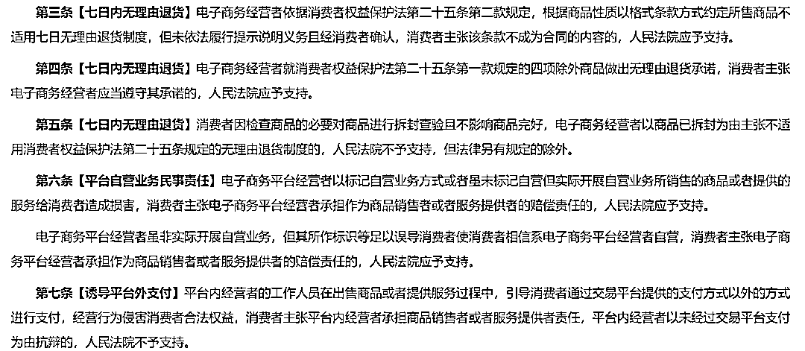

# 这些交易纠纷的背后，是披着羊皮的诈骗

> 原文：[`mp.weixin.qq.com/s?__biz=MzIyMDYwMTk0Mw==&mid=2247530930&idx=6&sn=b4d2424b970b6ff387fd33c4ab1c3cc4&chksm=97cbb28aa0bc3b9c163096027dc58e6dd6bcf76115f6a07bb06d71b6240e4770a0c3c14ebf23&scene=27#wechat_redirect`](http://mp.weixin.qq.com/s?__biz=MzIyMDYwMTk0Mw==&mid=2247530930&idx=6&sn=b4d2424b970b6ff387fd33c4ab1c3cc4&chksm=97cbb28aa0bc3b9c163096027dc58e6dd6bcf76115f6a07bb06d71b6240e4770a0c3c14ebf23&scene=27#wechat_redirect)

提到电信网络诈骗，人们脑海里浮现的往往是那种躲在东南亚，操着“冒充公检法”“杀猪盘”等各种话术坑蒙拐骗，得手后立马逃之夭夭的形象。

然而，根据鹅师傅的研究，发生在买卖过程中的交易诈骗在整个诈骗大盘中依然“名列前茅”，占比很高，而且被害人群分布极为广泛，属于高发多发的“全民适用”型电信网络诈骗类型。

所谓“交易诈骗”，是在商品交易过程中或以提供非法业务为由，通过不发货、不付款或诱导扫描付款码、点击钓鱼链接等方式实施的诈骗。这种诈骗为何如此受诈骗分子青睐？

据 CNNIC 第 48 次《中国互联网络发展状况统计报告》，截至 2021 年 6 月，我国网络购物用户规模达 8 .12 亿，较 2020 年 12 月增长 2965 万，占网民整体的 80.3%。

（来源：CNNIC 中国互联网络发展状况统计报告）

随着网络交易的兴起和蓬勃发展，买卖双方天涯两隔，信息的不对称以及履约上的时间差，使得诈骗团伙有了可乘之机。诈骗分子针对不同类型的网络购物人群和场景，衍生出更加多变的话术和手法，以致于交易诈骗占比居高不下、连年攀升。

同时，不法分子也开始规避法律和加强对抗，传统交易诈骗逐渐喜欢给自己穿上“纠纷”的外衣，善于以“买卖矛盾”掩盖“诈骗”本质，以“商品质量纷争”掩盖非法占有的目的，令人真假难辨。

下面，鹅师傅就来给大家盘一盘交易诈骗有哪些常见的手法？在打击重拳的夹缝中又是如何打着“交易纠纷”的幌子负隅顽抗？我们又该如何练就一双慧眼来识别区分“诈骗”与“纠纷”？

***1***

**交易诈骗的常见手法场景**

鹅师傅以购买手机为例，带大家走一遍网络购物可能遭遇诈骗的几大“凶险”场景。**（一）违背约定：支付货款后，手机不发货；或收到手机后，不付款。**
这一类诈骗极其常见，而且不乏有搭建平台大范围诈骗的情况。根据吉林省榆树市人民法院(2021)吉 0182 刑初 434 号判决书显示，李伟等人以搭建的“百民商城”、“京淘商城”平台为依托，诱骗被害人在网络商城内充值，被害人在商场购物后，却不发货或给少数顾客发与实际价值严重不符的商品。2020 年 10 月 16 日至 2021 年 05 月 07 日，引诱被害人充某资金流水共计人民币 868963.00 元。**（二）物品差异：买了手机，收到砖头**收到的商品与事先购买的商品差别较大，如购买衣服收到破旧衣服、邮寄空包裹、购买手机收到手机壳等。买“苹果”收到“砖头”的诈骗耳熟能详，但你可能想不到的是还有卖家被买家诈骗的情况，明明收到“苹果”，硬说收到“砖头”。根据河南省郑州市管城回族区人民法院（2020）豫 0104 刑初 534 号刑事判决书记载，被告人牛永娇通过某二手交易 APP 以 7510 元向陈某买了一部苹果手机。牛永娇收到手机后，谎称其收到是一块砖头而非手机，要求陈某退款。陈某无奈，只能退款。陈某后又向河南省某快递公司申请得到赔偿款人民币 7510 元。可见，交易诈骗中，诈骗者并不一定是卖家，还有可能是狡猾的买家。**（三） 交易托儿：“不是说好这批手机可以卖出去的吗？”**这一种玩法高端一些，但也更加残忍。骗子先伪装卖家，找受害人做中间商代理，许诺大量购买可以赚取差价，受害人同意后，骗子又伪装买家，找受害人批发，其实买家卖家是同一团伙，受害者付钱进货后，买家再在平台退款，完成诈骗。**（四） 虚假代购：一次购买两次付款**受害人让骗子网上代购，骗子向受害人展示订单情况后，要求受害人向骗子支付费用，实际快递是货到付款需要受害人再付一次钱，受害人因此被骗。1、付款抢购：666 元即有机会购买手机
骗子宣传最低优惠价购买手机，如先以 666 元优惠诱导用户付款购买，用户付款购买后，又告知 666 元只是抢购发货名额，故意误导用户把 666 元抢购名额费错当成商品价格，实质是付抢购费后，还要求支付尾款，用户不付款则表示不会退款。2、虚假退货：手机退货还要交保证金
受害人在网上购买了手机，以货到付款的方式支付，收完货后发现手机无法使用，联系对方咨询。卖家表示发错货，受害人退回手机后要求对方退款，对方以公司要求交保证金才可退款，并表示保证金只是走流程，马上就会退回，让受害人支付资金，以进行诈骗。**（七）钓鱼退款：退款也要激活费**受害人向骗子购买手机，通过对方提供的二维码进行付款，第一次扫码受害人付款成功，但是骗子谎称系统问题未下单成功，让受害人再次扫码付款，并表示之前的钱会退回。受害人察觉异常要求退款时，骗子又要求扫码支付激活费才可退款，并提供虚假退款链接收集受害人的身份证，银行卡密码等隐私信息。以上的诈骗的手法都是换汤不换药，巧妙利用双方信息差、时间差，以见不到对方和商品为条件，制造了一次又一次诈骗。这种诈骗中，非法占有受骗者财产的目的十分明显，在定性和打击上通常不存在障碍，直接定为刑事意义上的“诈骗”，小额的要对其进行行政拘留、罚款，达到一定数额的需要承担刑事责任。但这种操作的风险对于诈骗团伙而言非常大，一抓一个准，一不留神就进去了，于是他们开始巧妙地选择一种全新的包装方式。

***2***

**交易诈骗与纠纷掺杂的挑战**

如今，交易诈骗变得更为复杂，诈骗分子的对抗和法律规避意识更强，为了使得自己“非法占有”的目的不那么明显，诈骗分子开始逐渐抛弃简单粗暴的“收钱不发货”“收货不付款”等做法，而是更加青睐于采取以假充真、以次充好的方式，如提供与宣传情况严重不符的服饰、保健品；用假货冒充进口货物、高档货物；将普通宠物伪装成名贵宠物；提供虚假服务等，情形复杂多样。而且，诈骗分子在得手后，不仅不会立即拉黑对方、携款潜逃，而是继续假装与受害人、平台积极沟通，实则虚与委蛇，进一步掩盖其非法占有目的。只要不露出“非法占有”的马脚，定位为纠纷的几率就很大。如果定位为“纠纷”，意味着受骗者有苦说不出，明明感觉是自己被骗了，对方咋还在和自己平等协商呢？诈骗分子伪造交易外观、刻意制造纠纷的做法，模糊了交易诈骗和纠纷的区分边界，不仅让受骗人有苦难言，而且在有限的证据面前，面对交易双方的各执一词，网络平台也着实左右为难、真假难辨，平台的审核难度大大增加。特别是在服饰、游戏等交易数量大、涉案金额小的领域，区分交易诈骗和交易纠纷显得更加困难。如何准确辨别交易诈骗与交易纠纷，不仅网络平台面临很大挑战，就是司法机关，在办理此类案件时，往往也难度不小。如，（2018）最高法刑再 6 号赵某某涉嫌诈骗罪一案，买卖双方在是否付清货款问题上发生争议，产生纠纷。一审法院认为有关证据不能证明赵某某具有诈骗的主观故意，宣告赵某某无罪。二审法院认定赵某某犯诈骗罪，判处有期徒刑 5 年，并处罚金 20 万元。二审宣判后，赵某某申诉。中院、高院认为，原二审判决认定赵某某的行为构成诈骗罪并无不当，驳回申诉。最后，案件申诉至最高人民法院，最高人民法院再审审理后再次宣告赵某某无罪。案件审理从基层法院一直到了最高法院，耗时久远，且经历多次改判，定性难度之大，可想而知。

***3***

**如何辨别**

鹅师傅先跟大伙分析几个案例，再给大家提点建议：**1、吹嘘商品价值的程度大小**

**诈骗罪**

被告人陈纪敏将假货毛主席金像玉玺青石工艺品、中华武印青石工艺品高价销售给被害人，将价格低廉的第一二三套人民币纪念大全（印刷品）**宣扬成有巨大升值、保值空间的珍藏品**，甚至直接称纪念大全为真币，高价销售给被害人，从被害人处骗取合计人民币 370 万余元的钱财。
——浙江省永嘉县人民法院刑事判决书（2015）温永刑初字第 47 号

**无罪，也不构成民事欺诈**

被告在其网店展示页面宣称的“销量冠军”、“大量现货 23 时前付款当天发”、“索尼 Z3 钢化膜仅限今天拍下即送”等信息，只是一种促销的宣传手段和广告语，无欺诈的目的，**且不足以令消费者作出错误购买的意思表示，因此不能认定为欺诈**。
——浙江省宁波市中级人民法院民事判决书（2015）浙甬民二终字第 707 号

**小结**

涉案人员所用话术内容引起被害人错误认识，作出错误判断，并基于错误判断作出错误处分，才有可能构成诈骗罪。如果只是一种促销的宣传手段和广告语，不足以令消费者作出错误购买的意思表示，民事欺诈也较难成立。**2、履行合同的能力高低**

**诈骗罪**

被告人王爽称其手上有“五粮液”可以销售给被害人龚某，双方遂约定由被告人王爽以 770 元/瓶的价格向龚某提供 150 件“水晶”五粮液，龚某随即转 693000 元至王爽账户。王爽**收款后未落实货源、设法履行合同**，反而将被害人所付货款用于偿还其个人欠款...**前述行为表明王爽既无履行合同的能力，亦无承担责任的意愿。**
——四川省成都市中级人民法院刑事裁定书（2021）川 01 刑终 839 号

**小结**

判断是否具有“非法占有”的故意以行为主体取得财物时履约能力有无为基本出发点。**3、诈骗内容程度**
同样是贩卖规格不一致的苹果手机，诈骗内容程度也会影响二者的判定。

**诈骗罪**

被告人万忠洋通过社交软件发布大量售卖知名品牌手机的虚假广告，吸引被害人下单。被害人付款后，被告人万忠洋则**低价从二手交易平台购买低档电子产品快递给被害人，以次充好**。被告人万忠洋采取上述手段共骗取被害人人民币共计**40850 元****。例如：在诱骗被害人王某支付人民币 4250 元购买一台 iphone12 后，花费人民币 325 元从电商平台购买一台 iphone7,以次充好，快递给被害人。**
——江苏省淮安市清江浦区人民法院刑事判决书(2021)苏 0812 刑初 345 号

**民事欺诈**

原告额尔登在网店（某某数码店）购买 iPhone11ProMAX6.5 寸全新美版无锁国行双卡（绿色）512GB，价格共计 7540 元。收到手机后，经查询，涉案手机是 iPhone11ProMAX64GB。法院认为，被告承诺“原装正品 512GB”，而原告收到的手机内存在苹果官网查询的结果显然不符合产品描述，被告存在**以假充真欺诈消费者的行为，原告要求其进行三倍赔偿**，于法有据，本院予以支持。
——呼和浩特市新城区人民法院民事判决书（2020）内 0102 民初 4883 号

**小结**

诈骗内容程度亦可以影响二者的判定，这主要是从社会危害性的角度出发，可以体现于具体的金额、盈利情况以及交易频率中。在上述的二手交易平台转卖案中，被告人连续多次实施该种行为，且通过盈利金额判断这并非正常的交易行为，而在某数码店案中，店铺仅仅单次实施该种行为，且宣传的商品和用于欺诈的商品价格差异不大，“非法占有”的恶意难以判断。**总结****在交易活动中，诈骗与纠纷的实质界限在于行为人是否通过虚假事实来骗取他人财物，并具有严重的社会危害性。****客观上要求行为人有虚构事实、隐瞒真相的行为，并且被害人基于此产生错误认识而处分了财产。****而主观上要求行为人存在**非法占有的目的，这是区分诈骗与纠纷的关键界限，也是查证的主要难点。非法占有目的的判断，属于行为人主观心理事实认定的范畴，应坚持主客观相一致的原则，结合案件的客观事实来综合判定，**以行为人当时履约能力的有无为基本出发点**，结合**诈骗内容程度、履约行为、无法履约根本原因、对财物取得后处置情况、事后态度、损失挽回以及作案次数**等外化行为要素进行事实推定。特别是在行为人事后刻意伪装的情况下，更应综合多方面的客观事实去伪存真，不可偏听偏信其一。

***4***

**感觉被骗，该怎么办？**

交易诈骗虽然发生频率高，但诈骗的金额往往不大，少则几十、几百元 ，多也往往不超万元，再加上受害人自己搞不清是诈骗还是纠纷，往往就选择多一事不如少一事，自己吃亏算了，事情也就不了了之。在这里，鹅师傅还是要再次提醒大家，事有蹊跷要及时报警！是诈骗还是纠纷，司法机关会给出准确的判断，自认倒霉不仅会错失挽回经济损失的时机，更严重的是会让这些诈骗分子更加肆无忌惮地为非作歹。打击电信网络诈骗，需要全民参与，谁也不能置身事外而求独善其身。2021 年 12 月 27 日，最高人民法院发布《关于审理网络消费纠纷案件适用法律若干问题的规定（一）》（征求意见稿），向社会公开征求意见。草案中对【七日无理由退货】【诱导平台外支付】等问题作了进一步有利于消费者的规定。以后，不管是诈骗分子还是无良商家，想打着这些名义制造纠纷或者纠纷假象来骗取钱财，可能也没那么容易了。

***5***

**防范交易诈骗的建议**

被骗后，受骗者不只是钱包疼，还有心痛。据有关研究，超五成受害者患“网络被骗后遗症”，对网络内容及网友持有怀疑态度；三成受害者尽量避免使用网上支付。被骗后，有超过二成的受害者需要半年及以上的时间来平复心情。**为了守护心灵，保卫钱包，远离新型交易诈骗，鹅师傅建议大家：**1. 选择正规平台，远离路边小贩 2\. 付钱必走平台，绝不直接转账 3\. 仔细核对商品，保留商家承诺 4. 如果怀疑被骗，维权紧追不舍谨记：求助于人是强者的表现，遇到诈骗请拨“110”或者在国家反诈中心 APP 直接报案！

← 向右滑动与灰产圈互动交流 →

