# 又一“铁笼女”曝光：比丰县小花梅还惨…

> 原文：[`mp.weixin.qq.com/s?__biz=MzIyMDYwMTk0Mw==&mid=2247531021&idx=1&sn=19e430a990571c6adbbf9d3bc8170965&chksm=97cbb135a0bc38237e751d12bc2ba6c1b0ac6e1176e13c00c563d47d4ced8db961d76c18cc01&scene=27#wechat_redirect`](http://mp.weixin.qq.com/s?__biz=MzIyMDYwMTk0Mw==&mid=2247531021&idx=1&sn=19e430a990571c6adbbf9d3bc8170965&chksm=97cbb135a0bc38237e751d12bc2ba6c1b0ac6e1176e13c00c563d47d4ced8db961d76c18cc01&scene=27#wechat_redirect)

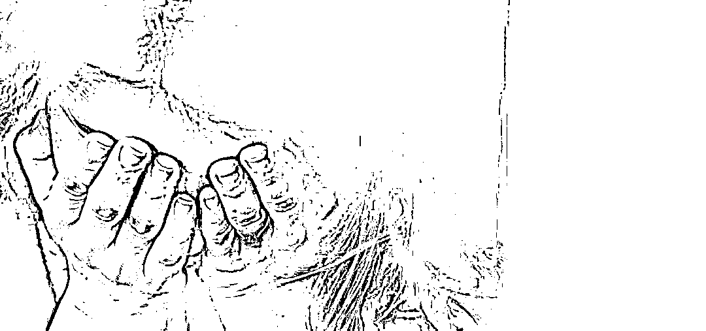

在人渣的眼里，人命如畜，骨肉之亲，如同稻草。

持续了一个月的“铁链女”事件，还在人心之中意难平，陕西榆林佳县疑似惊现“铁笼女”，让人心又一次在性奴、残暴的愤怒里，难以自拔。

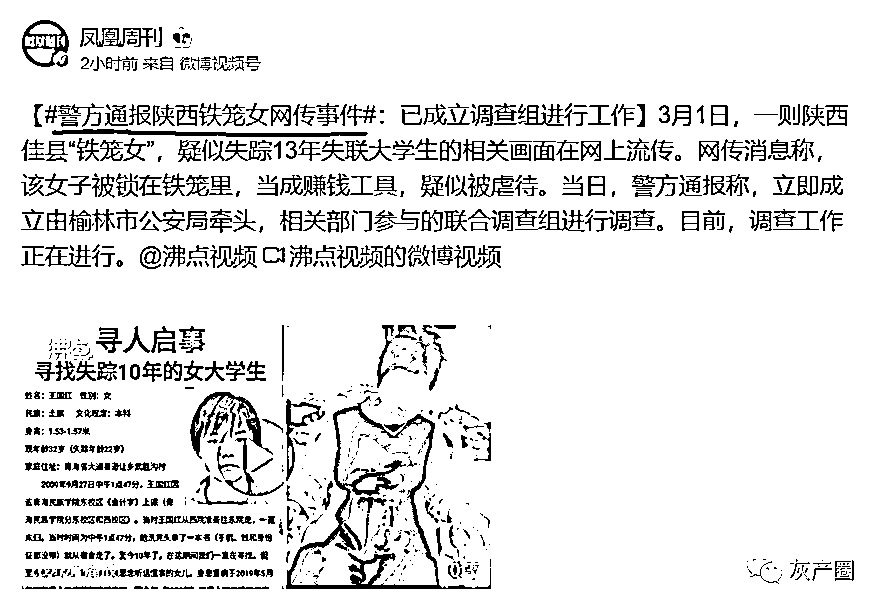

一位女子被关在大铁笼了，眼圈红肿，目光呆滞，手上有伤疤，小腿上有勒痕，脚掌有大面积被烫的伤疤，疑似精神失常，铁笼上边有一把大锁。

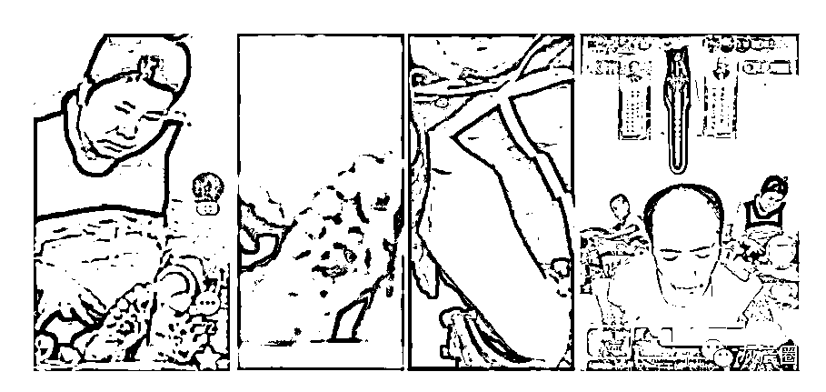

“铁笼女”顾名思义，关在铁笼里，被虐待，沦为赚钱工具。拿来比较就让人生理不适，但说句实话，把人关在铁笼子里，比在人脖子上系根铁链，更恐怖。这种不把人当人的糟蹋性行为，就像外星人在研究人类一样残忍。

她的“丈夫”叫李利民，无业，目前已是快手平台里拥有近十万粉丝的网红主播，快手 ID：904949992，用户名：“我是李奇峰”，此人在直播间有意无意暴露了很多他与“铁笼女”的猛料。

在视频中，李利民管“铁笼女”叫小雨，据说也是“捡”来的，名字是李利民取的，原名也不知道叫什么。网民通过快手视频比对，发现李利民至少比铁笼女大 20 岁。

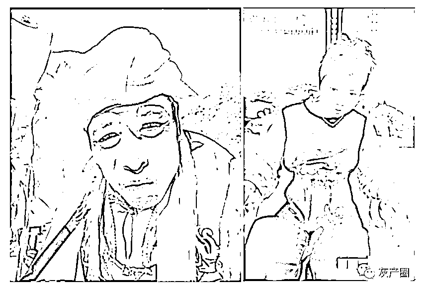

李利民在直播时为吸引眼球自己爆料：2009 年与之同居来路不明的女子小雨，曾多次试图逃跑，他毒打小雨以及用铁笼关押手段对付小雨等等。

结合多位爱心人士的反馈，李利民数次在直播间透露了虐待小雨的言论，说小雨是他捡来的，刚捡回来的时候，他把小雨绑在凳子上三天三夜。

李某民还说，自己把神经错乱的小雨关在后山一个山洞。小雨多次想从山洞逃跑，都没有成功。小雨不听话，他就打小雨，并且想各种办法控制她。为了防止小雨逃跑，李某民还在自己的三轮车上焊了一个巨大的铁笼，出门时把小雨锁在里面。

靠着这些内容，李某民很快积攒了七八万的粉丝。

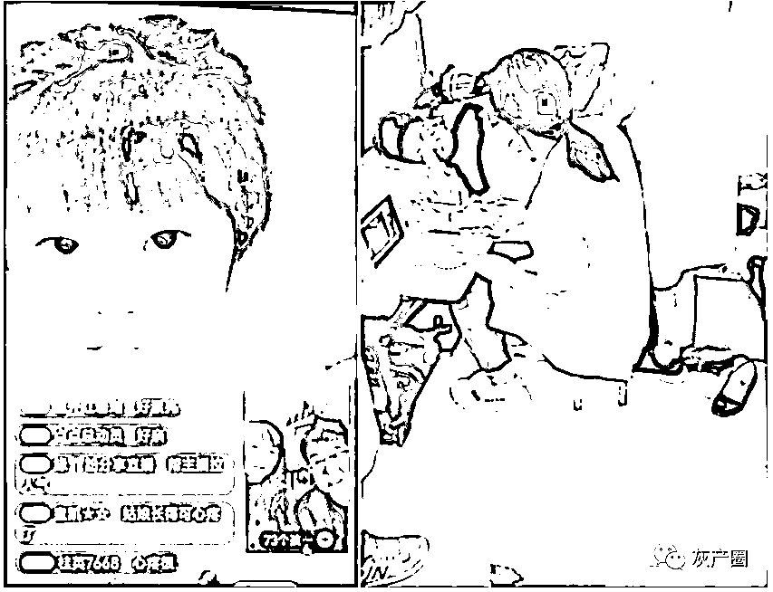

此外，李利民还亲口炫耀：小雨为他生有一子一女，儿子叫李之龙，2012 年 11 月 3 日生，女儿 2015 年 5 月 25 日生下后以三万元的价格卖给了邻村。

除以上儿女，爱心人士的资料里还披露：有一次小雨怀孕后，不知什么原因孩子流产了，流掉的胎儿胚胎，李利民竟然用玻璃瓶子装上放在房子里，这是多么变态恐怖。

李利民在直播时还展示了他托人给小雨上的户口，户口本上记载：唐小 X，出生年月日：1975 年 5 月 5 日，身份证号码：612729197505051523，高中文化，上户口的时间是：2019 年 5 月 8 日，与李利民的关系是夫妻。

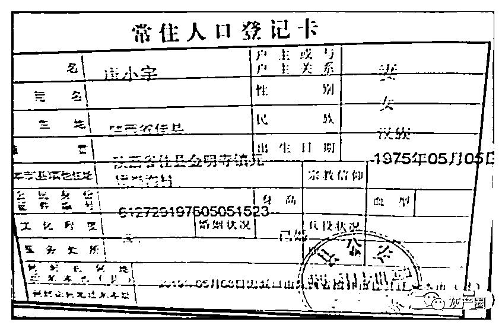

据当地志愿者透露，昨天，李某民在家中直播时，警方进入他家中将其带走。

据了解，该事件的地点为榆林市佳县金明寺镇的元团峁沟村。

今天上午，记者联系了陕西佳县有关部门。

金明寺镇政府有关人士说，“目前，市公安局已经就事件进行调查，镇政府做配合，成立了联合调查组。有进一步具体情况，佳县宣传部门会发布。”

佳县公安局工作人员表示，“这个正在调查中，我们已经成立专案组，后续以官方通报为主。”

佳县政府办的回复如出一辙，“目前成立调查组在调查。”

目前，随着舆论发酵，平台已将该李利民账号封禁。

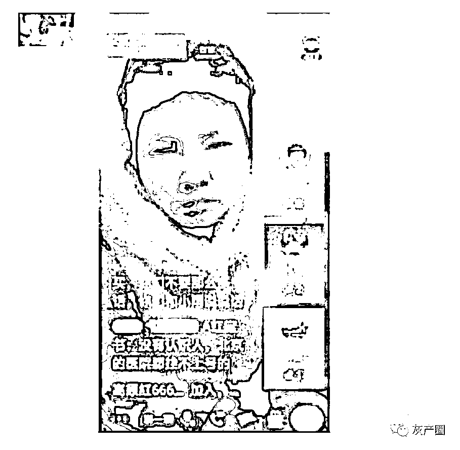

此事件尚未有明确结论。但无外乎两种可能：一种可能是李某民为了流量不择手段，刻意夸大甚至虚构某些事实，“铁笼女”是他自己编出来的。另外一种可能就是事情确实如他所说，“铁笼女”所遭遇的是真实发生的。

现在看，这种情况可能性要高于前者，因为直播中李某民展现的一些内容印证了自己的说法。

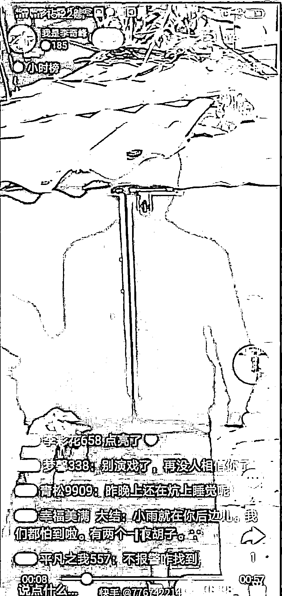

令人觉得不可思议的是，李利民现在名利双收。同丰县董某一样，李利民不仅有政府救助和盖房，还获得了大量捐助。

政府帮李利民建的房子单独在一座山的山头上，四周无一户人家。李利民在房子四周建有高墙铁丝网，房顶上边架设了摄像头，可以监视一切过往之人，房子窗户上有密密的钢筋，这些李利民在直播间均有展示。

最奇葩的是李利民有两个孩子，但当地政府给他们发了独生子女证，还颁发了“光荣之家”证书。

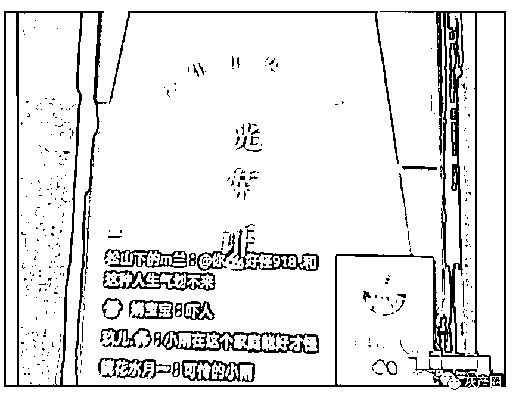

李利民还在快手中炫耀：“家里有亲戚在佳县当领导，家族在陕西省里有人，青海也有，北京也有。”

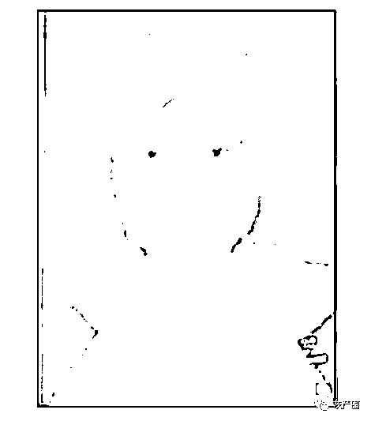

爱心志愿者反映，铁笼女可能是 2009 年失踪的青海省民族大学女大学生王国红。

在宝贝回家寻亲网站上，橙柿互动检索到王某红的具体身份信息。

王某红，身高：156CM（约），出生日期 1988 年 6 月 20 日（农历）。圆脸型，发质好，单眼皮，眼睛不大，嘴唇薄，嘴角有点下垂。失踪时间 2009 年 9 月 27 日，失踪地点为青海省西宁市青海民族大学。

失踪经过：当时和同宿舍的同学一起，在宿舍洗完头发拿着书就出了宿舍，准备去上课。但是当天王某红没有去上课，就这样消失了。加小编微信：tanzhiyihj 看更多好文。

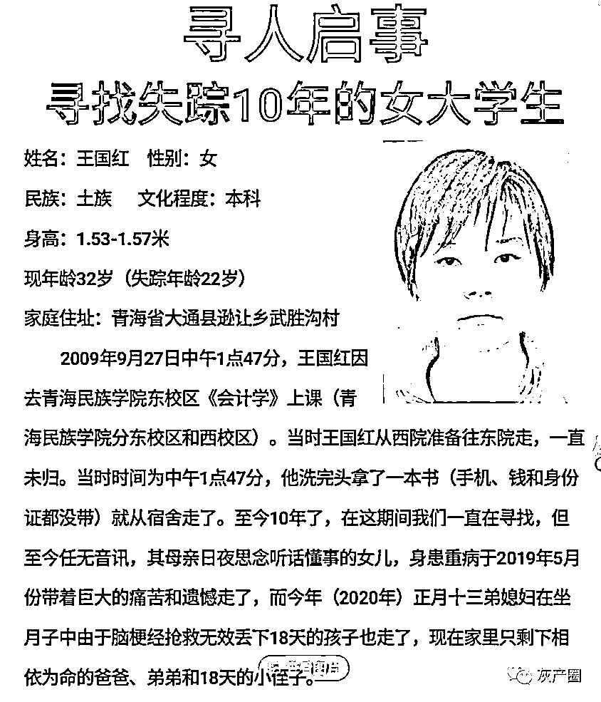

王国红失踪后，其父母王志英、乔凤翠一直苦命寻找，可是渺无音讯。母亲思女心切，得了重病，于 2019 年 5 月带着终生遗憾离开了人世。

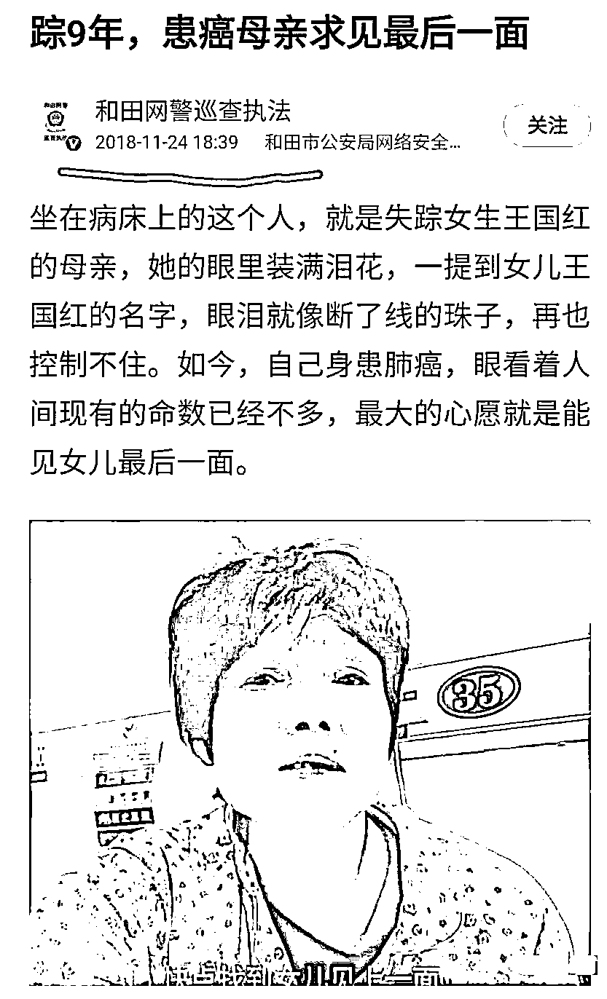

网友“麦茶唐大姐”在该文留言，时间是 21 年 11 月，应该是王国红家的亲戚或者要好的朋友，他说姑娘已经找到，在陕西省榆林市佳县一个山里，被一个老男人捡去生活了 14 年，现在已经失忆，他跑陕西一年，有了证据，请媒体帮忙…… 

她说的这个老男人，很有可能就是指李利民。

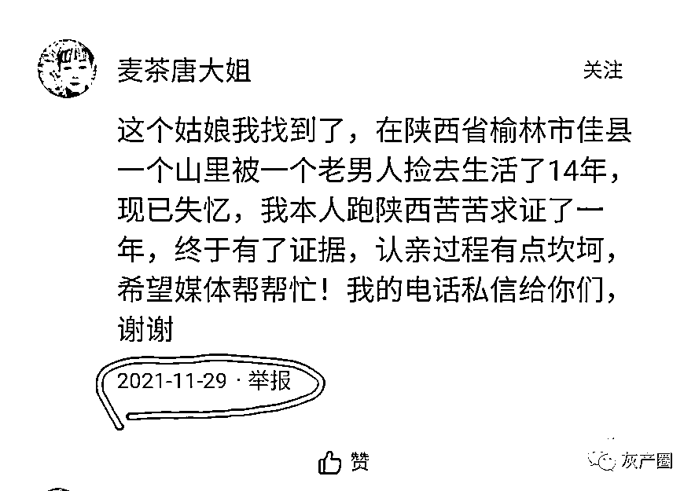

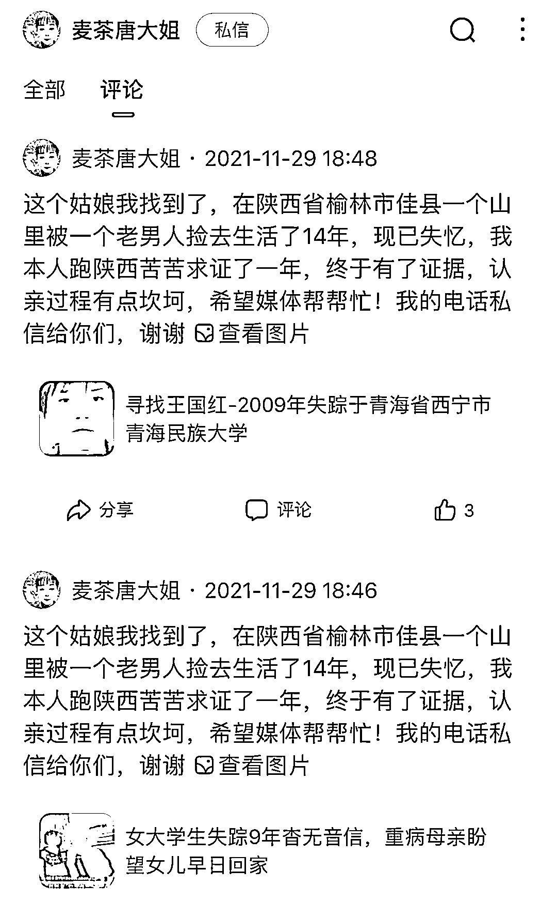

“铁笼女”直播照片如下，两者相似度颇高：

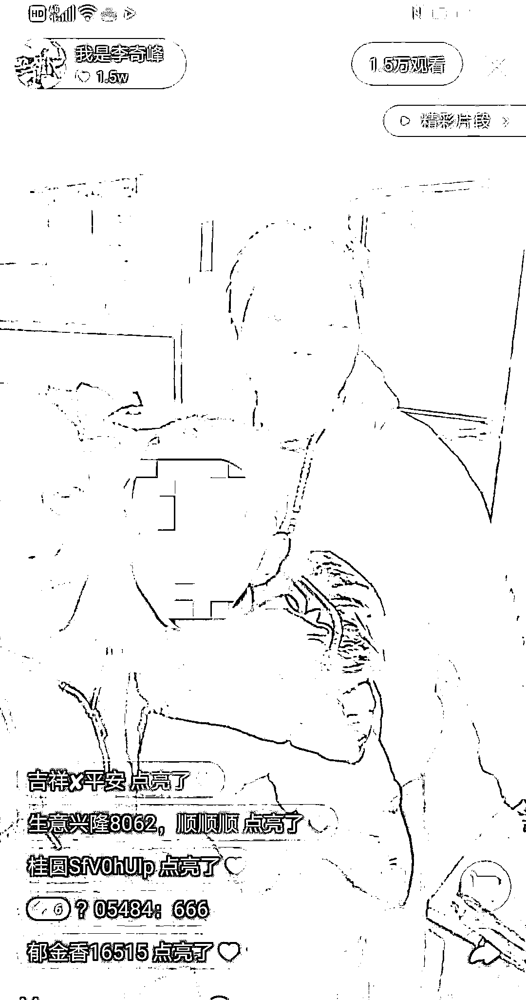

此外，李利民是陕西人，但他在快手里炫耀家族在青海有人，是不是暗示“铁笼女”是青海人？

看来，李利民可能也涉嫌拐卖妇女罪，强奸罪，非法拘禁罪，虐待罪。当地某些干部可能涉嫌失职渎职罪，包庇罪。

此事远没有丰县事件受人关注，李利民受到惩罚估计很有限。

此事件最让人心寒的地方在于小花梅引起如此大的关注与讨论之后，依旧有人不把拘禁、虐待女性当回事，居然在网上以炫耀的姿态讲出，让人难以接受。

我们必须发声，必须关注。沉默也是一种罪，那是平庸之恶，说得不好听点，对苦难和不公视而不见的人，也是罪恶的帮凶。

拯救她们，刻不容缓。她们的血泪，是我们的血泪。无数的血泪，都洗刷不了她们的悲惨命运。所有的文字，都换不回她们的青春和被糟蹋的人生。

一条铁链已经让我们无法呼吸了，再来个铁笼会让我们与世隔绝。

远方炮火很远，身边的铁链很近！

来源：柏举居士，正义者之家<mpvideosnap class="js_uneditable custom_select_card channels_iframe" data-pluginname="videosnap" data-id="export/UzFfAgtgekIEAQAAAAAABLsTiSMvKwAAAAstQy6ubaLX4KHWvLEZgBPE26McZxtpD7P8zNPgMIt3zuKt1ztzU1QQEq6wAcR1" data-url="https://findermp.video.qq.com/251/20304/stodownload?encfilekey=rjD5jyTuFrIpZ2ibE8T7YmwgiahniaXswqzkRkJK1j6hmVPu5OEiatyo06ibtgMxjYdrNonicmdGusTWBuvcdnhZ9rhYjibWUuhsyiagtN2kB7HicBHYyO1Ad32NQcA&amp;adaptivelytrans=0&amp;bizid=1023&amp;dotrans=0&amp;hy=SH&amp;idx=1&amp;m=&amp;scene=0&amp;token=AxricY7RBHdWg8dj3uShQBXZic4iaTkUibWKoa8dt8Eha3hEwhV02CicR2ebvkg0UgMAvN2TiahtfWVOc" data-headimgurl="http://wx.qlogo.cn/finderhead/ibq4aVwOt6HNqrr8OD3sCviaytF3B8TqCwHicxsuIanAJo/0" data-username="v2_060000231003b20faec8c6e48a1acbd3ce04ef33b077a1e41d0d3794ed88ea537878dbe65910@finder" data-nickname="灰产圈+" data-desc="【男子直播中自称“捡来妻子生下女儿卖掉”！官方回应】近日，多名网友爆料称，某平台账号“我是李奇峰”在直播中透露，他的妻子小雨是他捡来的一个来路不明的女子，两人 2009 年开始同居。小雨曾多次试图逃跑，李某采用特殊手段阻止。他还亲口讲述，小雨为他生有一子一女，女儿生下后，被他以 3 万元的价格卖给了邻村。3 月 1 日，#陕西针对铁笼女事件成立调查组#，据陕西榆林市公安局通报，2022 年 3 月 1 日 0 时许，微信公众号“现实的模样”发布：“陕西佳县暴出‘铁笼女’，悲惨遭遇堪比江苏丰县的‘铁链女’”。榆林市高度重视，立即成立由榆林市公安局牵头，相关部门参与的联合调查组进行调查。目前，调查工作正在进行#铁笼女@灰产圈+ " data-nonceid="5184829383598621808" data-type="video"></mpvideosnap><mpvideosnap class="js_uneditable custom_select_card channels_iframe" data-pluginname="videosnap" data-id="export/UzFfAgtgekIEAQAAAAAAayI4-Q4MZgAAAAstQy6ubaLX4KHWvLEZgBPElqNkIGp_D7P8zNPgMItBJoGc_AEObMys-JvVluB5" data-url="https://findermp.video.qq.com/251/20304/stodownload?encfilekey=rjD5jyTuFrIpZ2ibE8T7YmwgiahniaXswqzJOjJHGebyibVecQ4SiaFZbdNxmJ2V9GqHQgDD1tvZibOsKhW7edAWiamG8cz9lKtAkibNoI0wJicDsyA1IxBhtxO6tvQ&amp;adaptivelytrans=0&amp;bizid=1023&amp;dotrans=0&amp;hy=SH&amp;idx=1&amp;m=&amp;scene=0&amp;token=x5Y29zUxcibDUehfZPz6pO0G7BHZbVGu3Mb3dcaicicQvcWG6omDCnpDhZM6AibkNf34stkr3VBcpUo" data-headimgurl="http://wx.qlogo.cn/finderhead/ibq4aVwOt6HNqrr8OD3sCviaytF3B8TqCwHicxsuIanAJo/0" data-username="v2_060000231003b20faec8c6e48a1acbd3ce04ef33b077a1e41d0d3794ed88ea537878dbe65910@finder" data-nickname="灰产圈+" data-desc="#陕西针对铁笼女事件成立调查组#【男子直播中自称“捡来妻子生下女儿卖掉” 陕西榆林：正在调查】近日多名网友爆料称，一男子在直播中自称“捡来妻子生下女儿卖掉”。 根据网友提供的信息，账号“我是李奇峰”一直在直播陕西榆林市佳县居民李某个人的家庭生活。直播中李某透露，他的妻子小雨是他捡来的一个来路不明的女子，两人 2009 年开始同居。小雨曾多次试图逃跑，李某采用特殊手段阻止。网友称，李某曾在直播中亲口讲述，小雨为他生有一子一女，女儿生下后，被他以 3 万元的价格卖给了邻村。3 月 1 日下午，记者发现该账号已经被封禁。1 日晚，榆林市公安局发布通告，称已成立调查组调查此事@灰产圈+ " data-nonceid="8165162943390909273" data-type="video"></mpvideosnap>

← 向右滑动与灰产圈互动交流 →

