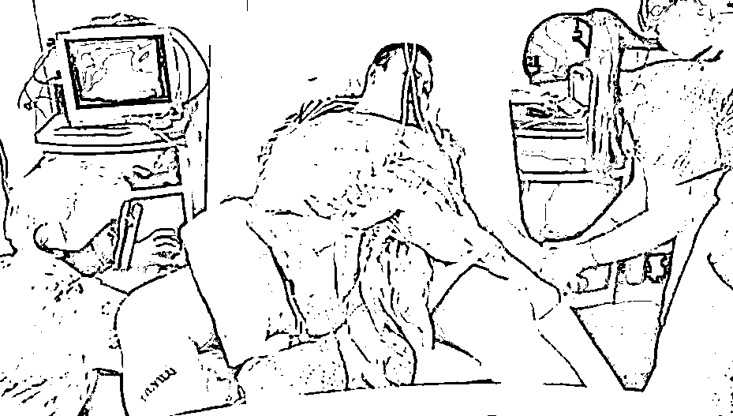
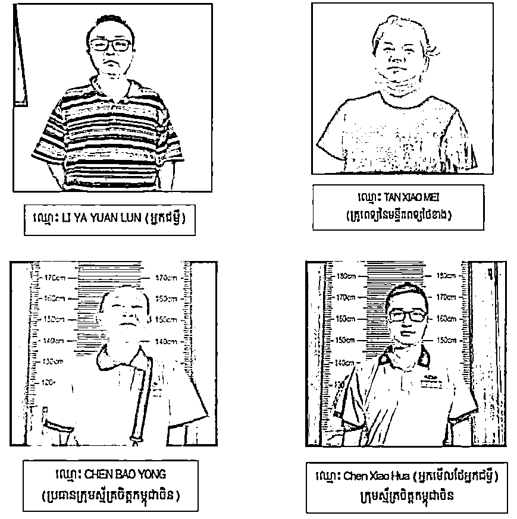

# “血奴”案当事人和 3 名涉案人员被控多项罪名

> 原文：[`mp.weixin.qq.com/s?__biz=MzIyMDYwMTk0Mw==&mid=2247531021&idx=2&sn=83323a93f114bc76b4f194857e010077&chksm=97cbb135a0bc3823fa04c36815fafa72f98ac31cfa4a80ad98f81cc7d756ea617a5b9a89f5a6&scene=27#wechat_redirect`](http://mp.weixin.qq.com/s?__biz=MzIyMDYwMTk0Mw==&mid=2247531021&idx=2&sn=83323a93f114bc76b4f194857e010077&chksm=97cbb135a0bc3823fa04c36815fafa72f98ac31cfa4a80ad98f81cc7d756ea617a5b9a89f5a6&scene=27#wechat_redirect)

据**封面新闻**消息，目前，柬埔寨西哈努克省初级法院已就“血奴”编造一案正式提控。

“血奴”案共有 4 名被告：当事人李亚缘纶、西港某医院医生谭小梅、中柬义工队队长陈宝荣和助手陈晓华。

目前，陈宝荣、陈晓华和谭小梅被关押在西港监狱，当事人李亚缘纶因病情未好转，法官批准他暂时在金边一家医院接受治疗。

此案中涉及的四人 

李亚缘纶因于 2021 年 6 月份偷渡至柬，被控犯下“非法入境柬埔寨罪”、“煽动歧视罪”和“提供虚假申报罪”。

谭小梅被控犯下“煽动歧视罪”和“提供虚假申报罪”。

陈宝荣和助手陈晓华被控 4 项罪名，包括“煽动歧视罪”、“非法干涉公共职能之行使罪”、“非法使用职业证明文件罪”、“提供虚假申报罪”。

柬埔寨《刑法》关于**“煽动歧视罪”**条文规定，基于任何人或任何群体属于或不属于特定人种、种族、民族成员或任何宗教信徒等原因，而直接煽动他人歧视、仇视或施暴的，即使该煽动无效，可处 1 年至 3 年有期徒刑。

**“提供虚假申报罪”**意指向公共机关提供虚假信息，旨在非法获取现金或利益，罪成可处 6 个月至 2 年有期徒刑；

**“非法干涉公共职能之行使罪”**，罪成可处 1 年至 3 年有期徒刑；

**“非法使用职业证明文件罪”**，罪成可处 1 个月至 1 年有期徒刑。

来源：封面新闻，我在柬埔寨

← 向右滑动与灰产圈互动交流 →

