# 500 元俩小时，陌陌被曝招嫖明码标价！小姐：都是通过陌陌拉客

> 原文：[`mp.weixin.qq.com/s?__biz=MzIyMDYwMTk0Mw==&mid=2247531021&idx=3&sn=33c94c161a0f060571c5dffec12e745d&chksm=97cbb135a0bc3823a56bfb6b0350434725a59f81683b436ec8e53bd17af5cf24e3a500bc4df5&scene=27#wechat_redirect`](http://mp.weixin.qq.com/s?__biz=MzIyMDYwMTk0Mw==&mid=2247531021&idx=3&sn=33c94c161a0f060571c5dffec12e745d&chksm=97cbb135a0bc3823a56bfb6b0350434725a59f81683b436ec8e53bd17af5cf24e3a500bc4df5&scene=27#wechat_redirect)

陌陌上架了社交产品“咔咔”，也是其推出的首款独立熟人社交产品。这也让陌陌再次成为大家关注的焦点。陌陌几乎是建立了从陌生人，到熟人社交矩阵。陌陌从一开始就被贴上了一些不雅的表情，如今的陌陌发展情况如何呢？

首先进入苹果手机应用商城里，打算下载软件。当输入陌陌下载时，系统竟然会自动关联“陌陌约炮”等字样。这样的标签，不免让人有些尴尬。下载之后，记者注册了个账号，随意选择了一个头像，就开启了一场陌生社交的"陌陌"调查。

陌陌上找到了“附近的人”这一栏，随机选取了几个“美女”打招呼。而收到的反馈却让人吃惊。一名用户名叫“逗比青”的用户称自己就是约的，这位“美女”在打“约”字的时候，用了音乐的“乐”字代替。后来，记者才明白，原来约很容易“约炮”联系起来，所以成了平台监控的敏感词。

而类似这样的“黑话”在陌陌软件的陌生人交流中已经是普遍现象。陌陌对于“约”，“兼职” “价格”等词的出现都会提示包含骚扰信息，但是这并不影响交流。

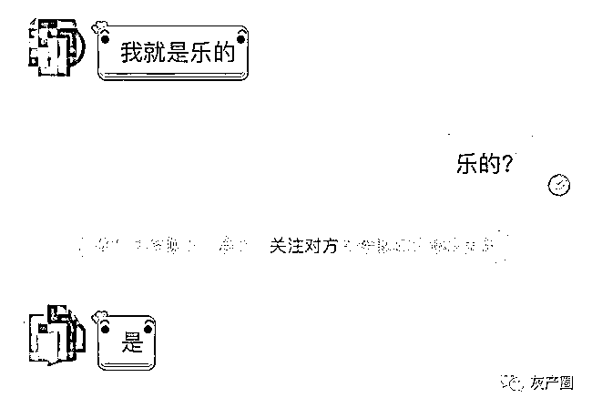

当问及怎么收费时候，对方很直接的说“500 两小时”。在陌陌动态里就有照片。至于怎么见面，其称“微信联系”。便将微信号通过陌陌发送过来。

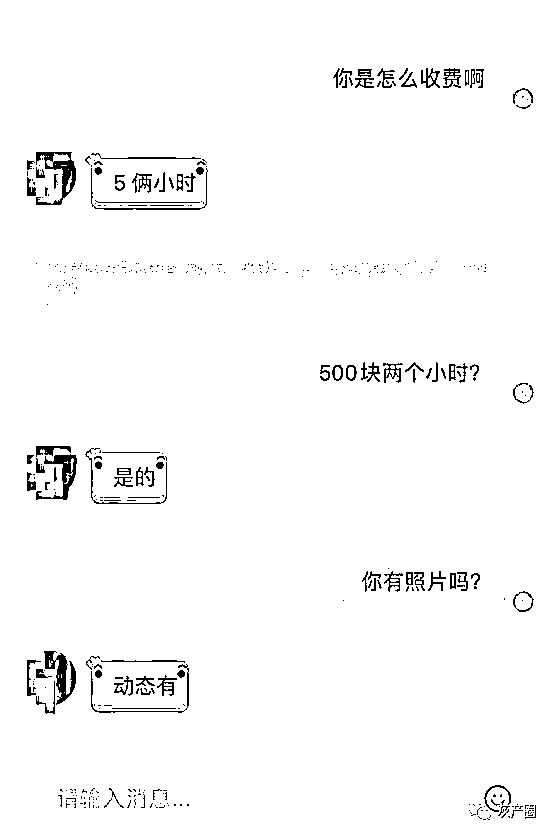

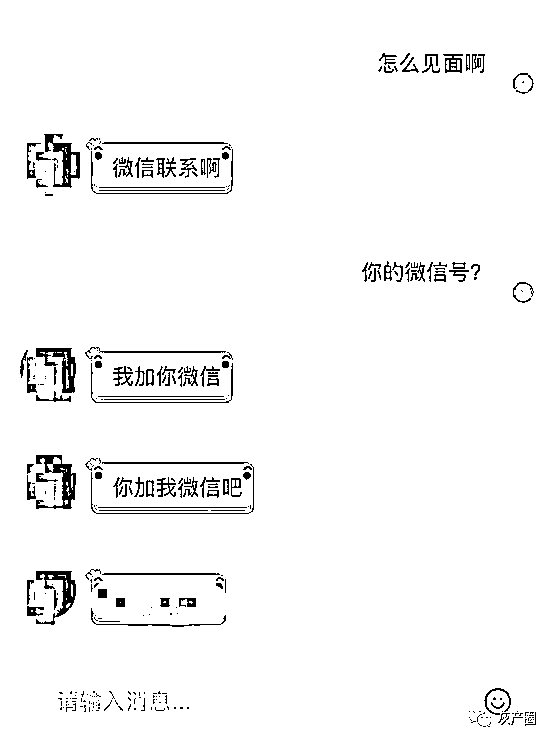

记者在随后的使用中，相同的手段，微信名叫“二大娘”的用户通过陌陌加上记者的微信。加上好友之后没有丝毫的拖泥带水，直接把所谓“约炮”的要求说了出来。

“你好，有地没”

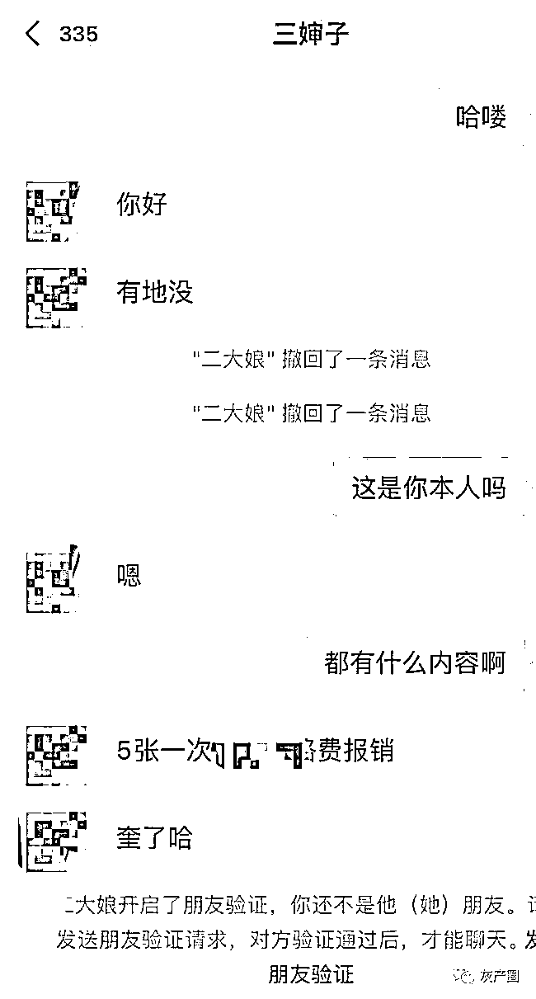

随后发了两张本人的照片，还没来得及细看，便迅速撤回了。在把价格说了之后，大约过了有两三分钟看到没有及时回复便把记者给删除了。当记者再次试图添加时候，发现对方的微信昵称已经换成“三婶子”并回复称“微信不留闲人”。

通过短暂的交流记者发现，这些所谓在陌陌“招嫖”的用户都非常谨慎，需要及时撤回消息的立马撤回，可以就继续聊，不行就会删除好友。而且他们的名字更换的非常频繁。没过一会，一位名叫“敏儿”的陌陌用户接受了记者的打招呼。同样是选择添加微信“换个地方说话”。

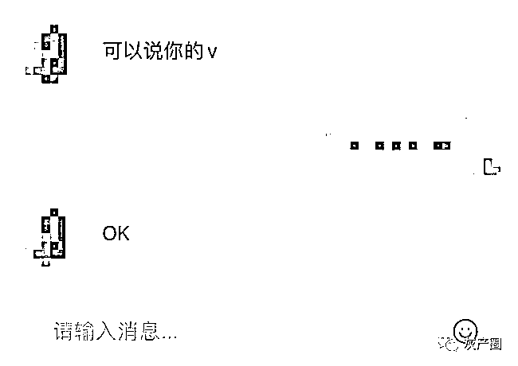

添加微信后随即发给了记者一张长图，里面包含了 10 几位"技师“，和服务项目及服务报价，然后又发送给了见面的地址。

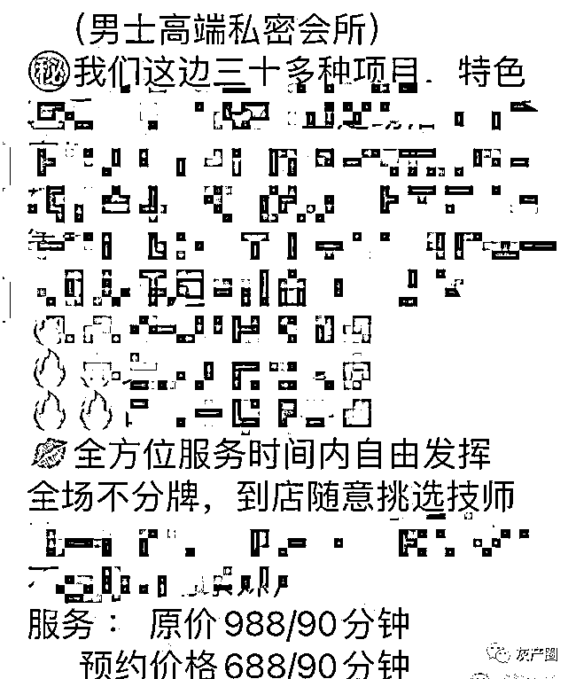

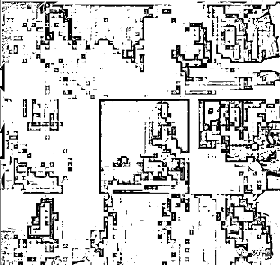

对方称，他们这里是从下午一点到晚上一点开始营业。客户联络的渠道都来自陌陌。

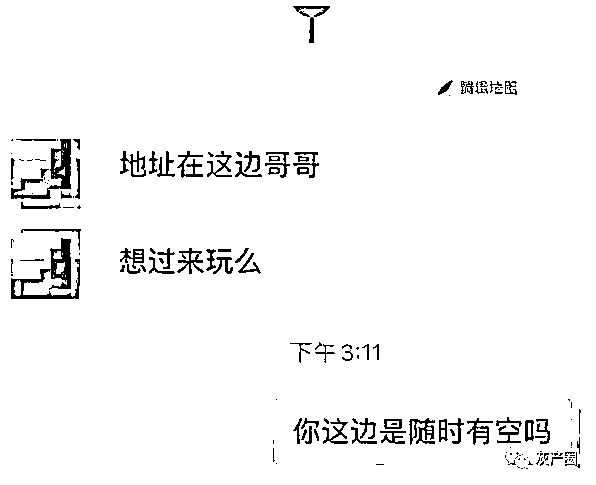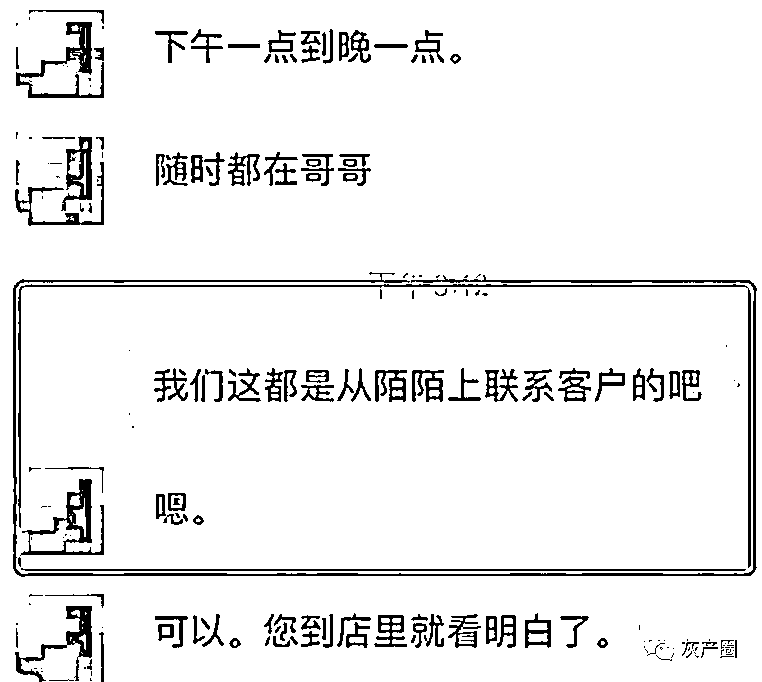

更让记者想象不到的是除了所谓“约炮” 在这个陌生人相互产生交集的 APP，没有什么是你想象不到的。在试用的过程中，一位疑似同性恋的用户主动向记者打招呼，交流中涉及不雅词汇。尽管陌陌官方一直在提示语言违规，但也丝毫不影响他发送内容。

用的女性头像就为“勾引”男性，其没要求也不收费，就是要找男性的伙伴。看到迟迟没有回复，他便拉黑了记者，当再次与其联系，陌陌上显示。“对方账号可能存在异常“。

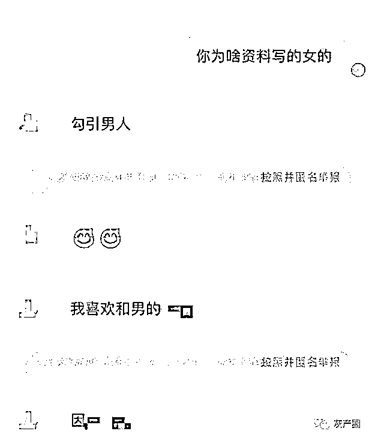

针对这种情况记者联系到陌陌客服，其称，用户如果发现了这种问题，可以通过平台上专门举报的按钮进行投诉反馈，并声称平台上的内容都是经过审核后发布的。但是记者实地调查发现，陌陌的审核和监管手段有待加强。

随后记者在互联网搜索“仙人跳“”约炮敲诈“等关键词，这不乏可以与陌陌关联在一起。据人民网此前报道，去年湖北省广水市一使用“仙人跳”方式实施系列抢劫、敲诈勒索的犯罪团伙十名成员已全部被广水市检察院批准逮捕。

犯罪团伙的作案方式也很简单，由团伙成员冒充女性，通过“探探”“陌陌”等网络交友平台，采取“钓鱼”或“约炮”的方式勾引心存“猎艳”心理的男士出来开房，待该男士与团伙内未成年女性成员发生完性关系后，由团伙其他成员分饰该女性成员的父亲或兄长、朋友，来到宾馆使用暴力、胁迫或以报警相要挟的方式，威逼该男士花钱摆平事件。

该团伙成员采取此种方式，疯狂作案数十起，抢劫或敲诈他人钱财达十万元。

查阅陌陌财报发现，第三季度，陌陌实现营收 37.667 亿元，同比下降 15.4%，这已经是其连续 3 个季度下滑。同时，陌陌净利润 6.54 亿元，同比下降 39.8%。

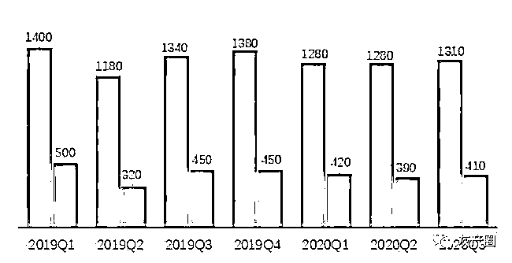

除了财务数据的下滑，用户增长的瓶颈同样是让陌陌头疼的事。短视频的兴起让陌陌用户有了新的出走端口，月活用户数的下降就导致了其付费用户数没有了增长的来源。

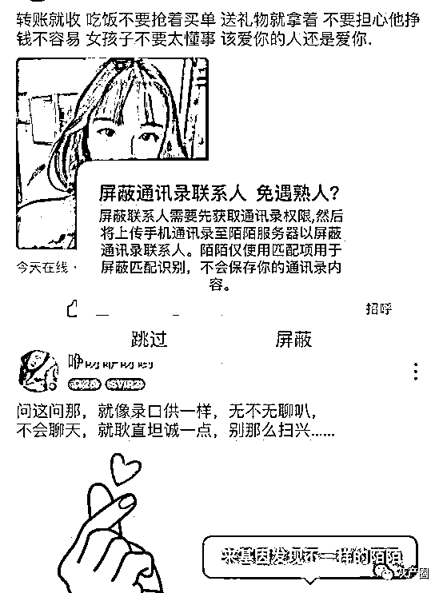

在采访中，记者发现，使用陌陌的用户多为单身。大部分有对象或者已婚人士对软件讳莫如深。已婚男士张先生接受记者采访时表示：“对于我这样的已婚人士，几乎不会用这种陌生人软件。而且我老婆对我管的也很严。有一次，因为好奇下载了软件，被老婆看到后直接给我删了。

陌陌主打陌生人社交，并且建立了陌生人社交软件的矩阵，除了收购探探外，陌陌相继推出对眼、对对、陌多多、芒西、换脸软件 ZAO 等多款泛社交产品。但是，影响力都没法跟主产品相提并论。而长期以来，陌陌身上被打上了“涉黄”“招嫖”等诸多不雅标签，严重影响了其客户市场的开拓。陌陌已经到了用户增长的瓶颈期。而要打破这个瓶颈，陌陌必须要撕掉这些不雅标签。

业内人士表示，其实陌陌也面临两难的境地。要是提高监管严管，那可能影响了一些陌生人交友的用户体验。如果不加强严管，那就很难撕掉不雅标签。陌陌积需寻找一个新的突破口拉动新的营收业务增长。

对于陌陌存在的情况，一经发布得到不少读者得共鸣。

有读者在评论区表示，“陌陌打擦边球，睁一只眼闭一只眼”还有用户表示；“仙人跳破坏行业健康发展，需严厉打击，还消费者一个朗朗乾坤”。

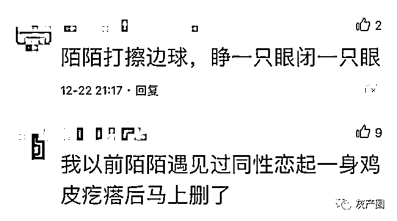

除此之外，还有些读者分享了自己在陌陌的遭遇，“我以前在陌陌遇到过同性恋，起一身鸡皮疙瘩后马上删除了“。

“前几天见了一个，五百块钱，二十五岁，见面一看差不多四十多岁了”。

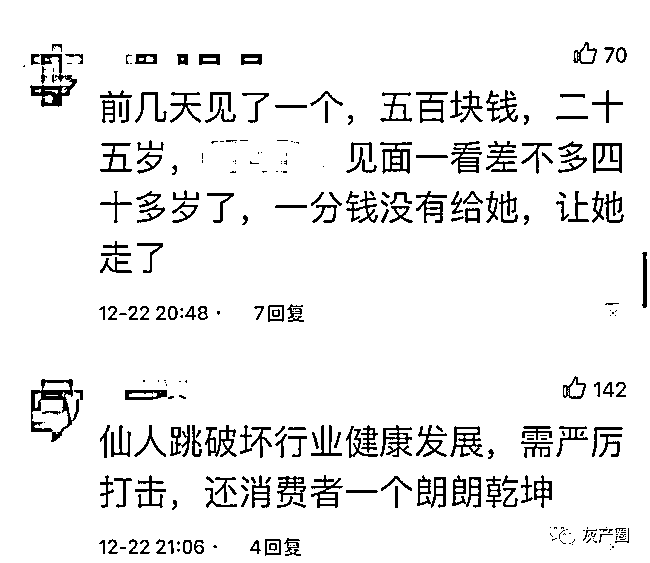

除了文中和用户提到的”招嫖“的情况，还有不少网友向记者爆出”新料“。

陌陌用户顾先生反映了自己在陌陌被”套路“的遭遇。顾先生说，自己在陌陌的相亲直播间，进行相亲，在直播间前后刷了 5000 多元石沉大海。"

顾先生说，自己本身就是陌陌用户，不经意间刷到了这类相亲的直播间。然后就点进去了，”点进去红娘就问有没有连麦的，然后我就试了试"。

“看着眼缘还不错，红娘、我、女嘉宾”就开了三方的视频。

然后红娘就给我说，“要我充值送礼物，看我是否有诚意，然后我就前后冲了 5000 多块钱刷给了直播间里的女嘉宾。”

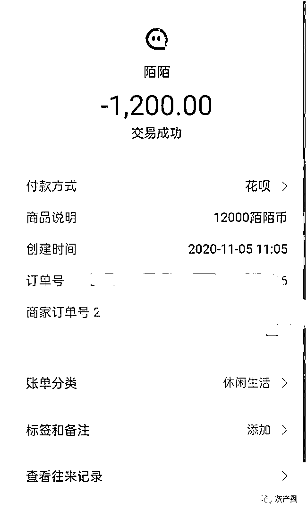

刷完之后红娘还要我充值，我就发现不对劲，“这根本就是个无底洞啊”。

“发现不对我就没有充值，红娘就说相亲失败，至于我充的这些钱也没有个说法， 这不纯属是骗人的吗”

随后，顾先生找到红娘，发现红娘已经将其拉入黑名单。

顾先生又在陌陌上联系到当时相亲的女嘉宾，”女嘉宾就给我说，你不喜欢我吗？这言外之意就是嫌我没再充钱，充钱刷礼物才代表喜欢她“

事已至此，顾先生才感觉到自己可能被套路了。他便联系到陌陌方面。

”陌陌就给我说这是娱乐性质的“

陌陌的回复让顾先生非常不满，”娱乐性质？我是看到相亲才去的，又不是看主播表演才艺打赏，我刷了这么多钱，连个说法都没有

“陌陌既然让这类直播间在平台存在，就应该做好监管，保护用户的权益吧”

来源：网易新闻，揭露骗局

← 向右滑动与灰产圈互动交流 →

