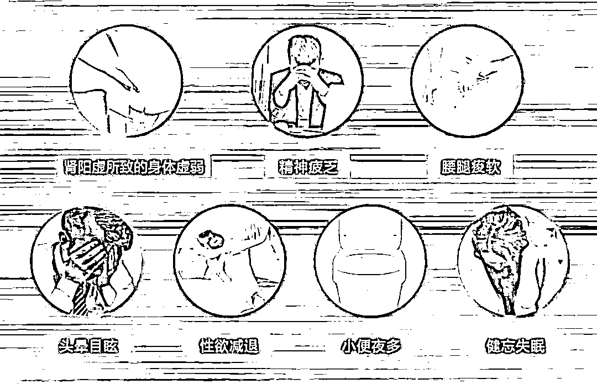
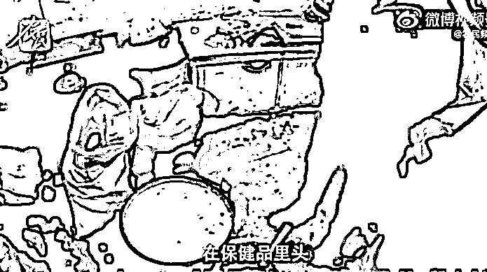
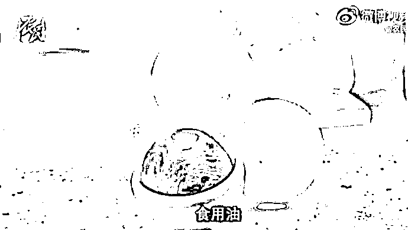
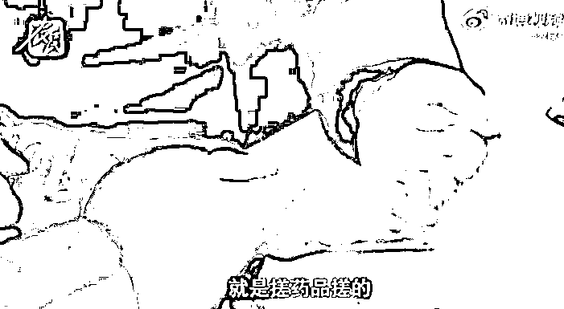
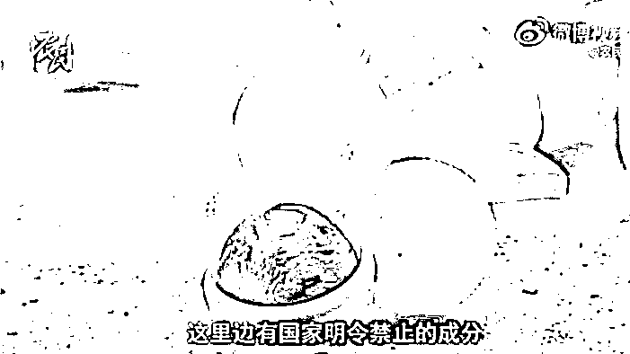
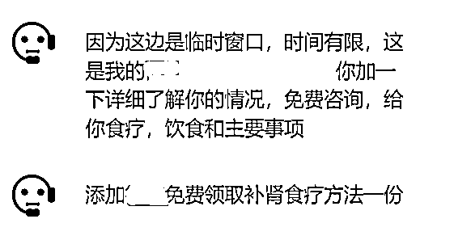
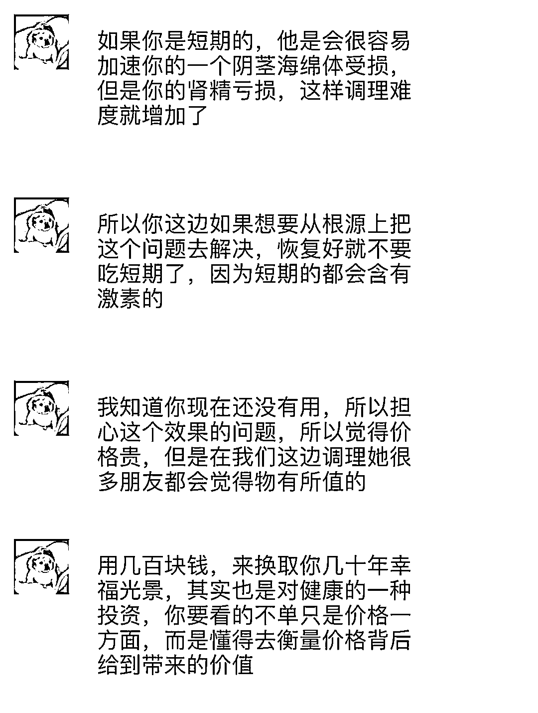
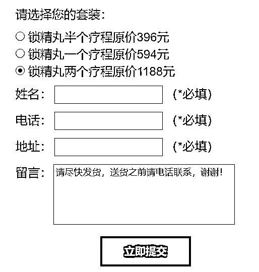
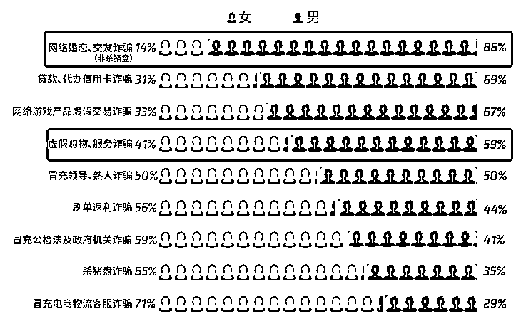

# 成本 8 毛的小药丸卖 800 块，又有骗子盯上男孩子们了

> 原文：[`mp.weixin.qq.com/s?__biz=MzIyMDYwMTk0Mw==&mid=2247531021&idx=4&sn=d2c5fa90b1647841c0c831efc4211dea&chksm=97cbb135a0bc38233004435c6fb633495deaefdb12c2c2b788f46dcac303dec3eeaa07d7e767&scene=27#wechat_redirect`](http://mp.weixin.qq.com/s?__biz=MzIyMDYwMTk0Mw==&mid=2247531021&idx=4&sn=d2c5fa90b1647841c0c831efc4211dea&chksm=97cbb135a0bc38233004435c6fb633495deaefdb12c2c2b788f46dcac303dec3eeaa07d7e767&scene=27#wechat_redirect)

在开始今天的文章之前，守哥先问几个问题：

> 你是不是时常感觉自己被抽空了一样，倒头就想睡？
> 
> 是不是睡觉时背部出虚汗，枕头都是湿湿的？
> 
> 或是经常感到精神压力特别大，比较忧郁压抑？
> 
> 发现自己平常也手心冒虚汗、乏力失眠健忘？

如果你感到身体不适，又觉得到正规医院检查太麻烦，想自行通过网络上的“寻医问药”解决问题，那么“恭喜”你：

**你已经被骗子盯上了。**

**每日手搓 3000 颗**

**成本八毛卖八百**

前不久，河北警方依法查获了一批网红男性保健品。照理来说，这种售卖虚假男性保健品的诈骗案例年年都有，咱们早就见怪不怪。

但这回，守哥还是被曝光的内幕恶心到了。

你绝对想不到，这些号称能提高男性生理机能，让男性瞬间自信的大保丸，究竟是怎么做出来的。

*图源：农民频道*

脏乱不堪的生产环境，随意堆在地上的生产原料……

是的，你没看错。

在一处极其简陋的毛坯房里面，在基本没有任何现代制药设备的情况下，只需要往成本低廉的白糖和中药里加一些违禁成分，倒入食用油混合，最后再用一双沾满污渍的手来回揉搓，就做成了一颗颗大保丸。

*图源：农民频道*

所谓“勤劳致富”，骗子也不例外。

**一颗大保丸成本只要 8 毛，通过匿名物流发给下线，再到买家手里售价立刻飙升至 800 元。**

极高的利润，给了骗子无穷的动力。在昏暗的小作坊里，骗子一天居然能搓出**3000 粒**左右的大保丸。由于长时间的“工作”，他的双手早已染上了颜色。

*图源：农民频道*

这样的三无产品，济公拿着伸腿瞪眼丸看了都得摇摇头。

更令人震惊的是，经国家相关部门检测发现，该假冒药品中还含有国家明令禁止的有毒成分。普通人服食后，不仅没有任何的保健作用，反而还能引发全身浮肿、虚脱等副作用，对人体的危害性非常大。

*图源：农民频道*

目前，警方已查处和没收该类全部产品，同时参与制售的 5 名犯罪嫌疑人均已被刑事拘留，此案件正进一步侦办中。

早在去年[海狗丸事件](http://mp.weixin.qq.com/s?__biz=MzI0MTMyMTY5Mg==&mid=2247546813&idx=1&sn=f59c57f50076cd66f50553c016ad926f&chksm=e90f240ede78ad181475513e81272590ecc60f07b669e920728478361bd0e812ac65950fd55f&scene=21#wechat_redirect)曝光后，守哥就和大家说过：

所谓壮阳药，壮阳是假的，但赚钱却是真的。

你无法想象高价买到手的保健品究竟是怎么生产的，就像你根本不知道，**骗子坑人的套路能有多深**。

**起底男性保健品诈骗套路**

这次，守哥就以中国裁判文书网中一起涉案金额高达 1378 万的男性保健品诈骗案为例，**复盘专业诈骗团伙是入伙通过公司化运作，一步步让你主动将口袋的钱交出去**。

广告投放，寻找目标

专业的诈骗团伙，都有着明确的分工。从管理人员到业务人员，内部设立广告部、微商部、电话部、财务部等机构，设立总经理、经理、组长职位，分工负责、层级管理。

数十名的业务人员，则是男性保健品诈骗中的核心。

一开始，广告部的业务员披上专业中药师的假身份，统一使用“吴老师补肾方”、“民生泰百年养肾方”、“官方健康顾问”等网络昵称，**专门针对患有男性生理疾病人群为目标，通过在网络发****布并投放虚假广告，诱导被害人浏览广告后填写姓名、电话、病情等信息**。

补肾、壮阳、增强体质、抗疲劳……普通人在浏览器上搜索“补肾”等关键词，就会出现类似的广告文案。

业务员晚上上广告，白天接线。一旦有人被广告吸引留下了联系方式，这些客户信息就会导入到公司电脑里的 M9 系统（一种电销软件，可更改号码归属地）。

问诊开药，一对一配制

在取得客户的联系方式后，电话部业务员通过Ｍ9 销售软件，虚拟本地座机号码拨打客户电话，冒称某某药品免费领取中心工作人员、健康顾问的身份，**在无任何医疗资质的情况下，根据“客户单”使用电话或者社交软件对客户进行“问诊”**。

客户单上的主要内容是：

1、客户姓名和年纪；

2、需要改善哪方面的问题（一般是男性健康方面的问题）；

3、身体自身有哪些病症等。

当客户说出自己的“男性秘密”后，业务员就会复制、粘贴话术来回复客户的问题。比如吓唬客户现在的年纪和身体不该出现这样的状况，告诉对方使用公司的产品会大大改善状况，极力诱惑其购买产品。

在推销过程中除了夸大产品的功效外，业务员还会向客户发一些药房配药的视频，用**“根据个人体制调配”、“一人一方纯中药熬制”**等话术，告诉客户疗程都是一对一配制，以此减少客户的疑虑。

售后无保障，引导继续复购

一旦客户下单，业务员就会在公司的工作群里“晒单”。有专人统计订单，将订单信息发给其他城市的下线，通过下线进行发货。所有的单子都是先交部分定金，剩下的费用货到付款，由物流代收。

订单完成后，套路还没结束。

如果客户觉得没有效果要求售后，业务员则用早就准备好的话术，以其自身原因和疗程不够等理由，建议客户继续购买产品，加大疗程。

据涉案业务员表示，在公司购药的客户中，反映毫无效果的人不少，但几乎没有人能获得退款。

在骗子的眼中，客户从来都不是消费的上帝，而是待宰的羔羊。

**环环相扣的诈骗套路、句句忽悠的诱导话术，都是为了挥刀的那一刻。**

**“两性”话题成男性噩梦**

你是不是也有这样的疑惑：

为什么壮阳市场明明假药横行，曝光的案例不胜枚举，但男性总是容易在同一个坑里反复横跳？

**因为，诈骗分子精准抓住了男性对“两性”问题敏感的弱点。**

据腾讯发布的《2021 年电信网络诈骗治理研究报告》调查显示，色情、网络婚恋、交友等“两性”话题相关的诈骗类型，成为男性被骗的重灾区。

*图源：《2021 年电信网络诈骗治理研究报告》*

*当“两性”话题变成男性痛点，衍生出来的其他的市场，**细到壮阳保健，小到割个包皮，都是诈骗分子精准收割的契机**。*

*在这种情况下，男性无疑是电信网络诈骗重点围猎的对象群体，上当受骗风险更高。*

*那么，我们应该如何避免被骗？*

*其实解决问题的一大关键，还在于自己的心态。*

*学会正确看待“两性”问题，把那些所谓的“男性秘密”当成普通感冒一样，买药就去正规渠道，治病就上正规医院。万一被骗也别扭捏，及时维权报警绝不让骗子逍遥法外。*

*我们保持平常心端正了姿态，不把这个事高高举起，骗子没有钻空子的机会。*

***那些精心研究出来的诈骗套路和话术，自然割不到你的头上。***

*点击查看视频↓↓*

*千万别再上当了*

 *[`v.qq.com/iframe/preview.html?width=500&height=375&auto=0&vid=z08492x92vv`](https://v.qq.com/iframe/preview.html?width=500&height=375&auto=0&vid=z08492x92vv)* 

**

*← 向右滑动与灰产圈互动交流 →*

**