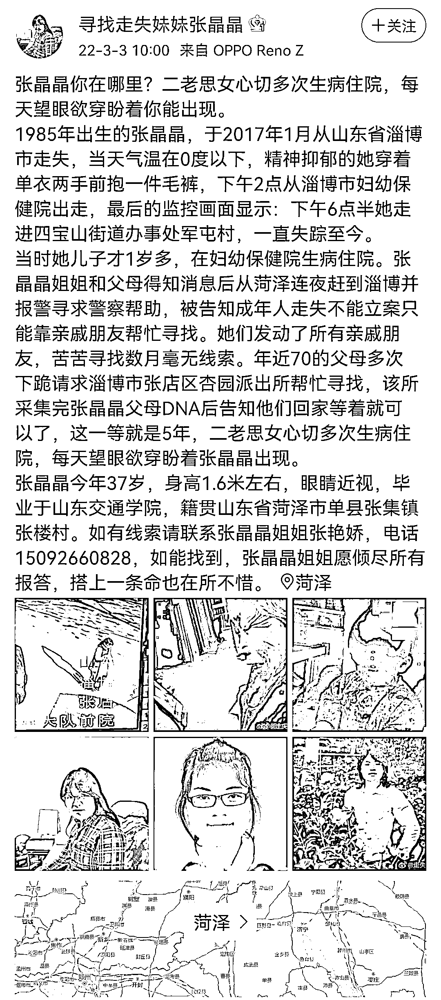
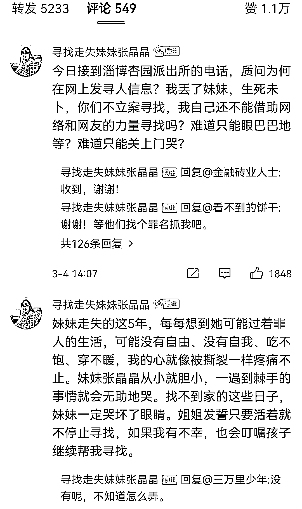
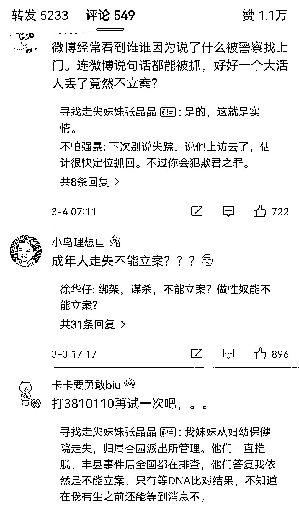
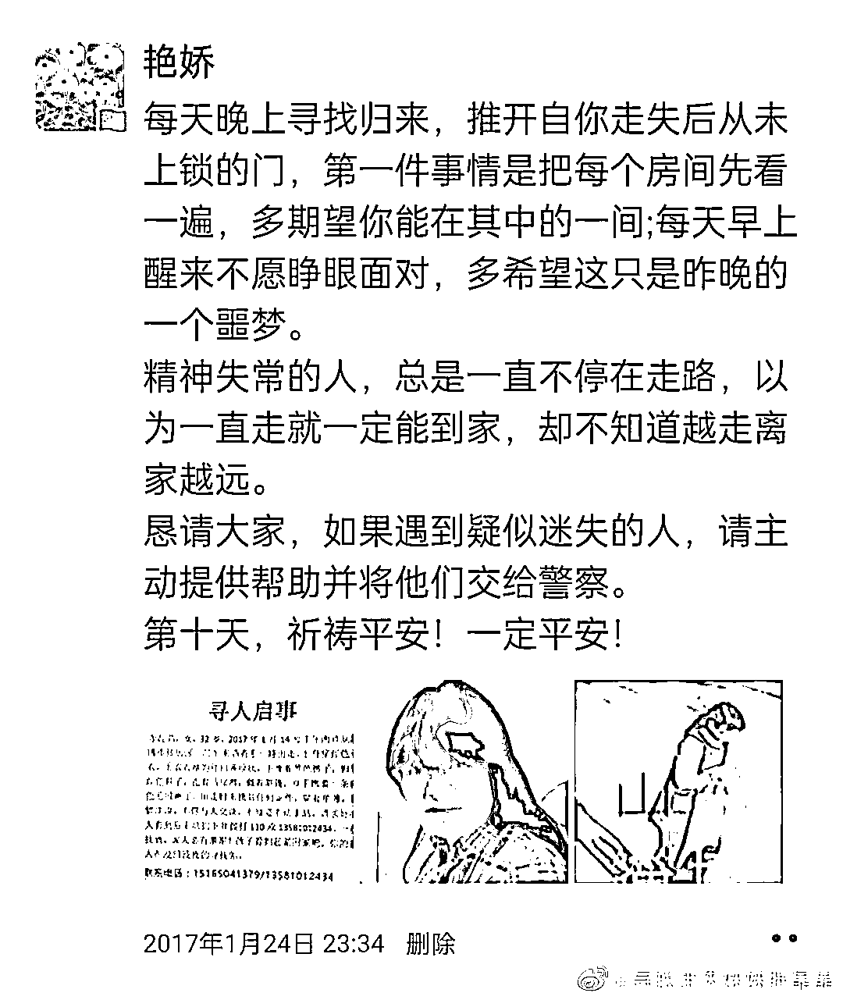
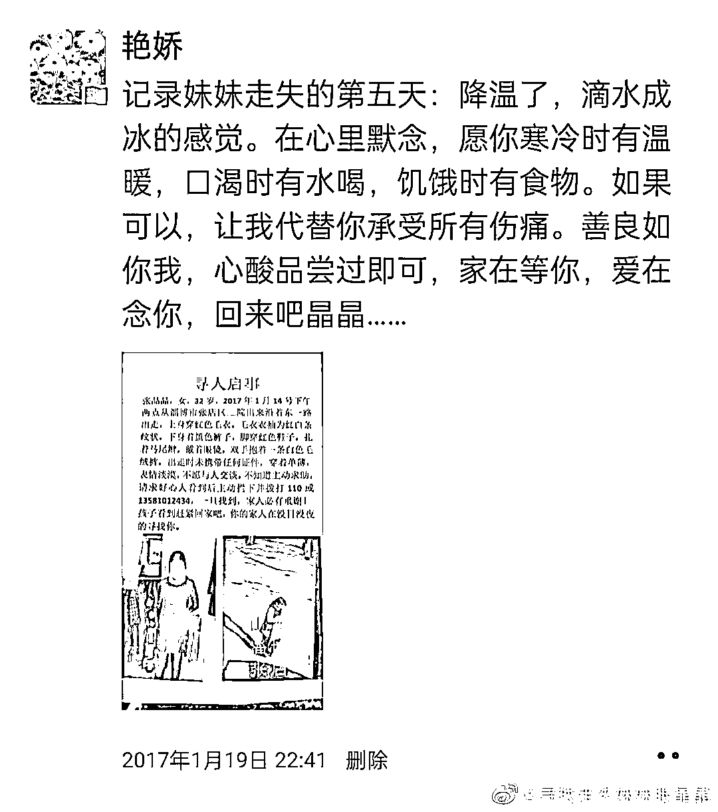
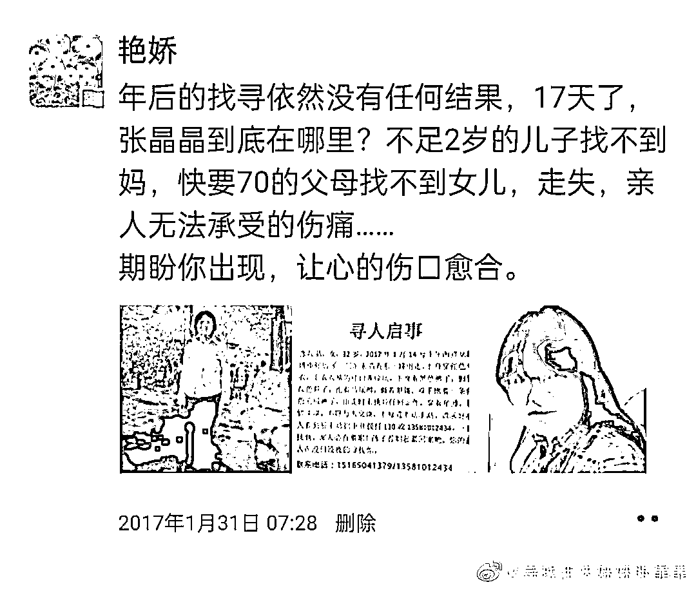
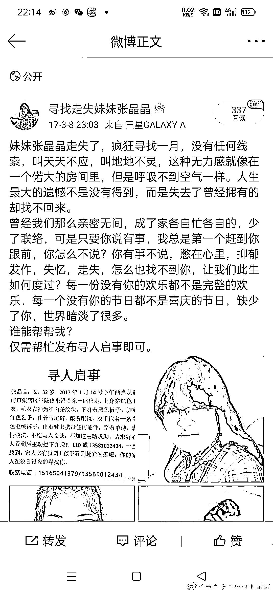
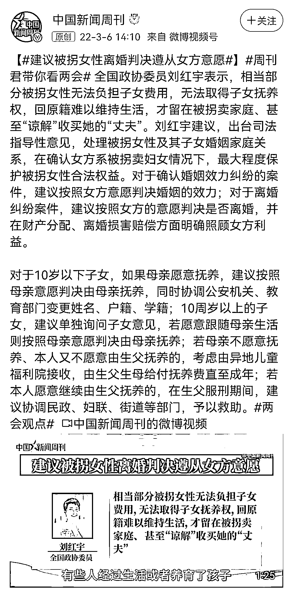

# 稍微作为一点，也不会有人跑到微博发声！

> 原文：[`mp.weixin.qq.com/s?__biz=MzIyMDYwMTk0Mw==&mid=2247531094&idx=1&sn=fc0fafffa83cf34e16714dd80c6b9432&chksm=97cbb16ea0bc3878d6de8db1716375d18215b15f657d89ec9f5abef4a35d99a77f6fcc3cc073&scene=27#wechat_redirect`](http://mp.weixin.qq.com/s?__biz=MzIyMDYwMTk0Mw==&mid=2247531094&idx=1&sn=fc0fafffa83cf34e16714dd80c6b9432&chksm=97cbb16ea0bc3878d6de8db1716375d18215b15f657d89ec9f5abef4a35d99a77f6fcc3cc073&scene=27#wechat_redirect)

一. 

成年人有自己处分自己的权利和意志，如果离家出走警方是不会管，但是如果是无缘无故的失踪的话，这就属于受案范围内了！

《公安机关查找疑似被侵害失踪人员信息工作规定》中要求，公安机关刑侦部门接到疑似被侵害失踪人员的报案后，应当登记受理，开展查找工作。《规定》中对“疑似被侵害失踪人员”进行了具体的描述：

　　(1)失踪现场有明显的侵害迹象的；

　　(2)有证人证明失踪人员遭到侵害的；

　　(3)人与机动车一起失踪或携带大量财物失踪的；

　　(4)不满 14 周岁的未成年人失踪超过 48 小时的；

　　(5)失踪人员在失踪前与他人有重大矛盾纠纷的；

　　(6)失踪原因不明，失踪时间超过 3 个月的；

　　(7)其他疑似被侵害的。

也所以，从上面博主的口述中，我们可以看到其妹妹在 2017 年就已经失踪，符合“规定”第六条“失踪原因不明，失踪时间超过 3 个月”。

此外，失踪人员有精神抑郁症状，不排除她也会遭遇丰县铁链母亲的遭遇，谁也不敢保证她现在是不是也在某个农村正被铁链拴在脖子上，遭受农村老光棍的侵害，完全符合第 7 条，“其他疑似被侵害的”，

所以这起失踪案件，从法理上完全具备立案条件。

二. 

翻看一下这位失踪女孩姐姐的信息，我们可以看到，妹妹的失踪对这个家庭的打击异常之大，家里还有一个幼小的孩子在等待着妈妈，看着就令人心疼！

个人觉得，在这件事上，不说本就是在职业范围之内的公务部门，就算是个过路客在看到后，只要有那么一点能力帮助，从人性，道德的角度都应该伸出起码的良心之手，而不是拿着法理的漏洞去推脱，况且乎，法理也是支持立案的。

三. 

至于为何要在微博上发布寻人启事。说难听点，如果你们稍微作为一点，稍微能让人看到帮助寻找的一点希望，谁还会董这万分之一在网上发帖寻找的行为！ 

说好听点，法律有哪条规定家人走失了，不允许在网上发帖寻找。当事人在网上发个帖子找自家妹妹，碍你们屁事了！ 

四. 

看到一个资讯，说的是某 WY,提议“出台司法指导性意见，处理被拐女性及其子女婚姻家庭关系，在确认女方系被拐卖妇女情况下，最大程度保护被拐女性合法权益。对于确认婚姻效力纠纷的案件，建议按照女方意愿判决婚姻的效力；对于离婚纠纷案件，建议按照女方的意愿判决是否离婚，并在财产分配、离婚损害赔偿方面明确照顾女方利益。”

笔者想说的是，**被拐何来离婚之说，这个婚姻本来就是建立在违法的基础之上，婚姻本来就是无效的。**

出现这种拐卖的行为，难道最该做的，不是严惩，不是用法律的铁腕将这些收买女性的老光棍们残酷惩戒，让他们牢底坐穿，如此才能震慑杜绝这种反人类的现象才不会发生吗？ 

我们的法律绝不能有一点袒护收买方的意味，买卖必须同罪，且要加大处罚力度，如此，丰县铁链女的这种人间悲剧，才不会发生在我们这个如此和谐文明的社会里！

← 向右滑动与灰产圈互动交流 →

