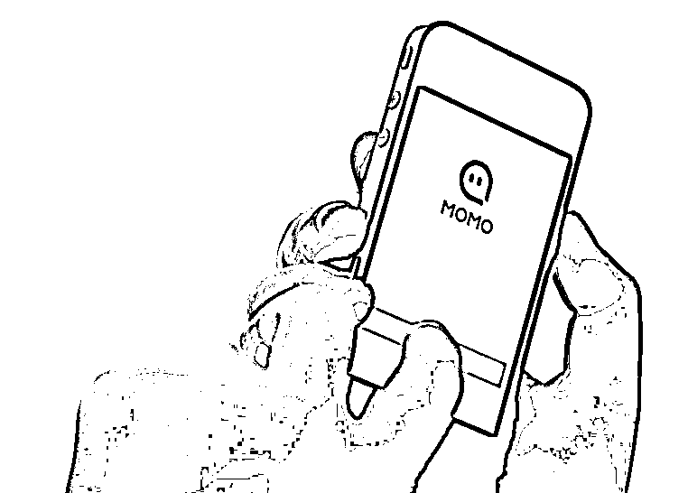
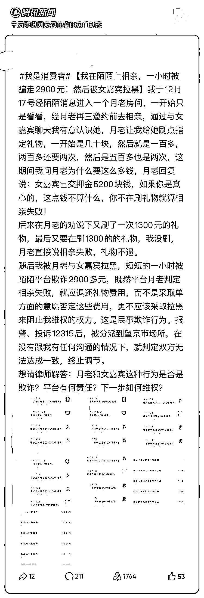
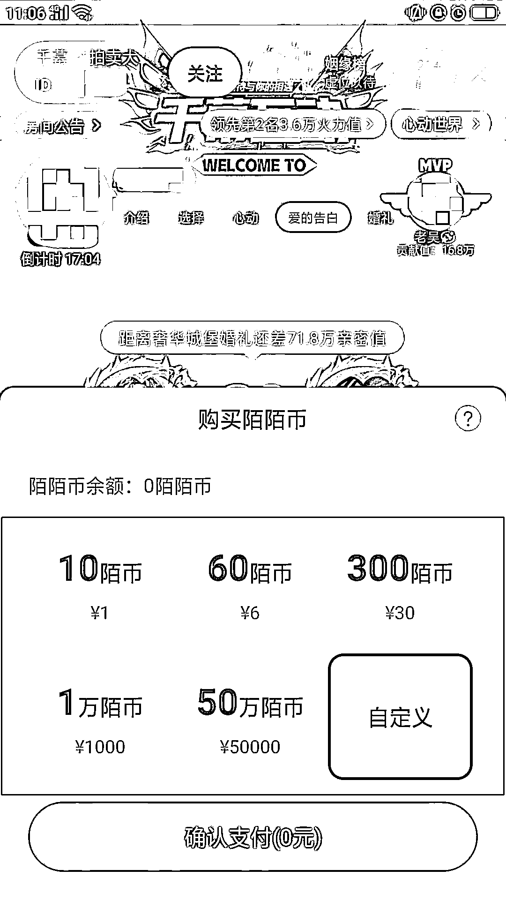
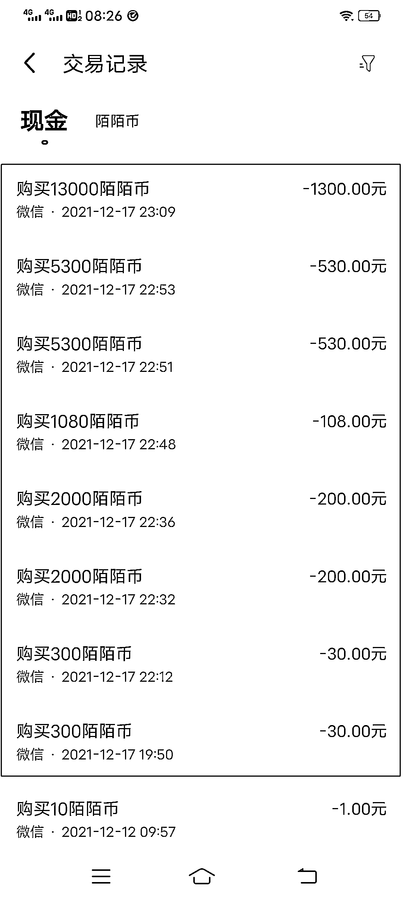
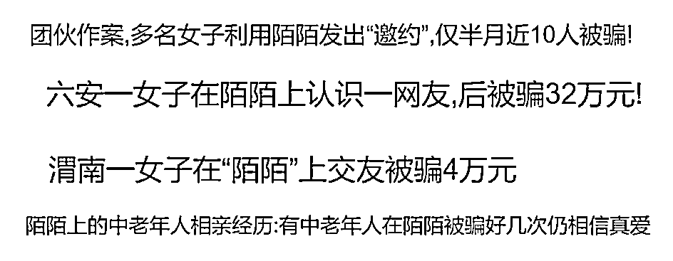
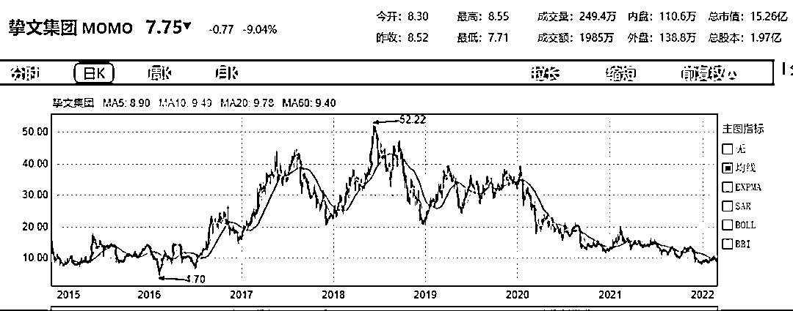
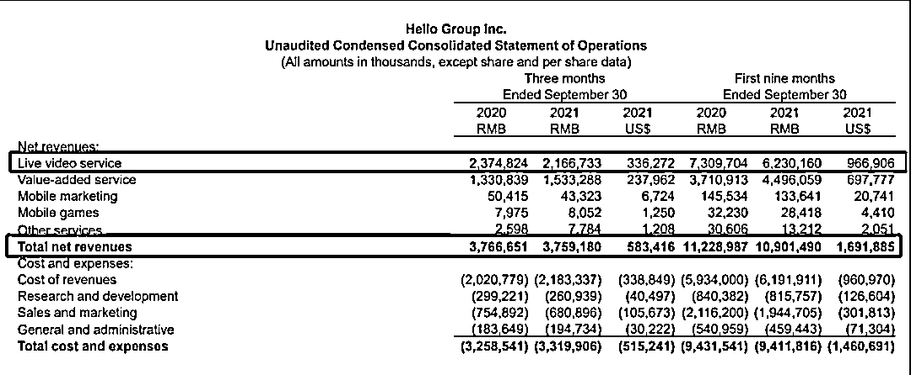

# 相亲 1 小时花 3000 元，还被拉黑！争议中的陌陌：营收下滑，年轻用户流失

> 原文：[`mp.weixin.qq.com/s?__biz=MzIyMDYwMTk0Mw==&mid=2247531094&idx=3&sn=9a35485111654c78d4232b582c6116cc&chksm=97cbb16ea0bc3878fede0d2f86189536af14060abfdff7672a4aafc3c69fc25598838afac8a6&scene=27#wechat_redirect`](http://mp.weixin.qq.com/s?__biz=MzIyMDYwMTk0Mw==&mid=2247531094&idx=3&sn=9a35485111654c78d4232b582c6116cc&chksm=97cbb16ea0bc3878fede0d2f86189536af14060abfdff7672a4aafc3c69fc25598838afac8a6&scene=27#wechat_redirect)

“约会”神器陌陌，不断引来“婚恋诈骗”的质疑。

近日，红星资本局注意到，有网友称自己在陌陌 APP 上相亲时，一个小时内被对方骗了近 3000 元。记者搜索后发现，该事件并非个例，在网页上输入“陌陌 被骗”，显示有 13000 多条相关搜索结果。

针对此事，陌陌对红星资本局回应称，交友直播间只是提供用户之间社交破冰的平台，主播个人承诺成功交友、诱导赠送礼物的行为属于违规行为，平台会予以坚决打击和处罚。目前，平台已将相关主播进行永久封禁处理。

陌陌 APP 于 2011 年上线，是国内一款老牌社交软件。软件上线十周年之际，公司更名为挚文集团（Nasdaq: MOMO），有了新名字的陌陌仍然被老问题困扰。

资料图 图据 IC photo

**在陌陌 APP 相亲**

**竟遭遇婚恋诈骗？**

日前红星资本局注意到，一位网友在腾讯新闻平台上发文称，“我在陌陌上相亲，一小时被骗走 2900 元，然后被女嘉宾拉黑。”随后，红星资本局联系上该网友。该网友称，“我反映的情况都是属实的。”

该网友称，2021 年 12 月 17 日，他根据陌陌消息提示，进入一个“月老房间”。一位主播以“月老”的身份，邀请他去相亲。于是该网友开始在“月老”的直播间中与一位女网友聊天，此时“月老”要求他给女网友刷礼物，称“这样就会赢得她的好感。”

红星资本局实测发现，在陌陌上，所有礼物均需通过陌陌币购买，1 元钱能买 10 陌陌币、30 元能买 300 陌陌币、5 万元能买 50 万陌陌币，购买方式有支付宝和微信两种。礼物种类繁多，包括玫瑰花、魔法书、水晶王冠、旋转木马等等，价格最高的礼物“温暖的弦”，需要 5.2 万陌陌币，即 5000 多元人民币。

在“月老”的劝说下，该网友开始刷礼物，根据其提供的一张交易记录，他在 1 个多小时内共计花费 2898 元。该网友称：“我当时就问‘月老’，为什么要刷这么多钱啊？可‘月老’告诉我，女网友已交了押金 5200 多元，如果你是真心的，这点钱算什么？‘月老’还说如果不继续刷礼物，就意味着这次相亲失败。”

网友提供交易记录

当他最终拒绝继续刷礼物后，“月老”就告诉他，相亲失败，礼物不退，他也被“月老”和女网友拉黑。“既然相亲失败，就应该退还礼物费用啊？为何要拉黑，这不是欺诈么？”该网友表示，自己已经拨打了 110 和 12315 进行投诉。

**陌陌：主播“月老”存在不实承诺**

**账号已被永久封禁**

上述网友的遭遇并非个例，红星资本局搜索“陌陌 被骗”关键词，有 13000 多条相关内容。

针对上述网友的遭遇，3 月 6 日，**陌陌方面回应红星资本局称，前文中主播“月老”的账号已被封禁。**

**陌陌方面表示：**

***交友直播间只是提供用户之间社交破冰的平台，主播个人承诺成功交友、诱导赠送礼物的行为属于违规行为，平台会予以坚决打击和处罚。***

***根据用户提供的信息，我们查询到当天该交友直播间主播确实存在不实承诺、诱导用户赠送礼物的行为。平台按照相关处罚原则对其进行了永久封禁处理。***

***建议用户提高警惕，谨慎打赏，遇到不实承诺、诱导赠送礼物的行为可以点击直播间举报按钮，平台客服会尽快核实处理。如涉及欺诈平台建议用户报警，我们会全力配合警方调查取证。***

但对于涉事“女网友”是否存在违规，陌陌方面并未表态。

红星资本局在实测中未搜索到“月老房间”，于是选择进入“游戏房间”。进入房间后，会自动弹出陌陌公告和风险提示。提示称，陌陌对房间内容 24 小时巡查，任何违法违规等行为将被封禁。房间内交友承诺系个人行为，请勿参与房间内通过游戏、活动、赠送虚拟礼物等提供的任意附带条件的非官方奖励活动，谨防上当受骗。

**律师：可能涉及欺诈**

**平台方负有审核义务，需承担对应责任**

红星资本局注意到，2 月 15 日，最高人民法院公布《最高人民法院关于审理网络消费纠纷案件适用法律若干问题的规定(一)》(以下简称《规定》)。

《规定》中，针对电商、网络直播营销等平台，都强调了要压实平台责任。其中，第 11 条对平台内经营者开设网络直播间销售商品的情形作出规定，明确平台内经营者的工作人员作出虚假宣传等，平台内经营者要承担赔偿责任。

对此，上海大邦律师事务所律师游云庭告诉红星资本局，是否存在“虚假宣传”等问题、案件的责任方在谁，需要根据双方的沟通内容而定。

“双方如果在一个小时内没有实际沟通，而男方却花费了近三千元，确实应该退款，判定责任的应是平台方。”游云庭认为，如果是这样，上述案件可能涉及欺诈。

但是，如果男方在具体的沟通过程中涉及一些“出格的问题”，则未必。

游云庭建议，**用户可以向市场监管部门投诉陌陌未尽到平台责任，也可向法院起诉陌陌。**“由于不知道女方身份，**在陌陌提供女方身份后，还可以追加被告，要求这两方退还相应的款项。”**

此外，陕西恒达律师事务所高级合伙人、知名公益律师赵良善也告诉红星资本局，**本事件特殊之处在于，该名小伙需在平台上先购买陌陌币，随后才能通过陌陌币去买礼物送给女网友，从而说明了该平台有利害关系。**

“**平台作为平台经营者和管理者，对于女网友负有审核义务，未审核或者审核不严的，在过错范围内承担对应责任。平台承担责任后，可向女网友追偿。**”

赵良善建议，该名小伙可先与平台协商，如协商不成，可向当地市场监督管理局反映，由市场监督管理局调处；或者直接向法院提起诉讼，以维护其合法权益。

北京大成（成都）律师事务所律师李莎莎对红星资本局解释，月老如果只是劝说，并未虚假承诺，不构成欺诈的话，不应归责于月老，同样也不可归责于平台。**如有证据证明月老存在恶意欺诈，则应承担相应责任，平台也应承担审核失职的责任**。

在上述网友发布在腾讯新闻的帖子下方，执业律师侯朝辉发表观点称：“可以推定，月老和女嘉宾可能具有欺诈的故意……根据《民法典》的相关规定，如果你向陌陌平台反映你的遭遇，平台是有义务进行居中协调或采取必要措施的。

**营收连续 7 季度同比下滑**

**年轻人正在远离陌陌**

自陌陌 2011 年上线，迄今已十年，是国内老牌社交 APP。2014 年 12 月，在美国纳斯达克上市。上线十周年之际，2021 年 8 月，该公司法定名称从“ Momo Inc.”更名为“Hello Group Inc.”，并启用全新中文名“挚文集团”。

2022 年 2 月，有消息称，挚文集团已启动港股上市计划。虽然公司方面对此消息 “不予置评”，但依然引起了广泛关注。

从单一的软件名称到“集团”，隐射出陌陌的多元化战略。

最初，陌陌的定位为“陌生人社交平台”。2016 年，公司开始发展直播业务。2018 年，陌陌宣布收购探探，总金额约为 7.6 亿美元。2020 年，推出聊天软件“咔咔”、短视频交友软件“对眼”、真实社交软件“陌多多”。2021 年推出照片社交“MEET”。此外，还发力影视业务，参与出品电影及综艺。

然而，公司逐渐抛弃产品标签、扩展赛道的同时，也逐渐失去了资本的青睐。

上市之初，陌陌发行价 13.5 美元。几年来，公司股价大起大落，市值一度超百亿美元。但截至 2022 年 3 月 5 日，挚文集团股价 7.75 美元/股，总市值仅 15.26 亿美元。与之相较，2016 年底上线，而同样主打陌生人社交的 Soul，此前披露的招股书显示，估值已近 20 亿美元。

从营收、净利、用户规模等多个角度来看，挚文集团都在走下坡路。

挚文集团 2021 年第三季度报告显示，该季度公司营收、净利润双双下滑。第三季度实现营收 37.59 亿元（人民币，下同），同比下滑 0.2%；净利润为 4.032 亿元，同比下降 11.7%。**值得一提的是，挚文集团已经连续 7 个季度营收同比下滑**。

而从营收构成来看，直播仍然是挚文集团的核心业务。2021 年第三季度，直播收入 21.67 亿元，占总营收的 58%；与总营收一样，连续 7 个季度同比下滑。增值服务收入主要包括虚拟礼物和会员订阅，为 15.33 亿元，同比增长 15.2%，占总营收 41%。

可见，新的业务没能赋予公司新的增长曲线，重金收购的探探，更是成为了公司的“短板”。

挚文集团财报显示，从 2020 年第四季度开始，陌陌公司直播服务与增值服务的付费用户连续 4 个季度下滑。2020 年第三季度，其付费用户去重后总数达 1310 万，包括探探付费用户 410 万。2021 年第三季度，其付费用户去重后总数为 1220 万，包括探探付费用户 290 万。

也就是说，**探探付费用户减少 120 万，总付费用户减少 90 万。**

探探的亏损也有扩大的趋势，2021 年第三季度，探探的运营亏损为 1.798 亿元，相比之下去年同期的运营亏损为 1.215 亿元。

此外，2021 年 6 月，陌陌主 App 月度活跃用户为 1.156 亿，创历史新高，但 2021 年 9 月又回落至 1.155 亿。事实上，早在 2018 年，陌陌主 APP 的月活就已经突破 1 亿，意味着近几年陌陌月活用户增长十分缓慢。

而年轻用户也不再留恋陌陌，据北京晨报报道，2015 年，陌陌用户中 19 至 32 岁的用户比例高达 82%，26 岁以下的用户群是陌陌盈利的主要力量。但到了 2021 年 10 月，易观千帆数据显示，当月陌陌用户 24 岁以下的约占 16%，24-30 岁约占 27%，两者相加仅占 43%。

付费用户数下滑，年轻用户数占比降低，又陷入负面舆论，陌陌未来发展方向还需探索。

← 向右滑动与灰产圈互动交流 →

# 

> 原文：[`mp.weixin.qq.com/s?__biz=MzIyMDYwMTk0Mw==&mid=2247531094&idx=4&sn=75b43d73c2f360120af960e32d7fcf2d&chksm=97cbb16ea0bc38785a7c61eac43aa07ff8dff51d99581c484bc62480cab467dba4b31f4f9a50&scene=27#wechat_redirect`](http://mp.weixin.qq.com/s?__biz=MzIyMDYwMTk0Mw==&mid=2247531094&idx=4&sn=75b43d73c2f360120af960e32d7fcf2d&chksm=97cbb16ea0bc38785a7c61eac43aa07ff8dff51d99581c484bc62480cab467dba4b31f4f9a50&scene=27#wechat_redirect)