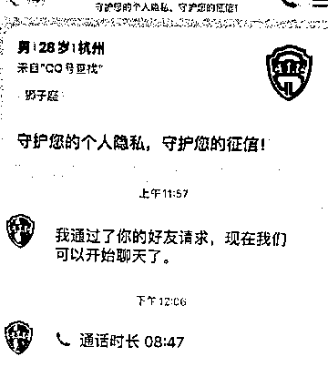
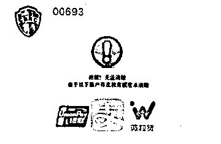
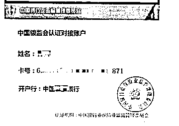

# 注意，新骗局来了！“注销校园贷”之前要先“申请成人贷”……

> 原文：[`mp.weixin.qq.com/s?__biz=MzIyMDYwMTk0Mw==&mid=2247531094&idx=6&sn=d05453c73b9cee627474be9ebca3d3be&chksm=97cbb16ea0bc387808e87f85c0c319bd35c5c9783d651d33ffb741ddfe7281068213fcbf7f4e&scene=27#wechat_redirect`](http://mp.weixin.qq.com/s?__biz=MzIyMDYwMTk0Mw==&mid=2247531094&idx=6&sn=d05453c73b9cee627474be9ebca3d3be&chksm=97cbb16ea0bc387808e87f85c0c319bd35c5c9783d651d33ffb741ddfe7281068213fcbf7f4e&scene=27#wechat_redirect)

近日有市民群众

尤其是大学刚毕业不久的市民群众称

**近期有不法分子**

**假装银监会工作人员或网贷公司客服**

**以“注销校园贷账号”为由行骗**

**还出现了新骗局**

这是怎么回事？

警察蜀黍这就帮你查清楚！

**刚工作的我接到了“客服”电话：****“您的校园贷账号需要注销。”‍**

刚参加工作不到一年的小孙接到一名自称“某第三方支付平台工作人员”的电话。

电话里，“客服”告诉小孙，他在大学期间“有过贷款记录”，目前国家正在整治“校园贷”，小孙必须赶紧进行“注销操作”，否则将影响到个人征信。而且，“客服”还称，小孙之前申请贷款时的身份是学生，而目前已经工作了，在“注销”的同时，必须将身份“转换成成人贷”，也就是说小孙得“申请成人贷款”。

由于**“客服”准确说出了小孙的毕业院校名称及毕业时间**，小孙就对“客服”所说的“注销”事项信以为真，而当听到还会“影响个人征信”，这就让刚步入社会不久的小孙在信任之余更增加了一丝担忧。接下来，小孙开始“配合”骗子进行所谓的一系列“注销”“申请”操作。

**申请新贷款 5 万元，****最终被“客服”分享了**

小孙添加了“客服”的 QQ，“客服”向小孙发来了 QQ 语音邀请，在语音中，“客服”称为了方便小孙进行处理，会把小孙拉进一个叫“银监会监督管理群”的 QQ 群，同时会通过“系统后台”查询小孙名下还有哪些账户需要“注销”。

不一会，小孙就在群内收到了一张自己名下的三个贷款账号“无法清除”的图片。

随后，“客服”让小孙登陆以上三个平台并把自己名下的额度都转到一个“中国银监会认证对接账户”指定账号中，“客服”的“理由”是，“需要进行资金对冲，后续完成后资金会原路返还”。

可当小孙按“客服”要求把 3 万余元转到指定账号后，却迟迟没有等到“资金返还”。这时，“客服”又称由于小孙申请校园贷款时人员身份是学生，现在已经工作了，必须重新申请“成人贷款”。于是，小孙又在多个网上贷款平台注册并进行了贷款申请。当小孙告诉“客服”自己已经申请成功了，“客服”以“指导操作”为由让小孙点击 QQ 群中的“分享屏幕”按钮。在进行了十分钟左右的“分享屏幕”后，小孙发现自己刚刚贷到的 5 万元都被转走了。小孙这时才意识到情况不对，赶紧报警。

**“注销校园贷”+“转换成人贷”+“屏幕共享”=新骗术公式**

小孙遭遇的是

冒充客服之“注销校园贷账号”骗局

但不同的是

该类骗局出现新套路

↓↓↓

*“注销前必须转换成人贷”并借助“腾讯会议”APP 或其他聊天工具中的“屏幕共享”“共享屏幕”等工具获取受害者短信验证码，与以往骗局相比，欺骗性更强、财损数更大。*

据警方统计

在接报的该类案件中

**最多的一名受害者在骗子的诱导下**

**在多达 12 个网上贷款平台申请了贷款！**

****

**具体套路如下：**

**第一步：能够说出受害者的身份信息。**为了骗取受害者的信任，不法分子提前利用非法渠道获取受害者的个人信息，后在电话中准确报出受害者的姓名、身份证号、家庭住址等信息，实施“精准”诈骗。

**第二步：编造理由让受害者陷入恐慌。**当受害者放松警惕后，不法分子谎称根据国家相关政策需要配合“注销校园贷”账号，否则会影响个人征信。若是受害者未曾注册过“校园贷”，不法分子则谎称其身份信息被盗用注册了网贷账号，也需要配合注销。

**第三步：要求转账完成“销户”。**当受害者深陷恐慌时，不法分子便要求受害者在多个贷款平台借款，提现后转入他们的“对公账户”来完成“销户”，并承诺会返还转账资金。当受害者发现被骗时，对方早已联系不上。‍

而骗子之所以“升级”骗术

**提出“注销前必须转换成人贷”**

**为的是让受害者能够到更多平台进行借贷**

**从而骗取更多的资金**

同时，骗子利用受害者

不熟悉“屏幕共享”功能

**诱导受害者开启“屏幕共享”**

**查看到受害者的短信通知中的银行验证码**

从而盗刷走受害者刚刚贷到的钱款

**警方提醒**

大多数第三方支付平台都是通过身份证实名认证的，**不存在学生账户改成成人账户的情****况。**此外，平台不会用私人号码或者添加 QQ、微信等方式联系用户，更不会让用户添加 QQ 群。

市民群众在日常工作生活中，要树立正确的消费观念和习惯，办理贷款务必做好前期工作；不要轻信自称客服要注销校园贷款账号的电话，一旦提到“屏幕共享”“转账汇款”等字眼，务必提高警惕，谨慎操作。

来源：反诈之旅，昆明反电信网络诈骗中心

← 向右滑动与灰产圈互动交流 →

