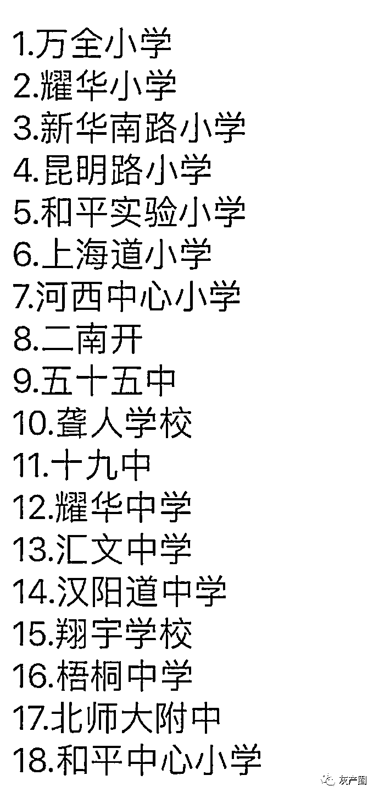
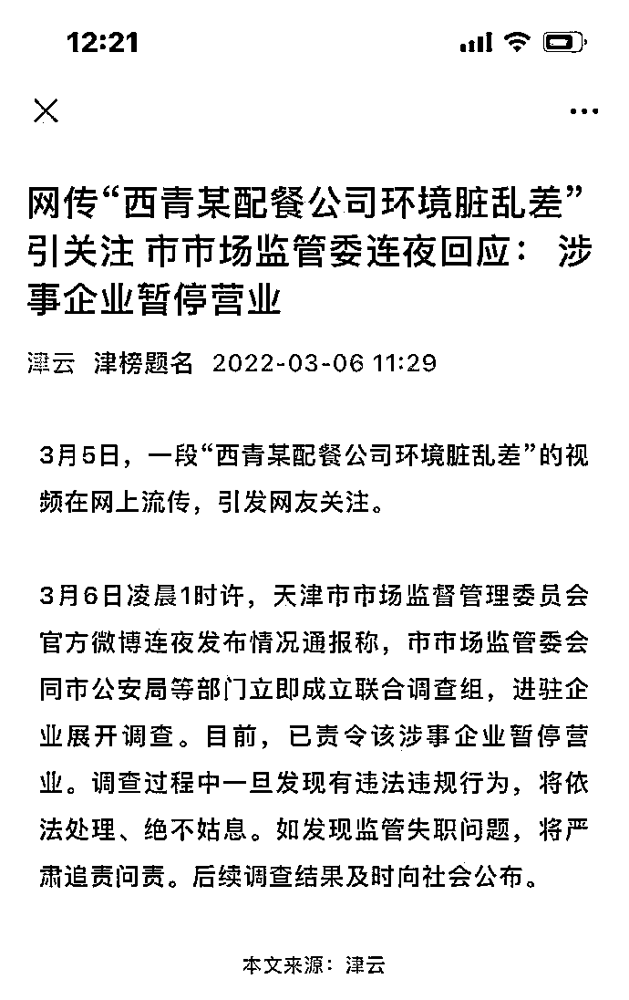
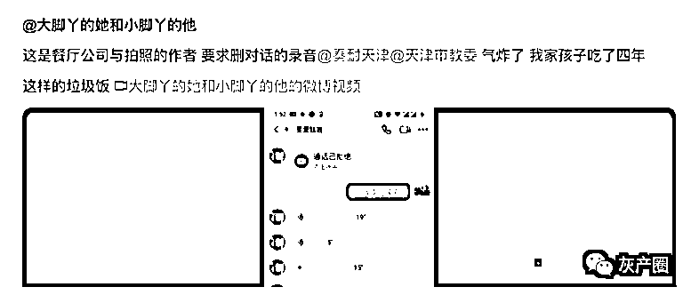

# 天津网友感冒打短工，意外拍到给中小学配餐公司后厨脏乱，引起市委重视！

> 原文：[`mp.weixin.qq.com/s?__biz=MzIyMDYwMTk0Mw==&mid=2247531167&idx=3&sn=ed236813ffeed407f23228b0b15b6f4b&chksm=97cbb1a7a0bc38b1f901847cd9b2f3b15bac240cf0ade14191ee05b553c4a9c6f5a9707b638c&scene=27#wechat_redirect`](http://mp.weixin.qq.com/s?__biz=MzIyMDYwMTk0Mw==&mid=2247531167&idx=3&sn=ed236813ffeed407f23228b0b15b6f4b&chksm=97cbb1a7a0bc38b1f901847cd9b2f3b15bac240cf0ade14191ee05b553c4a9c6f5a9707b638c&scene=27#wechat_redirect)

近日，天津，有网友在感冒未愈的情况下，通过劳务市场“找活”，在没有经过任何体检环节情况下进入一中小学配餐公司工作，随后发现其后厨环境地面潮湿布满食物残渣、食物随意摆放。

[`mp.weixin.qq.com/mp/readtemplate?t=pages/video_player_tmpl&action=mpvideo&auto=0&vid=wxv_2298678481758666753`](https://mp.weixin.qq.com/mp/readtemplate?t=pages/video_player_tmpl&action=mpvideo&auto=0&vid=wxv_2298678481758666753)

网传被供饭的小学校名单（官方未核实） 

网友感叹：和平区的家长们，买了全天津最贵的学区房，可他们的孩子，却吃着全天津最差的营养餐。

6 日，市监局通报中小学配餐公司后厨脏乱差，市监管会同市公安局等部门立即成立联合调查组，进驻企业展开调查。目前，已责令该涉事企业暂停营业。后续调查结果及时向社会公布。

随后，微博网友爆出一段餐厅公司与拍照的作者要求删对话的录音

<mpvideosnap class="js_uneditable custom_select_card channels_iframe" data-pluginname="videosnap" data-id="export/UzFfAgtgekIEAQAAAAAAQp8E0ooiXQAAAAstQy6ubaLX4KHWvLEZgBPE6aNgLW8QTrz8zNPgMIu60faiTiTrIUA5258z0AN3" data-url="https://findermp.video.qq.com/251/20304/stodownload?encfilekey=S7s6ianIic0ia4PicKJSfB8EjyjpQibPUAXolmNX2cPviaUlyOvs6UB9vwU2YqWjHqlSLiaOWA6mP3ekFfmJ2GueCLGycpjkCzju2EDE6rZxlzibD4ApqwumTyNILQ&amp;adaptivelytrans=0&amp;bizid=1023&amp;dotrans=0&amp;hy=SH&amp;idx=1&amp;m=&amp;scene=0&amp;token=AxricY7RBHdXF56fSOft3wdRVNiagmYl7NmLWkynlujqjRSVQ9VBic1mASoqvJXdqg4eLX0I4qeZl8" data-headimgurl="http://wx.qlogo.cn/finderhead/ibq4aVwOt6HNqrr8OD3sCviaytF3B8TqCwHicxsuIanAJo/0" data-username="v2_060000231003b20faec8c6e48a1acbd3ce04ef33b077a1e41d0d3794ed88ea537878dbe65910@finder" data-nickname="灰产圈+" data-desc="这是餐厅公司与拍照的作者 要求删对话的录音@奏耐天津@天津市教委 气炸了 我家孩子吃了四年这样的垃圾饭 #灰产圈@灰产圈+ " data-nonceid="1635266766614124964" data-type="video"></mpvideosnap>

不过，后来，微博上出现一段网友与涉事企业人员的对话，对方称视频拍摄者对视频进行了伪造，已经被警方控制

[`v.qq.com/iframe/preview.html?width=500&height=375&auto=0&vid=j332641i68j`](https://v.qq.com/iframe/preview.html?width=500&height=375&auto=0&vid=j332641i68j)

目前，市教委，市政府，警方都已经联合调查此事，最终调查结果，敬请期待警方公布吧。 

来源：微博那些事儿

← 向右滑动与灰产圈互动交流 →

