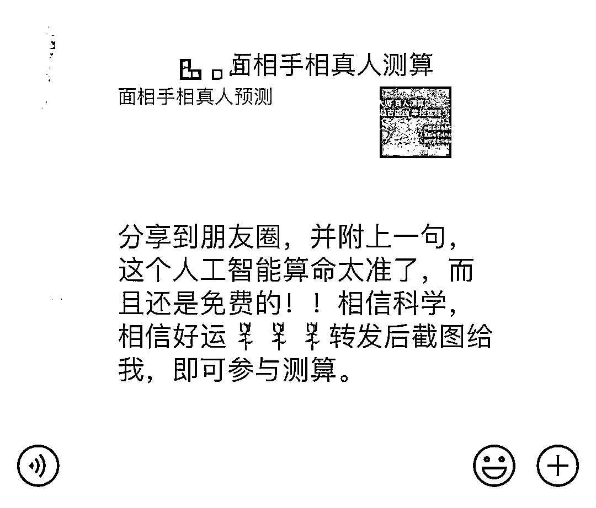

# 遇事不决，先问玄学？

> 原文：[`mp.weixin.qq.com/s?__biz=MzIyMDYwMTk0Mw==&mid=2247531167&idx=4&sn=355343dfd5bcd76c1b5bb360dad669fe&chksm=97cbb1a7a0bc38b1747bb6618a5c6cb50aca8710deac70ab422c51eb0261000372d6806bc8ab&scene=27#wechat_redirect`](http://mp.weixin.qq.com/s?__biz=MzIyMDYwMTk0Mw==&mid=2247531167&idx=4&sn=355343dfd5bcd76c1b5bb360dad669fe&chksm=97cbb1a7a0bc38b1747bb6618a5c6cb50aca8710deac70ab422c51eb0261000372d6806bc8ab&scene=27#wechat_redirect)

咱就是说

咱们当代年轻人

虽然打小成长在唯物主义观下

但多多少少还是有点迷信玄学

白天在工位上互道再见 

晚上免不了在同道大叔和陶白白的留言区相见 

遇上喜欢的人 

必先查其星座

知其生肖

偷偷算下契合指数

有些小伙伴更加上头

迷上了**占卜**和**网络“云算命”**

道友中间流传着一句口头禅：

**大事问八字**

**小事问塔罗**

**无事问星座**

去某应用市场里一搜索

关于命理学的 APP 有**200**多个

有一项网络调查显示

30 岁以下的年轻人中

就有**62%**的人参与过各类形式的算命

小珊随便打开微博搜索**“星座”**或**“占星”**

千万级粉丝量的博主可以说是俯拾皆是

到底人们为什么会去选择算命呢？

在越来越讲求科学、效率、方法论的今天

为啥从中产到学生

从 90 后到 00 后

大家都纷纷开始

“**遇事不决，先问玄学**”？

某种程度上 

**玄学，是一面照出焦虑的镜子**

折射当下人们

在面对不确定性和迷茫的时候 

心理极度需要看清当下的迷雾

或者寻求一个**心理安慰**

从 qq 空间时代就流行的各种好运锦鲤

再到孔庙授权特许的

“**孔庙祈福晨光考试笔**”

学业烦恼缠身的年轻人

一直就是迷信玄学的重灾区 

还有**看姻缘**、**算人生际遇**的等等等等 

可以说

哪里有焦虑，哪里就有玄学

据说有段时间大厂大裁员后

# 星座博主的业务量那叫一个激增

成百上千的年轻人用焦虑发电

以知识付费的名义供养起

他们深信不疑的命理大 V

但是安友们

算命这个“生意”其实是典型的灰产

把生辰八字和面相相片发给“大师” 

听两分钟指点就要花几百块

“愿望手链”“事业手链”也是标价近千元

……

不是是让你**付费算命**就是让你**付费转运**

当然 

**免费的算命广告也是坑**

如果你心里想着

“反正是免费的，玩玩不会有损失”

那就上当了

他们只是以免费做诱饵，吸引人点击

然后诱导转发多个群或朋友圈

确认完你传播出去以后

后边免费算命的事基本是交给电脑软件

而这种**“AI 算命”**主要有两个大坑

**一个是收集个人信息**

什么**生辰八字手机****号**，**面相手相正面照**

这些信息可能会被不法分子利用

进行诈骗和其他违法犯罪活动

**另一个坑是引导二次消费**

一顿操作后 

反正就是还得让你花点钱

花完钱后得到的结果也是大同小异  

有网友就晒出过被坑完钱拉黑的经历

这些骗子惯用的手法是

用模棱两可的话术

实现正反两面全覆盖

但就是不给出绝对性判断

比如

**“你有时很外向乐于社交，**

**另一些时候内向矜持、不事张扬。”**

**“你相信爱情**

**但是怀疑自己能否找到真爱”**

诸如此类“正确的废话”

在算命平台和大师眼里

有没有事实根据不重要

重要的是算命费

和购买“转运”商品的钱

最后的最后

小珊诚恳建议大家 

**珍爱生命，远离玄学** 

毕竟

人生的魅力就来源于未知呀

来源：微信珊瑚安全

← 向右滑动与灰产圈互动交流 →

