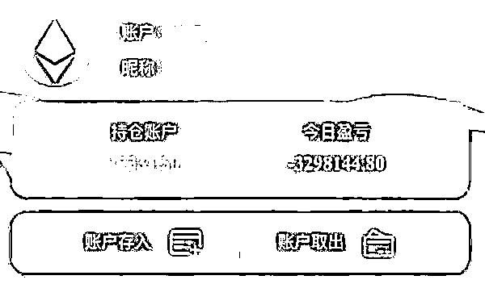

# 20 天被骗近 300 万！这场始于网恋、终于投资度骗局你什么时候清醒？

> 原文：[`mp.weixin.qq.com/s?__biz=MzIyMDYwMTk0Mw==&mid=2247531167&idx=5&sn=12fc6645dc80bb9cc6c4636110dcee55&chksm=97cbb1a7a0bc38b12d4b5e816fa851b94d157051d98684f91ad5e09a7b5eb049b0c62b59616d&scene=27#wechat_redirect`](http://mp.weixin.qq.com/s?__biz=MzIyMDYwMTk0Mw==&mid=2247531167&idx=5&sn=12fc6645dc80bb9cc6c4636110dcee55&chksm=97cbb1a7a0bc38b12d4b5e816fa851b94d157051d98684f91ad5e09a7b5eb049b0c62b59616d&scene=27#wechat_redirect)

一位自称李某的男士在微信上添加了单身的吴女士（化名），两人慢慢地开始了聊天。在聊天过程中，李某对吴女士嘘寒问暖十分体贴，并总是会有意无意的透露自己拥有多家公司、参与投资很多项目，资产实力雄厚，还经常向吴女士发送一些“自己”的照片，英俊多金又体贴的李某很快打动了吴女士，由此两人便慢慢在网络发展到暧昧关系。

（通过警方提取的吴女士的聊天记录解析骗子的诈骗伎俩。在聊天过程中，骗子一般都把自己打造成多金帅气的人设。上图的照片就是骗子发给吴女士的“自拍照”，这些其实都是骗子精心准备的，并且不止只有这几张，而是有着一整个套图及视频，涉及工作中的、健身的、娱乐的、开车的、朋友聚会的等等，在后期的接触过程中会根据聊天内容随时发各类应景照片视频，迷惑性非常之强。）

聊了一段时间后，李某说要带着吴女士和自己一起赚钱，向吴女士推荐了一款 APP，称这个平台很容易赚钱，自己目前也在这个平台上投资，并赚了很多钱。

（经过前期的经营，此时的骗子已经完全赢得了吴女士的好感，便开始特意的提出要带吴女士“赚钱”。前面十多天的耐心铺垫，只为这一刻的一击即中！）

吴女士于是下载了李某推荐的 APP，抱着试试看的心态转了几千元到该平台上，结果当天就赚到了几百块，并提现成功。第二天，骗子又让吴女士加大投资，直接充值 5 万元，结果又有 10%的盈利照样提现成功了。尝到甜头的吴女士在李某的怂恿下，一下子充值了 80 余万元，而此时的账户页面显示盈利已有近 10 万元。此时，以为自己赚到钱的吴女士已经完全信任了李某，同时也憧憬着两人美好的未来……

（下午投资 5 万元试水的吴女士当晚就有了高盈利，这时是可以成功提现到银行卡的。在此也可以看出骗子不但有耐心，而且还舍得下本钱。）

（骗子制造紧张情绪，忽悠吴女士直接充值 80 万，声称一个项目只有几分钟购买时间，错过了就没有了。后面同样也是如此手段，催促吴女士尽快充值，不要错过好“产品”）

（平台显示的吴女士充值后的盈利情况。殊不知，这个平台就是诈骗分子打造的，里面的盈利状况是他们想让你看到的数字，随时可以改动。但是你想把这个金额提出来是再无可能了。）

紧接着李某又邀请吴女士参加平台的情侣活动，说是两人一起参加平台会反馈更高的收益，但活动的门槛是要充值 200 万，这样才可以和之前账户中的 90 多万元一起提出来，否则账号将会被冻结。

（骗子继续忽悠吴女士参加情侣活动，增加“投资”金额，并声称如不继续充值账号将会被冻结，所有资金打水漂。）

于是吴女士拿出了全部积蓄又借了点钱凑足 200 万购买了所谓的“情侣活动”，加上“盈利”，平台显示的余额已经到了 300 余万！然而吴女士申请提现却并没有成功，平台称是吴女士的资金流水不够，如果要提现需要在平台内有足够的资金流水。毫无防备的吴女士只得求助李某，李某便指导吴女士将 APP 上显示的 300 多万余额都购买了虚拟币以制造流水记录。

然而，当期待着能提现的吴女士再次打开账户后，却看到自己的账户亏损得只剩 1 万余元了。

（吴女士充值 200 万后还是无法提现，向骗子求助。骗子自然是“有求必应”。）

（在骗子指引下，吴女士在平台操作购买虚拟币制造资金流水，谁知平台显示，吴女士的账户一天直接亏损了 300 多万。这些数字当然也是骗子在后台随意修改的。）

然而被爱情冲昏头脑的吴女士到此时仍然没有意识到自己被骗，还只是认为是自己的投资失败而已。骗子也表示自己在平台跟着李女士购买一样的产品也亏损严重，并安慰说这是一次正常的投资亏损，竟然让吴女士向朋友借钱或者从各种网贷平台借钱来继续投资翻本。

所幸吴女士拒绝了，在心情抑郁之际才醒悟过来，至今都没有李某的电话号码，也没有视频通话过，只看过他发来的照片视频。于是吴女士向李某要电话号码，李某倒也爽快，发了两个号码，称都是自己的。可当吴女士拨打后，才发现两个号码都是假的。

（被吴女士拆穿后骗子还在极力辩解。在网上交往的这 20 天中，吴女士从不曾与对方视频通过话或者电话联系过。当然，在这类诈骗手段中，骗子会以各种理由拒绝电话或者视频联系。）

至此，吴女士终于意识到了自己被骗，立即向警方报警。

警方经工作，发现该微信号系在境外注册并在境外使用，相关工作正在进一步开展中。

骗术揭密

第一步：网络寻找诈骗目标

本案例中骗子把目标锁定在单身女性群体，通过婚恋平台、微信、QQ 等网上交友软件搜寻目标。

第二步：精心营造完美人设

骗子对自己的身份人设进行全方位的包装，小到网名昵称年龄爱好，大到事业状况家人信息，营造自己高富帅成功人士的人设。

第三步：甜言蜜语骗取信任

骗子对诈骗对象嘘寒问暖、关怀备至，甚至确定恋爱关系，取得充分信任。

第四步：诱导投资实施诈骗

骗子在获得诈骗对象的信任后，便会谎称知道有个平台投资收益高，可以通过投资快速赚钱，怂恿受害人在其自制的平台投资。大多数人会试着小额投入几笔，骗子通过操控后台，以小额试水成功盈利，诱惑诈骗对象放松警惕。

第五步：无法提现销声匿迹

等到受害人投入大量金额后，就会发现平台无法提现，再想与骗子交涉时骗子已经消失得无影无踪。

在吴女士这个案例中，可以看出“杀猪盘”中的骗子表现的极为有耐心，从添加好友开始并不会一上来或者没几天就推荐投资之类，而是通过十几天的聊天精心打造人设、施展撩妹技巧，并在聊天过程经常含有其赚钱又多又快等心理暗示内容，只为俘获芳心后的一击必中。其实，这是骗子第二次说要带吴女士赚钱，之前吴女士已经拒绝过一次了，不过骗子并没有再深入推荐也没有放弃这个目标，而是继续关怀式的聊天，直到吴女士上当。

另外，还有一点就是受害者初次“投资”都会谨慎一些，骗子也是相当舍得下本，刚开始的高额盈利返现是可以给受害者提现的，但是他们基本不用担心人会一去不复返，因为他们知道一旦上钩了，基本就没人能拒绝得了这种高回报还有感情作为保障的“投资”！

受害人心理分析

第一种“饲料”是情感依赖。

陌生人能获得受害人深度信任，原因其实挺简单——“沙漠中的一杯水”最解渴。

现代社会人际交往快速多变，能走心的挚友本来就不多，就算有，彼此或许还仗着关系亲密，总是简单粗暴相待。反观骗子，都是些不讲武德、有备而来的家伙，他们比“甲方爸爸”都超有耐心，甚至有求必应。

所以“防杀”的第一步，就是我们都对身边人耐心一点、温柔一点，这样遇事还能商量商量，而骗术是见光死的。

第二种“饲料”是大赚特赚。

骗钱要具备两个前提，一是让你有安全感，不戒备；二是让你先体验一下赚大钱的快乐。因此结合起来说就是，骗子的任务就是让你“在绝对安全的前提下，好好体验一下挣大钱的快感”。有时骗子一上来不用你的钱，用他自己的“钱”，请你代为打理他的理财账户，让你的高峰体验来得既安全无比又猝不及防。有些受害人甚至是瞒着骗子、怀着内疚去人家平台“投资”的。所以“防杀”的第二步，就是别替陌生人打理财务账户，没人忙到钱袋子都要请你来管的地步。

第三种“饲料”是急于挽损。

第一波被骗之后，受害人看到的提示可能只是“不能提现”“违规操作”等，客服也会说“是流水不够”。这其实是第二波收割的开始。此时假如你已有警觉，骗子会采取大比例的“配资”来引诱你拿出最后一笔钱“挽救”损失，他的“配资”本身也是高度诱人的，而且你充满感激。

所以“防杀”的第三步，是暂时接受沉没成本，及时报警，帮助警方抢占先机。报警越早，挽损效果越好！

“杀猪盘”除了“饲料”，还得有“砧板”。

这个“砧板”就是各类来历不明的投资理财 APP，一般人很难想象那些余额数字、关于不能提现的提示语，其实都是可以在后台随意输入的。一旦加装并进入了这样的 APP，就真的“人为刀俎，坐等杀猪”了。有些骗子到后期骗人的语言已经极尽想象之能事，一来是因为已经骗到了大头，所以肆无忌惮；二来也是因为他说啥，平台都能帮他显示啥，而受害人往往会对平台的显示内容有莫名的“权威认同”。

提醒

1、杀猪盘一般都是始于网恋，终于投资，从人设包装到主动关怀，完美人设加温柔体贴很容易让人产生恋爱的幻觉。网络交友需谨慎，特别是对那些没见过面的人，尤其在涉及金钱往来时一定要提高警惕，并与身边亲朋好友多沟通、多询问，防止落入圈套。

2、切勿点击网友发送的网络链接或者下载各种投资、赌博平台。平台上快速翻倍的账户金额只是骗子通过后台操纵的数字，真正等你加大投入时，往往无法提现。

3、所谓的“高级理财分析师”的身份、投资平台漏洞等等话术，诱导着人的侥幸心理，通过小额投资高额回报的试水逐步击垮人的防御底线。

4、天上不会掉馅饼，成功从来无捷径。不要被所谓“低成本、高回报”迷惑，切勿相信只赚不赔的“买卖”，赚钱还是要脚踏实地。如果发现被骗请保存好证据。

## 

来源：洛阳市反诈骗中心 ，防骗每日电讯，巴蜀反诈

← 向右滑动与灰产圈互动交流 →

